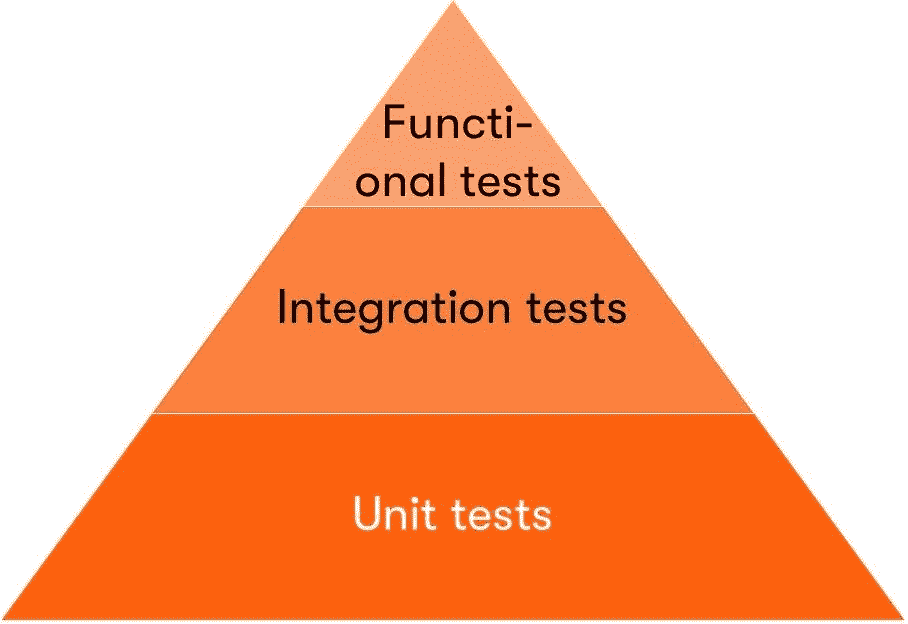
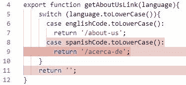
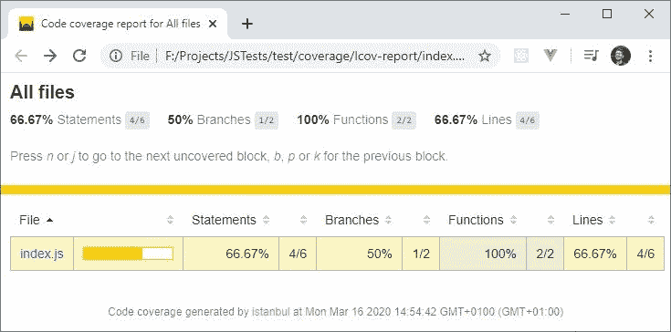

# 如何开始对 JavaScript 代码进行单元测试

> 原文：<https://www.freecodecamp.org/news/how-to-start-unit-testing-javascript/>

我们都知道应该编写单元测试。但是，与实际实现相比，很难知道从哪里开始以及在测试上投入多少时间。那么，从哪里开始呢？它仅仅是关于测试代码还是单元测试有其他的好处？

在本文中，我将解释不同类型的测试，以及单元测试给开发团队带来的好处。我将展示 Jest——一个 JavaScript 测试框架。

## 不同类型的测试

在我们深入单元测试细节之前，我想快速浏览一下不同类型的测试。他们周围经常有一些混乱，我并不感到惊讶。有时候他们之间的界限很窄。

### 单元测试

单元测试只测试实现的一个部分。一个单位。没有依赖或集成，没有框架细节。它们就像一个用特定语言返回链接的方法:

```
export function getAboutUsLink(language){
  switch (language.toLowerCase()){
    case englishCode.toLowerCase():
      return '/about-us';
    case spanishCode.toLowerCase():
      return '/acerca-de';
  }
  return '';
}
```

### 集成测试

在某些时候，您的代码与数据库、文件系统或另一个第三方进行通信。它甚至可以是你应用程序中的另一个模块。

这部分实现应该通过集成测试来测试。他们通常有一个更复杂的设置，包括准备测试环境、初始化依赖项等等。

### 功能测试

单元测试和集成测试让你对你的应用程序的工作充满信心。功能测试从用户的角度来看应用程序，并测试系统是否按预期工作。



在上图中，您可以看到单元测试构成了应用程序测试套件的庞大基础。通常，它们很小，数量很多，并且是自动执行的。

所以现在让我们更详细地了解一下单元测试。

## 我为什么要写单元测试呢？

每当我问开发人员他们是否为他们的应用程序编写了测试，他们总是告诉我:“我没有时间给他们”或者“我不需要他们，我知道它能工作。”

所以我礼貌地微笑，告诉他们我想告诉你的事情。单元测试不仅仅是测试。他们还在其他方面为您提供帮助，因此您可以:

确信你的代码是可行的。你上一次提交代码变更，你的构建失败，你的应用有一半停止工作是什么时候？我的是上周。

但那还是可以的。真正的问题是当构建成功时，变更已经部署，而您的应用程序开始变得不稳定。

当这种情况发生时，你开始对你的代码失去信心，最终只能祈祷应用程序能够工作。单元测试将帮助您更快地发现问题并获得信心。

做出更好的架构决策。代码发生了变化，但是关于平台、模块、结构和其他的一些决定需要在项目的早期阶段做出。

当你从一开始就考虑单元测试时，它将帮助你更好地构建你的代码，并实现关注点的适当分离。你不会试图将多重职责分配给单个代码块，因为这对单元测试来说是一场噩梦。

编码前查明功能。您编写方法的签名，并立即开始实现它。哦，但是如果一个参数为空，会发生什么呢？如果它的值超出预期范围或者包含太多字符怎么办？你抛出一个异常还是返回 null？

单元测试将帮助您发现所有这些情况。再看看这些问题，你会发现这正是你的单元测试用例的定义。

我确信编写单元测试有更多的好处。这些只是我从自己的经历中回忆起来的。那些我通过艰难的方式学到的东西。

## 如何编写你的第一个 JavaScript 单元测试

但是让我们回到 JavaScript。我们先从 [Jest](https://jestjs.io/) 说起，这是一个 JavaScript 测试框架。它是一个工具，支持自动单元测试，提供代码覆盖，并让我们容易地模仿对象。Jest 也有 Visual Studio 代码[的扩展，可从这里获得](https://marketplace.visualstudio.com/items?itemName=Orta.vscode-jest)。

还有其他的框架，如果你感兴趣，你可以在[这篇文章](https://www.browserstack.com/guide/top-javascript-testing-frameworks)中查看。

```
npm i jest --save-dev 
```

让我们使用前面提到的方法`getAboutUsLink`作为我们想要测试的实现:

```
const englishCode = "en-US";
const spanishCode = "es-ES";
function getAboutUsLink(language){
    switch (language.toLowerCase()){
      case englishCode.toLowerCase():
        return '/about-us';
      case spanishCode.toLowerCase():
        return '/acerca-de';
    }
    return '';
}
module.exports = getAboutUsLink; 
```

我把这个放进了`index.js`文件。我们可以在同一个文件中编写测试，但是一个好的做法是将单元测试分离到一个专用的文件中。

常见的命名模式有`{filename}.test.js`和`{filename}.spec.js`。我用了第一个，`index.test.js`:

```
const getAboutUsLink = require("./index");
test("Returns about-us for english language", () => {
    expect(getAboutUsLink("en-US")).toBe("/about-us");
}); 
```

首先，我们需要导入我们想要测试的函数。每个测试都被定义为对`test`函数的调用。第一个参数是供您参考的测试名称。另一个是箭头函数，我们调用想要测试的函数，并指定我们期望的结果。我

在这种情况下，我们用`en-US`作为语言参数调用`getAboutUsLink`函数。我们期望结果是`/about-us`。

现在我们可以全局安装 Jest CLI 并运行测试:

```
npm i jest-cli -g
jest 
```

如果您看到与配置相关的错误，请确保您有自己的`package.json`文件。如果没有，使用`npm init`生成一个。

您应该会看到类似这样的内容:

```
 PASS  ./index.test.js
  √ Returns about-us for english language (4ms)
  console.log index.js:15
    /about-us
Test Suites: 1 passed, 1 total
Tests:       1 passed, 1 total
Snapshots:   0 total
Time:        2.389s 
```

干得好！这是自始至终的第一个简单的 JavaScript 单元测试。如果您安装了 Visual Studio 代码扩展，它将在您保存文件后自动运行测试。让我们用下面这行代码来扩展测试:

```
expect(getAboutUsLink("cs-CZ")).toBe("/o-nas"); 
```

一旦你保存了文件，Jest 会通知你测试失败。这有助于您在提交变更之前发现潜在的问题。

## 测试高级功能和模拟服务

在现实生活中，getAboutUsLink 方法的语言代码在同一个文件中不会是常量。它们的值通常在整个项目中使用，因此它们将在自己的模块中定义，并导入到所有使用它们的函数中。

```
import { englishCode, spanishCode } from './LanguageCodes' 
```

您可以用同样的方式将这些常量导入到测试中。但是如果你使用的是对象而不是简单的常量，情况会变得更加复杂。看看这个方法:

```
import { UserStore } from './UserStore'
function getUserDisplayName(){
  const user = UserStore.getUser(userId);
  return `${user.LastName}, ${user.FirstName}`;
} 
```

该方法使用导入的`UserStore`:

```
class User {
    getUser(userId){
        // logic to get data from a database
    }
    setUser(user){
        // logic to store data in a database
    }
}
let UserStore = new User();
export { UserStore } 
```

为了正确地对这个方法进行单元测试，我们需要模仿`UserStore`。模拟是原始对象的替代品。它允许我们从测试方法的实现中分离出依赖关系和真实数据，就像假人代替真人帮助进行汽车碰撞测试一样。

如果我们不使用模拟，我们将测试这个函数和存储。这将是一个集成测试，我们可能需要模拟使用的数据库。

### 嘲笑一项服务

要模仿对象，您可以提供模仿功能或手动模仿。我将关注后者，因为我有一个简单明了的用例。但是请随意查看 Jest 提供的其他嘲笑可能性。

```
jest.mock('./UserStore', () => ({
    UserStore: ({
        getUser: jest.fn().mockImplementation(arg => ({
            FirstName: 'Ondrej',
            LastName: 'Polesny'
        })),
        setUser: jest.fn()
    })
})); 
```

首先，我们需要指定我们在模仿什么——`./UserStore`模块。接下来，我们需要返回包含从该模块导出的所有对象的 mock。

在这个例子中，只有名为`UserStore`的`User`对象具有函数`getUser`。但是对于真正的实现，模拟可能要长得多。在单元测试的范围内，任何你并不真正关心的函数都可以用`jest.fn()`轻松嘲讽。

`getUserDisplayName`函数的单元测试与我们之前创建的类似:

```
test("Returns display name", () => {
    expect(getUserDisplayName(1)).toBe("Polesny, Ondrej");
}) 
```

当我保存文件时，Jest 告诉我有两个测试通过了。如果您正在手动执行测试，现在就这样做，并确保您看到相同的结果。

### 代码覆盖率报告

既然我们知道了如何测试 JavaScript 代码，那么用测试覆盖尽可能多的代码是很好的。这很难做到。最终，我们只是普通人。我们希望完成我们的任务，而单元测试通常会产生一个我们容易忽略的不必要的工作量。代码覆盖率是一个帮助我们战胜这种情况的工具。

代码覆盖率将告诉你单元测试覆盖了你的代码的多大部分。以我检查`getAboutUsLink`函数的第一个单元测试为例:

```
test("Returns about-us for english language", () => {
   expect(getAboutUsLink("en-US")).toBe("/about-us");
}); 
```

它检查英语链接，但西班牙语版本仍然未经测试。代码覆盖率是 50%。另一个单元测试是彻底检查`getDisplayName`函数，它的代码覆盖率是 100%。总的代码覆盖率是 67%。我们有 3 个用例要测试，但是我们的测试只覆盖了其中的 2 个。

要查看代码覆盖率报告，请在终端中键入以下命令:

```
jest --coverage 
```

或者，如果您使用带有 Jest 扩展的 Visual Studio 代码，您可以运行命令(CTRL+SHIFT+P)*Jest:Toggle Coverage Overlay*。它会在实现中向您显示哪些代码行没有被测试覆盖。



通过运行覆盖率检查，Jest 还将创建一个 HTML 报告。在`coverage/lcov-report/index.html`下的项目文件夹中找到它。



现在，我就不用提你要争取 100%的代码覆盖率了吧？:-)

## 摘要

在本文中，我向您展示了如何用 JavaScript 开始单元测试。虽然让您的代码覆盖率在报告中达到 100%是件好事，但在现实中，并不总是有可能(有意义地)达到这一点。目标是让单元测试帮助您维护您的代码，并确保它总是按预期工作。它们使您能够:

*   明确定义实施要求，
*   更好地设计您的代码并分离关注点，
*   发现新提交可能带来的问题，
*   并让您相信您的代码是有效的。

最好的起点是 Jest 文档中的[入门](https://jestjs.io/docs/en/getting-started)页面，这样您就可以自己尝试这些实践。

你自己有测试代码的经验吗？我很想听听，请在推特上告诉我或者加入我的 [Twitch 流](https://twitch.tv/ondrabus)。