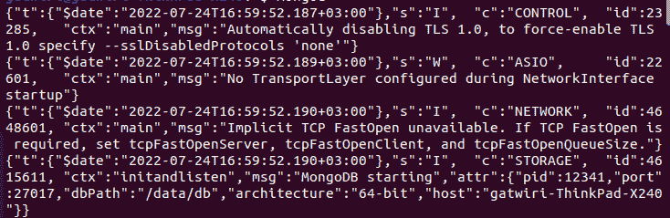
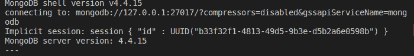

# 如何开始使用 MongoDB——初学者数据库设置

> 原文：<https://www.freecodecamp.org/news/how-to-start-using-mongodb/>

MongoDB 是一个越来越受欢迎的开源 NoSQL 数据库。与传统的 SQL 数据库相比，它有许多优点。

它提供了高可伸缩性、可靠性和性能，即使数据量巨大也是如此。

本文涵盖了开始使用 MongoDB 需要了解的基础知识以及如何正确使用它。

### 先决条件

*   合适的 IDE，如 VS 代码
*   一个终端

### 你会学到什么

*   什么是 MongoDB？
*   什么是 NoSQL？
*   如何安装 MongoDB
*   Hoe to setup MongoDB
*   如何运行 MongoDB

## 什么是 NoSQL 数据库？

NoSQL 数据库是非关系数据库，它不使用关系数据库传统的基于表的模式。

NoSQL 数据库通常用于大数据和实时网络应用。MongoDB 是最流行的 NoSQL 数据库之一。它速度快、可伸缩，并且使用 JSON 文档来存储数据。

## 为什么我应该使用 No-SQL？

否-SQL 数据库是强大的工具，可以帮助您处理大量数据。它们尤其擅长处理非结构化数据，因此如果您要处理大量不适合传统关系数据库的数据，它们可能是一个不错的选择。

不，SQL 数据库比关系数据库更具可伸缩性，如果您希望数据随时间增长，这一点很重要。

## 如何开始使用 MongoDB–安装指南

使用[这个链接](https://www.mongodb.com/docs/manual/administration/install-community/)安装 MongoDB，或者如果你使用的是 Ubuntu，使用下面的说明:

*   导入公钥

```
sudo apt-key adv --keyserver hkp://keyserver.ubuntu.com:80 --recv 2930ADAE8CAF5059EE73BB4B58712A2291FA4AD5 
```

*   为 Ubuntu 创建一个列表文件

```
echo "deb [ arch=amd64,arm64 ] https://repo.mongodb.org/apt/ubuntu xenial/mongodb-org/3.6 multiverse" | sudo tee /etc/apt/sources.list.d/mongodb-org-3.6.list 
```

*   运行以下命令进行更新:

```
sudo apt-get update 
```

*   安装最新的软件包

```
sudo apt-get install -y mongodb-org 
```

*   然后运行:

```
sudo service mongod start 
```

## 如何创建和填充 MongoDB 数据库

安装 MongoDB 后，创建一个数据目录，MongoDB 将在其中存储其数据文件。默认情况下，这是`/data/db`，但是如果您愿意，可以指定一个不同的位置。最后，通过从命令行运行`mongod`来启动 MongoDB 服务器。

使用以下命令为`dbPath`创建一个目录:

```
sudo mkdir -p /data/db 
sudo chown -R `id -un` /data/db
```

然后在不同的终端运行`sudo mongod --port 27017`或`mongod`:



在 MongoDB 4.4+中，服务器日志的输出格式(也称为`structured logging`)应该如下图所示。尽管 JSON 格式最初看起来令人生畏，但它是为了与常见的 JSON 工具和框架一起使用而设计的。

使用以下命令输入 MongoDB shell:

```
mongo 
```

运行以下命令后，您将获得如下所示的输出:



## 如何创建新的 MongoDB 数据库

使用 MongoDB 的第一步是用命令`use mydatabase`创建一个新的数据库。然后，您可以在该数据库中创建集合。最后，您可以填充您的新集合。

```
 use record
 db.users.insert({username: "myname", password: "mypassword"}) 
```

`use record`命令将数据库切换到`record database`。`db.users.insert(...)`命令向`record`数据库中的`users`表添加一个输入。

下面是上面命令的输出:

```
WriteResult({ "nInserted" : 1 })
```

运行以下命令查看您在上一步中创建的记录:

```
 db.users.find() 
```

`db.users.find()`命令在`users`表中搜索所有条目。
您的输出产生以下结果:

```
{ "_id" : ObjectId("62dd6ab4a7d1ab0948574778"), "username" : "myname", "password" : "mypassword" }
```

## 如何向数据库中添加新记录

要添加新记录，请执行以下操作:

```
 use record
 db.commerce.save({scriptname: "dygraph.min.js", version: "2.1.0"})
 db.commerce.save({scriptname: "sortable.min.js", version: "0.8.0"})
```

我们在`commerce`表中添加了两条记录，每条记录都包含由`scriptname`和`version`属性指定的数据。

您应该得到这样的结果:

```
WriteResult({ "nInserted" : 1 })
```

要查看存储在 MongoDB 数据库中的所有表，请运行以下命令:

```
 use record
 show collections 
```

您应该会看到与下面类似的输出:

```
commerce
users
```

## 结论

MongoDB 是一个强大的数据库系统，可以用于各种应用程序。它易于设置和使用，其可伸缩性使其成为大型项目的良好选择。

如果您是数据库系统的新手，MongoDB 是一个不错的起点。