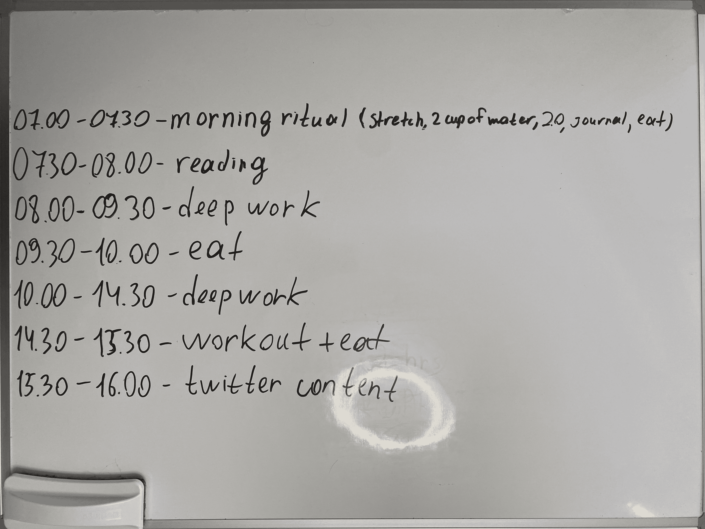
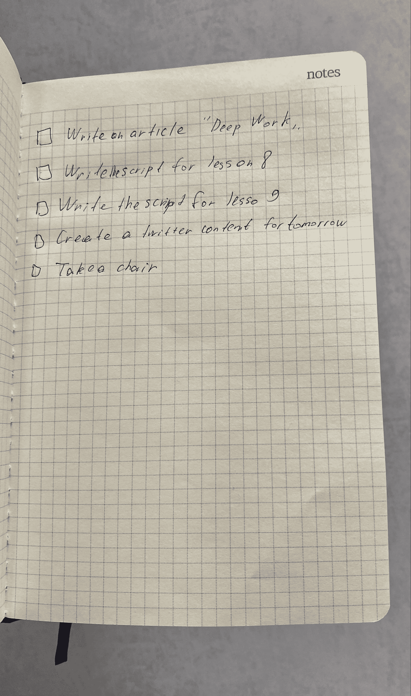
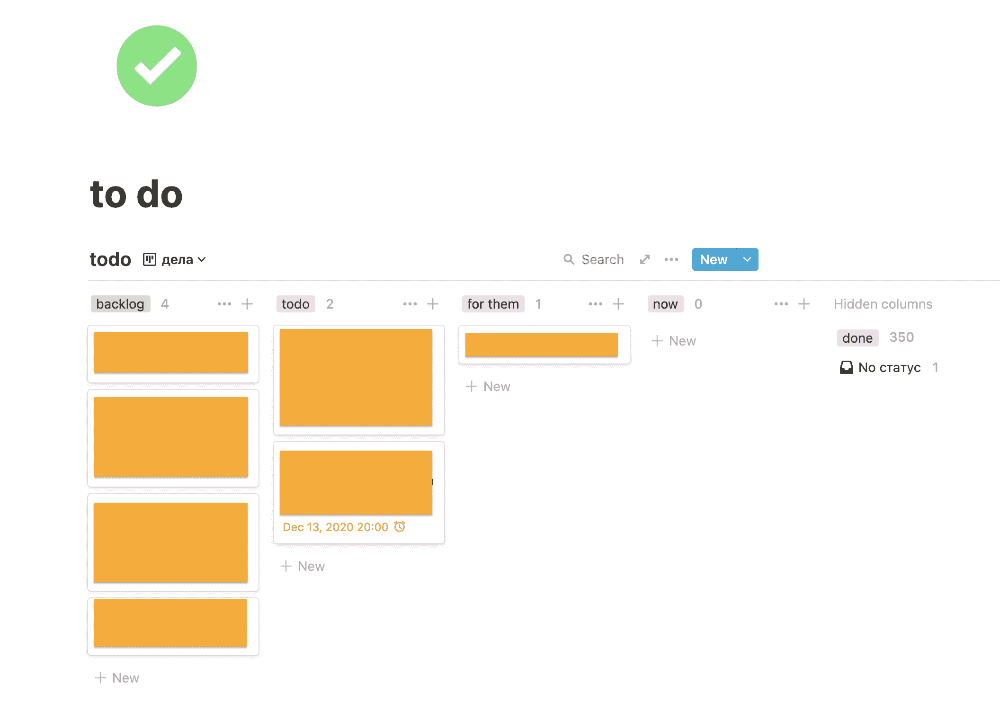

# 如何全天保持高效——程序员的编码和计划技巧

> 原文：<https://www.freecodecamp.org/news/how-to-stay-productive-all-day-coding-and-scheduling-tips-for-programmers/>

我一生都在编错误的代码。

我觉得只要坐在办公桌前，打开笔记本电脑，从我的待办事项列表中选择一项任务，然后编写代码直到我觉得累了就可以了。

但实际上，这种工作方式总是在 2-4 个小时的编码后杀死我的生产力水平。我觉得太累了，除了不同的低能量任务(*像代码评审*)之外，我什么都不想做。

今天，我可以连续编码 8 个多小时，之后也不会觉得很累。

有什么变化？

我的工作方法。

经过 62 本以上的自我发展书籍，几十篇关于生产力的文章和研究，以及我的尝试和错误，我已经创建了一个生产力系统，它帮助我编码，写作，创造，并以最大的能力生活，而没有拖延，疲劳和脑雾。

在这里。

## 我的生产力系统

我的生产力系统建立在三大支柱之上:

1.  日程安排
2.  明天的待办事项
3.  系统 69

让我们仔细看看它们。

## 创建时间表

一切从时间表开始。我做任务的内容、地点和时间。

我的日程表是这样的:

我用白板不断提醒自己在特定时刻应该做什么。

我总是忽略创建一个时间表。

“我知道我该做什么，什么时候做！”我告诉自己。

但事实上，我总是忘记做我的日常活动(*即使我已经养成了做它们的习惯*)。

例如，当我早上 7:00 醒来时，我知道我在上班前有 1 个小时的空闲时间。在那一个小时里，我想有时间做一个晨间仪式(吃饭、伸展、淋浴、呼吸)和阅读 30 分钟。

但是很多时候我会在早上吃一个小时的早餐，忘记花时间去阅读。即使我记得我每天早上必须阅读 30 分钟。我*过度完成*一项活动(早餐)，从另一项活动(阅读)中偷取时间。

我还注意到，没有时间表，我要花很多时间来决定下一步该做什么。我可以在下午完成锻炼，洗个澡，坐在办公桌前，打开笔记本电脑，然后在 10 分钟内决定下一个任务。

如果我们计算每天做这些决定要花多少时间，那 10 分钟就变成了 60 分钟。**一小时！**时间真多。

另一件事是，在决定我下一步应该做什么的过程中，总有一个天使和一个恶魔坐在我的肩膀上，“帮助”我决定我是应该做那些必不可少的事情还是做一些轻松的工作，甚至是休息一下放松一下。我经常不得不用意志力强迫自己在没有时间表的情况下做“正确的”事情。

> 如果你浪费资源去决定何时何地工作，你会妨碍你完成工作的能力–[守护者](https://www.theguardian.com/science/2013/oct/05/daily-rituals-creative-minds-mason-currey)

当我制定了时间表，这些问题就消失了。

现在，我总是有时间做我计划好的事情。

我总是知道我下一步该做什么。

我不需要用意志力强迫自己去做本质的事情。

这个时间表让我的决策过程处于自动驾驶状态。

如果你想创建自己的日程表，我推荐你使用谷歌日历。这样，您就可以轻松地编辑或与他人共享您的日程安排。

此外，我建议把你的时间表写在一张纸上或白板上，时刻提醒自己应该在何时何地做哪些事情。

## 写下你明天要做的事情

如果时间表帮助我决定下一个任务应该做什么，在哪里，什么时候，待办事项清单帮助我决定下一步应该做什么。

我可以度过“完美计划”的一天，但仍然没有做对我来说至关重要的事情。

比如我打开我的时间表，看到 08.00 到 09.30 有一个“深度工作”块，我可以做深度工作。但这并不能保证我在这段时间里会做重要的事情，而不是一些轻松的工作。

我们的大脑总是试图花费更少的能量，并会尽一切努力说服你不要浪费能量。

这就是待办事项清单出现的地方。

它进一步帮助我将决策过程置于自动驾驶状态，并在上面花费更少的时间和认知资源。

它保证我只做必要的事情(*大部分时间*)。

我的待办事项清单很简单:我用一个普通的纸笔记本做它，用[观念](https://www.notion.so/)做电子版(*我用观念做一切事情，但那是另一篇文章*

当我创建待办事项清单时，我会在晚上为第二天创建它。

为什么？

当你在早上计划你的一天时，你在思考当天需要完成的每一项任务。当任务清晰简单并且你知道该做什么时，这是很好的(比如*“John 提交的代码评审最后一次”*)。

但是当你不知道具体需要做什么的时候，就要花时间去想清楚。就像你知道你需要写一篇文章，但不知道写什么。研究你的想法并选择合适的主题来写需要时间。

而且除了这样的任务需要花时间研究之外，还有一种可能是你会陷入你的思维过程的陷阱(*当你开始想象结果、细节、过程以及其他与任务相关的各种事情，你在上面花了 5 分钟、10 分钟、15 分钟，甚至更多的时间*)。

早上创建待办事项清单的过程浪费了你富有成效的早晨时间，你的认知资源，并且有机会分散你的注意力。

这就是为什么我会为第二天而不是第二天早上列一个待办事项清单。

## 系统 69

当我开始编码时，我是这样做的:

1.  打开笔记本电脑。
2.  打开代码编辑器( *VSCode* )。
3.  选择一项任务。
4.  编码到我觉得累为止。
5.  休息一下(*花时间在社交媒体上*)。

看起来正常？

是啊。

直到我读到了番茄工作法。

番茄工作法是一种时间管理方法，当你把工作分成间隔时，传统上长度为 25 分钟，由短暂的休息分开。例如，25 分钟的编码和之后的 5 分钟休息。你把整个工作日分成这样的休息时间。

*25 分钟编码。*

*5 分钟休息。*

*25 分钟编码。*

*5 分钟休息。*

*25 分钟编码。*

*以此类推，直到工作日结束。*

我试过了，效果不错，但没有我想象的那么好。我确实变得更有效率了，但是多了一个小时。我发现 25 分钟的工作间隔对我来说太短了*(我花了 5-10 分钟激活[心流状态](https://en.wikipedia.org/wiki/Flow_%28psychology%29)，所以我不能在这样的间隔下进行超过 15 分钟的“深度工作”)。*

所以我更进一步。

我发现了 52 + 17 法则。

这是什么？

工作 52 分钟，休息 17 分钟。类似于番茄工作法。

我测试了它，它对我来说比 25+5 间隔更有效。现在，我可以多工作两个小时，但在一天工作之后，我仍然感觉像个废物。

所以我没有止步于 52 + 17 法则。

我开始更多地研究生产力和动机，并了解了有效的休息。

当大多数人听到“休息”这个词时，第一个联想就是“做除了工作以外的任何事情”比如滚动你的 Instagram feed，和朋友聊天，或者看 YouTube。

从技术上讲，这些都是突破，但不是有效的突破。

有效休息的主要标志是它给你能量，而不是带走能量。

我有效休息的例子:

*   拉伸。
*   补水。
*   轻度锻炼。
*   走路(*不带耳机*)。
*   呼吸法(*箱式呼吸法，维姆·霍夫法*)。

在我了解了有效休息之后，我的工作日变得几乎完美了——52 分钟的工作( *45 分钟经常处于流畅状态，因为我需要 10 分钟来达到它*)和 17 分钟的有效休息给我能量。

一切都很完美，我想我可以就此打住…

但是我走得更远。

我痴迷于让我工作的每一个小时都成为地球上最有效率的一个小时。

我想我做到了。

有一件事让我无法一直处于心流状态，那就是分心。

多年来我没有注意他们。我手机上弹出的所有通知，我周围人的噪音，我笔记本电脑上数百个打开的标签和窗口，所有这些干扰。

我会设置一个 52 分钟的计时器，开始工作，进入心流状态，然后砰！会弹出一个新的通知。我会说，“那里面是什么？”

流动状态消失了。

对任务的关注消失了。

生产力消失了。

一个小小的通知立刻毁了我的工作效率。

我从来没有关注过，直到我开始深入个人发展领域(*要是早点开始就好了*)。

现在，当我工作时，我关闭所有通知，告诉人们不要打扰我，戴上耳机(如果我在嘈杂的环境中工作，戴上耳机)，关闭所有与任务无关的浏览器标签，**尽一切努力避免在工作时间分心。**

到目前为止一切顺利——现在我的系统看起来真的很完美。

但是我能更进一步吗？

当然了。

最后一个难题是不能一心多用。

今天听到有人可以一心多用，我笑了。

多任务是[不工作](https://www.theladders.com/career-advice/why-multitasking-is-a-myth-backed-by-science)。

这是一个神话。

只有一项研究表明，2.5%的受试者可以同时处理多项任务，效率水平与一次完成一项任务相同。

**其他 97.5%都不是。**

所以当我选择一项任务并开始做的时候，我只专注于它。

一次一个任务。

不是两个。不是三个。只有一个。

这是我在工作时间遵循的一条规则。

一直都是。

好了，现在我们有了 69 号系统的所有部分。

让我们把它们粘在一起，看看我们会得到什么:

1.  52 分钟的工作。
2.  17 分钟的有效休息时间。
3.  排除一切干扰。
4.  一次专注于一项任务。

厉害！

这是我的系统 69。

## 最后…

这是我的生产力系统的三大支柱。

今天，我成功地使用这个系统作为一个内容创作者。我每天都在[写我的博客](https://blog.nickbulljs.com/)，建立[最实用的 JavaScript 课程](https://javascriptcoursethatworks.com/)，创建 [Twitter 内容](https://twitter.com/nickbulljs)，写一本关于[如何钉钉软件工程师面试的书](https://nailthetechnicalinterview.com/)，轻松地做许多更多的任务，不费力也不累。

你可以使用我的生产力系统成功地做任何种类的工作，不仅仅是编码。但是要明智地使用它。

祝你愉快！

尼克

此外，每周我都会向 web 开发人员发送我的“3-2-1”时事通讯，其中有 3 篇我亲自挑选的文章，2 篇来自其他人的 Web 开发指南，以及 1 篇我喜欢的有用的 Tweet。

[在此加入 1300+开发者。](https://nickbulljs.com/)