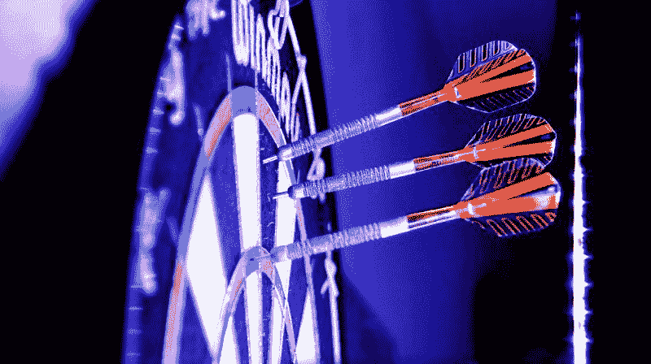
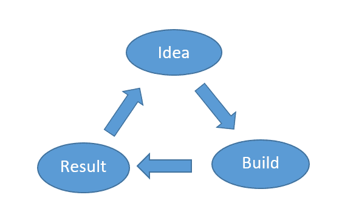
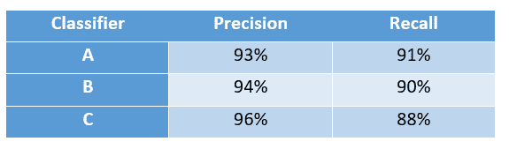
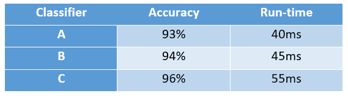
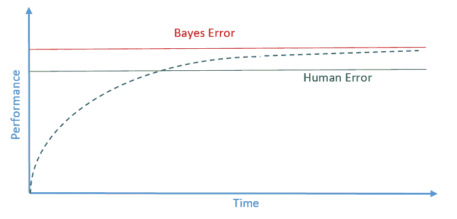
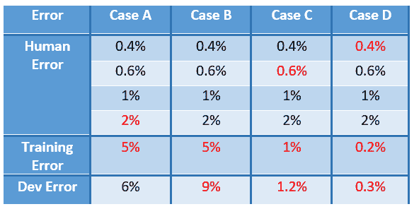

# 如何战略性地完成你的机器学习模型的性能目标

> 原文：<https://www.freecodecamp.org/news/how-to-strategically-accomplish-your-machine-learning-models-performance-goals-44dddc11697e/>

奈扎·阿萨维尔

# 如何战略性地完成你的机器学习模型的性能目标

“three dart pins” by [Alexander Muzenhardt](https://unsplash.com/@darts_pictures?utm_source=medium&utm_medium=referral) on [Unsplash](https://unsplash.com?utm_source=medium&utm_medium=referral)

### 介绍

机器学习(ML)开发是一个迭代过程。你有一个解决手头问题的想法，你建立这个想法并检查结果。您得到了另一个改进结果的想法，如此类推，直到您达到性能目标，认为您的模型可以部署到产品中了——可以供最终用户使用了。

Figure 1\. The iterative process in ML development.

然而，通常有许多想法和可能性，你可以尝试提高性能，更接近你的目标。例如，你可以收集更多的数据，训练更长的时间，或者尝试更大或更小的网络。

在这个实验过程中走错方向可能代价高昂，尤其是对于大型项目。没有人愿意花两个月的时间收集更多的数据，然后发现性能提升微不足道，一天都不值得，更不用说两个月了！

战略性地设定和努力实现你的 ML 模型的性能目标对于加速实验过程和实现目标是至关重要的。在这篇文章中，我提出了一些建议，希望能在这方面帮助你。

### 预期先验知识

这篇文章假设你至少知道构建 ML 模型的基本知识。这个讨论并不是为了说明什么是 ML 模型或者如何构建一个 ML 模型。相反，内容是关于如何在开发过程中战略性地改进 ML 模型。**具体来说，您应该熟悉以下概念和术语:**

*   **训练集、开发集和测试集:**开发集也称为验证集或保持集。[这篇文章](https://towardsdatascience.com/train-validation-and-test-sets-72cb40cba9e7)是对这个话题的一个很好的简短介绍。
*   **评估(或性能)度量:**这是用于指示 ML 模型在工作中有多“好”的度量。[这里有一个帖子](https://towardsdatascience.com/metrics-to-evaluate-your-machine-learning-algorithm-f10ba6e38234)，介绍了 ML 中使用的一些基本指标。
*   **偏差(欠拟合)和方差(过拟合)误差:** [这个](https://www.quora.com/What-is-the-best-way-to-explain-the-bias-variance-trade-off-in-layman’s-terms)用简单的方式很好的解释了这些误差。

### 正交化的重要性

如您所知，开发 ML 模型的顺序步骤如下:

1.  很好地适应训练集。例如，尝试更大的网络，尝试另一种成本函数优化方法，尝试更长时间的训练。
2.  安装好开发套件。比如尝试正则化，尝试收集更多的训练数据。
3.  很好地安装测试设备。例如，尝试更大的开发设置。
4.  在生产中表现出色。如果不是，开发集需要改变模型的成本函数。

在这个过程中，理想情况下，您希望您尝试的修改——“模型控制”——是独立的。为什么？

例如，考虑一下汽车的方向盘。当你向左打方向盘时，汽车向左移动。当你向右打方向盘时，汽车向右移动。如果向左打方向盘使汽车向左移动**并且**增加了汽车的速度会怎么样？控制汽车会变得更加困难，对吗？为什么？因为向左打方向盘**不再是汽车的独立控制**。它与另一个控制器相连，速度控制器*。*当控制独立时，总是更容易。

在 ML 开发中，**提前停止**，*，*例如，是一种正则化形式，用于通过仅在训练集的一部分上进行训练来提高 dev 集上的性能。因此，提前停止是一个与另一个控制无关的**控制，即你训练多长时间。**

对于更快的迭代开发过程，您会希望您的控件的独立性，即**正交化**。换句话说，考虑尽可能避免像这样的依赖控件，尽早停止，以加快开发过程。

### 战略

记住前面的介绍，下面是一些设置和战略性地提高模型性能的技巧:

#### **a)将多个评估指标合并为一个**

您可能有几个评估指标来评估您的 ML 模型的性能。例如，你可以用召回率和精确度来评估一个分类器。查全率和查准率是相互竞争的指标，通常一个提高，另一个降低。那么，例如，如何从下面的表 1 中选择最佳分类器呢？

在这种情况下，将精度和召回率结合成一个指标是一个好主意。F1 的分数[ `F1 score= (2 *precision*recall)/(precision + recall)` ]就可以了，你可能已经意识到了。因此，表 1 中的分类器 A 将具有最好的 F1 分数。

Table 1\. Performance results of a classifier (synthetic data).

显然，这个过程是特定于问题的。您的应用程序可能需要最大限度地提高精度。在这种情况下，表 1 中的分类器 C 将是您的最佳选择。

**优化和满足**

你可能想遵循优化和满意的方法。这意味着，只要其他指标满足某个最小阈值，您就在优化一个指标。

假设表 1 中的分类器以及准确度和运行时间是两个度量，如下表 2 所示。您可能主要关心优化一个指标——准确性——只要其他指标——运行时——满足某个阈值。在这个例子中，运行时间阈值是 50 毫秒或更少。因此，只要运行时间为 50 毫秒或更少，您就在寻找具有最高精度的分类器**。因此，从表 2 中，您可以选择分类器 b。**

Table 2\. Performance results of a classifier (synthetic data).

但是，如果您的目标是最大化所有指标的性能，您需要将它们结合起来。

将所有指标合并成一个并不总是容易的。可能有很多。他们之间的关系不清楚。在这种情况下，你将需要**创造性**和**细心**来组合它们！你在提出一个**一体化**性能指标上投入的时间是值得的。它不仅会加快开发过程，而且会在生产中产生一个表现良好的模型。

#### **b)正确设置培训、开发和测试设备**

**为培训/开发/测试分割选择正确的尺寸**

您可能已经看到了分别针对培训、开发和测试数据集的 60%、20%和 20%的划分。这适用于小型数据集，比如 10k 或更少的数据点。然而，当处理大型数据集时，特别是深度学习时，98%，1%，1%或类似的分割可能更合适。如果您的数据集中有 200 万个数据点，那么 1%的分割就是 2 万个数据点，这对开发和测试集来说足够了。

一般来说，您希望您的 dev 集足够大，以捕获您在实验过程中对模型所做的更改。您希望您的测试集足够大，以使您对模型的性能有高度的信心。

**确保开发和测试集来自同一个分布**

虽然这看起来微不足道，但我见过有经验的开发人员忘记了这一点。假设您已经试验并迭代改进了一个基于邮政编码预测汽车贷款违约的模型。例如，如果开发集来自平均收入较高的邮政编码地区，就不要期望你的模型能在来自平均收入较低的邮政编码地区的测试集上正确工作。这是两个不同的发行版！

**确保开发和测试集反映您的模型在生产中会遇到的数据**

例如，如果您正在进行人脸识别，那么您的开发/测试图像的分辨率应该反映生产中图像的分辨率。虽然这可能是一个微不足道的例子，但是您应该检查您的应用程序在生产中使用的数据的所有方面，并与您的培训/开发/测试数据进行比较。如果您的模型在您的度量和开发/测试集上做得很好，但是在生产中做得不那么好，那么您有错误的度量和/或错误的开发/测试集！

#### **c)首先识别并解决“正确的”错误**

**贝叶斯错误和人为错误**

贝叶斯误差是模型中存在的理论上的最低误差，换句话说就是不可约误差。例如，考虑一个狗分类器，它预测手边的图像是狗还是其他动物。可能会有一些图像非常模糊，以至于人类甚至是有史以来最复杂的系统都无法对其进行分类。这将是贝叶斯的错误。

根据定义，人为错误比贝叶斯错误更大——更糟糕。然而，人类的错误通常非常接近贝叶斯的错误，因为我们真的很擅长识别模式。因此，人为错误通常被用作贝叶斯错误的代理。

**提高低于人类水平的绩效**

当您的 ML 模型的性能低于人类水平的性能时，您可以通过以下方式提高性能:

1.  获得更多由人类标记的数据
2.  分析错误，并将见解融入系统。为什么 ML 模型会犯这样那样的错误，而人类却能做到正确？
3.  改进模型本身。查看它是欠拟合(高偏差误差)还是过拟合(高方差误差)，并相应地更改模型。

一旦超过了人的水平，如你所料，提高性能就变成了一个更慢、更困难的过程。

Figure 2\. Performance curve of a typical ML model as a function of time productively spent in improving the performance (illustrative figure).

那么，你如何准确地定义人为错误呢？这就是接下来要讨论的！

**定义人为错误并识别要首先解决的错误**

考虑之前的狗分类问题——识别图像是否是狗。在做了一些研究后，您可能会发现如下人为错误:

*   普通人:2%的误差
*   一般动物学家:1%的误差
*   动物专家:0.6%的误差
*   一组动物学家专家:0.4%的误差

现在，考虑下面表 3 中的四种情况。

Table 3\. Errors of a dog-image classifier (synthetic data). Human Error (top to bottom) are of: team of expert zoologists, an expert zoologist, the average zoologist, and the average person.

在情况 A 中，您应该优先考虑欠拟合问题——高偏置——如红色误差所示，因为偏置误差(5% -2% =3%)大于方差误差(6% -5% =1%)。对于人为误差，在小于训练误差的*的人为误差中，最大的*被首先*使用*。因此，在这种情况下，你的人为误差参考值是普通人的 2%，因为它是小于训练误差的人为误差中最大的误差(在这种情况下是所有的误差)。

在情况 B 中，您可能需要首先改善方差误差，9%-5%=4%，因为它大于偏置误差 5%-2%=3%。

在案例 C 中，你超越了普通人的表现，你和普通动物学家的表现紧密相连。所以，你新的人类误差应该是动物学家专家的误差——0.6%—或者甚至是动物学家专家团队的误差——0.4%。这种情况下的方差误差为 0.2%，而偏置误差在 0.4%和 0.6%之间。因此，您应该首先解决这个错误，需要更好地拟合训练数据。

**超越人类的表现**

在案例 D 中，您可以看到训练误差为 0.2%，而最佳人为误差为 0.4%。这是否意味着你的模型超越了人类的表现，或者模型超出了 0.2%？！你看，不清楚是关注偏差误差还是方差误差。此外，如果您的模型确实超越了人类的表现，并且您仍在寻求改进该模型，那么从人类直觉的角度来看，遵循哪种策略就变得不清楚了。

现在有许多超越人类表现的人工智能模型，如产品推荐和在线广告定位系统。这些“超越人类表现的模型”往往是非自然感知系统，即不是计算机视觉、语音识别或自然语言处理系统。原因是我们人类真的很擅长自然感知任务。

然而，通过大数据和深度学习，存在超越人类表现的自然感知系统，并且它们越来越好。但这些都是非自然感知问题难多了。

最初发表于 2018 年 3 月 24 日 assawiel.com/blog。编辑:2018 年 10 月 4 日