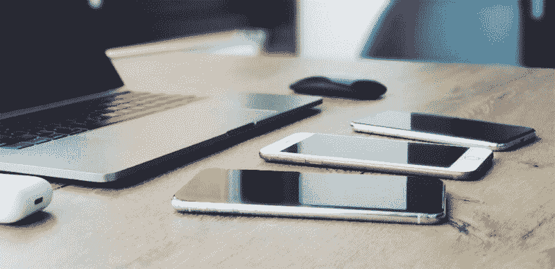
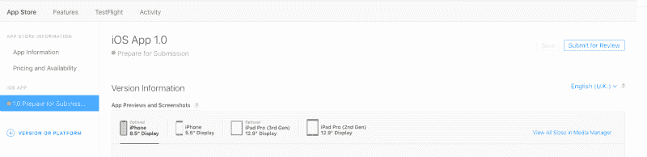

# 如何成功将应用提交到应用商店进行审核

> 原文：<https://www.freecodecamp.org/news/how-to-successfully-submit-an-app-to-the-app-store-for-review-ad7ccdd87722/>

伊琳娜·布利吉纳

# 如何成功将应用提交到应用商店进行审核

苹果团队对移动应用程序的质量有着严格的要求。这对用户来说真的很棒，因为苹果团队努力让 App Store 成为一个值得信赖的生态系统。App Store 有很高的门槛和苛刻的要求，不仅对应用的性能，而且对适当的安全措施的实施。用户可以确信 iOS 应用程序是可靠的。

然而，对于开发人员来说，满足所有需求可能会变成一个真正的地狱。仅作比较，应用程序的开发可能只需要几周时间，而通过 App Store 审核的时间可能长达一个月(如果开发者无视[苹果的开发者指南](https://developer.apple.com/app-store/review/guidelines)，甚至几个月)。

我在 [Dashdevs](http://www.dashdevs.com) 工作，是一名客户接洽员。我的主要职责是从头开始创建应用程序，以便它们通过审查。我根据客户的要求工作。我们在 iOS 应用程序开发方面拥有超过 9 年的专业经验。我们与各种市场、行业和不同的公司合作过。

应用程序的复杂性也各不相同。2018 年，我们提交了 250 多个应用供审查。不是所有人第一次都通过审查。但有时我们会从一篇好的评论中感受到真正无拘无束的快乐。

在这篇文章中，我想分享我们的经验，这样你可以避免常见的错误，轻松通过审查阶段。

### **如何申请 App Store**

一个闪亮的全新的 iOS 应用程序已经开发，测试，并准备好看看这个世界。二进制文件已经上传到 iTunes Connect 面板。但是还需要什么呢？

*   您需要添加关于您的应用程序的基本信息(描述、标签、联系人)，添加屏幕截图和演示用户帐户的凭据(如果您的应用程序需要授权)。
*   你需要在应用评测笔记中详细解释非显而易见的功能(比如原生手势用法)和应用内购买。
*   然后你需要按下“提交审核”按钮，通知苹果你的应用程序已经准备好应用商店。

如果描述中缺少重要的东西，您会收到通知。然后申请状态审核会改为“等待审核”。真正的检查可能需要几天时间。当核查小组实际开始审查时，申请的状态将改为“审查中”。

***提示:*** *在你的 iPhone 上安装 iTunes Connect 应用程序，就可以立即收到所有状态变化的通知，这样可以节省一些精力。*

App Store 审查是所有应用程序的强制步骤。应用程序验证的过程坚持苹果的指导方针，确保最佳和最安全的用户体验。

他们还检查关于应用程序的主要信息。一部分验证是使用脚本自动完成的，而另一部分则由人们来执行。如果您的应用程序有问题，您将会收到一个通知，详细描述应该修复的问题。审查第一阶段的时间范围为 3 至 7 天。应用程序更新的检查速度更快，从 1 天缩短到 3 天。

在过去的几年里，我在申请审核时遇到了一些问题。有些很容易修理，有些要花很多时间。

### 那么，为什么你的申请第一次没有通过呢？

以下是你需要考虑的。

#### **使用人机界面指南(HIG)进行设计**

你的设计师应该从一开始就遵循 HIG。按钮的大小和位置、基本 UI 元素的正确使用以及导航必须符合 Apple 指南。如果你在开发的最后发现了 HIG 的问题，修复这些问题会让你付出很大的代价。

***提示:*** *不要创建与现有苹果产品或任何其他应用程序相似的应用程序(不要抄袭)。苹果团队对此要求非常严格。*

#### **检查功能列表**

您的应用程序必须包括功能、内容和 UI，使其超越重新包装的网站。苹果团队关心的是对用户的有用性和好处。

有一次，我们的一个应用程序被拒绝了，因为苹果审查团队认为我们的应用程序不需要注册/登录功能。因此，我们发出了上诉通知，并附上了与此功能相关的证据。

另一个案例有一点不同——这个应用程序对于 AppStore 来说太简单了(只是一个有趣的日历)。应用程序需要额外的功能。我们通过添加共享功能对其进行了改进，并通过了审查。

一个更重要的规则是，您的应用程序不能要求安装其他应用程序。

#### **向苹果团队提供一个功能齐全的演示账户**

App Store 审核团队肯定会尝试注册你的应用，但他们也需要验证其余的功能。例如，要查看一个银行应用程序的功能，他们需要有一个带有激活卡的帐户，并在上面进行一些交易。您需要确保该帐户可以访问所有功能，并且所有后端功能都已打开。

***提示:*** *不要把这个账号提供给你的 QA 团队进行平时的测试，尤其是在评审期间。有一次，我们发申请审核，同时我们的质保工程师在测试屏蔽功能，偶尔会禁止一个新用户。*

#### **app 里没有“测试”、“即将推出”、“测试版”、“试用版”、“试飞版”。**

你所有的未来，未完成，演示功能不得用于应用程序。不要在你的应用程序内容中使用这些词，即使是应用程序内的截图和描述。如果你需要测试你的应用程序，你可以加入 [Testflight services](https://developer.apple.com/testflight/) 。

我们曾经在另一个应用程序中犯了一个可笑的错误。您可能知道，为了准备提交以供审查，开发人员有时会从试飞中截取应用程序的屏幕截图。这些图片是作为应用商店的真实应用程序的截图发布的。如果你这样做，检查两次，因为状态栏中可能有“测试飞行”标签。当这种情况发生时，你的申请会被拒绝。这点小事可能会阻碍你提交申请。

#### **性能**

App Store 应用程序不允许出现崩溃、性能下降、内存泄漏等问题。不完整的应用程序捆绑包和二进制文件会立即被拒绝，它们会崩溃或在应用程序中出现明显的技术问题。

#### **仅描述现有功能**

未来功能的广告不应出现在应用程序的描述中。

#### **条款和条件/隐私政策**。

这些文档或指向它们的链接必须添加到应用程序中。您需要向用户解释他们的敏感数据是如何处理的，以及应用程序与第三方共享了哪些数据以及用于什么目的(例如，分析工具、广告网络和第三方 SDK 等)。).用户需要知道应用程序的删除和保留策略。

#### **知识产权**

需要有权限才能使用 app 里的所有素材(版权问题)。如果您没有获得必要的许可，请不要在您的应用程序中使用第三方商标、版权作品或专利创意。请记住禁止在移动应用程序中使用性或色情内容、大麻、烟草、受控物质、误导性的宗教经文引用以及暴力的限制。

#### **许可证**

如果您所在业务领域的某些法规要求提供您的服务需要许可证，如金融科技、医药、医疗保健等。，您需要在申请审核时附上这些文件的副本。如果一个 app 需要特定的硬件，你需要提供这个硬件对应的证书或者许可证。

我们经验中的另一个例子是:一个应用程序使用了特殊的标签打印机。起初，申请被拒绝，我们需要获得证书才能使用这些打印机。我们花了一个月的时间才得到硬件生产商的正式批准。

另一个例子是数字银行应用。我们需要向 App Store 审查团队提供电子货币许可证。这也适用于加密货币行业。

> 促进首次硬币发行(“ico”)、加密货币期货交易和其他加密证券或准证券交易的应用程序必须来自于老牌银行、证券公司、期货商(“FCM”)或其他经批准的金融机构，并且必须遵守所有适用的法律。

#### **向用户询问权限**

您的应用程序必须请求使用相机、麦克风、位置、访问通讯录、相机胶卷和用户位置的权限。权限必须与应用程序的功能相关。App Store 团队关心应用程序中收集的信息是否以正确的方式存储，并防止其被第三方未经授权使用、披露或访问。

***提示:*** *别忘了给这些权限添加一个描述。plist 文件。这是拒绝的另一个常见原因。*

#### **应用程序中没有模型数据**

如果您的应用程序没有您需要的某些表单的内容，请隐藏该元素或为其添加一个占位符，并说明用户如何获得必要的数据。

有时开发人员硬编码来显示最大的用户功能。例如，您的应用程序有一个显示用户在应用程序中的活动统计数据的图表部分。在这种情况下，必须有一个带有提示文本的占位符，当用户开始日常使用该应用程序时，该图表将可用。

对于广告，情况是一样的——你不能提交带有空广告横幅或测试广告的应用程序。

#### **调节用户内容的能力**

“阻止用户/内容”、“报告用户/内容”、“用户黑名单”是应用程序的必需功能，如果它提供多用户通信(例如，订阅源、聊天、群组)。作为产品所有者，你需要意识到不同的人会使用你的应用程序，其中一些人可能会打扰其他人。您需要为您的用户提供管理他们正在交互的内容和社区的能力。

### 发布选项

每一次提交评审，我的团队都会获得新的经验。我的主要建议是，一旦你开发了应用程序的 MVP，就将你的应用程序提交给 App Store 审查。请记住，即使你通过了审核，也不意味着这个应用就会被发布。

成功审核后，您可以采取三种不同的措施:

*   **手动发布此版本:**作为开发人员或应用程序管理员，您需要前往 iTunes Connect 面板并按下按钮来发布应用程序。
*   **自动发布此版本:**这意味着应用程序通过审核后将立即发布。
*   **App 审核后自动发布此版本，不得早于…:** 您可以选择发布的时间/日期。如果你的申请通过了审查，它将在那时被发布。

这些选项可以帮助开发人员和产品所有者/经理通过审查，并等待营销活动开始。你需要知道第一次应用审查是最关键的，因此应用商店团队会在更长的时间内更彻底地验证应用。每一个进一步的更新也会被检查，但是它需要更少的时间来验证。有时只需要几个小时。

App Store 可能会拒绝您的应用程序。没关系。不要惊慌。如果您了解原因，您只需解决问题并重新提交申请进行审查。如果您有任何问题或想要提供更多信息，您可以使用解决方案中心与应用审查团队交流。他们支持你，并准备好帮助你的申请。在他们的帮助下，我们解决了很多问题。

我希望我在这篇文章中提到的例子能对你有所帮助，你所有的 IOS 应用都能在第一次尝试时通过 App Store 验证。

附:有用的链接:

*   [App 编程指南](https://developer.apple.com/library/content/documentation/iPhone/Conceptual/iPhoneOSProgrammingGuide/Introduction/Introduction.html#//apple_ref/doc/uid/TP40007072)
*   [App 扩展编程指南](https://developer.apple.com/library/content/documentation/General/Conceptual/ExtensibilityPG/)
*   [iOS 数据存储指南](https://developer.apple.com/icloud/documentation/data-storage/index.html)
*   [人机界面指南](https://developer.apple.com/design/human-interface-guidelines/)
*   [营销资源和身份指南](https://developer.apple.com/app-store/marketing/guidelines/)
*   [使用苹果商标和版权的指南](http://www.apple.com/legal/intellectual-property/guidelinesfor3rdparties.html)