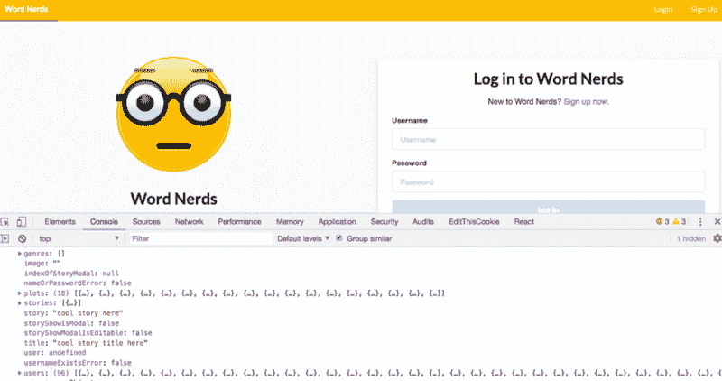
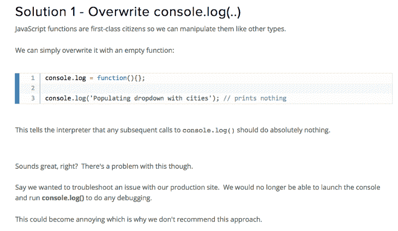
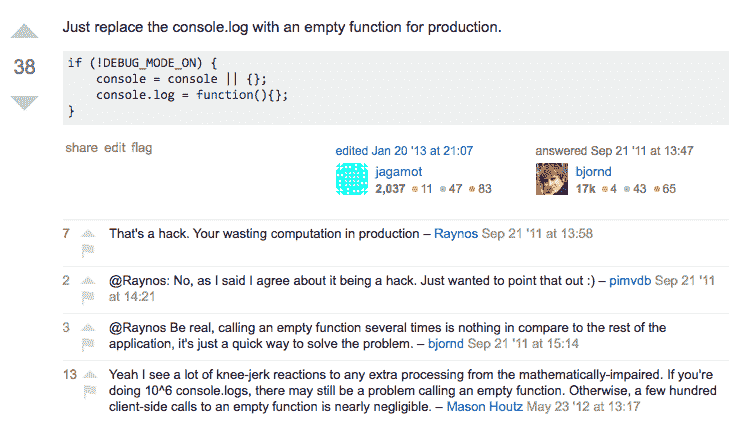
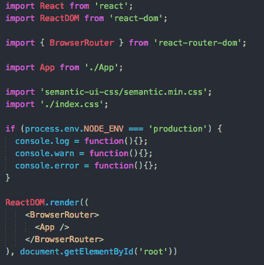
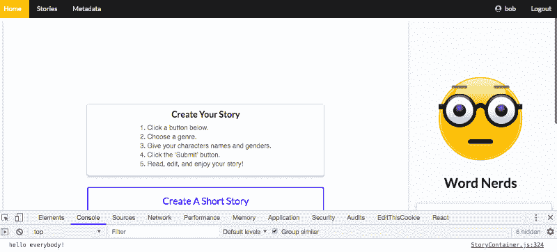
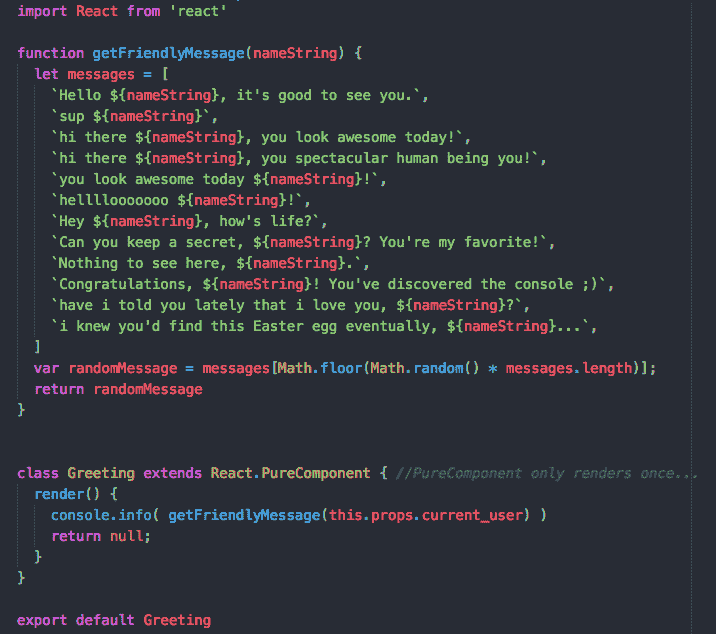

# 如何通过在控制台中隐藏复活节彩蛋来给你的应用程序用户带来惊喜

> 原文：<https://www.freecodecamp.org/news/how-to-surprise-your-apps-users-by-hiding-easter-eggs-in-the-console-3b6e9285e7e7/>

伊森·瑞安

# 如何通过在控制台中隐藏复活节彩蛋来给你的应用程序用户带来惊喜



too much logging to the console

我喜欢 console.logging(“东西”)。

我在我的应用程序中一直这样做，为了调试的目的和特性构建的目的，只是为了纯粹的地狱。把东西记录到控制台很有趣。

如果我感到兴奋的话，我甚至会使用`console.warn()`和`console.error()`以及`console.table()`。

我喜欢它们在我的控制台上制造的所有漂亮的颜色，有时你想让一些信息比其他的更突出。

但是我昨天在看我的故事生成器应用程序时意识到我是在生产模式下登录到控制台的。

啊哦意大利面。

这是不允许的。它会不必要地降低代码速度，更重要的是，它会泄露我的用户的电子邮件地址！我记录了所有用户的用户名和电子邮件地址。不酷！他们的密码当然是加密的，但还是不行。我不希望任何坏人得到一堆我的用户的电子邮件地址，并向他们发送垃圾邮件。

### 在生产模式下清除控制台日志

修理它被证明是容易的。当然，我可以浏览代码库并注释掉我所有的 console.logs()，但是那会很痛苦，其中一些在开发模式中有重要的用途。

幸运的是，有一个更简单、更好的方法。

首先，我咨询了 StackFlow 上列出的[对这个问题的一些解决方案](https://stackoverflow.com/questions/7500811/how-do-i-disable-console-log-when-i-am-not-debugging)，然后最终采用了[这篇博文](https://www.codebyamir.com/blog/suppressing-console-log-messages-in-production)上列出的第一个解决方案。



Solution via [www.codebyamir.com](http://www.codebyamir.com)

当有人将此列为问题的解决方案时，一些评论提到:“那是一个黑客。你在生产中浪费计算”



“That’s a hack.”

辩论得好！我不太担心多次调用一个空函数会在生产中浪费一些计算，所以我采用了这个解决方案，因为它很容易实现并且解决了我的问题。

我是这样做的，在 src/index.js 文件中:



src/index.js file

当然，我可以在任何文件中这样做，比如 App 组件，或者我的 StoryContainer 组件。只要是在任何控制台日志、警告或错误被呈现之前。但我觉得从根本上做是有意义的。

我在开发中用“开发”代替“生产”进行了测试，结果成功了！控制台中不再有消息。

#### 将消息添加回控制台

但后来我感到悲伤:(

控制台中没有更多消息？看起来很稀疏。

也可以给那些好奇、无畏、敢于打开控制台的文字爱好者一些信息。

所以我加了一个回去，像一个隐藏的复活节彩蛋:



hello everybody!

我是怎么做到的？简单:由于我的应用程序对`console.log()`、`console.warn()`和`console.error()`的所有调用都被空函数覆盖，我简单地添加了一个`console.info()`！它基本上和`console.log()`一样。这里[列出了一些差异，并引起争议](https://stackoverflow.com/questions/25532778/node-js-console-log-vs-console-info)。

虽然有点无聊。我已经在 state 中存储了我的应用程序的登录用户名，为什么不个性化我的消息呢？

如果我要个性化我的消息，为什么不个性化一堆消息，并在每次登录用户检查控制台时随机返回一条？每个人都喜欢寻找复活节彩蛋！

这就是我决定要做的，下面是我的做法:



Greeting component

我在我的 StoryContainer 中呈现我的问候组件，以便每当登录用户选择查看控制台时，他们将会看到一条友好的消息！

```
function getFriendlyMessage(nameString) {
  let messages = [
    `Hello ${nameString}, it's good to see you!`,
    `sup ${nameString}`,
    `hi there ${nameString}, you look awesome today!`,
    `hi there ${nameString}, you spectacular human being you!`,
    `you look awesome today ${nameString}!`,
    `hellllooooooo ${nameString}!`,
    `Hey ${nameString}, how's life?`,
    `Can you keep a secret, ${nameString}? You're my favorite!`,
    `Nothing to see here, ${nameString}.`,
    `Congratulations, ${nameString}! You've discovered the console ;)`,
    `have i told you lately that i love you, ${nameString}?`,
    `i knew you'd find this Easter egg eventually, ${nameString}...`,
  ]
  var randomMessage = messages[Math.floor(Math.random() * messages.length)];
  return randomMessage
}
```

编码很有趣。

感谢阅读，文字书呆子们！