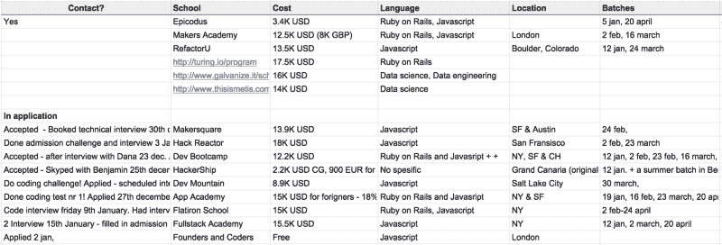
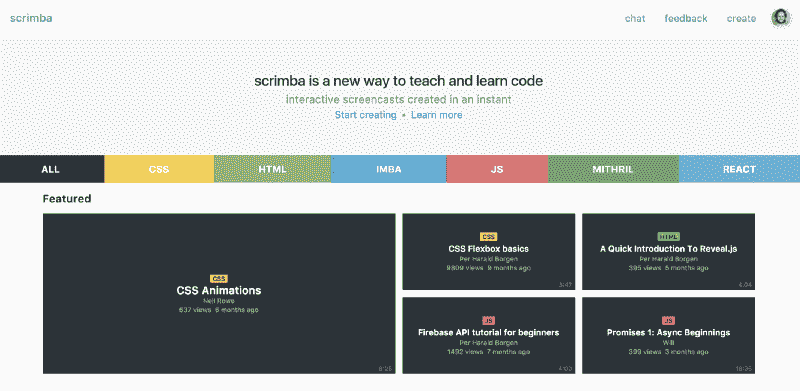

# 如何在编码训练营中生存并最大化你被雇佣的机会

> 原文：<https://www.freecodecamp.org/news/how-to-survive-a-coding-bootcamp-and-maximize-your-chances-of-getting-hired-d4066b58602a/>

2015 年我完全不是技术人员。然而，五个月后，我被聘为开发人员。这都要归功于伦敦一个奇妙的(免费的)编码训练营。这是我有过的最好的学习经历，也是我写了很多关于它的文章。

我现在正在构建一个[编码截屏工具](https://scrimba.com/?utm_source=freecodecamp.org&utm_medium=referral&utm_campaign=survive_bootcamp)，让编程的教与学变得更加容易，所以我非常关心这个主题。我喜欢听那些通过学习如何编程而改变生活的人的故事。

但不是每个参加编码训练营的人都能成功找到一份好工作。这并不奇怪，因为一路上有太多的陷阱需要避免。

本文将帮助您避免这些陷阱，成为一名专业的开发人员。

### 提示 1:选择正确的

你应该仔细考虑你选择哪个编码训练营。它们有很多，区分它们的不仅仅是它们的质量，还有其他一些垂直领域。

以下是一些例子:

*   **费用**:从免费(或者预先免费，但你要支付第一年工资的一部分)到 20，000 美元不等
*   **地点:**你应该搬到一个不同的城市还是找一个当地的编码训练营？
*   **所教工具:** JavaScript/Node.js，Python，Ruby，。网等。
*   **线上与线下**

考虑这些因素，找出对你来说什么是重要的，什么是不重要的。一旦你知道自己想要什么(比如今年秋天在美国售价低于 15，000 美元的 JavaScript 训练营)，你就可以开始寻找合适的了。

你应该对此有条不紊。如果你需要关于如何做到这一点的提示，我已经写了一篇关于我如何在这里做这件事的文章。

本质上，我列出了一个与我相关的清单，然后应用到所有的清单上。然后我过滤，因为我要么被拒绝，要么决定拒绝他们。

我被五个不同的学校录取了，这意味着我可以挑选。经过再三考虑，我选择了伦敦的创始人和程序员。

这个过程中最重要的一个方面是过滤掉不太严肃的学校。你不会想在一所更关心赚钱而不是培养优秀软件开发人员的学校里终老。

### 秘诀 2:拼命准备。

你只有几个月的时间来提高自己的技能。所以你应该帮自己一个忙，提前做好充分的准备。

一旦我决定参加一个训练营，我就把我的编程活动从**爱好**提升到**痴迷爱好**。我把所有的空闲时间都花在了挑战算法、制作小游戏和浏览教程上。

这样做，会让你的第一周或第二周稍微轻松一点。

这一点之所以如此重要，是因为最初的几周是最艰难的。这段时间你要消化的信息量是惊人的。几乎**一切** 对你来说都是新的。

你不仅要每天学习新的编程概念，还要学习所有的工具和行话。甚至你周围的人对你来说都是陌生的。

如果你没有准备好，你可能会开始落后。根据我的经验，那些一开始就落后的人最终也会落后。您应该不惜任何代价避免这种情况。

### 小贴士#3:这不是一份全职工作——甚至比那还要多

这个建议写在这里感觉有点傻。但我仍然认为我必须这么做，因为我从个人经验中知道，并不是每个人都遵循它。

这就是为什么他们中的许多人在传统的朝九晚五的工作日之外还有课程和项目。

你成功找到工作的机会与你花费的时间正相关。

一些学生将训练营视为一项常规工作或学校，在晚上或周末跳过编码。虽然有些人可以做到这一点，但对你来说可能不会有好结果。

我从奥斯陆搬到伦敦去做创始人和程序员。这意味着除了在训练营认识的朋友，我在镇上没有朋友。这非常有效，因为我可以把所有的时间都花在思考代码上。我喜欢它。

### 提示 4:确保你是专业的

最后，你不应该把精力平均分配到所有科目上。你应该在某个时候开始专攻。

这可能看起来违背直觉，因为你的知识中有太多的漏洞需要填补。关注所有学科的基础知识似乎是明智的。

但是你毕业的时候，你的知识会有很多漏洞**无论如何**，所以多一些也没什么区别。但是如果你专攻**一个***科目，这可能会造成至少给一个面试官留下印象和不给任何面试官留下印象的差别。至少，我就是这样。*

这个策略正是我在训练营结束后找到工作的原因。

在训练营进行到一半的时候，我选择关注 React.js。这并不意味着从那时起，我可以把所有的时间都花在编写 React 上。我仍然需要学习教学大纲中的所有其他内容。但是只要有可能，我就包含了这个库，并且被包含 React 的任务所吸引。这使得我的投资组合中有五个 React 项目，而不是只有几个。

### 仅此而已

如果你遵循这些建议，你很可能在训练营结束后找到一份初级软件开发员的工作。当你这么做的时候，一定要阅读我的《初级开发人员生存指南》。

感谢阅读！我是 Per， [Scrimba](https://scrimba.com/?utm_source=freecodecamp.org&utm_medium=referral&utm_campaign=survive_bootcamp) 的联合创始人，这是一个创建交互式代码截屏的工具。如果你正在教授或学习如何编码，一定要去看看。

