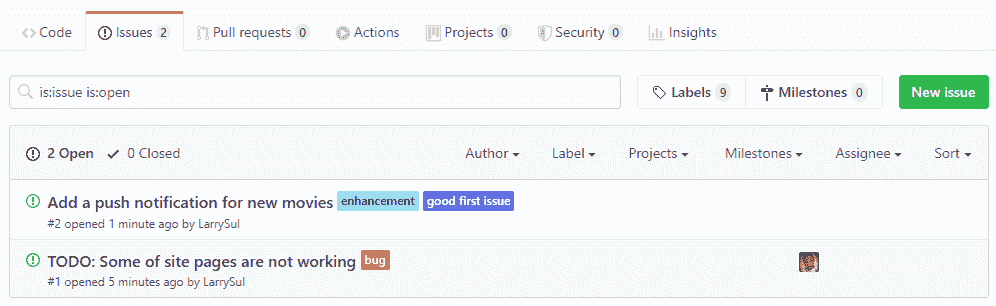

# 如何在本地 Git 存储库中的问题之间切换

> 原文：<https://www.freecodecamp.org/news/how-to-switch-between-issues-in-git/>

在我的开源之旅中，我遇到了一个简单(但很棘手)的情况，如果你做错了，它可能会绊倒你。这就是我们将在本文中讨论的内容。

加入开源社区意味着你在为自由或开源软件的发展做贡献。有许多组织总是欢迎贡献者加入他们的代码库。

要开始使用开源，你需要对版本控制工具有一个基本的了解，比如 [Git](https://git-scm.com/) 。贡献者使用 Git 来跟踪项目文件中的变化，它也帮助人们协调他们在这些文件上的工作。

## 先决条件

1.  安装了 Git
2.  对 Git 有基本的了解

## 为什么是问题？



存储库中的问题可以用来跟踪您正在处理的项目的任务、想法、错误或增强。基本上，它们为你提供了任务需要什么的描述。

要处理某个问题，项目管理员需要将该特定问题分配给您。这样，其他团队成员就会知道有人正在处理这个问题。

## 处理一个问题

要开始处理一个问题，您需要在本地机器上使用 Git clone 命令克隆或复制目标存储库。

```
git clone <url of repository>
```

创建一个上游，允许您跟踪最新的上游(即原始存储库)变更。这样，Git 可以在发生变化时通知您，以便您可以更新克隆的存储库。

```
git remote add upstream <url of the original repository> 
```

要预览可用遥控器列表和可执行的任务(获取和推送),请键入:

```
git remote -v
```

为了跟上最新的变化，您总是需要尝试从上游获取。通过这种方式，您可以从参与各种功能的每个团队成员那里获得所有的提交。

```
git fetch <upstream>/<master>
```

接下来，您需要将其他贡献者的提交合并到本地存储库中。

```
git merge <upstream>/<master> 
```

Git merge 的目标是使主分支的本地副本与主分支的上游副本完全匹配。

接下来，为分配给您的问题创建一个分支。为什么一定要创建分支机构？树枝是用来做什么的？让我们进一步调查。

### Git 分支

分支为您提供了所做更改的快照。当进行提交时，Git 存储来自提交的信息。这提供了一个指针，以后可以用来引用或跟踪所做的更改。这就是为什么在处理新任务、bug 修复或任何其他特性时，创建一个分支是有帮助的。

当我们开始时，Git 为我们提供了一个主分支。主分支包含工作代码。为了避免将您的更改与生产代码混淆，您需要创建一个新的分支。

要创建分支，您需要输入以下 Git 命令:

```
git checkout -b <descriptive-branch-name>
```

该命令基于当前分支创建一个新分支，尽管您也可以指定要创建新分支的分支。

```
git checkout -b <descriptive-branch-name> <target-branch-name> 
```

要列出存储库中所有可用的分支，请键入:

```
git branch
```

当您正在处理的任务已经完成时，在本地存储库上推送更改以供审查。之后，创建一个 pull 请求，通知项目管理员所分配任务的当前状态。

```
git push -u origin <descriptive-branch-name> 
```

## 现在我该如何转到下一期呢？

使用描述性名称创建不同的分支，如下所示:

```
git checkout -b <descriptive-branch-name> <target-branch-name> 
```

一旦我们有了我们的分支，我们将使用来自 [hub](https://hub.github.com/) 的实用程序命令。该命令将帮助我们从上游获取代码，并且它还将运行合并(如果您安装了 [hub 实用程序)](https://github.com/github/hub#installation)。

```
hub sync
```

该命令检索上游更改，并将它们与新创建的分支合并。您总是可以使用 Git status 命令检查您的分支和上游的更改:

```
git status
```

现在，您可以继续处理新的分支。只需记住提交您的更改，并像我们上面所做的那样推送到远程分支。

### 你可能犯的错误。

您可能会在处理多个问题时出错——这可能会导致从分支中删除提交。

下面是一个示例，演示了如何从分支中删除不需要的提交:

**步骤 1:** 切换到您想要删除不需要的提交的分支:

```
git checkout <descriptive-branch-name> 
```

**步骤 2:** 运行对分支机构的提交记录。这将帮助您基于唯一的**提交散列**(提交内容的 SHA1 40 字符校验和)决定您想要保留哪些提交，通常采用以下形式:**da 034 F6 ff 3 e 856 b5 ba 155 BC 01 def 0847 a1 C4 ed 7 e**。

```
git log
```

同样值得注意的是，如果您希望保留最近的提交(比如上一次提交),您可以简单地这样做:

```
git log -n 1
```

**步骤 3:** 因为您想要丢弃该分支上的所有其他提交，所以只需对该分支应用一个提交。放弃和应用是两个步骤:

首先，使用以下命令放弃分支上的所有提交:

```
git reset --hard <upstream>/<master> 
```

简单地说，上面的命令告诉 Git 丢弃所有暂存和未暂存的更改。它会忘记当前本地分支上的所有内容，并使其与`upstream/master`完全相同。

其次，使用以下命令将一个提交应用到分支:

```
git cherry-pick Hash

//where Hash is a commit hash from other branch
```

默认情况下，该命令从一个分支中选择一个引用(即提交),并将其应用于另一个分支。

**第四步:**当你运行`git status`时，它会报告你的分支`<origin>/<descriptive-branch-name>`分叉了。因为这是意料之中的，所以我们需要强制遥控器只包含那些我们精选的更改。

要做到这一点，我们需要使用一个命令来帮助删除远程历史并用不同的历史替换它:

```
git push --force origin
```

该命令将丢弃远程上的额外提交，就像我们丢弃本地副本上的额外提交一样。这很危险，因为这是极少数会丢弃某些东西的 git 命令之一——所以使用时要小心。

现在，当您运行`git status`时，它报告该分支与`<origin>/<descriptive-branch-name>`是最新的。这表明手术成功地进行了。

感谢阅读？！大呼小叫地[马克韦特](https://github.com/markewaite)？

在 [twitter](https://twitter.com/devlarri) 上关注我。