# 如何同步以太坊节点而不犯我犯过的错误

> 原文：<https://www.freecodecamp.org/news/how-to-sync-an-ethereum-node-using-geth-and-ethereum-wallet-81423d42a583/>

作者扎克

# 如何同步以太坊节点而不犯我犯过的错误

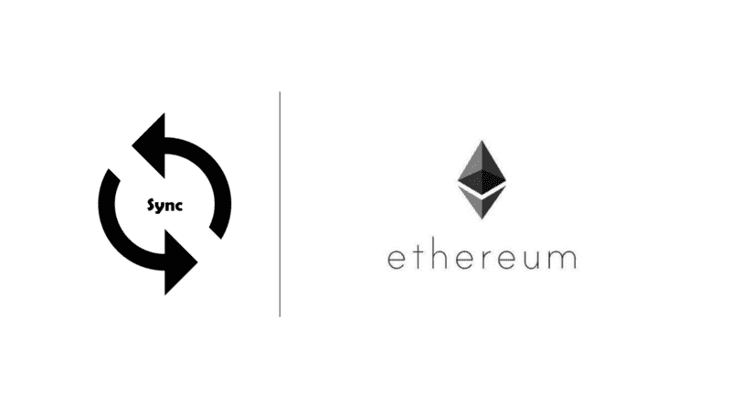

当我第一次开始在以太坊平台上开发时，同步一个节点是我首先要做的事情之一。没有人帮我，也没有地方整理我遇到的所有常见错误，我浪费了数周时间来同步一个节点。这太令人头痛了，我几乎要放弃了。

不知道术语只会让它更难。

因此，在这篇文章中，我想综合你可能面临的所有常见错误，并解释同步节点时每个步骤背后的原因。希望你不会像我一样有这么糟糕的早期经历。

### 快速介绍

在以太坊中，开发人员创建在网络上运行的应用程序片段。这些被称为智能合约。虽然您可以手动部署它们而不同步到以太坊节点，但从长远来看，同步开发过程更方便(特别是当我们想要使用像[松露](http://truffleframework.com/)这样的开发框架时)。

要同步以太坊节点，我们需要以下软件:

*   Geth —以太坊节点的客户端。
*   以太坊钱包—以太坊节点的用户界面。

让我们开始吧。

### 安装 Geth

要下载 Geth，Windows 用户请点击此处。然后点击“Geth for Windows”按钮。

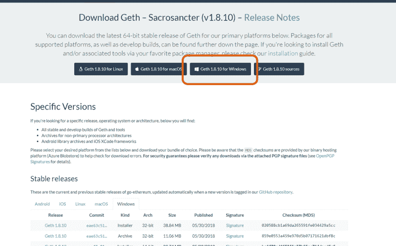

对于 MacOS 用户，我建议你使用自制软件下载。您可以使用以下命令来完成此操作:

```
brew tap ethereum/ethereumbrew install ethereum
```

更多详情请参考 [Geth 的说明](https://github.com/ethereum/go-ethereum/wiki/Installation-Instructions-for-Mac)。

通过在终端(MacOS)或 PowerShell (Windows)中键入`geth version`来检查 Geth 是否安装正确。

### 安装以太坊钱包

我们将与网络交互的 GUI 称为“钱包”。你可以用谷歌快速搜索找到许多不同的以太坊钱包(如 Parity、Jaxx 和 MyEtherWallet)。我个人喜欢用以太坊钱包。它的界面很人性化，我也有点偏心，因为它是以太坊自己开发的。

你可以在这里找到安装程序[。](https://github.com/ethereum/mist/releases/latest)

注:比起**迷雾**，我更喜欢**以太坊钱包**。Mist 基本上是一个渲染去中心化应用(dApps)和网站的浏览器。

对于智能合约的开发，我们将只需要以太坊钱包。

### Mainnet vs Testnet

在以太坊中，有两个主要的网络:mainnet 和 testnet。

主网是用来处理实际事务的。以太的价值通过加密货币交易所与真正的法定货币挂钩。

作为开发人员，我们不想用真金白银来运行应用程序测试。这就是测试网的用途。

我们称测试网为 Ropsten。

### 运行 Geth 和以太坊钱包

当你开发一个智能合同时，你应该首先同步测试网。当我们准备好部署时，我们只需要同步 mainnet。

你需要大约 30GB 的存储空间来同步一个测试网。由于 mainnet 中有更多的事务，您将需要大约 **100GB** 来同步 mainnet。

注意:有人说，你需要一个固态硬盘存储快速写入，以便同步可以赶上最新的块。就个人而言，我觉得硬盘存储是可以的。然而，如果可以选择，我肯定会使用 SSD 存储。

#### **对于 Windows 用户**

为了便于访问，我建议您创建一个文件夹来存储区块链。比如“C:\EthereumTestnet”。

创建文件夹后，尝试运行以下命令:

```
geth — testnet — data-dir=”C:\EthereumTestnet” — rpc — rpcapi eth,web3,net,personal
```

编辑:似乎有些论点已经改变了。如果您遇到这样的错误“提供了标志但未定义:-data-dir”，请尝试将参数名称更改为 datadir，而不是 data-dir。

参数`--testnet`指定我们想要同步到 Ropsten 网络。因此，要同步 mainnet，您只需取出参数`--testnet`并更改数据目录。例如:

`geth — data-dir=”C:\EthereumMainnet” — rpc — rpcapi eth,web3,net,personal`

`--rpc`参数启用 HTTP-RPC 服务器。这允许我们使用某些服务，如`--rpcapi eth,web3,net,personal`中所述。

输入命令后，您应该会看到类似这样的内容:

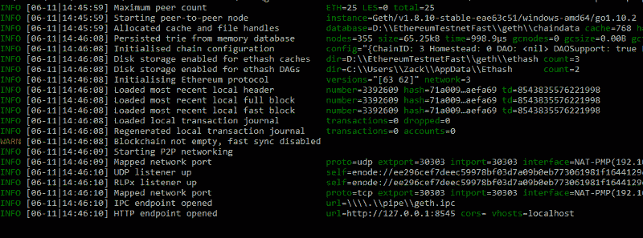

Geth starting up.

为了不破坏区块链，尤其是在同步了几个小时之后，你应该**而不是**突然关闭命令提示符。总是通过按下 **Ctrl + C** 来停止同步，等待 Geth 为你关闭程序。

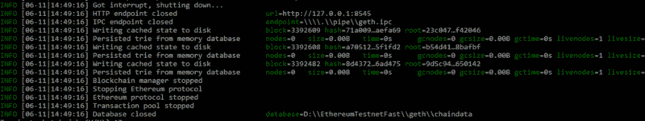

After pressing Ctrl + C, Geth shuts down.

然而，很难记住您需要的所有命令和 rpc 服务。这就是为什么我建议创建一个快捷方式或批处理文件来帮助你。

只需使用任何文本编辑器创建一个文件，并将其保存为**。bat** 档。比如 *RunGethTestnet.bat* (名字不重要)。将命令复制并粘贴到文件中，然后保存。下次需要运行 Geth for Ropsten 时，只需双击该文件。

运行完 Geth，还要运行以太坊钱包。因为我们想让界面定位我们使用 Geth 同步文件的确切位置，所以我们从控制台执行它。

与 Geth 类似，我也为它保存了一个批处理文件和一个示例命令，如下所示:

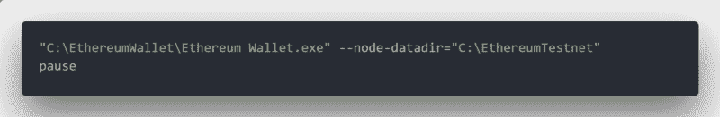

请注意，您的命令可能与我的命令略有不同，因为您可能将应用程序存储在不同的目录中。

或者，您可以将应用程序添加到您的路径中。

参数`--node-datadir="C:\EthereumTestnet"`声明了我存储 chaindata 的位置，这与我为 Geth 指定的位置完全相同。

#### **对于 Mac 用户**

这对于 MacOS 来说稍微简单一些，因为 chaindata 是自动下载到库中的，不会对我们隐藏。因此，我们不需要指定数据目录。

尽管如此，我还是建议创建一个脚本文件来简化 Geth 和以太坊钱包的运行。

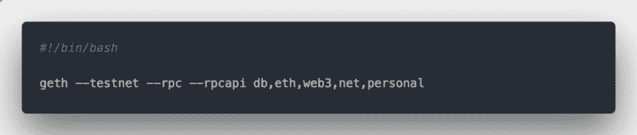

Geth command for testnet

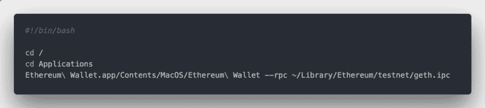

Command to run Ethereum Wallet

注意: **Geth 要在以太坊钱包**之前运行。

单独运行以太坊钱包会自动启动同步过程，因为它会在后台自动运行 Geth 客户端。这是用户友好的，但是不能启用我们想要使用的 RPC 服务。因此，我们希望确保在 Geth 和 Ethereum 钱包执行中启用 RPC。

#### 几个音符

1.  同步过程非常漫长，可能需要 2-3 天。请保持耐心，考虑让你的电脑通宵开机。
2.  同步速度取决于您的互联网速度、对等点数量和存储驱动器的写入速度。
3.  由于数据存储在数据块中并链接在一起，因此一个数据块的损坏可能会损坏整个数据链。这可能会浪费您等待节点同步的时间。因此，正确关闭 Geth 是非常重要的。在某些情况下，您可能希望[回滚](https://github.com/ethereumproject/go-ethereum/pull/206)。但是在这里预防胜于治疗。
4.  你以太坊钱包上的进度条**不**准确。依赖它会给你很多焦虑和挫败感。
5.  Geth 在端口 30303 上运行，用于外部监听。
6.  用于内部通信的默认端口是 8545，例如在您的钱包和 Geth 之间。

### 确保您的 Geth 客户端端口已打开

确保与 Geth 客户机的连接不受限制非常重要。我遇到的一个大难题是让我的防火墙限制我可以通过 Geth 客户机连接的数量。

您可以通过查看**对等点计数**来发现这个问题。如果它一直保持在大约 1-3 个同伴的低水平(至少半小时)，很有可能你的连接是有限的。健康的范围是 5 个同伴以上。

#### **MacOS 用户**

当您运行 Geth 时，应该会有一个允许连接的通知。当然，点击“允许”。

若要检查，请前往“系统偏好设置”>“系统与隐私”。

在**防火墙**选项卡下，点击**防火墙选项**。

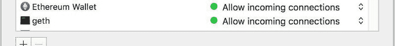

#### **Windows 用户**

要打开您的端口，请转到控制面板>系统和安全> Windows defender 防火墙。

点击**高级设置**。在侧面板上，点击**入站规则**。

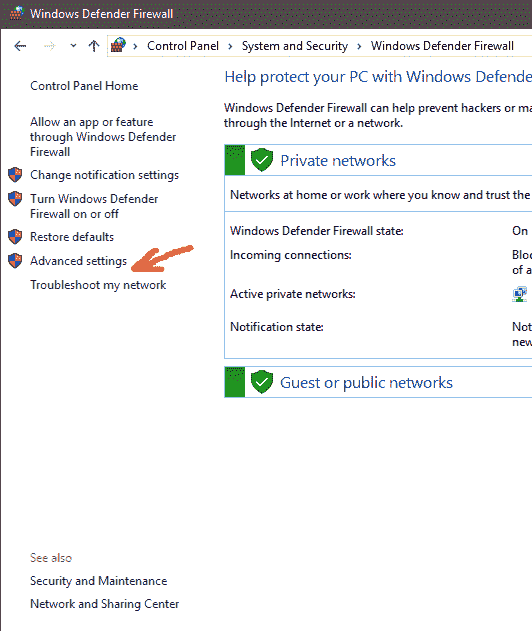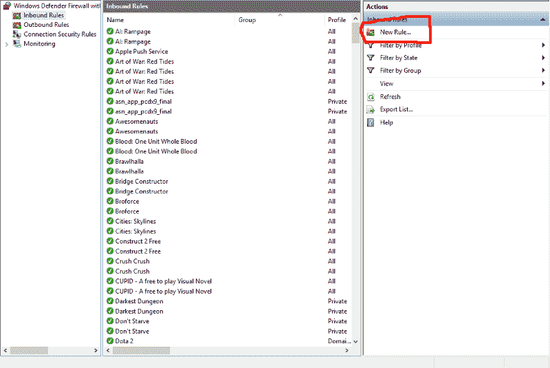

您要打开的入站端口是 TCP 和 UDP 30303。所以我为 TCP 30303 创建了一个规则，为 UDP 30303 创建了另一个规则。

您可能还需要打开 TCP 30303 的出站端口。

请注意，任何第三方防火墙/防病毒软件也可能会限制您的连接，因此请确保对其进行相应的配置。

### 附加到 Geth

要检索关于您的节点的更多信息，您可以连接到 Geth 客户机，并使用 RPC 服务执行命令。

这里有一个简单的方法来检查您的同步状态:通过在单独的终端/控制台上输入以下命令来连接到客户端。

`geth attach [http://127.0.0.1:8545](http://127.0.0.1:8545)`

同样，为了方便起见，您可能希望将其存储在批处理/脚本文件中。

运行该命令后，您应该会看到类似这样的内容。

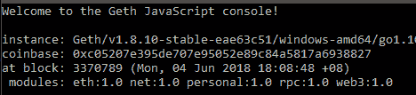

输入`web3.eth`你应该会看到很多信息。要检索有关同步的特定信息，请键入`web3.eth.syncing`。

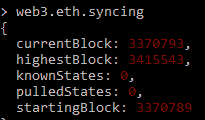

如你所见，以太坊钱包顶部的进度条仅仅是对**最高区块**和**当前区块**的比较。由于你的电脑所知的**最高区块**可能不是实际的最高区块，进度条可能不会反映真实的进度。

事实上，随着您同步您的节点，**最高块**和**已知状态**将继续增加。

### 最后几点

由于技术瞬息万变，请始终使用客户端和钱包的稳定版本，以避免给自己带来更多头痛。

另外，请注意，对于您面临的任何问题，总会有一个解决方法。当你面临同步问题时，你可以尝试寻找解决方案，因为你可能不是第一个面临同样问题的人。

并时刻提醒自己，开发智能合约不需要同步节点。这样做只会有助于促进您对环境以及开发过程的理解。所以，如果你在开发过程中这么早就遇到问题，不要为此自责。

*要获得更多此类文章，[关注我](https://medium.com/@zack.learns)或访问我的网站——[一个开发者的视角](https://developerperspective.com/)。*