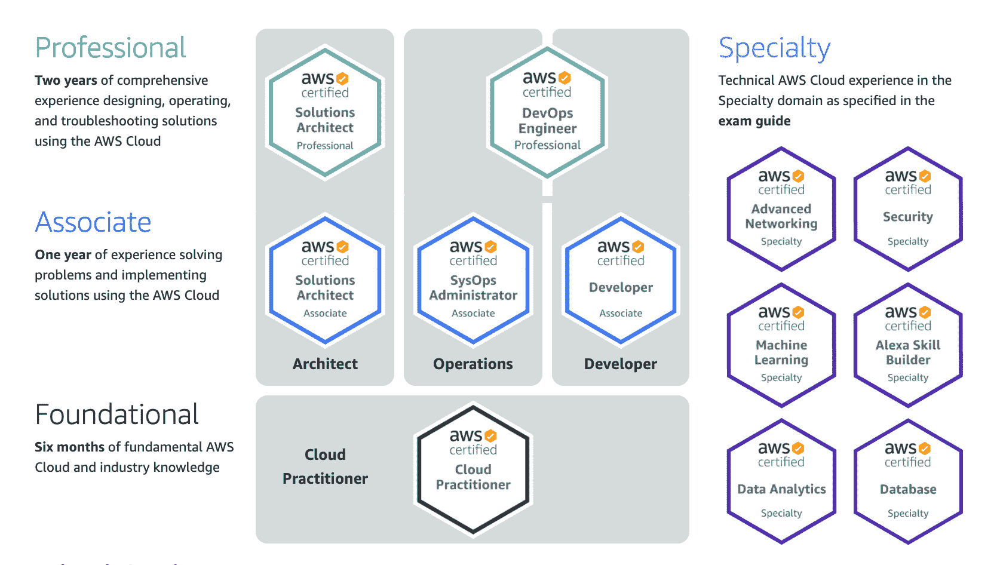
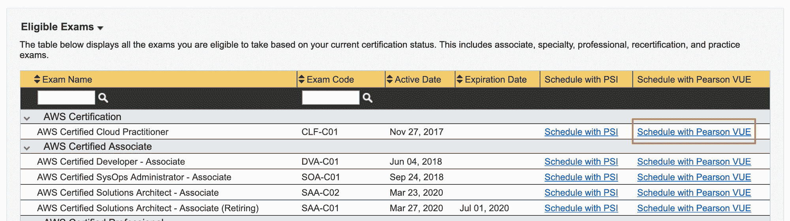
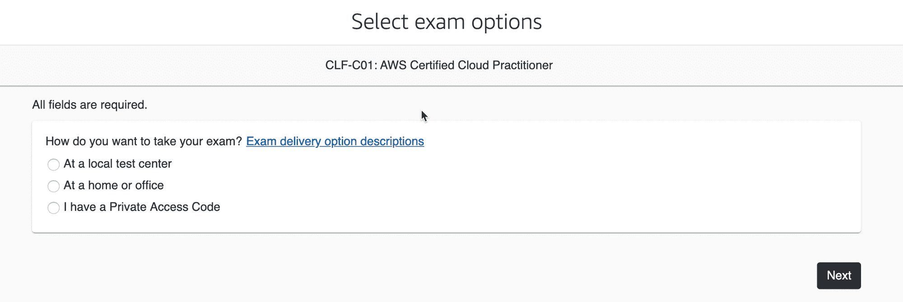
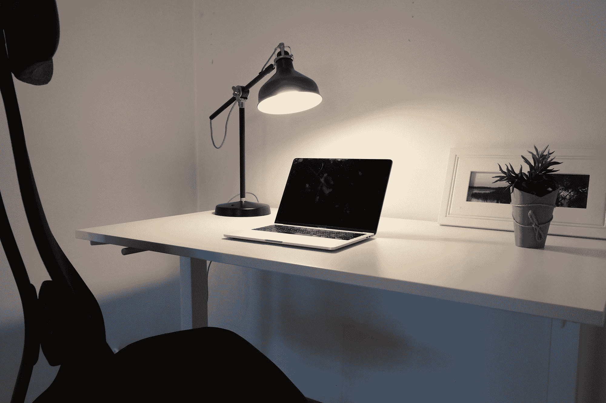

# 在家工作时如何获得 AWS 认证

> 原文：<https://www.freecodecamp.org/news/how-to-take-any-aws-certification-from-home/>

这篇文章将教你一切你需要知道的，以便从家里得到任何 AWS 认证。你将学习如何安排考试，如何为这个重要的日子布置你的工作空间，以及你需要记住的提示。

## 什么是 AWS 认证？

AWS(亚马逊网络服务)认证有助于验证您使用 AWS 解决不同问题的知识和能力。它们是帮助您和其他人确认您对该云提供商了解多少的绝佳工具。

这些认证直接来自 AWS，因为它们是产生认证内容并维护它们的人。当你获得 AWS 认证时，你就开始属于一个由 AWS 认证人员组成的全球社区，作为这个团体的一员，你会获得一些[好处](https://aws.amazon.com/certification/benefits/)。

目前有 12 种不同的 AWS 认证，涵盖不同的知识水平和不同的专业知识。

Source: [https://aws.amazon.com/certification/](https://aws.amazon.com/certification/)

有两种不同类型的认证:专业认证和通才认证。

在通才认证中，我们有 3 个专业水平-基础、助理和专业。这些认证通常涵盖 AWS 中提供的大部分服务，具体取决于您需要达到的深度。

在**基础**级别，我们有云从业者。这个认证涵盖了很多 AWS 服务，但是你真的不需要太多深度。

该认证非常适合开始云计算之旅的人，因为您将了解到许多不同的服务和概念，这些在云计算中非常重要。

在**助理**级别中，有 3 种不同的认证:

*   解决方案架构师助理
*   SysOps 管理员助理
*   开发人员助理。

这些认证涵盖的服务范围也非常广泛，但它们比基础级别更深入。

助理级认证有助于了解如何在云中设计、部署和维护或开发应用程序。这些是技术人员开始云计算之旅的好方法。

在通才认证的顶端，我们有**专业**级认证:解决方案架构师专业人员和开发人员助理。

这些都是非常广泛和非常深入的认证，你需要基本上了解 AWS 的一切。这些是为长期在 AWS 工作并有丰富经验的人准备的。

在**专家**类别中，我们有 6 项认证:

*   高级网络
*   安全性
*   机器学习
*   Alexa 技能生成器
*   数据分析和数据库。

这些认证在一个主题中非常具体，并深入到该主题中。对于专注于这些主题并希望尽可能多地了解 AWS 相关内容的专业人士来说，它们非常有用。

## 如何学习 AWS 认证

学习认证真的取决于你的背景。没有一条道路可以统治所有人。如果你不是技术人员，你想开始工作，或者你是一名新的云开发人员或架构师，这与你已经使用 AWS 很多年，只是想验证你的技能是不一样的。

AWS 及其合作伙伴提供了很多课程，你可以去参加 3 天的课程，学习通过认证所需的一切。这些教师指导的课程往往相当昂贵。

有很多平台提供付费在线课程。这些课程倾向于自学，你必须跟着老师学。通常这些网站的主要优势是他们有很好的论坛和大量的考试。

在免费代码营，你可以找到一些免费的课程来学习一些认证。这些都是很有价值的资源，你可以根据这些视频免费准备考试:

**[AWS 认证云从业者培训 2020 年](https://www.freecodecamp.org/news/aws-certified-cloud-practitioner-training-2019-free-video-course/)**

**[AWS 认证解决方案架构师助理 2020](https://www.freecodecamp.org/news/pass-the-aws-certified-solutions-architect-exam-with-this-free-10-hour-course/)**

**[AWS 认证开发者-准 2020](https://www.freecodecamp.org/news/pass-the-aws-developer-associate-exam-with-this-free-16-hour-course/)**

此外，如果你需要一些额外的动力，还有正在进行的[# AWS certified Challenge](https://www.freecodecamp.org/news/awscertified-challenge-free-path-aws-cloud-certifications/)，这样你就可以成为试图实现相同目标的更大团队中的一员。

## 如何在家参加 AWS 认证

在 2020 年 3 月 30 日之前，您只能参加考试中心的 AWS 认证。基本上你必须在特定的时间去特定的地方参加考试。

从那以后，一切都变了。从测试中心获得认证的选择仍然存在，但现在**所有** AWS 认证都可以通过在线监考的方式获得——这意味着可以在家进行。这一新的选择增加了 AWS 认证测试的灵活性，使每个人都更容易获得。

在考试中心参加考试有它的好处，因为有工作人员帮助您办理考试报到手续，考试计算机为考试进行了完美的设置，整个地方被设计为安静和准备好考试。

当您参加在线监考考试时，您将参加与在考试中心相同的考试，考试时间相同。但是你将在你的电脑上参加考试，在一个你必须为那种情况做准备的地方。会有一个监考人远程监控你的考试。

## 你应该在家参加认证吗？

如果您想在考试中使用在线监考，您需要具备一些条件。

首先，你需要能够与一位讲英语的监考人交谈，他将监督你的考试。AWS 认证提供英语、日语、韩语或简体中文版本，但与远程监考人的交流将使用英语——无论您的认证使用何种语言。

除了 mainland China、日本、斯洛文尼亚和南韩的考生，网上监考在世界各地都可以进行。这是一件很棒的事情，因为在世界的偏远地区寻找考试中心是一件很有挑战性的事情。

此外，这些考试是全天候提供的。这对忙碌的人来说非常方便，所以你总能找到适合你的地方。

此外，您将需要使用自己的计算机进行在线监考，在决定这一选项之前，您应该了解特定的系统要求和政策。

在报名参加考试之前，使用同一台计算机，在你要参加考试的同一地点运行系统测试总是好的。主要要求是稳定的互联网连接、麦克风和网络摄像头。

你需要一个安静的私人空间，在那里你不会被打扰。这是最重要的要求之一。如果监考人认为有一些声音或奇怪的噪音，他们可以自动取消你的考试。

此外，在监考期间，你将不能离开电脑，因为不允许休息。你总是需要在你的网络摄像头的视野。

如果你对之前的所有限制都没问题，那么在家考试对你来说是可能的。

## 如何安排 AWS 认证

尽管在线监考考试可以每天 24 小时进行，但提前一段时间注册认证是一个好习惯。这样，您就可以准备好一切，并在您的环境中进行设置。

注册认证非常简单。您需要遵循 [AWS 认证页面](https://www.aws.training/certification)中的说明。请记住，您可能需要创建许多帐户，并登录至少 3 个不同的服务。

这听起来可能有点吓人，但是这个过程是有指导的，并且有很好的文档记录。一件非常重要的事情是，当你创建这些账户时，确保你使用的名字**与你的 ID 中出现的名字**完全相同。这在验证过程中至关重要。

当您进入选择 AWS 认证的页面时，您需要选择测试供应商“**皮尔逊 VUE** ”。那是在线监考供应商。

在您选择了需要支付认证费用的时间和日期之后。所有认证都有不同的价格，您可以在 AWS 认证页面找到价格列表。当你完成付款后，你就准备好了。

## 如何在家准备考试

有许多事情你应该在考试前几天做，以确保认证当天一切顺利。

尽量多做模拟考试，确保你的模拟考试有正确的时间安排。当你遇到最难的考试时，时间就成了一个问题，所以练习快速答题非常重要。

此外，如果你有一些学习笔记，这是再次阅读它们的好时机。大多数在线课程都有总结或一些简短的版本，你可以在考试前复习最重要的概念。至少再复习一遍最难的题目总是好的。

如果你在家或在办公室参加考试，有些事情你需要提前做。先找到你要做的考试的地方，确切的位置。然后运行系统测试。确保一切正常。

做完这些后，确保你的家人或同事不会打扰你。如果你有任何中断，你将自动失败。

如果你有宠物，确保它们可以被放在不同的房间。非常重要的一点是，在你考试的时候，不要有任何东西打扰你，房间里也不要有其他的动静或噪音。

This was the place where I took the exam - the proctor made me remove the plant and the frame

当你选好地点，整理好分心的外在因素，现在就该设置环境了。我建议你找一个不太杂乱的地方，放一张干净的空桌子。一张可以拿走上面所有东西的桌子。

房间内不应有写有文字的白板或无法关闭的屏幕。让它尽可能地整洁，这样监考人就没有理由对你选择的地方感到紧张。

请记住，监考人不知道你的空间-他们只能看到和听到来自你的麦克风和网络摄像头的内容，如果有任何疑问，他们会让你失望。

挑露手的服装也不错。监考人会要求看你的袖子，如果你没有袖子会有帮助。如果你有手表的话，他们也会要求你摘下手表。

如果你想在考试的时候知道时间，你电脑的时钟会被屏蔽，你不会有手表，所以在进入考试之前确保你有一个挂钟。考试期间，屏幕上会有一个计时器，告诉你还剩多少分钟。

## 在家考试时会发生什么

请在考试 **时间**前 30 分钟到认证系统**报到。记住这一点非常重要，当登记流程开始时，最好为认证准备好整个空间。**

在考试前 30 分钟，您应该查看您在报名时收到的电子邮件，然后单击链接开始报到过程。为此，你需要准备好手机和带照片的有效身份证件。

在办理入住手续的过程中，您将会收到一条带有链接的手机短信。该链接将打开一个用于验证您的身份和空间的 web 应用程序。

你需要做的第一件事就是自拍。然后你需要拍一张身份证正反两面的照片。最后，你需要从你的测试空间拍四张照片。你需要从各个方向拍摄照片，展示你周围的所有墙壁。

完成这个过程后，你需要把手机收起来，放在一个够不到的地方。然后就可以进入下一步了。您可能需要等待几分钟，让远程监考人员来欢迎您。这个要看他们有多忙了。

监考老师要做的第一件事就是确定你就是用手机拍的自拍中的那个人。他们还会要求你看袖子和手，以确保你没有手表。此外，如果你有眼镜，他们会要求你看看你的眼镜里面。

然后监考人也会验证你的工作空间。他们会要求你移动你的电脑，并通过网络摄像头显示你工作场所的周围环境。如果桌子上有东西，他们会让你把它们拿走。你唯一能放在桌子上的东西是一杯水，而且杯子必须是透明的。

监考老师验证完一切后，会说一些基本规则，问你有没有问题。基本上，他们会说你需要在整个考试过程中保持电脑麦克风和网络摄像头打开，并且你需要关闭电脑中的所有应用程序。

当一切都通过验证后，监考老师会为你开始考试。

考试期间，你不能说话。即使你在大声朗读问题或大声思考，**你也不能说话**。此外，你需要一直处于摄像头的视野中，不能休息或上厕所。

我参加在线认证的个人经历非常愉快，尽管有各种限制。因为我事先知道这些限制，所以我为这一天准备了整个工作区。我很放松，因为我在我的房子里，一个我感到安全的地方，在那里我为这次考试而学习。在某个时刻，我忘记了有人在看着我，感觉我只是在为考试排练。

我用我在这篇博文中提到的一些技巧和诀窍制作了一个视频。在这个视频中，你可以看到更多的个人评论和我参加考试后的感受。

[https://www.youtube.com/embed/oWnSjh_Zb4w?feature=oembed](https://www.youtube.com/embed/oWnSjh_Zb4w?feature=oembed)

**感谢阅读。**

我是 Marcia Villalba，是 AWS 的开发者倡导者，也是 youtube 频道 FooBar 的主持人，在那里我有超过 250 个关于无服务器、AWS 和软件工程师实践的视频教程。

我也在努力获得尽可能多的认证，所以你可以跟着我一起去，我们可以一起去。

*   推特:[https://twitter.com/mavi888uy](https://twitter.com/mavi888uy)
*   YouTube:[https://youtube.com/foobar_codes](https://youtube.com/foobar_codes)