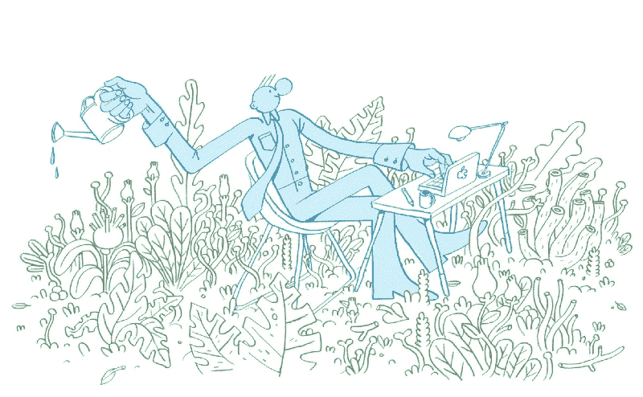
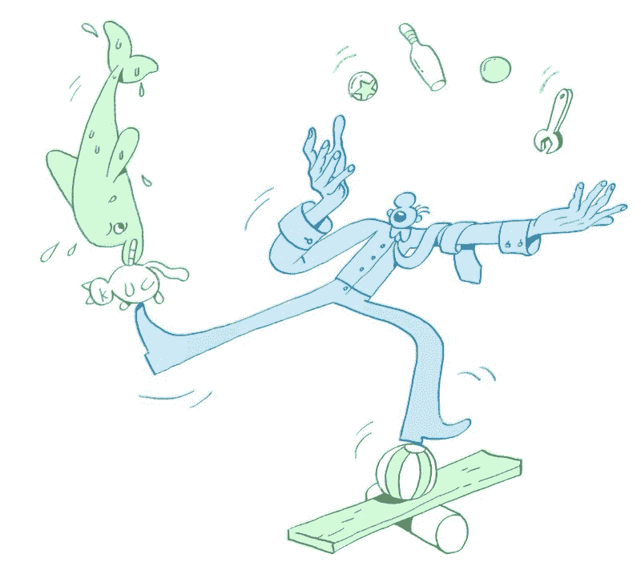

# 如何谈论你的副业

> 原文：<https://www.freecodecamp.org/news/how-to-talk-about-your-side-projects-18b96f192817/>

坦纳·克里斯滕森

Illustrations by [Andrew Colin Beck](http://www.mysticgrandpa.com) for this article.

# 如何谈论你的副业

一有机会就谈谈你的副业。当你这样做的时候，记得从问题开始，谈论你是如何处理它的，分享你面临的挑战，表达你努力的结果，最后定义如果你必须重新做一遍，你会做什么不同的事情。

我记得我第一次去脸书面试时坐下来。

当时，我内心深处的感觉主要是兴奋，但也有一种强烈的恐惧。害怕我被恶作剧。恐怕他们抓错人了。害怕我走进去，让自己难堪，然后带着失败回家。

那时我的职业生涯几乎完全由在线营销工作组成。我申请的是产品设计师的职位，但我的投资组合中的一切都是关于电子邮件营销、文案和技术搜索引擎优化的。当然，我会被发现是一个骗子，并被拒绝，我怎么能不感到一些隐约的恐惧？

我当然没有被拒之门外。面试顺利进行，我得到了这份工作。我这样做的时候并没有谈到我的日常工作，全职工作。

相反，我谈到了我在过去十年里通过加班和长周末所做的相关产品设计工作的强大潜流:设计、建造和营销我自己的副业项目。

当时我不知道我的副业如何与我将在脸书做的工作完美结合，因为对我来说这些事情只是“副业”但现在我明白了，是我的兼职项目教会了我几乎所有我需要知道的东西，不仅是为了得到这份工作，也是为了做得更好。

不幸的是，副业经常被那些不积极参与的人忽略。谈论副业是非常有益的。它们展示了你的工作方式。

关于识别和克服挑战的过程，关于做出取舍，以及工作幕后发生的事情，否则人们可能不会接触到。当然，副业也可以非常有趣。

但是，如果你的简历上只有一些实习和一系列兼职项目，你应该如何谈论每一项，以及——可能更重要的是——你如何权衡真实的、基于工作的工作经历与兼职项目的经历？你如何让别人相信副业是一件值得谈论的事情？在求职面试中，你应该提到你的副业吗？

如果不是因为我的副业，我可能不会有今天。以下是我多年来在谈论兼职项目时学到的一些东西。

### 从问题开始

在任何一个项目中，都有一个问题正在被解决；要么是你经历过的问题，要么是你认识的人面临过的问题。

问题是最初是什么导致了这个项目成为现实。也许问题是你整个夏天都很无聊，需要一种方法来提高你的设计技能。或者，问题可能是你的朋友在制定周末计划时总是遇到日程安排的问题。

把你的项目之前发生的所有事情都看作是谈论它的背景，然后从结果出现的问题开始。

每个故事都是这样开始的。在故事开始之前，这个国家的法律必须被制定出来。在谈论你的工作时，同样的格式也应该适用。想想《星球大战》开始时缓慢、巨大的滚动文本，以及这是如何为电影的其余部分搭建舞台的。

当谈论你的项目时，首先要围绕这个世界存在之前是什么样子提出问题。你最初是如何遇到这个问题的？你如何证明这是一个真正的问题？是什么让你对尝试从事这项工作感到兴奋，你是如何在这项工作和你本可以用时间做的其他事情之间做出权衡的？

> [探索我在 Snaplight 上的故事](https://medium.com/@tannerc/oh-shit-my-weekend-project-turned-into-an-app-store-best-new-app-1fddf680778e#.r7krijks4)看看这款应用如何从一个周末项目变成星巴克的特色。

### 定义你的方法

一旦你确定了你是如何遇到这个问题的，谈论你是如何解决这个问题的是很重要的。

在讲故事的过程中，机会出现后发生的事情就是通常所说的“情况”在你离项目最初的机会太远之前，情况是怎样的？也许你发现自己无法入睡，因为这个问题给了你一个你必须去挠的痒感。或者你开始幻想这个问题以及解决方案会是什么样子。

你做了什么研究或者直接投入到工作中了吗？无论哪种情况:那是什么样的？这是你的典型行为吗？你和其他人谈过这个问题吗？你从哪里寻找灵感？你是如何激励自己的？为了着手这个项目，你不得不做出什么样的取舍？

你如何管理这项工作不仅能揭示你的能力，还能揭示你的性格和动力。如果你直接投入到工作中，而没有感觉到市场或看到竞争解决方案是如何工作的，是什么推动了这个决定？

### 分享你面临的挑战

事情很少按计划进行。我们生病了，错过了几天的工作，工作范围最终被大大低估，我们高估了自己的能力，或者错误判断了我们的解决方案对问题的影响。不管是什么类型的工作，也不管是在周末还是在办公室工作，你都会遇到很多挑战。

知道你如何应对挑战，对于想雇佣你的人来说是一个很好的信号。

表达你在兼职项目中面临的一些挑战，可以很好地告诉你如何在压力下或不太理想的情况下工作。

你在做这个项目的时候遇到了什么挑战？你有没有发现自己怀疑自己的能力，或者整个项目？你曾经想要放弃吗？是什么让你熬过了那些感觉？你有没有发现自己被难住了？你是如何绕过路障的？有人在那里帮助你吗，如果有的话:你如何依靠他们来继续工作？

> [探索我为 Brainbean](https://medium.com/@tannerc/how-i-turned-an-idea-into-a-hit-ipad-app-5726d9ab79f1#.7nq6paho5) 写的故事，看看七个月的工作是如何成为 iPad 第三大应用的。

### 以结果结尾

你谈到了问题出现之前的生活，你是如何受到启发的，你是如何解决它的，以及你在这个过程中遇到的一些复杂情况。现在该谈谈你工作的结果了。

(这里值得注意的是，一个未完成的项目和一个已完成的项目一样值得讨论。已完成的项目展示了看透事物的能力，但未完成的项目也能透露很多关于你的信息。)

说了这么多，做了这么多，你还剩下什么？你的工作是否改变了这个世界——即使它只是你的 *世界的一小部分*？您的解决方案是如何结束的，是否与您的预期有所不同？你有什么证据证明事情有所不同？

当总结你的项目时，谈论世界现在的样子:在你利用你的能力并努力寻找解决问题的方法之后。什么变了？你的解决方案有结果吗？为什么你认为它有或没有？

### 跟进你会有哪些不同的做法

最后要谈的事情可能是最重要的事情之一:如果你能回到过去，从头再来，你会有什么不同？

自我意识是批判性思维和个人成长的关键特质。知道你在哪里失败了，在哪里成功了，如果有机会你会再做什么，可以展示你的意识和学到的教训。

你通过这个项目学到了什么捷径吗？你有没有学到什么新技能，或者你自己没有意识到的特质？你会做些什么来加快工作进度，或者再润色一下？你认为你如何将你从副业项目中学到的东西转化到你的下一个项目或更实质性的东西中？

谈论你的副业是很有力量的。它让我有了今天的地位，我一直在寻找方法将我在工作中学到的东西融入到我的兼职项目中，反之亦然。

如果你有兴趣了解更多关于副业、创意、写作或设计的信息，请在 [Medium](http://medium.com/@tannerc) 或 [Twitter](http://twitter.com/tannerc) 上关注我。

*————————*
*[坦纳·克里斯滕森](http://tannerc.com)是脸书的一名自学成才的产品设计师，著有《创造力挑战**》，* [创意之作](http://creativesomething.net/) *的创始人，一些* [顶级创意应用](https://itunes.apple.com/us/developer/tanner-christensen/id421646590) *的开发者，* [媒体](https://medium.com/@tannerc) *的博主，Adobe 的前作家*[99](http://99u.com/)