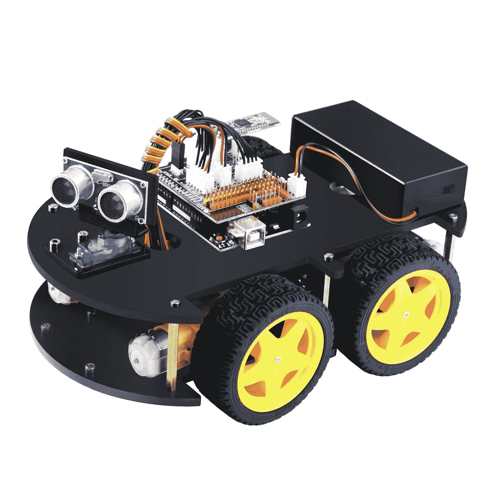
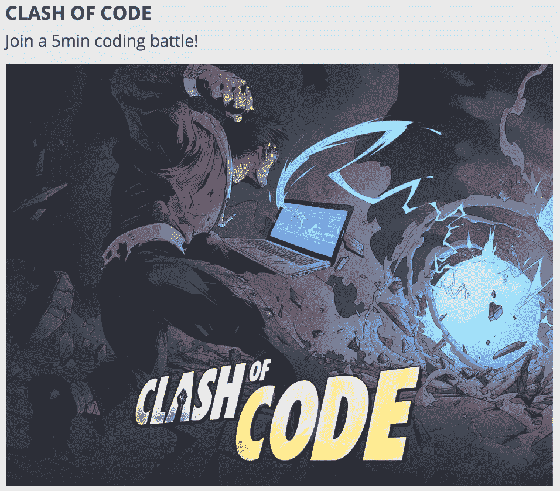

# 如何教青少年编程

> 原文：<https://www.freecodecamp.org/news/how-to-teach-programming-to-teenagers-2ecd43846f0d/>

肖恩·崔

在过去，许多热心的家长曾经找到我，问我是如何开始学习编码的——主要是为了找到帮助他们的孩子如何编码的方法。每一次，我都没有一个明确的答案，因为我学习编码的年龄比这些父母的大多数孩子都要晚得多。为了帮助这些父母，我也试图找到一些资源来帮助孩子们学习编码。

我发现有很多资源可以帮助 K-6 学生学习如何编码。一些例子包括 [Scratch](https://scratch.mit.edu/about) 和 Code.org[的 Hour of Code](https://code.org/)，这对刚熟悉编程的人来说非常有用。

通过这些平台，学生们编写简单的程序，使图形生物移动或构建简单的游戏，并学习编程的基本工具——如循环和条件——同时建立有用的解决问题的技能。这些平台的主要优势是来自平台的视觉反馈，这确实有助于学生持续参与课程和练习。

然而，教 6 年级以上的青少年编程是完全不同的事情。[这篇文章](https://www.geekwire.com/2018/new-research-finds-95-teens-access-smartphone-45-online-almost-constantly/)显示，如今超过 95%的青少年拥有智能手机。所以，从头开始或 Code.org 的视觉反馈不再让他们惊叹。事实上，我发现青少年实际上觉得它们很平凡，很幼稚。

相反，青少年想要建造或做一些他们可以展示的真正的*。比如建立并启动一个真正的 iPhone 应用程序或他们自己的网站，或者侵入某个系统。但是，你如何能让一个刚刚完成一套 Scratch 练习的人开发一个 iPhone 应用程序，同时让他们不断地参与完成它呢？*

*所以，我想分享我在两年时间里教 4 个青少年编程的经验。学生们开始有不同范围的编程技能、个性和期望。因此，为了让每个人都参与进来，我不得不通过各种尝试来找到适合每个人的教材。*

*这篇文章的主要目的是分享我学到的东西和成功的尝试，希望能帮助其他青少年学会热爱编程。*

# *青少年有很高的期望*

*我了解到青少年像干海绵一样吸收新技术。虽然成年人可能对技术上有点过时没什么意见，但青少年把他们的生命押在保持酷和跟随最新潮流上。我发现，青少年倾向于使用最酷、最新的应用，甚至在它们登上 TechCrunch 或美国消费者新闻与商业频道头条之前。*

*其实是我的学生给我介绍了一堆[。io 游戏](https://www.crazygames.com/c/io)和 [HQ 琐事](https://en.wikipedia.org/wiki/HQ_Trivia)。所以，重要的是他们学到的是 **酷** ，以及一些他们可以和朋友分享的东西。*

*当我开始上编程课时，他们问的第一件事是“我们能黑东西吗？比如网站和 iPhone 应用？”。*

*所以，我告诉他们，我们应该先学习 HTML 和 CSS，以了解如何入侵网站，并向他们展示了这一点:*

```
*`<!DOCTYPE HTML>
<html>  
<head><title>Hello World!</title></head>  
<body><h1>Hello World!</h1></body>
</html>`*
```

*我解释了这些标签的含义以及它们将如何出现在页面上。我用这个`hello.html`加载了一个页面，他们对看到一个很酷的网页的所有期望都落空了。他们立刻感到厌烦。*

*然而，我继续上课，教他们更多的 HTML，CSS 和基本的 JavaScript。我觉得，通过教他们更多的 HTML、CSS 和 JavaScript，并学习建立一些示例网站的技术，他们会感觉更投入。然而，我错了。*

*即使在建立了一系列简单的网站并将其部署在 [Firebase](https://firebase.google.com/) 上之后，他们仍然坚持说他们想做一些更 **真实** 的东西，以及一些他们可以展示给朋友的东西。*

# *教他们做一些真实的事情*

*我意识到，有许多方法可以做一些真实的事情，这根本不是创建具有可爱 GUI 的软件，或者教他们新的数据结构，或者从哈佛 CS50 获得一些材料并展示给他们。*

*我决定最好使用硬件，让学生们亲身感受他们编写的代码。我的两个选择是[树莓派](https://amzn.to/2PLBxk1)和 [Arduino](https://amzn.to/2CK7eEc) 。*

*Raspberry Pi 是一台运行自己版本的 Linux 的微型计算机，能够运行大多数编程语言。您可以购买各种外设，这些外设可以通过您自己的定制软件进行控制。*

*Arduino 参与更多。它是作为一个开源的硬件平台，很多公司构建各种套件，比如[智能自主车](https://amzn.to/2PJHWfu)和[四足机器人](https://amzn.to/2RQTaNu)。*

*

Smart car we built using Arduino* 

*使用 Raspberry Pi，我们建立了一个[气象站](https://amzn.to/2pTtXoN)，它可以检测周围地区的温度和气压，并将它们发送到云数据库。然后，学生们可以通过在线绘图工具查看天气数据。我们还编写了简单的实用函数，如改变温度单位和查找最小/最大/平均温度，以发送到数据库。这些练习帮助学生学习简单的数据结构和算法，如数组、字典和排序。*

*在这之后，我们继续建造基于 Arduino 的自动驾驶汽车。每个学生都有让汽车移动和探测障碍物的样本代码。然后，我们建造了一个迷宫，并给第一个制造出走出迷宫的汽车的学生一份奖品。*

*学生们很自然地互相讨论哪种逻辑能最有效地帮助汽车走出迷宫。他们发现他们的算法很快被他们制造的汽车学习和执行，这很酷。最重要的是，学生们真的很喜欢它，因为它是真实和有形的。*

*我们还做了一些学习黑客基础的练习！与旨在帮助参与者学习如何解决面试问题的 [LeetCode](https://leetcode.com/) 类似，还有许多帮助学生学习黑客基础知识的工具。例如， [HackThis](https://www.hackthis.co.uk/) 是一个不错的网站，它给你一系列的挑战，你可以在你的浏览器上查看和解决。它要求您使用许多现有的浏览器工具，如 Chrome dev tools，来找到您可以利用来进入系统的缺陷。*

*学生们真的很喜欢这个练习，因为解决这些练习让他们觉得自己像是《碟中谍》里的间谍。完成挑战后，他们实际上进入了真正的网站(我确保他们没有做违法的事情…)，并试图找到他们可以利用的漏洞。*

*一旦他们有了更多的准备，学会了基本的 Linux 概念，我打算用 [Kali](https://www.kali.org/) Linux 教他们更高级的黑客概念，我认为这将会更加令人兴奋。*

# *作为学习工具的竞争*

*

Clash of Code to start the day* 

*最后，我学到的最后一件事是，青少年是相当好胜的。他们喜欢能给他们即时反馈的练习，比如给他们一个分数，一个徽章，或者把他们放在一个真正的记分牌上。*

*我发现激励学生的最好平台是[编码游戏](https://www.codingame.com/start)。他们会解决每一个编程练习，并在这个过程中升级。这些练习也有一些很好的视觉部分，使学生能够很好地参与到练习中。*

*我们还会以一场[代码冲突](https://www.codingame.com/multiplayer/clashofcode)开始这一天，这是其他在线用户之间的一场快速的 5 分钟现场编程挑战，学生们有时会战胜比他们水平高的其他玩家！这真的让他们振奋起来，开始新的一天学习编程。*

# *最后的想法*

*教编程既有趣又有教育意义。你不仅学会了如何教另一个人，也给了你一个站在学生立场上的机会。你学会了理解别人如何看待一个问题，并意识到有许多不同的方式来看待同一个问题。你也学习如何用学生喜欢思考的方式描述问题。另外，就我个人而言，我认为教学有助于你成为一个更善解人意、更有耐心的人。*

*我希望你也能让我知道你是如何帮助其他人加入编程世界的。对于那些开始帮助他人学习编程的人来说，我真的希望这篇文章能为你自己的课程提供一些帮助。*

*感谢您的阅读！*