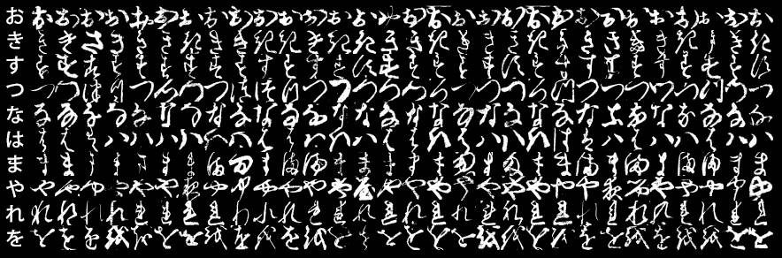
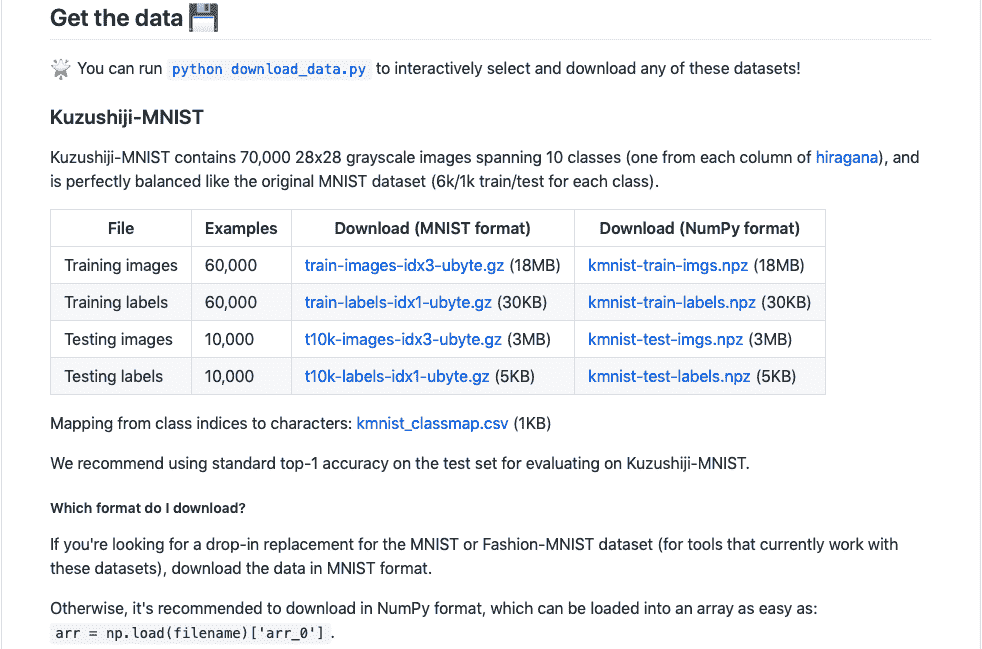
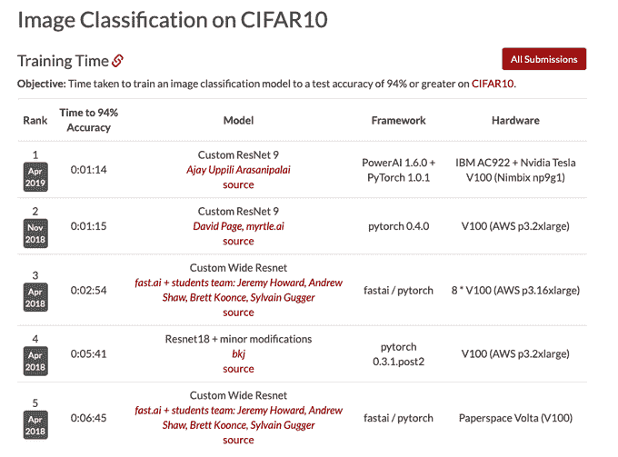
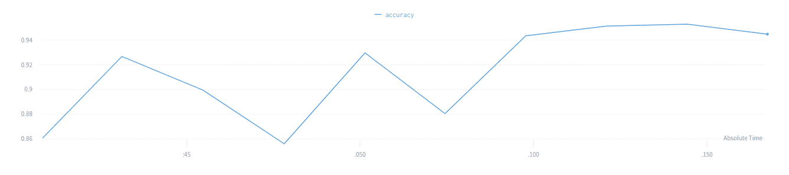
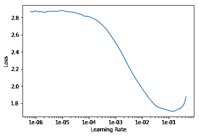
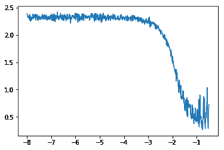

# 如何训练图像分类器和教你的电脑日语

> 原文：<https://www.freecodecamp.org/news/how-to-teach-your-computer-japanese/>

## 介绍

Hi. Hello .你好

你刚才看到的那些弯弯曲曲的字符来自一种叫做日语的语言。看过龙珠 z 的大概都听过。

[Source](http://fanaru.com/dragon-ball-z/image/100881-dragon-ball-z-dragon-ball-fight.gif)

但问题是:你知道那些古老的日本卷轴让你看起来像要释放一个终极武士忍者霸王超级连击动作。

是啊，那些。我不能完全读懂它们，事实证明很少有人能读懂。

幸运的是，一群聪明人明白我掌握 Bijudama-Rasenshuriken 有多重要，所以他们发明了这个叫深度学习的东西。

所以收拾好你的拉面，准备好。在本文中，我将向您展示如何训练一个神经网络，它可以从图像中准确预测日本字符。

为了确保我们获得良好的结果，我将使用一个名为 fastAI 的令人难以置信的深度学习库，它是 PyTorch 的包装器，可以轻松实现现代研究的最佳实践。你可以在他们的[文档](https://docs.fast.ai)上了解更多信息。

说完这些，我们开始吧。

## KMNIST

好的，在我们创建动画字幕之前，我们需要一个数据集。今天我们将关注 KMNIST。

这个数据集采用了日本汉字的例子，并把它们组织成 10 个有标签的类。这些图像的尺寸为 28x28 像素，总共有 70，000 张图像，反映了 MNIST 的结构。

但是为什么是 KMNIST 呢？首先，它的名字里有“MNIST ”,我们都知道机器学习领域的人有多喜欢 MNIST。

[Source](http://codh.rois.ac.jp/img/kmnist.png)

因此，从理论上讲，您可以只修改从堆栈溢出和 BOOM 复制粘贴的几行 Keras 代码！你现在有了可以恢复古代日本文字的计算机代码。

当然，在实践中，事情没那么简单。首先，你在 MNIST 上训练的可爱的小模型可能不会做得那么好。因为，你知道，弄清楚一个数字是 2 还是 5 比破译一个被遗忘的草书要容易一点点，而这个草书在地球上只有少数人知道如何阅读。

除此之外，我想我应该指出 Kuzushiji，也就是 KMNIST 中的“K”所代表的，不仅仅是 10 个字符长。不幸的是，我不是少数能读懂这种语言的专家之一，所以我无法详细描述它是如何工作的。

但我知道的是:这些 Kuzushiji 字符数据集实际上有三种变体——KMNIST、Kuzushiji-49 和 Kuzushiji-Kanji。

Kuzushiji-49 是 49 级的变体，而不是 10 级。Kuzushiji-Kanji 更疯狂，有多达 3832 个类。

是的，你没看错。是 ImageNet 的三倍。

‍

## 如何不弄乱你的数据集

为了尽可能保持 MNIST 风格，发布 KMNIST 数据集的研究人员似乎保持了原始格式(伙计，他们真的把整个 MNIST 事件放在心上了，不是吗)。

如果你看一下 kmn ist GitHub repo，你会看到数据集以两种格式提供:原始的 MNIST 和一堆 Numpy 数组。

当然，我知道你可能懒得点击那个链接。所以给你。你可以以后再谢我。

[Source](https://github.com/rois-codh/kmnist)

就我个人而言，我发现在使用 fastai 时 NumPy 数组格式更容易处理，但是选择权在你。如果你使用 PyTorch，KMNIST 作为 [`torchvision.datasets`](https://pytorch.org/docs/stable/torchvision/datasets.html?highlight=kmnist#kmnist) 的一部分免费提供。

下一个挑战实际上是把那些 10，000 年前的笔触放到你的笔记本上(或者 IDE，我是谁来判断)。幸运的是，GitHub repo 提到有一个名为`download_data.py`的便捷脚本可以为我们完成所有工作。耶！

从这里开始，如果我继续谈论如何在没有实际代码的情况下预处理数据，可能会变得很尴尬。因此，如果你想更深入地了解，请查阅笔记本。

继续前进…

## 我应该使用超超盗梦空间 ResNet XXXL？‍

### 简短回答

大概不会。普通的 ResNet 应该可以。

### 一个不太简短的回答

好吧，听着。现在，你可能在想，“KMNIST 大。KMNIST 努力。我需要使用非常新、非常奇特的模型。”

我是不是用了比扎罗的声音？

关键是，你不需要一个闪亮的新模型来做好这些图像分类任务。在最好的情况下，你可能会以大量的时间和金钱为代价，获得一点点的精度提高。

大多数时候，你只会浪费大量的时间和金钱。

所以听从我的建议——坚持好的旧时尚。它们工作得非常好，相对快速和轻量级(与像 Inception 和 DenseNet 这样的其他内存大户相比)，最棒的是，人们已经使用它们有一段时间了，所以微调应该不会太难。

如果您正在处理的数据集像 MNIST 一样简单，请使用 ResNet18。如果是中等难度，比如 CIFAR10，就用 ResNet34。如果真的很难，像 ImageNet，就用 ResNet50。如果比这更难，你可能用得起比 ResNet 更好的东西。

不相信我？请查看我从 2019 年 4 月开始参加斯坦福大学 DAWNBench 竞赛的领先参赛作品:

你看到了什么？到处都是 ResNets！拜托，这肯定有原因的。‍

## 超参数丰富

几个月前，我写了一篇关于如何选择正确的超参数的文章。如果您对这项艰巨任务的更通用的解决方案感兴趣，可以去看看。在这里，我将向您介绍我挑选足够好的超参数的过程，以便在 KMNIST 上获得足够好的结果。

首先，让我们回顾一下需要优化的超参数。

我们已经决定使用 ResNet34，就这样。我们不需要搞清楚层数、滤镜大小、滤镜数量等。因为这是我们模型的一部分。

看，我告诉过你这会节省时间。

所以剩下的是三大要素:学习速率、批量大小和时期数量(加上像放弃概率这样的东西，我们可以只使用默认值)。

让我们一个一个地检查它们。

### 时代数

先说纪元数。当你摆弄笔记本上的模型时，你会看到，我们的训练非常有效。我们可以在几分钟内轻松达到 90%的准确率。

因此，考虑到我们的训练速度如此之快，我们似乎不太可能使用太多的纪元和过度训练。我见过其他 KMNIST 模型训练超过 50 个纪元而没有任何问题，所以保持在 0-30 范围内应该是绝对没问题的。

这意味着在我们给模型设置的限制范围内，当涉及到纪元时，越多越好。在我的实验中，我发现 10 个时期在模型准确性和训练时间之间取得了良好的平衡。

### 学习率

我要说的话会惹怒很多人。但我还是要说——我们不需要太在意学习率。

是的，你没听错。但请给我一个解释的机会。

我们不会说“嗯……那似乎不起作用，让我们用 lr=3e-3 再试一次”，而是要用一种更系统、更有纪律的方法来找到一个好的学习率。

我们将使用学习率查找器，这是莱斯利·史密斯在他关于循环学习率的论文中提出的革命性想法。

它是这样工作的:

*   首先，我们建立我们的模型，并准备训练它一个时期。随着模型的训练，我们将逐渐提高学习率。
*   在这个过程中，我们将记录每次迭代的损失。
*   最后，我们选择对应于最低损失的学习率。

当该说的都说了，该做的都做了，你把损失和学习率对应起来，你应该会看到这样的情况:

现在，在你眼花缭乱地选择 1e-01 作为学习率之前，我要让你知道这是**而不是**的最佳选择。

这是因为 fastai 实现了一种称为指数加权平均值的平滑技术，这是深度学习研究人员版本的 Instagram 过滤器。它防止我们的情节看起来像是给你邻居的孩子太多时间用蓝色蜡笔的结果。

因为我们使用一种平均的形式来使图看起来平滑，所以你在学习率查找器上看到的“最小”点实际上并不是最小的。它是一个平均值。

相反，为了*实际上*找到学习率，一个好的经验法则是选择比平滑图上的最小点低一个数量级的学习率。这在实践中往往非常有效。

我明白，如果你一生都在野蛮地学习比率值，所有这些绘图和平均可能看起来很奇怪。因此，我建议你去看看西尔万·古格对学习率搜索器的解释，了解更多。

### 批量

好吧，你在这里抓到我了。我最初的实验使用了 128 的批量大小，因为这是 top submission 使用的。

我知道，我知道。没什么创意。但我就是这么做的。后来，我用其他几个批量做了实验，结果都不太好。所以是 128！

一般来说，批量大小优化起来很奇怪，因为它部分取决于您使用的计算机。如果你有一个配有更多 VRAM 的 GPU，你可以在更大的批量上训练。

因此，如果我告诉您使用 2048 的批量大小，例如，而不是获得令人垂涎的 Kaggle 上的第一名和永久的名誉和荣耀，您可能只会以 CUDA:内存不足错误结束。

因此，很难推荐一个完美的批量，因为在实践中，显然有计算的限制。选择它的最好方法是尝试适合你的价值观。

但是你如何从正整数的汪洋大海中挑选一个随机数呢？

你其实不知道。因为 GPU 内存是按位组织的，所以选择 2 的幂作为批量大小是个好主意，这样你的小批量就能很好地适应内存。

我会这样做:从一个中等规模的批量开始，比如 512。然后，如果你发现你的模型开始变得奇怪，亏损没有明显的下降趋势，那就减半。接下来，以 256 的批量重复训练过程，看看它这次是否有所表现。

如果没有，清洗，冲洗，并重复。

## 几张漂亮的照片

随着这里进行的优化，跟踪我们创建的这一大堆模型、指标和超参数将非常具有挑战性。

为了确保我们在攀登准确性之山时都保持理智，我们将使用[wand b+fastai 集成](https://docs.wandb.com/docs/frameworks/fastai.html)。

那么 wandb 实际上是做什么的呢？

它会跟踪关于您的模型的大量统计数据，以及它是如何自动执行的。但真正酷的是，它还提供即时图表和可视化，以跟踪关键指标，如准确性和损失，都是实时的！

如果这还不够，它还在云中存储所有这些图表、可视化和统计数据，因此您可以随时随地访问它们。

您开始在黑色终端屏幕前摆弄 matplotlib 的日子已经结束了。

本文的笔记本教程简单介绍了它如何与 fastai 无缝协作。你也可以查看一下[的 wandb 工作区](https://app.wandb.ai/ajayuppili/kmnist/runs/41gbr2yx)，在那里你不用写任何代码就可以看到我提到的所有东西。

## 结论

到此结束

这意味着“这是结束。”

但你不需要我告诉你，对吧？在你经历了获取日语字符数据集、使用学习率查找器、使用现代最佳实践训练 ResNet，以及使用云中的实时监控看着你的模型获得荣耀的麻烦之后，就不会了。

是的，在大约 20 分钟内，你真的做到了！给自己一个鼓励。

拜托，去看龙珠吧。