# 如何用 Postman 的简单方法测试和使用 Web APIs

> 原文：<https://www.freecodecamp.org/news/how-to-test-and-play-with-web-apis-the-easy-way-with-postman/>

在一个静态网站和应用程序越来越依赖于独立维护的 API 的世界里，仅仅通过在浏览器中摆弄很难弄清楚它们是如何工作的。

那么我们如何使用 Postman 来测试我们现有的 API 并理解它们是如何工作的呢？

*   [什么是邮递员？](#what-is-postman)
*   我们要建造/学习什么？
*   [第 0 部分:与邮递员建立联系](#part-0-getting-set-up-with-postman)
*   第一部分:邮递员简介
*   [第 2 部分:创建一个新的邮递员请求来获取关于杰尼龟的信息](#part-2-creating-a-new-postman-request-to-get-info-about-squirtle)
*   [第 3 部分:在 Postman 中为 PokéAPI 创建一个请求集合](https://www.freecodecamp.org/news/p/a02335e1-4f9a-453d-8916-db6b8419cf99/part-3-creating-a-collection-of-requests-in-postman-for-the-pok-api)
*   [第 4 部分:向邮递员发出帖子请求，将句子翻译成听起来像尤达的声音](#part-4-making-post-requests-with-postman-to-translate-sentences-to-sound-like-yoda)
*   [第 5 部分:用 API 密钥认证对指环王 API 的请求](#part-5-authenticating-requests-to-the-lord-of-the-rings-api-with-an-api-key)

[https://www.youtube.com/embed/KFuaybrXCdw?feature=oembed](https://www.youtube.com/embed/KFuaybrXCdw?feature=oembed)

## 邮递员是什么？

Postman 是一个工具，团队可以用它来使用易于使用的配置可靠地测试 API。它提供了您在处理 API 时所期望的特性，包括身份验证、设置头、定制有效负载，以及一系列有助于减少使用 API 的摩擦的特性。

而且不仅仅是为了测试。美妙之处在于，这可以用于团队中许多不同成员使用 API 的许多方面。也许项目经理想要验证事情是否正常工作，或者可能发现直接使用 API 进行更改更容易，或者 QA 工程师需要确保一切仍然正常工作，或者开发人员想要在使用 API 本身的同时积极地进行更改。

最棒的是——Postman 提供了协作功能。自由层包括导出和导入保存的 API 请求集合，以及创建共享链接。如果你是团队的一员，他们有付费层，允许你同步你的收藏，以确保每个人都有最新的收藏。

## 我们要建造/学习什么？

我们将通过两个不同的示例 API 来介绍 Postman 的概念。

首先，我们将通过 Pokémon 的[公共 API 完成一些简单的 HTTP 请求。](https://pokeapi.co/)

然后，我们将使用 Yoda Translator API 来演示如何发出特定的 HTTP 请求。

一旦我们理解了基本的工作原理，我们将使用[指环王 API](https://the-one-api.herokuapp.com/) 来学习认证如何与 API 一起工作。为此，您需要注册一个 API 密钥的免费帐户。

## 第 0 部分:与邮递员建立联系

在我们开始之前，你需要 [Postman](https://www.postman.com/downloads/) 来跟随这个演练。好消息是，Postman 在 Mac、Windows 和 Linux 上是免费的，所以你应该能找到一个适合你的版本。

找邮递员:[https://www.postman.com/downloads/](https://www.postman.com/downloads/)

下载完成后，浏览标准安装说明，打开它，我们就可以开始了！

## 第一部分:邮递员简介

第一次打开 Postman 时，你会立即看到一个启动板，上面有一大堆开始使用的选项。

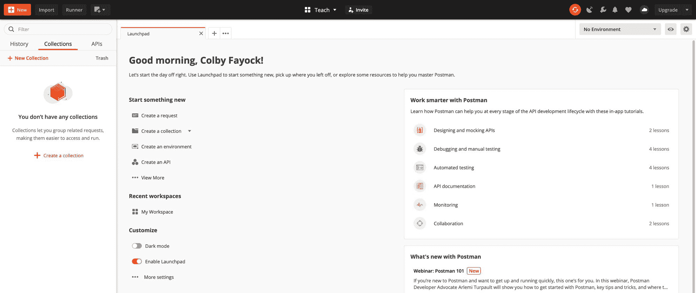

这可能看起来有点让人不知所措，但是让我们来分解一些我们需要知道的关键概念。

### 要求

请求就像它听起来的那样，是一个特定的 API 请求。这将是一个单一类型的请求，无论是 GET 还是 POST 到一个特定的端点。您将希望为每种类型的端点创建新的请求，这将允许您在测试时在它们之间移动。

### 收集

集合是一组请求。这便于将您的请求组织到不同的组中。这可以简单到两个完全不同的 API(即 Twitter vs Slack)或者它可以是一个 API 的两个不同组(即 Twitter Tweets API vs Twitter 账户 API)。

### 批准

授权是使用 API 对请求进行身份验证的方式，无论是由发出请求的人还是由代表您发出请求的计算机。这通常以 API 密钥的形式出现，它可以是分配给你的帐户的静态值，也可以是用像 [OAuth](https://oauth.net/) 这样的工具动态生成的。

### 环境

环境将允许您配置您的端点以使用特定的变量，这使得在不同的环境之间使用相同的端点变得更加容易。例如，您可能在生产和开发环境中都有相同的`/profile`端点，但是它们有不同的域。Environments 允许您管理具有可变域的单个请求。

### 工作区

在这篇文章中，我们不会深入讨论工作空间，但是它允许您管理和组织不同的集合。想象一下，如果您想将 Postman 用于工作和个人项目，您可能会有一个工作区和一个个人工作区。

出于本文的目的，我们将讨论请求、集合和授权。

## 第 2 部分:创建一个新的邮递员请求来获取关于杰尼龟的信息

现在我们对不同的术语有了更好的理解，让我们实际创建一个请求。

在 UI 的左上方，你应该会看到一个橘黄色的按钮，上面写着 **New** 。继续点击，然后选择**请求**。

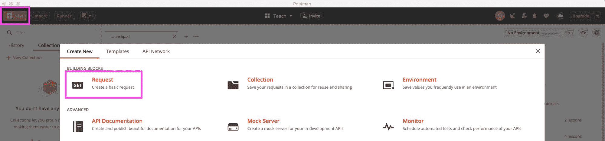

在我们进入请求本身之前，它请求一些事情。

首先需要的是一个名字。我们将从请求关于神奇宝贝杰尼龟的信息开始，所以我们把它命名为“神奇宝贝-杰尼龟”。

它还需要一个收藏，所以点击**创建收藏**，让我们将收藏命名为“我最喜欢的神奇宝贝”。

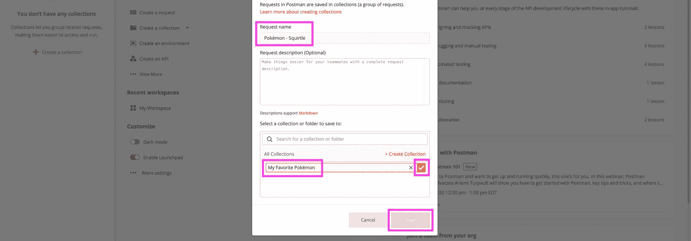

点击收藏名称旁边的橙色复选标记按钮，然后点击**保存**。

此时，我们将有一个新的请求，所以让我们构建这个请求。

对于我们的第一个请求，我们首先需要填写两件事:

*   请求类型: GET、POST、PUT 等——我们将使用 GET
*   **请求 URL:** 您的 API 请求的端点——对于我们的请求，我们将使用 https://pokeapi.co/api/v2/pokemon/squirtle/的

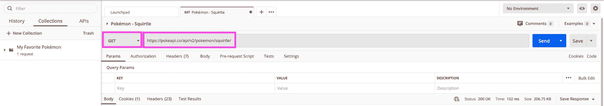

一旦你确认这些都是正确的，你只需点击右边的蓝色**发送**按钮，我们就成功地发出了我们的第一个请求！

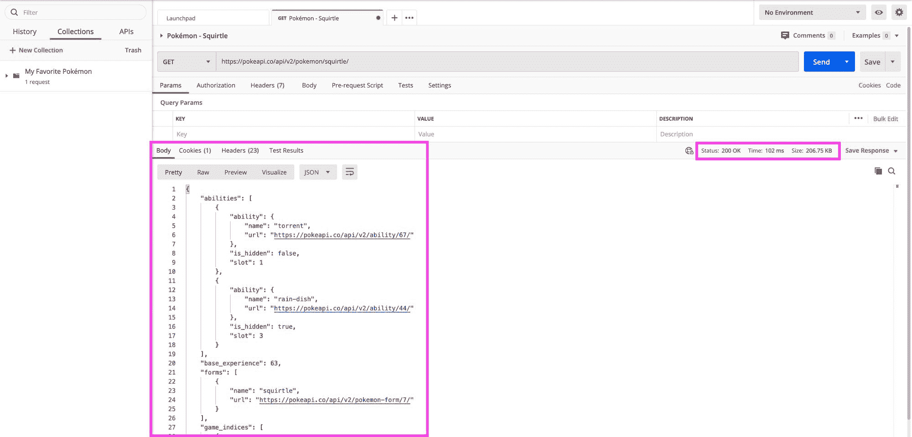

我们立刻得到一些我们可以看到的东西:

*   **Body:** 在底部，我们应该可以看到 API 请求的响应体。对于我们的杰尼龟 API，我们应该有一个 JSON 对象，包含类似于`abilities`、`base_experience`和`forms`的数据。
*   **状态:**在右边，我们应该会看到 HTTP 状态码。“200 Ok”是一个好兆头，意味着它是成功的！
*   **时间:**简单地说，请求完成需要多长时间
*   **Size:** 响应数据的大小，以 KB 为单位(在我们的例子中)

您还可以将鼠标悬停在状态、时间和大小上，更深入地查看每个选项。

于是我们提出了第一个要求！

在我们继续之前要注意的一件事是，我们的请求看起来像是在浏览器选项卡中。如果我们完成了那个特定的请求，我们可以关闭选项卡，然后单击 **Save** 以确保我们的所有更改都在那里，供下次使用！

## 第 3 部分:在 Postman 中为 PokéAPI 创建一个请求集合

现在我们已经创建了一个请求，让我们创建一个它们的集合。从技术上讲，我们已经为第 2 部分创建了一个新的集合，但是我们将创建一个新的集合来了解集合本身是如何工作的。

在界面左上方，再次点击橙色**新建**按钮，选择**收藏**。

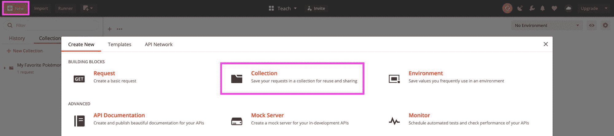

与请求类似，它要求一个名称，所以我们称之为“PokéAPI”。您也可以添加描述，然后点击底部的**创建**。

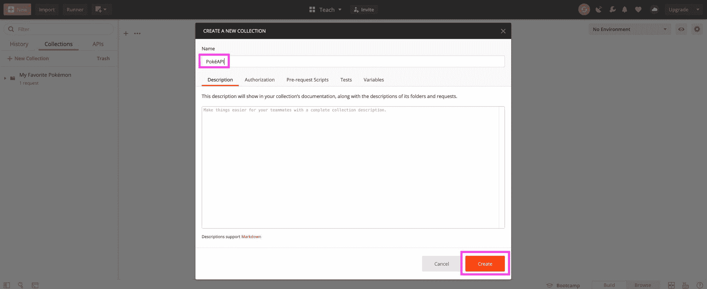

在左边，你会看到你的收藏。您可以选择并展开该文件夹，因为我们将使用它。

在我们添加一个请求之前，PokéAPI 有不同类型的请求，所以把它组织得更彻底一点是有意义的。因此，让我们单击 PokéAPI 集合旁边的三个点，并选择**添加文件夹**。

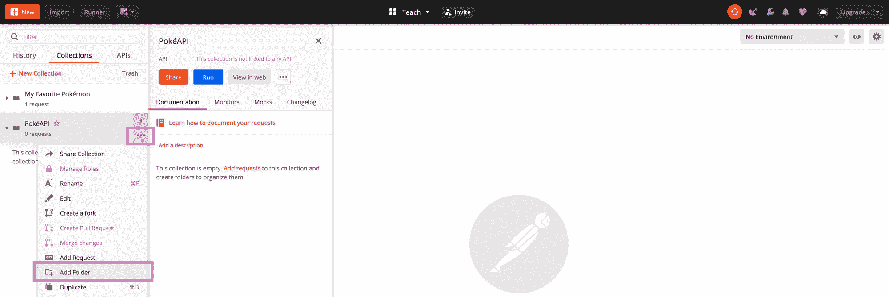

和其他的一样，这也需要一个名字。文件夹有点像集合中的集合，所以您可以获得类似的选项。让我们把这个命名为“神奇宝贝”，然后像以前一样点击橙色的**保存**按钮。

现在让我们添加我们的请求！首先，单击 Pokémon 文件夹旁边的三个点，类似于我们如何将文件夹添加到集合中，但这次选择**添加请求**。

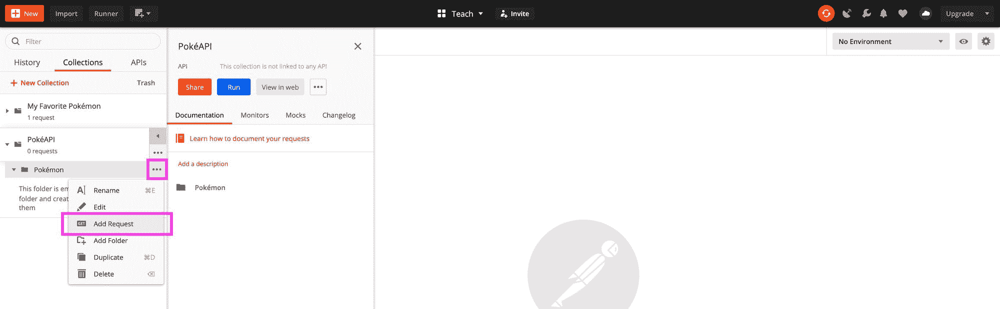

让我们把这个请求命名为“口袋妖怪”。虽然我们在神奇宝贝文件夹中有一个神奇宝贝请求可能会令人困惑，但神奇宝贝只是神奇宝贝组的端点之一。

现在，让我们使用与我们之前在杰尼龟请求中使用的完全相同的 API:

*   **请求类型:**获取
*   **请求网址:**【https://pokeapi.co/api/v2/pokemon/squirtle/ 

与之前类似，当我们点击蓝色的**发送**按钮时，我们应该会看到一个成功的请求！

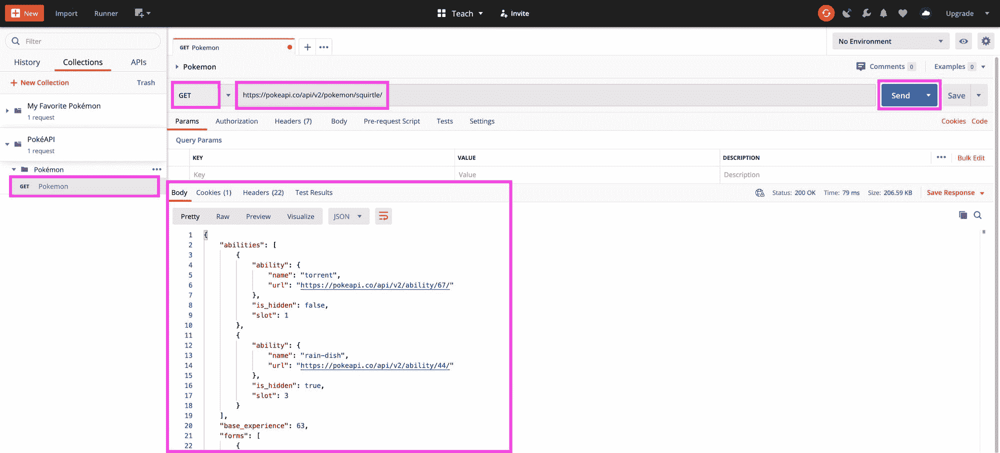

现在让我们添加另一个请求。按照与前面相同的过程，在 PokéAPI Pokémon 文件夹下创建一个新请求，我们将这个请求命名为“能力”。

如果您滚动浏览来自第一个杰尼龟端点的响应，您会看到许多其他 API urls。在顶部，我们有`abilities`，我们有两个不同的——“洪流”和“雨盘”。

选择你最喜欢的杰尼龟技能，将`url`值复制到我们刚刚创建的新技能请求中，我将使用`rain-dish`。

我们可以将请求类型保留为 GET，点击蓝色的 **Send** 按钮，我们可以再次看到成功的响应！

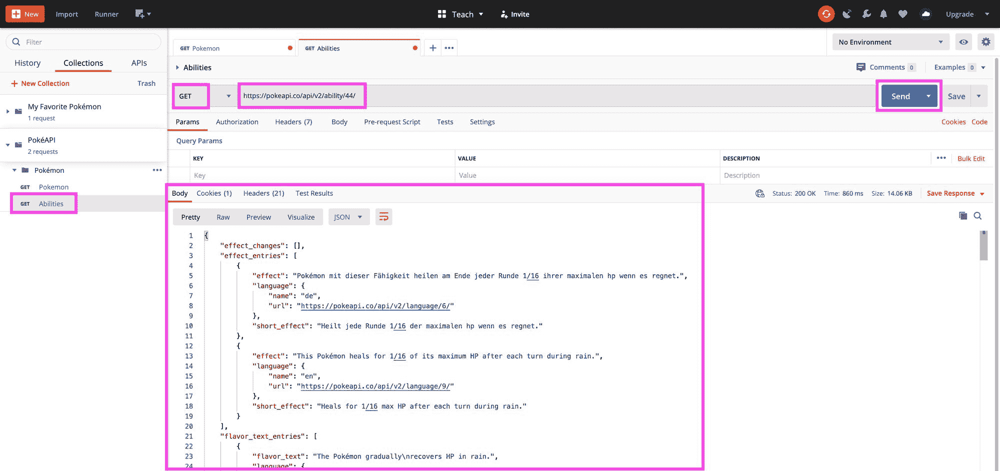

在这里，我们得到了很多关于我们的杰尼龟能力雨盘的信息，一些细节来自不同的语言，这很酷！

所以现在我们有了一个新的 PokéAPI 集合，其中一个 Pokémon 文件夹表示 Pokémon API 端点组，包括 Pokemon 和能力。

我们将停止第 3 部分中的这两个请求，但是您可以继续添加您想要的 PokéAPI 请求！

## 第 4 部分:向邮递员请求翻译句子听起来像尤达

到目前为止，我们只发出了 GET 请求，但是如果我们想发出一个 POST 请求，我们需要实际发送一些数据呢？

对于 POST 请求，我们将使用 funtranslations.com 的 Yoda Translator API。虽然这个 API 只接受一个参数，但它仍然是一个很好的公共端点，我们可以用它来理解这个概念。

首先，让我们用一个新请求创建一个新集合:

*   **收藏:**趣味翻译
*   **请求:**尤达

这一次，我们的请求配置将不是 GET 请求，而是:

*   **请求类型:**发布
*   **请求网址:**【https://api.funtranslations.com/translate/yoda 

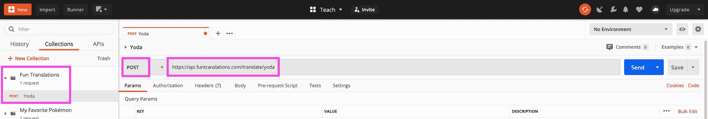

现在这一次，如果我们点击蓝色的**发送**按钮，我们会注意到我们没有得到成功的 200 响应，我们得到 400！


我们实际上从未设置任何要发布到 API 的数据，它需要这些数据，所以让我们添加它。

在**请求网址**的正下方，点击**正文**。然后选择 **raw** 作为车身类型，而不是无。最后，在类型的最右边，将**文本**改为 **JSON** 。

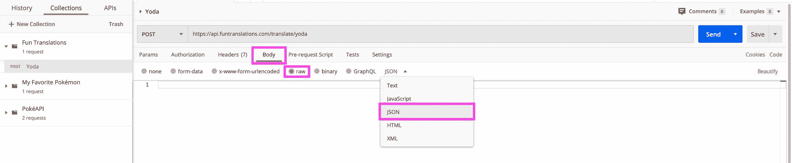

然后，在它下面的空白处，您可以添加以下内容:

```
{
    "text": "Hello, I am learning how to test APIs with Postman!"
} 
```

现在，再次单击蓝色的**发送**按钮，我们会得到一个成功的响应！

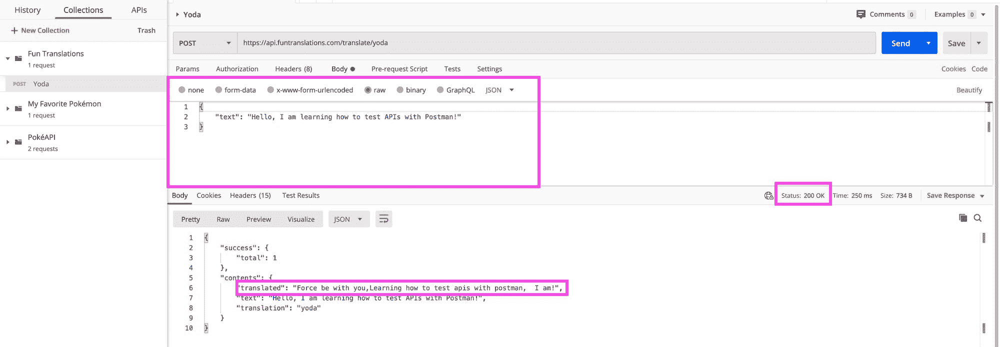

我们可以将这个概念应用到几乎所有的 API 上。Postman 不仅允许您发布 JSON，还允许您使用我们在 Body Type 部分看到的其他格式，这意味着您有很多选项，具体取决于您使用的 API 的要求。

## 第 5 部分:用 API 密钥认证对指环王 API 的请求

在本演练的其余部分，我们将使用指环王 API。

首先，指环王 API 需要认证，以便使用 API 密钥发出请求。首先，在我们开始之前，您需要[创建一个免费帐户](https://the-one-api.herokuapp.com/sign-up)。

[https://the-one-api.herokuapp.com/sign-up](https://the-one-api.herokuapp.com/sign-up)

一旦你注册并登录，你首先看到的就是你的 API 密匙！要么把这把钥匙抄下来，要么记住你以后能在哪里找到它。如果您离开页面，您可以通过在 API 网站的导航中导航到**欢迎**，然后导航到**帐户**来获取页面。

首先，让我们创建一个新的集合并请求:

*   **收藏:**魔戒
*   **文件夹:**电影
*   **请求:**所有电影
*   **请求类型:**获取
*   **请求网址:**【https://the-one-api.herokuapp.com/v1/movie 

完成上述设置后，单击**发送**，您会立即注意到它给出了一个响应，显示 401，并且它是未经认证的。

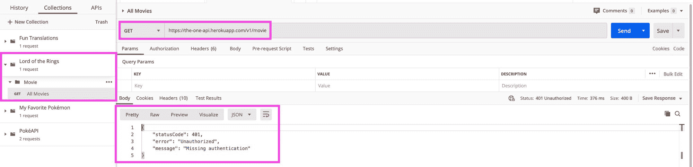

因为这个 API 需要 API 密钥，这正是我们所期望的。那么让我们点击**授权**选项卡。然后我们可以选择**不记名令牌**的**类型**，在右边，我们可以粘贴我们刚刚用指环王 API 设置的密钥。

当我们点击**发送**时，我们现在看到一个成功的响应！

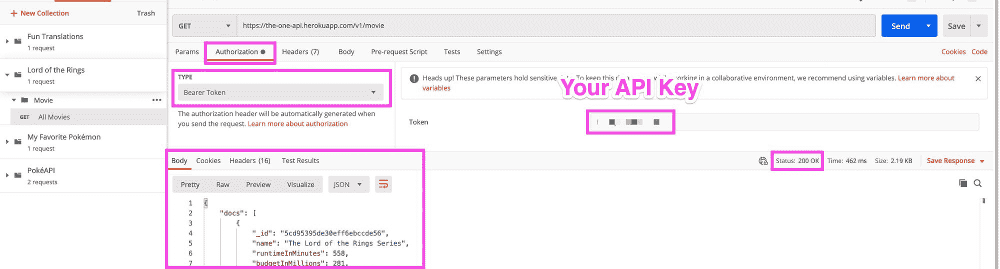

这真的很棒，但是如果我们有一堆使用单个键的请求呢？我们必须对每个请求都进行管理吗？

我们可以对集合进行管理，而不是对每个单独的请求进行管理。让我们首先构建另一个请求。

在我们的指环王收藏和电影文件夹下，创建一个新请求:

*   **请求:**按电影 ID 报价
*   **请求类型:**获取
*   **请求网址:**【https://the-one-api.herokuapp.com/v1/movie/{id} 

在这个请求中，让我们使用来自第一个请求的响应的 ID，我将使用两个塔的 ID`5cd95395de30eff6ebccde5b`,因此请求 URL 看起来像:

```
https://the-one-api.herokuapp.com/v1/movie/5cd95395de30eff6ebccde5b
```

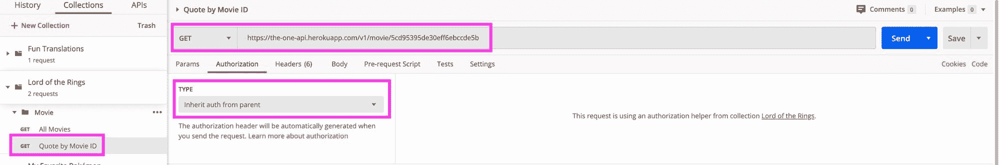

现在，我们不在请求授权中设置令牌，而是将类型保留为 **Inherit auth from parent** 。点击收藏旁边的三个点，选择**编辑**。

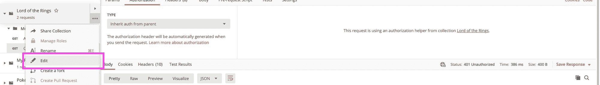

这里，我们将做与第一个请求完全相同的事情，但是是在集合配置上。选择**授权**选项卡，在类型下选择**不记名令牌**，并在**令牌**字段再次粘贴您的令牌。

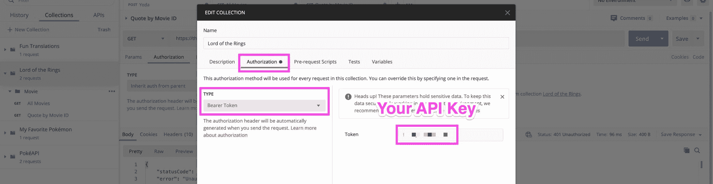

最后，点击**更新**并再次点击蓝色的**发送**按钮，我们可以看到一个成功的请求！

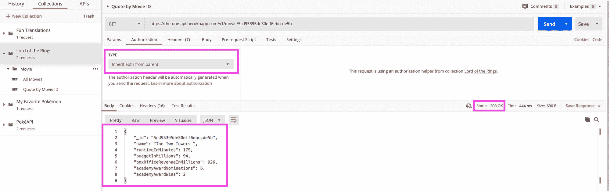

我们现在可以返回到我们的所有电影请求，并更新授权，以使用一种从父项继承授权的类型，它应该仍然继续工作！

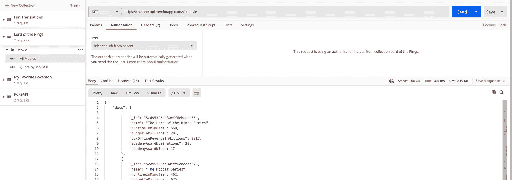

## 我们还能对邮递员做些什么？

虽然我已经介绍了很多基础知识，但是您还可以使用 Postman 做更多的事情。以下是我最喜欢的几个。

### 环境变量

如果您是一名项目开发人员，那么您的团队很可能会使用多种环境，比如开发和生产环境。您可以添加一个环境变量，并在环境之间切换时更改该变量，而不是创建和维护完全独立的请求！

变量适用于许多场景，但这是一种常见的用法。查看邮递员的文档，了解如何操作。

[https://learning . postman . com/docs/postman/variables-and-environments/variables/](https://learning.postman.com/docs/postman/variables-and-environments/variables/)

### 导入和导出集合和数据

关于 Postman 的一个很棒的事情是，一旦你把你的请求都组织好了，你就可以把它们导出来给其他人使用。这也意味着您可以从其他团队成员导入集合。这使得确保每个人都使用相同的收藏更加容易。

额外收获:您甚至可以将这些文件存储在 Git 存储库中，因为它们只是 JSON。

但是请记住，如果您像我们在本指南中一样对收藏使用授权，您将需要确保在导出收藏时不包括授权。

[https://learning . postman . com/docs/postman/collections/importing-and-exporting-data/](https://learning.postman.com/docs/postman/collections/importing-and-exporting-data/)

### 自动化测试

一旦你在一个集合中有了一组请求，甚至更好的是，如果你将它们存储在 Github 中，你可以开始使用这些请求作为管理你的 API 的自动化测试的一部分。

虽然有一些解决方案可以做到这一点，但 Postman 包括一个内置在应用程序中的集合运行器，而 [Newman](https://learning.postman.com/docs/postman/collection-runs/command-line-integration-with-newman/) 是一个命令行工具，可以让你直接从终端运行测试。

[https://www.postman.com/use-cases/api-testing-automation/](https://www.postman.com/use-cases/api-testing-automation/)

## 你最喜欢用什么方式测试和玩 API？

在 Twitter 上与我分享！

[](https://twitter.com/colbyfayock)

*   [？在 Twitter 上关注我](https://twitter.com/colbyfayock)
*   [？️订阅我的 Youtube](https://youtube.com/colbyfayock)
*   [✉️注册我的简讯](https://www.colbyfayock.com/newsletter/)