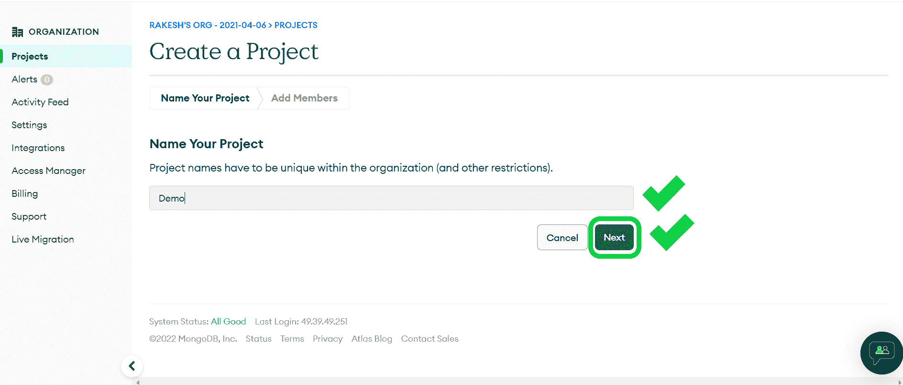
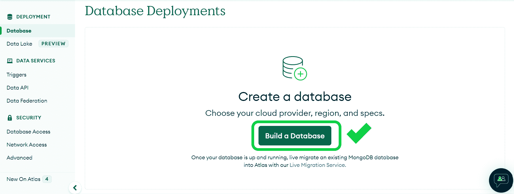
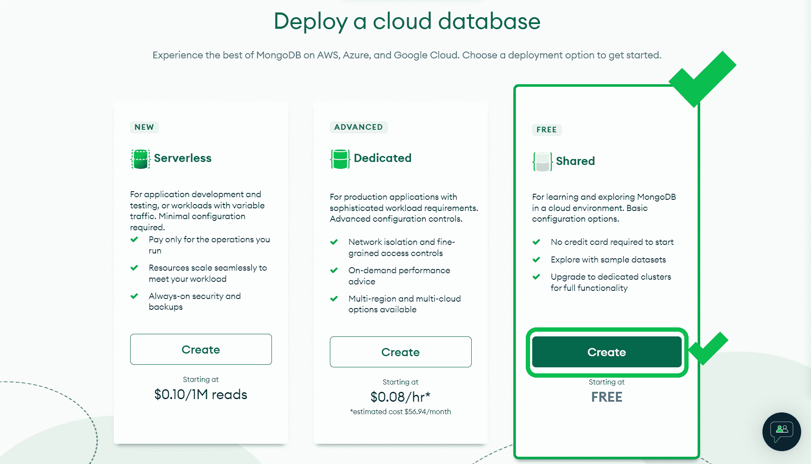
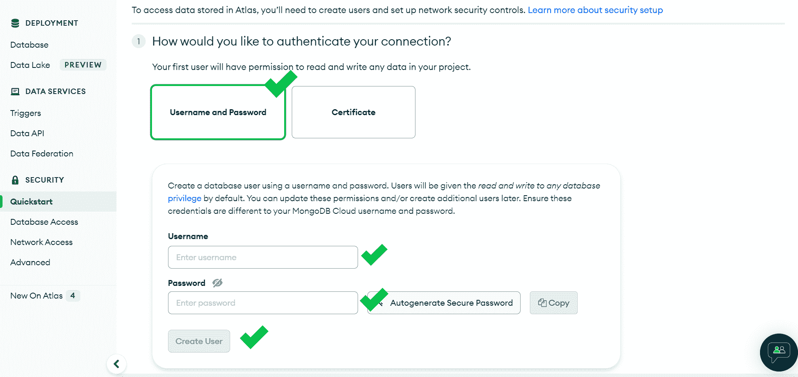
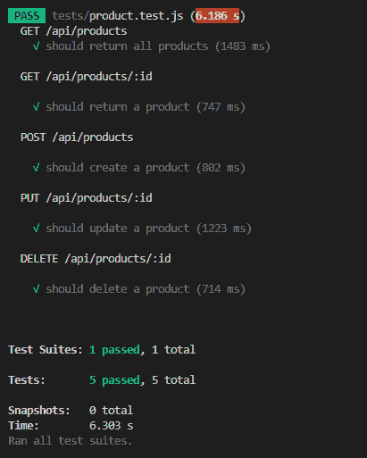

# 如何用 Jest 和 SuperTest 测试你的 Express.js 和 Mongoose 应用

> 原文：<https://www.freecodecamp.org/news/how-to-test-in-express-and-mongoose-apps/>

测试是软件开发的重要部分。越早开始测试越好。

在本文中，我将向您展示如何使用 **Jest** 和 **Supertest** 为您的 NodeJs/ExpressJS 和 MongoDB/mongose 应用程序编写测试。

## 我们开始吧

首先让我们设置一个演示 Express.js 应用程序。

假设我们正在为一个电子商务应用程序构建一个后端 REST API。

此应用程序应该:

*   获取所有产品
*   通过 id 获取产品
*   将产品添加到数据库
*   从数据库中删除产品
*   更新产品信息

## Express.js 应用程序设置

### 步骤 1:项目设置

首先创建一个文件夹，用`npm`启动一个空白应用。

```
npm init
```

填写它要求的所有细节。

然后，用以下命令安装`express`、`mongoose`、`axios`和`dotenv`:

```
npm i express mongoose axios dotenv
```

这里是我的 GitHub 上的 [package.json](https://github.com/itsrakeshhq/jest-tests-demo/blob/a1725cb3379f78a03cf8d3d4cfa22127469e8b50/package.json) 的链接。

### 步骤 2:创建样板文件

让我们创建所有的文件夹和文件，然后用一些样板代码填充它们。

您的文件夹层次结构应该是这样的:

```
.
├── controllers
│   └── product.controller.js
├── models
│   └── product.model.js
├── routes
│   └── product.route.js
├── package-lock.json
├── package.json
├── .env
├── app.js
└── server.js
```

package.json

通过复制和粘贴来使用这些文件的代码。尽你所能分析代码和流程。

*   `[product.controller.js](https://github.com/itsrakeshhq/jest-tests-demo/blob/main/controllers/product.controller.js)`
*   `[product.model.js](https://github.com/itsrakeshhq/jest-tests-demo/blob/main/models/product.model.js)`
*   `[product.route.js](https://github.com/itsrakeshhq/jest-tests-demo/blob/main/routes/product.route.js)`
*   `[app.js](https://github.com/itsrakeshhq/jest-tests-demo/blob/main/app.js)`
*   `[server.js](https://github.com/itsrakeshhq/jest-tests-demo/blob/main/server.js)`

### 步骤 3:数据库设置

我建议在一个项目中使用两个数据库——一个用于测试，另一个用于开发。但是仅仅一个数据库对于学习目的来说就足够了。

首先，创建一个 [MongoDB](https://mongodb.com) 账号或者登录。

然后创建一个新项目。给它起个名字，然后按下**下一个**按钮。



Naming the project

之后点击**创建项目**。

我们必须在下面的窗口中通过选择云提供商、位置和规格来创建数据库。所以按下**建立一个数据库**就可以开始了。



Build a database

选择“共享”，因为它足以满足学习目的。然后点击**创建**。



Choose a deployment option

接下来，选择“aws”作为您的云提供商和离您最近的地区。根据您的选择，点击**创建集群**。

星团的形成需要一些时间。同时创建一个用户来访问您的数据库。



Create Superuser

选择“我的本地环境”，因为我们正在开发我们的应用程序。然后，您可以添加 IP 地址。最后，点击**关闭**。


Add IP addresses

数据库建立后，您将收到一个 URI 字符串，我们将使用它来连接数据库。该字符串如下所示:

```
mongodb+srv://<YOUR_USERNAME>:<YOUR_PASSWORD>@<YOUR_CLUSTER_URL>/<DATABASE_NAME>?retryWrites=true&w=majority
```

将这个字符串放在`.env`文件中。

```
MONGODB_URI=your database string
```

现在我们准备开始测试我们的应用程序。

## 如何用 Jest 和 SuperTest 编写测试

### 步骤 1:安装软件包

您需要三个 npm 包来开始编写测试:`jest`、`supertest`和`cross-env`。您可以像这样安装它们:

```
npm i jest supertest cross-env
```

*   Jest 是一个测试 JavaScript 代码的框架。单元测试是它的主要用途。
*   使用 Supertest，我们可以测试 HTTP 服务器上的端点和路由。
*   `cross-env`:您可以使用 cross-env 在一个命令内设置环境变量。

### 步骤 2:添加测试脚本

打开您的`package.json`文件，并将测试脚本添加到脚本中。

```
"scripts": {
    "test": "cross-env NODE_ENV=test jest --testTimeout=5000",
    "start": "node server.js",
    "dev": "nodemon server.js"
},
```

Add test script

在这种情况下，我们使用`cross-env`来设置环境变量，`jest`来执行测试套件，`testTimeout`被设置为`5000`，因为某些请求可能需要一段时间才能完成。

### 步骤 3:开始编写测试

首先，在应用程序的根目录下创建一个名为`tests`的文件夹，然后在那里创建一个名为`product.test.js`的文件。当你做`npm run test`时，Jest 在项目的根目录下搜索文件夹`tests`。因此，您必须将您的测试文件放在`tests`文件夹中。

接下来，将`supertest`和`mongoose`包导入到测试文件中。

```
const mongoose = require("mongoose");
const request = require("supertest");
```

导入`dotenv`来加载环境变量，并导入`app.js`,因为这是我们的应用程序开始的地方。

```
const mongoose = require("mongoose");
const request = require("supertest");
const app = require("../app");

require("dotenv").config(); 
```

您需要在每次测试前后连接和断开数据库(因为一旦测试完成，我们就不需要数据库了)。

```
/* Connecting to the database before each test. */
beforeEach(async () => {
  await mongoose.connect(process.env.MONGODB_URI);
});

/* Closing database connection after each test. */
afterEach(async () => {
  await mongoose.connection.close();
}); 
```

现在你可以编写你的第一个单元测试了。

```
describe("GET /api/products", () => {
  it("should return all products", async () => {
    const res = await request(app).get("/api/products");
    expect(res.statusCode).toBe(200);
    expect(res.body.length).toBeGreaterThan(0);
  });
}); 
```

在上面的代码中，

*   我们用`describe`来描述单元测试。即使这不是必需的，在测试结果中识别测试也是有用的。
*   在`it`中，我们编写实际的测试代码。在第一个参数中告诉测试执行了什么，然后在第二个参数中，编写一个包含测试代码的回调函数。
*   在回调函数中，首先将请求发送到端点，然后比较预期响应和实际响应。如果两个答案都匹配，则测试通过，否则测试失败。✨就像✨.一样简单

您可以用同样的方式为所有的端点编写测试。

```
describe("GET /api/products/:id", () => {
  it("should return a product", async () => {
    const res = await request(app).get(
      "/api/products/6331abc9e9ececcc2d449e44"
    );
    expect(res.statusCode).toBe(200);
    expect(res.body.name).toBe("Product 1");
  });
});

describe("POST /api/products", () => {
  it("should create a product", async () => {
    const res = await request(app).post("/api/products").send({
      name: "Product 2",
      price: 1009,
      description: "Description 2",
    });
    expect(res.statusCode).toBe(201);
    expect(res.body.name).toBe("Product 2");
  });
});

describe("PUT /api/products/:id", () => {
  it("should update a product", async () => {
    const res = await request(app)
      .patch("/api/products/6331abc9e9ececcc2d449e44")
      .send({
        name: "Product 4",
        price: 104,
        description: "Description 4",
      });
    expect(res.statusCode).toBe(200);
    expect(res.body.price).toBe(104);
  });
});

describe("DELETE /api/products/:id", () => {
  it("should delete a product", async () => {
    const res = await request(app).delete(
      "/api/products/6331abc9e9ececcc2d449e44"
    );
    expect(res.statusCode).toBe(200);
  });
}); 
```

然后运行`npm run test`来运行测试套件(suite - test 文件)。



Test results

就是这样！现在你知道如何用 Jest 和 SuperTest 测试你的 Express/mongose 应用了。

现在继续为您的应用程序创建新的测试。:)

如果您有任何问题，请随时在 [Twitter](https://twitter.com/rakesh_at_tweet) 上给我发消息。