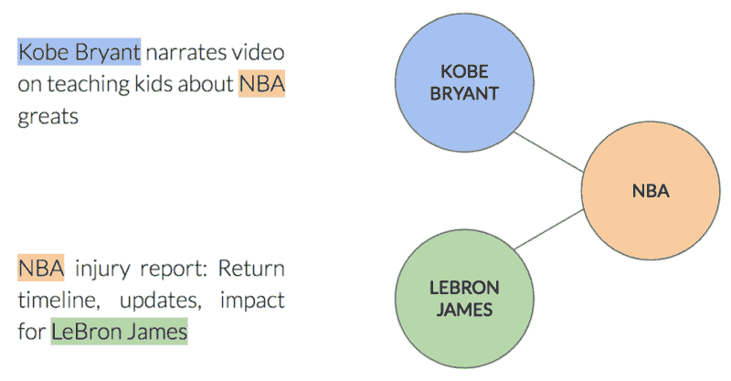
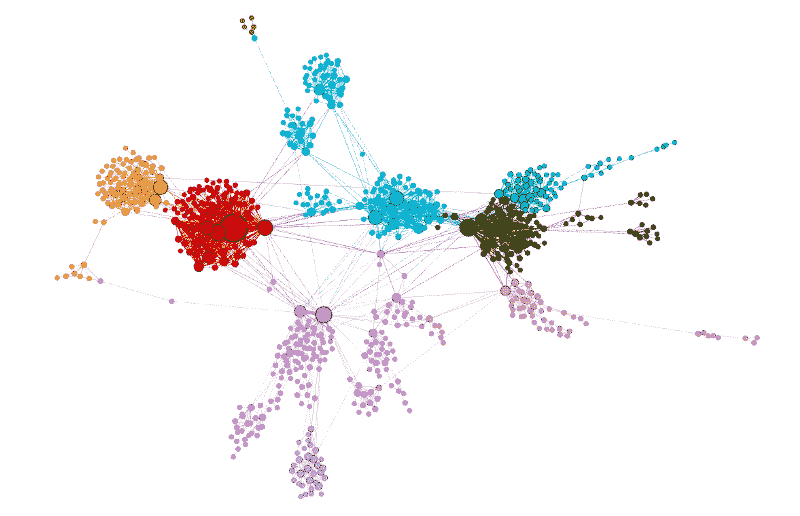
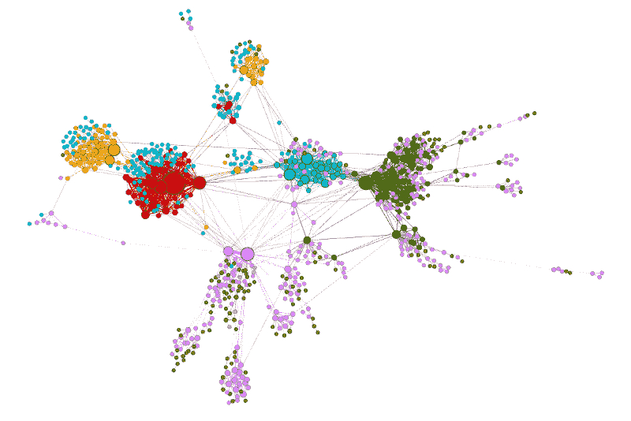
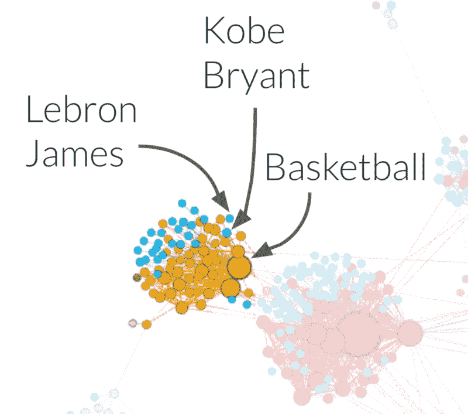
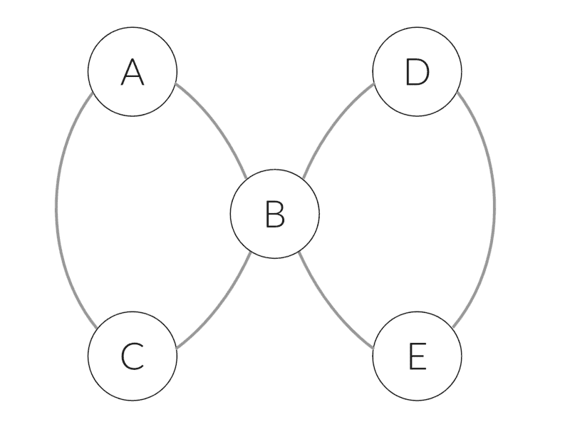

# node2vec 如何工作——以及它能做哪些 word2vec 不能做的事情

> 原文：<https://www.freecodecamp.org/news/how-to-think-about-your-data-in-a-different-way-b84306fc2e1d/>

作者:佐哈尔·科马罗夫斯基

# node2vec 如何工作——以及它能做哪些 word2vec 不能做的事情

#### 如何以不同的方式思考您的数据

在过去的几年里，深度学习(DL)已经成为许多领域应用程序的主要推动者，如视觉、自然语言处理、音频、点击流数据等。最近，研究人员开始成功地将深度学习方法应用于社交网络、推荐系统和生物学等领域的图形数据集，这些领域的数据本质上是以图形方式构建的。

那么图形神经网络是如何工作的呢？我们为什么需要它们？

### 深度学习的前提

在涉及图形数据的机器学习任务中，我们通常希望以某种方式描述图中的每个节点，以允许我们将其输入到某种机器学习算法中。如果没有 DL，人们将不得不手动提取特征，例如节点拥有的邻居数量。但这是一项费力的工作。

这就是 DL 的闪光点。它自动利用图的结构来提取每个节点的特征。这些特征被称为嵌入。

有趣的是，即使您完全没有关于节点的信息，您仍然可以使用 DL 来提取嵌入。图的结构，也就是连接模式，包含了可行的信息。

那么我们如何利用这个结构来提取信息呢？图中每个节点的上下文真的能帮助我们吗？

### 从上下文中学习

一个仅使用上下文提取实体信息的著名算法是 [word2vec](https://www.tensorflow.org/tutorials/representation/word2vec) 。word2vec 的输入是一组句子，输出是每个单词的嵌入。与文本通过单词周围的单词描述每个单词的上下文类似，图形通过相邻节点描述每个节点的上下文。

在文本中，单词以线性顺序出现，而在图表中却不是这样。相邻节点之间没有自然的顺序。所以我们不能用 word2vec…还是可以？

### 像一个坏数学家一样还原

我们可以将数据的图形结构简化为线性结构，这样图形结构中编码的信息就不会丢失。这样做，我们将能够使用好的旧词 2vec。

关键点是在图中执行随机行走。每一步从一个随机节点开始，执行一系列的步骤，每一步都到一个随机的邻居。每一次随机游走都形成了一个可以馈入 word2vec 的句子。这个算法叫做 [node2vec](https://snap.stanford.edu/node2vec/) 。这个过程中有更多的细节，你可以在[原文](https://arxiv.org/abs/1607.00653)中读到。

### 个案研究

Taboola 的内容推荐系统收集了大量的数据，其中一些可以用图形方式表示。让我们检查一种类型的数据，作为使用 node2vec 的案例研究。

Taboola 推荐出版商网站上显示的 widget 中的文章:

每篇文章都有命名的实体——由标题描述的实体。例如，项目“地球上最可爱的狗”包含实体“狗”和“星球”。每个命名实体可以出现在许多不同的项目中。

我们可以用图来描述这种关系，如下所示:每个节点都是一个命名的实体。如果两个命名实体出现在同一个项目中，则两个节点之间会有一条边:

既然我们能够以图形化的方式描述我们的数据，让我们运行 node2vec，看看我们可以从数据中了解到什么。你可以在这里找到工作代码[。](https://github.com/taboola/node2vec-example)

在学习节点嵌入之后，我们可以将它们用作下游任务的特征，例如 CTR(点击率)预测。虽然它可能有利于模型，但很难理解 node2vec 学到的品质。

另一种选择是使用 [K-means](https://en.wikipedia.org/wiki/K-means_clustering) 将相似的嵌入聚类在一起，并根据相关的聚类给节点着色:

酷！node2vec 捕获的集群似乎是同质的。换句话说，图中彼此靠近的节点在嵌入空间中也彼此靠近。以橙色集群为例——它的所有命名实体都与篮球有关。

你可能想知道使用 node2vec 比传统的图形算法，如社区检测算法(例如，[格文-纽曼算法](https://arxiv.org/abs/cond-mat/0308217))有什么好处。捕捉每个节点所属的社区肯定可以使用这样的算法来完成，这没有什么错。

实际上，这正是特征工程。我们已经知道 DL 可以节省您精心制作这些功能的时间。那么为什么不享受这个福利呢？我们还应该记住，node2vec 学习高维嵌入。这些嵌入比仅仅是社区归属要丰富得多。

### 采取另一种方法

在这个用例中使用 node2vec 可能不是第一个想到的想法。有人可能会建议简单地使用 word2vec，其中每个句子都是单个项目中命名实体的序列。在这种方法中，我们不将数据视为具有图形结构。那么这种有效的方法和 node2vec 有什么区别呢？

如果我们仔细想想，我们在 word2vec 方法中生成的每个句子都是我们之前定义的图表中的一个环节。node2vec 还定义了同一个图上的遍历。所以它们是一样的，对吗？让我们看看通过 word2vec 方法得到的集群:

现在,“basketball”集群不那么同质了——它包含橙色和蓝色节点。例如，命名实体“Basketball”是橙色的。而篮球运动员“勒布朗·詹姆斯”和“科比·布莱恩特”是蓝色的！

但是为什么会这样呢？

在这种方法中，图中的每个遍历仅由出现在单个项目中的命名实体组成。这意味着我们被限制在从起点到终点的距离不超过 1 的步数。在 node2vec 中，我们没有这个限制。由于每种方法使用不同种类的行走，学习嵌入捕获不同种类的信息。

为了使它更具体，考虑下面的例子。假设我们有两个项目，一个包含命名实体 A、B、C，另一个包含 D、B、e。这些项目会产生下图:

在简单的 word2vec 方法中，我们将生成以下句子:[A，B，C]和[D，B，E]。在 node2vec 方法中，我们也可以得到类似于[A，B，E]的句子。如果我们将后者引入训练过程，我们将会知道 E 和 C 是可以互换的。前缀[A，B]将能够预测 C 和 E。因此，C 和 E 将得到相似的嵌入，并将被聚类在一起。

### 外卖食品

使用正确的数据结构来表示数据非常重要。每种数据结构都意味着不同的学习算法。换句话说，引入了不同的电感偏置。

识别您的数据有一定的结构，因此您可以使用正确的工具来完成这项工作，这可能是一项挑战。

由于如此多的真实世界数据集自然地表示为图形，我们认为图形神经网络是我们作为数据科学家的工具箱中的必备工具。

*由我和[约尔·泽尔德斯](https://www.freecodecamp.org/news/how-to-think-about-your-data-in-a-different-way-b84306fc2e1d/undefined)T5 在[engineering.taboola.com](https://engineering.taboola.com/think-data-different)发表。*