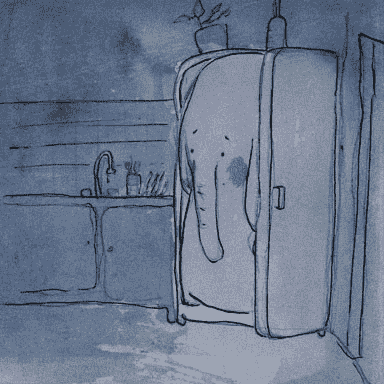

# 如何像程序员一样思考

> 原文：<https://www.freecodecamp.org/news/how-to-think-like-a-programmer-3ae955d414cd/>

作者 Zell Liew

# 如何像程序员一样思考


“我不懂 JavaScript。我不能从零开始做组件。当我盯着一个空白的 JavaScript 文件时，我的大脑一片空白。我想我做不到，因为我不知道如何像程序员一样思考。

听起来很熟悉？你并不孤单，我的朋友。许多试图将 JavaScript 作为第一编程语言的人都面临着同样的问题。

见鬼，即使是已经在用另一种语言编码的开发人员也面临着同样的 JavaScript 问题。他们说的不是“我不能像程序员一样思考”，而是“我不能用 JavaScript 思考。”

但不会了。让今天成为你学会像程序员一样思考的一天。

### 你已经可以像程序员一样思考了。

你有没有在 freeCodeCamp、Code Academy 或者 Code Wars 这样的地方尝试过关于 JavaScript 的简单练习？

如果你有，你已经知道如何像程序员一样思考。

当你面对你的 JavaScript 文件时，你的大脑一片空白的真正原因可能是因为**编码器的阻塞**。你害怕写不工作的 JavaScript。你害怕面对错误。你不知道如何开始。

克服编码障碍很简单。您可以遵循以下四个步骤:

1.  把问题分解成更小的问题
2.  为你的小问题寻找解决方案
3.  以一致的方式组合解决方案
4.  重构和改进

让我们仔细看看这些步骤。

### 第一步:把问题分解成更小的问题。

你如何把一头大象放进冰箱？

大多数人会这样回答:

1.  打开冰箱
2.  把大象放进去
3.  关上冰箱

问题解决了。



这个答案是当你面对一个空白的 JavaScript 文件时为什么会卡住的最好例子。它跳过步骤。

如果你对这个问题进行逻辑思考，你会发现一些尚未解答的突出问题:

1.  我们在说什么冰箱？
2.  我们说的是哪种大象？
3.  如果大象太大，放不进冰箱，你会怎么做？
4.  你首先在哪里找到大象的？
5.  你如何把大象运到你的冰箱里？

当你编码时，你需要回答你能想到的每一个小问题。这就是为什么第一步是把你的问题分成小块。

### 第二步:为你的小问题找到解决方案。

第二步是找到解决每个小问题的方法。在这里，尽量详细很重要。

1.  什么冰箱？—你厨房里的冰箱
2.  哪种大象？—[非洲丛林象](https://en.wikipedia.org/wiki/African_elephant)
3.  大象太大怎么办？—拿个收缩枪(？)来缩小大象(？).
4.  你在哪里找到大象的？—非洲
5.  你如何运输大象？—缩水后放进包里，然后坐飞机回家。

有时候，你需要挖掘几层才能得到你需要的答案。在上面的例子中，我们可以更深入地研究答案 3 和 4。

1.  你从哪弄来的收缩枪？—向隔壁的疯狂科学家借。
2.  你能在非洲的什么地方找到你的大象？—南非的阿多大象公园。

一旦你有了所有小问题的答案，你就可以把它们拼凑起来解决大问题。

### 步骤 3:以一致的方式组合解决方案。

因此，在把大象放进冰箱的例子中，你可以遵循以下步骤:

1.  从隔壁的科学家那里拿把收缩枪
2.  飞往南非
3.  前往阿多大象公园
4.  在公园里找到一头大象
5.  用收缩枪射大象
6.  把缩小的大象放进你的包里
7.  返回机场
8.  飞回你的国家
9.  去你家旅行
10.  把大象放进你的冰箱

问题解决了。

听起来很有趣，你很可能不会用 JavaScript 捕捉大象并把它们放进冰箱。

### 我们用一个真实的例子。

假设您想要一个创建按钮，当点击它时，会显示一个侧边栏。

### 第一步——分解它

将组件分解成小块。您可能会发现以下几个问题:

1.  这个按钮的标记是什么？
2.  按钮应该是什么样子？
3.  按钮被点击一次会发生什么？
4.  再次点击按钮会发生什么？
5.  第三次点击按钮会发生什么？
6.  这个侧边栏的标记是什么？
7.  侧边栏显示时是什么样子？
8.  侧边栏隐藏后是什么样子？
9.  侧边栏是如何显示的？
10.  侧边栏是如何消失的？
11.  页面加载时侧边栏应该显示吗？

### 第二步——为问题创造解决方案

为了创造解决方案，你需要了解你所创造的媒介。在我们的例子中，你需要了解足够的 HTML、CSS 和 JavaScript。

如果你不知道这些问题的答案，不要担心。如果你把它们充分分解，你应该能在五分钟内通过谷歌找到答案。

让我们来回答每个问题:

**这个按钮的标记是什么？**

标记是一个`<`；一个带有 cla `ss of .`按钮的>标签。

```
<a href="#" class="button">Click me</a>
```

这个按钮应该是什么样子？

这个按钮应该有以下 CSS:

```
.btn {  display: inline-block;  font-size: 2em;  padding: 0.75em 1em;  background-color: #1ce;  color: #fff;  text-transform: uppercase;  text-decoration: none;}
```

点击一次按钮会发生什么？两次？三次？

当按钮被点击一次时，侧边栏应该出现。下次点击按钮时，这个侧边栏就会消失。再次单击该按钮时，它会再次显示。

**这个侧边栏的标记是什么？**

侧边栏应该是一个包含链接列表的`<d` iv >:

```
<div class="sidebar">  <ul>    <li><a href="#">Link 1</a></li>    <li><a href="#">Link 2</a></li>    <li><a href="#">Link 3</a></li>    <li><a href="#">Link 4</a></li>    <li><a href="#">Link 5</a></li>  </ul></div>
```

侧边栏显示时是什么样子？

侧边栏应该放在窗口的右边。它需要固定在适当的位置，以便用户可以看到它。应该是 300px 宽。

当您解决完问题后，您可能会得到类似于以下内容的 CSS:

```
.sidebar {  position: fixed;  top: 0;  bottom: 0;  right: 0;  width: 300px;  background-color: #333;}.sidebar ul {  margin: 0;  padding: 0;}.sidebar li {  list-style: none;}.sidebar li + li {  border-top: 1px solid white;}.sidebar a {  display: block;  padding: 1em 1.5em;  color: #fff;  text-decoration: none;}
```

**侧边栏隐藏后是什么样子？**

侧边栏应该向右移动 300 像素，这样它就不在屏幕上了。

当你回答这个问题时，另外两个问题可能会浮现在你的脑海里:

1.  如何知道侧边栏是显示还是隐藏？
2.  如何设计隐藏侧边栏的样式？

我们也来回答一下。

如何知道侧边栏是显示还是隐藏？

如果侧边栏有一个`.is-hidden`类，侧边栏应该隐藏起来。否则，应该是可见的。

如何设计隐藏侧边栏的样式？

我们使用`translateX`将侧边栏向右移动 300 像素，因为`transform`是动画更好的属性之一。你的风格就变成了:

```
.sidebar.is-hidden {  transform: translateX(300px);}
```

侧边栏是如何显示的？

侧边栏不会立即出现。它需要从右边移动到左边，在右边它是隐藏的，在左边它是可见的。

如果你知道你的 CSS，你将能够使用`transition`属性。如果你没有，你可以通过谷歌找到你的答案。

```
.sidebar {  /* other properties */  transition: transform 0.3s ease-out;}
```

**侧边栏是怎么消失的？**

它应该以出现的方式消失，方向相反。有了这个，你就不用再写任何额外的 CSS 代码了。

页面加载时，侧边栏应该显示吗？

没有。鉴于我们所拥有的，我们可以在侧边栏标记中添加一个`is-hidden`类，侧边栏应该保持隐藏。

```
<div class="sidebar is-hidden">  <!-- links --></div>
```

现在，我们已经回答了几乎所有的问题，除了一个——按钮被点击一次会发生什么？两次？三次？

我们上面的回答太含糊了。我们知道当你点击侧边栏时，它会出现，但是怎么出现呢？当你再次点击侧边栏时，它应该会消失，但是怎么做呢？

至此，我们可以更详细地再次回答这个问题。但是在那之前，你怎么知道你什么时候点击了一个按钮？

**如何知道你点击了一个按钮**。

如果您了解您的 JavaScript，您知道您可以向按钮添加一个事件监听器，并监听一个`click`事件。如果你不知道，你可以谷歌一下。

在添加事件监听器之前，您需要从带有`querySelector`的标记中找到按钮。

```
const button = document.querySelector('.btn')button.addEventListener('click', function() {  console.log('button is clicked!')})
```

**点击一次按钮会发生什么？**

当按钮被点击一次时，我们应该删除`is-hidden`类，这样按钮就会显示出来。要在 JavaScript 中删除一个类，我们使用`Element.classList.remove`。这意味着我们需要首先选择侧边栏。

```
const button = document.querySelector('.btn')const sidebar = document.querySelector('.sidebar')button.addEventListener('click', function() {  sidebar.classList.remove('is-hidden')})
```

**点击按钮两次会发生什么？**

当再次点击按钮时，我们应该将`is-hidden`类添加回侧边栏，这样它就会消失。

不幸的是，我们不能用事件监听器检测一个按钮被点击了多少次。那么，最好的方法是检查类`is-hidden`是否已经出现在侧边栏上。如果是的话，我们就移除它。如果不是，我们添加它。

```
const button = document.querySelector('.btn')const sidebar = document.querySelector('.sidebar')button.addEventListener('click', function() {  if (sidebar.classList.contains('is-hidden')) {    sidebar.classList.remove('is-hidden')  } else {    sidebar.classList.add('is-hidden')  }})
```

这样，你就有了组件的初始原型。

[https://codepen.io/zellwk/pen/zdqmLe/](https://codepen.io/zellwk/pen/zdqmLe/)

### 第四步——重构提升。

我们整合了第三步，以一致的方式组装我们的解决方案。最后一步是重构和改进您的代码。这一步对你来说可能不是很自然。在你知道你的代码是否可以改进之前，需要努力和实践。

所以，一旦你完成了这三个步骤，休息一下，做点别的事情。当您更好地使用 JavaScript 时，当您回来时，您可能会注意到您错过了一些细节。

在上面的例子中，你可以再问几个问题:

1.  如何让有视觉障碍的用户能够访问这个侧边栏组件？
2.  如何让这个侧边栏组件更容易被有键盘的人使用？
3.  你能以任何方式改进代码吗？

对于第三点，如果您进一步搜索，您可能会注意到有一个`toggle`方法可以删除一个存在的类。如果这个类不存在，`toggle`方法会为我们添加它:

```
const button = document.querySelector('.btn')const sidebar = document.querySelector('.sidebar')button.addEventListener('click', function() {  sidebar.classList.toggle('is-hidden')})
```

### 包扎

像程序员一样思考很简单。关键是要知道如何把问题分解成更小的问题。

当你把问题分解后，为你的小问题找到解决方案，并把它们编码。一路走来，你会发现更多以前没有想到的问题。也解决它们。

当你写完每个小问题的答案时，你就有了大问题的答案。有时，你可能需要将你为小问题所写的步骤结合起来。

最后，当您创建第一个解决方案时，工作还没有完成。总会有改进的空间。然而，您很可能现在看不到改进。休息一下，做点别的事情，然后再回来。到时候你就可以问更好的问题了。

**对了，你想学 JavaScript 却不知道怎么开始吗？如果你是，试着浏览一下我为你构建的这个 [JavaScript 路线图](https://jsroadmap.com/)。在这篇文章中，您将学习如何克服学习 JavaScript 的障碍，并获得正确学习 JavaScript 的路线图。玩得开心！**

(如果你喜欢这篇文章，如果你能给我一些掌声并[分享它](http://twitter.com/share?text=Great%20article%20by%20@zellwk:%20How%20to%20think%20like%20a%20programmer.&url=https://zellwk.com/blog/think/&hashtags=JavaScript,%20thinkLikeProgrammers)，我将不胜感激。？)谢谢！

*最初发表于[https://zellwk.com/blog/think/](https://zellwk.com/blog/think/)。*