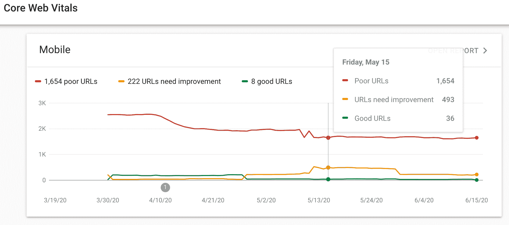
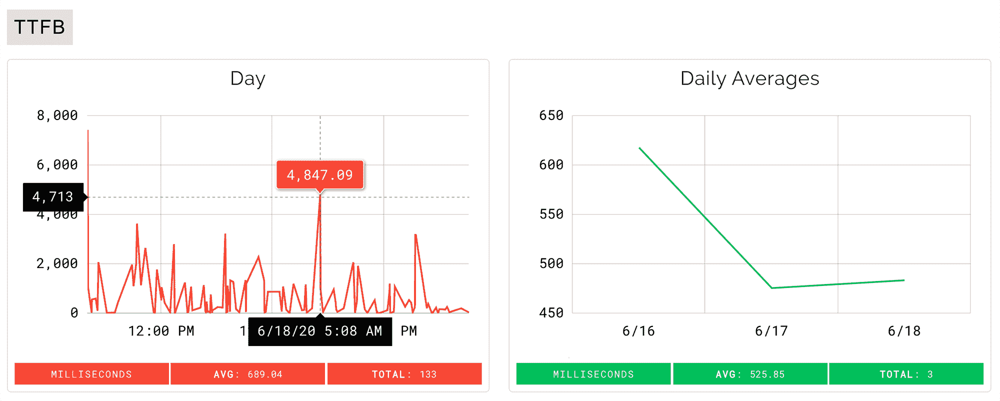

# 如何跟踪和分析网站的生命以提高搜索引擎优化

> 原文：<https://www.freecodecamp.org/news/how-to-track-and-analyze-web-vitals-to-improve-seo/>

好消息-我们现在有了一套全新的标准来判断我们的搜索引擎的价值！？

如果你像我一样，当你读到谷歌宣布即将改变搜索算法时，你可能不会高兴得跳起来。但是在花一些时间呼吸之后，我相信这是一个积极的改变。

公告强调了网页体验及其在未来搜索索引中的作用。通过遵循这一新方向，我们不仅可以为网站用户提供更好的体验，还可以建立有效的策略来改善 SEO。

## 什么是网络生命？

以下指标涵盖了撰写本文时定义的网络生命周期。

*   [第一次内容丰富的绘画(FCP](https://web.dev/fcp/) )测量从页面开始加载到页面内容的任何部分呈现在屏幕上的时间。
*   [首次输入延迟(FID)](https://web.dev/fid/) 测量从用户第一次与页面交互到浏览器能够对交互做出响应的时间。
*   [最大内容绘制(LCP)](https://web.dev/lcp/) 度量报告视口内可见的最大内容元素的渲染时间。
*   [到达第一个字节的时间(TTFB)](https://web.dev/time-to-first-byte/) 是用户的浏览器接收页面内容的第一个字节所花费的时间。
*   [累积布局偏移(CLS)](https://web.dev/cls/) 测量在页面的整个生命周期中发生的每个*意外布局偏移的所有单个 **布局偏移分数** 的总和。为了计算 **布局偏移分数** ，浏览器查看视窗大小和视窗中不稳定元素在两个渲染帧之间的移动。*

## *为什么网络生命周期很重要？*

*近年来， [Lighthouse](https://developers.google.com/web/tools/lighthouse) ，一个用于提高网页质量的开源自动化工具，被广泛采用为行业标准。*

*现在，另一个名为 [Web Vitals](https://github.com/GoogleChrome/web-vitals) 的谷歌项目已经出现，该项目从**真实用户**中获取指标，精确匹配 Chrome 如何测量这些指标并报告给其他谷歌工具。*

*有了它，我们可以从 SEO 的角度建立页面体验视角，进行分析，并做出相应的调整。？*

> *核心网站生命是适用于所有网页的网站生命的子集，应该由所有网站所有者来衡量，并将在所有谷歌工具中出现。每一个核心网络要素都代表了用户体验的一个独特方面，在领域中是可测量的[，并且反映了一个关键的](https://web.dev/user-centric-performance-metrics/#how-metrics-are-measured)[以用户为中心的](https://web.dev/user-centric-performance-metrics/#how-metrics-are-measured)结果的真实体验。*

*[Web VitalsEssential metrics for a healthy siteweb.dev](https://web.dev/vitals/)*

## *谷歌搜索控制台中的网络生命*

*搜索控制台提供真实用户如何访问网站的报告以及关于这些用户的各种数据。*

*核心网站的生命周期以总结的形式报告，显示好的、需要改进的或只是差的 URL 的总数。？*

*

Google Search Console Core Web Vitals* 

## *向 Google Analytics 发送 Web 重要信息，并在 Data Studio 中可视化*

*搜索控制台提供了大计划中的结果摘要，但为了获得详细的报告，我们可以更进一步。Web Vitals GitHub 项目记录了一种以分析事件的形式捕获指标的方法，这些分析事件可以在谷歌的数据工作室中以图表的形式可视化。*

*声明:我个人还没有能力将分析 Web 生命事件连接到 Data Studio，目前也缺乏相关文档。但是我会在整理出一个例子后更新这篇文章。*

## *通过自动化灯塔检查实时可视化和分析网络重要信息*

*

[Automated Lighthouse Check Web Vitals Demo](https://www.automated-lighthouse-check.com/dashboard/demo/web-vitals)* 

*Google Analytics 和 Data Studio 是强大的工具，可以提供很好的洞察力。最棒的是，它们是免费的！*

*Automated Lighthouse Check 是一个使用 Lighthouse 监控网站的网站，现在提供了一个 Web Vitals 实现。你可以在你的网站上嵌入一个 JS 片段，并开始实时收集网络生命指标。*

*该工具的一个优点是其简单的设置过程和容易过滤。您可以通过 URL 以及浏览器、操作系统和设备过滤数据。*

## *结论*

*SEO 的成功之路是曲折的，但幸运的是，我们现在有了一套更具体的指导方针。如果你的目标是在谷歌搜索引擎上获得高排名，利用谷歌推荐的工具和项目是个好主意，包括 Lighthouse 和 Web Vitals。*