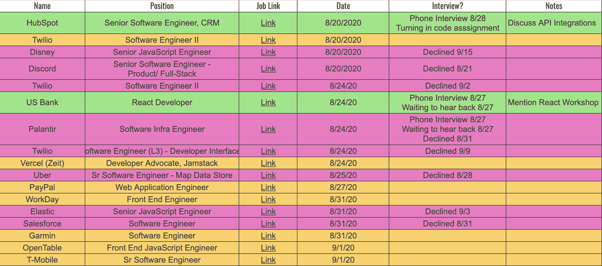

# 如何用电子表格跟踪你的求职进度

> 原文：<https://www.freecodecamp.org/news/how-to-track-your-job-search/>

好吧，那么你已经决定开始找新工作了。

诚然，这是一个人们不太喜欢的过程，总的来说。

虽然我很确定我不能说服你彻底地 **享受** 找工作的过程，但我可以分享一个我在之前的找工作中多次使用的方法，这个方法让这个过程感觉更加 **有组织** 和 **有效率** 。

一切都从一张电子表格开始。

# 为你的进步建立一个分类账

首先，创建一个新的电子表格，命名为 **我的求职之旅** 。

接下来，我建议您创建六列标题:

## 公司名称

这是一个非常明显的问题，但这是一个非常重要的信息。

没有人想在开始面试的时候完全忽略他们要面试的公司的名字。

## 位置

如果你申请多家公司和多个职位，事情很容易变得混乱。

现代科技领域有如此多不同的头衔。

你要确保自己对目前申请的每个职位都保持警惕，这样你就可以在公司面试前很容易地回忆起这一点。

## 链接到职务

最终，你会吸引你申请的公司的兴趣，太棒了！

起初，你很兴奋，然后突然一股焦虑感笼罩了你。

你不记得申请过这个职位，完全不知道这个职位的相关细节。

这就是为什么插入一个到职位发布的直接链接是一个谨慎的举动。

这不仅能让你快速回忆起公司及其使命的重要细节，还能为你在面试时的谈话要点提供重要参考。

这些参考资料可以是公司精神，你可以从个人经历或他们使用的你也曾共事过的技术中找到答案。

## 应用日期

起初，这个数据点可能看起来不太相关。但我认为它可以(至少)达到两个目的。

*   首先，它有助于衡量你一天、一周或一个月提交了多少份申请

这能给你巨大的信心提升，尤其是当你觉得找工作永无止境的时候。有了捕获的日期数据，你可以回顾和反思你在搜索中付出的所有努力，甚至在你得到面试之前。

光是这一点就很难，你应该为此感到骄傲！

*   其次，它可以让你深入了解一个标准的面试过程需要多长时间

在我的文章[如何准备软件开发人员面试](https://www.martincartledge.io/prepare-for-software-developer-interview/)中，我解释了面试过程的步骤。

这一过程可能因职位和公司而异。但是，能够回顾最初的日期，并找出你目前在某个特定公司的位置，可能是另一个有益的衡量标准。

面试过程可能会很长，很累人。但是随着每一天都过了你最初的申请日期，你可以用这个标准来给自己另一个内部信心的提升。你今天所在的地方比你昨天所在的地方更远。

为此感到骄傲！

## 申请状态

在不同阶段的几次申请和几次面试之后，事情会变得很难把握。

这就是 **申请状态** 栏真正能帮上忙的地方。

如果一家公司主动联系你安排面试，开始记录面试过程中每一步的日期、时间和面试类型。

这有助于保持对你当前优先事项的高度关注，也是避免重复预约面试的好方法。

我还建议在本专栏中记录你被拒绝的申请。

通过记录你在求职中的成功和失败，你可以更容易地检查你的*成功率。*

*如果你发现在 100 家公司中，你只收到了 5 份回复，也许是时候检查一下你能控制的东西了(比如你的简历，如果你有求职信的话)。*

*总而言之，拥有这些数据点真的有助于你巩固为什么你在求职中得到或没有得到你想要的结果。*

## *笔记*

*即使你申请的是全职工作，也很难搞清楚你感兴趣的每份工作的所有细节。*

*最后一栏， **备注** ，本质上是一个占位符，用来存放你对公司、职位或面试过程的各种想法。*

*这也是一个为面试的任何一步写提醒的好地方。*

**例如-*公司精神:不惜一切代价为最终用户着想。提用户验收会体验！***

*如果你花一点时间记下一些你认为在面试过程中对一家公司有帮助的笔记，它们通常会对你有很大帮助，帮助你在候选人中脱颖而出。*

*你准备得越充分，你讨论的问题或经历越周到，你在面试官面前就越有优势。这表明你对这个职位/公司有真正的*兴趣。**

## **最终产品**

****

# **下一步:碾压面试！**

**如果你已经花时间找工作，跟踪你的旅程，我不能保证你会在你申请的每家公司得到面试机会。但是我可以保证，在前进的每一步，你都会感到更有准备，更有条理。**

**如果你投入了时间并获得了面试机会，那么恭喜你！我祝你一路顺风。**

**如果你刚刚开始找工作，祝你好运！你能行的。**

**你是软件开发的新手，并试图获得面试机会吗？看看我在[上的帖子，获得软件开发人员](https://www.martincartledge.io/get-software-developer-interview/)的面试机会。**