# 如何使用 TensorFlow Eager execution 训练自己的 FaceID ConvNet

> 原文：<https://www.freecodecamp.org/news/how-to-train-your-own-faceid-cnn-using-tensorflow-eager-execution-6905afe4fd5a/>

泰勒·席尔瓦

人脸无处不在——从社交媒体网站上的照片和视频，到像 iPhone Xs FaceID 这样的消费者安全应用程序。

在这种情况下，应用于人脸的计算机视觉有许多子区域。这些包括人脸检测、识别和跟踪。此外，随着深度学习的进步，这些解决方案在商业应用方面越来越成熟。

这篇文章一点一点地向你展示了如何设计和训练自己的卷积神经网络(CNN)用于人脸识别。在这里，我们提出一个 Tensorflow 渴望实现暹罗 DenseNets。

你可以在这里找到完整的代码。

### 暹罗猫

连体 CNN 是一类包含两个或更多相同网络实例的神经网络(NNs)。术语“相同”指的是两个 NNs 共享相同的设计配置，最重要的是它们的重量。

为了理解 DenseNets，我们需要关注其架构的两个主要组件。这就是**致密块体**和**过渡层**。

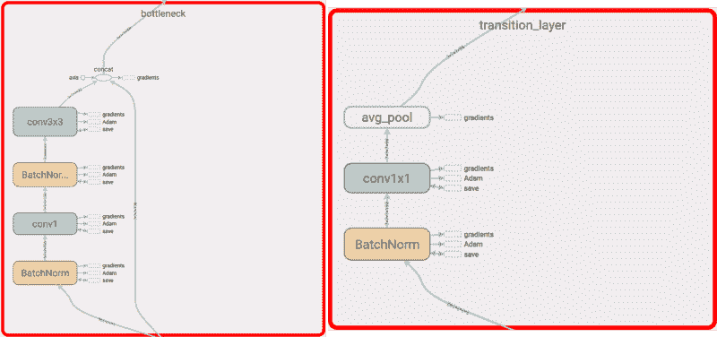

简而言之，DenseNet 是密集块的堆叠，后面是过渡层。一个块由一系列单元组成。每个单元包含两个卷积。每个卷积之前都有**批标准化** (BN)和**校正线性单位** (ReLU)激活。

每个单元输出固定数量的特征向量。这个数字由一个参数控制，即增长率。本质上，它管理给定单元允许传递给下一个单元多少新信息。

类似地，过渡层是简单的组件。它们被设计成对通过网络的特征向量进行下采样。每个过渡层由一个 BN 操作组成，随后是一个 **1x1** 卷积加上一个 **2x2** 平均池。

与其他常规 CNN 的最大区别在于，密集区块中的每个单元都与其之前的每个单元相连。在一个块内，**第 n 个**单元接收由**第 n-1 个**、**第 n-2 个、** …一直到流水线中的第一个单元学习的特征向量作为输入。换句话说，DenseNets 设计允许在其单元之间共享高级功能。

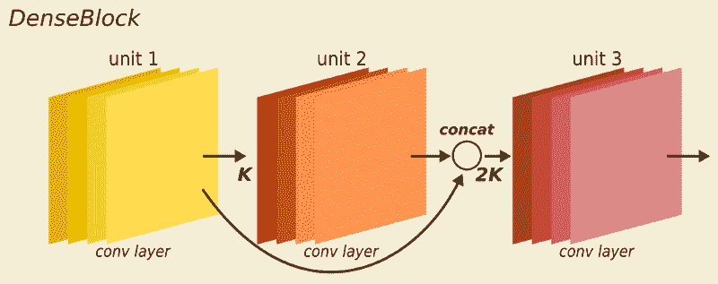

DenseBlock overview. Each unit outputs K feature vectors. The following units receive feature vectors from previous units by concatenation.

与 ResNets 相比，DenseNets 具有通过级联而不是求和来重用的特性。因此，DenseNets 在参数数量上比 ResNets 更紧凑。直观地，由任何给定 DenseNet 单元学习的每个特征向量被块内所有随后的单元重用。这使得网络的不同层获知冗余特征的可能性最小化。

ResNets 和 DenseNets 都使用流行的瓶颈层设计。它由两部分组成:

*   一个 **1x1** 卷积来减少特征的空间维度
*   更宽的卷积，在这种情况下是用于特征学习的 **3x3** 运算

在参数效率和每秒浮点运算(FLOPs)方面，DenseNets 远远超过 ResNets。DenseNets 不仅在 ImageNets 上实现了更小的错误率，而且比 ResNets 需要更少的参数和更少的 FLOPs。

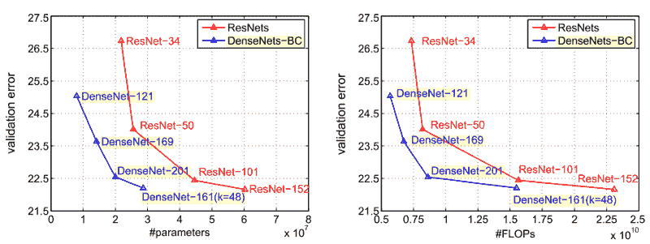

增强模型紧凑性的另一个技巧是压缩因子。这个过程发生在过渡层上，目的是减少进入下一个密集块的特征向量的数量。DenseNets 通过在 0 和 1 之间设置一个因子 **θ** 来实现这种机制。θ控制允许多少当前特征传递到下一个块。该技术允许 DenseNets 进一步减少特征向量的数量，并且参数效率非常高。

### 学习面孔相似性

这不是一个分类任务——我们不想把图像分成几类。相反，我们想学习一种可以单独描述每个输入的表示。

具体来说，我们希望找到输入图像之间的相似之处。为此，我们需要一个能够表达两个可比较事物之间关系的表示。

在实践中，我们希望学习嵌入向量来表示人的面部图像之间的关系。我们希望矢量具有以下特性:

*   如果两幅图像( **X1** 和 **X2** )相似，我们希望两个输出向量之间的距离尽可能小
*   如果 **X1** 和 **X2** 是**而不是**相似，我们希望这个距离尽可能大

下面我们代表整个暹罗 DenseNets **学习人脸嵌入的框架**。接下来的部分将介绍该体系结构的具体构建模块。

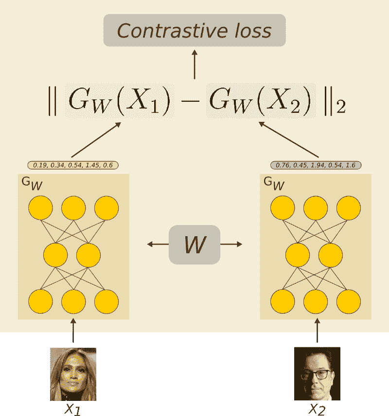

### 对比损失

为了理解对比损失是如何工作的，首先要记住的是**它对成对的图像**起作用。

以上面两张图片为例。在给定的点，我们给系统一对( **X1** ， **X2** )具有以下性质:

*   如果认为 **X1** 与 **X2** 相似，我们给它打 0 分
*   否则 **X1** 得到标签 1

现在，让我们将 **Gw** 定义为一个参数函数——神经网络。它的作用非常简单， **Gw** 将高分辨率输入映射到低分辨率输出。

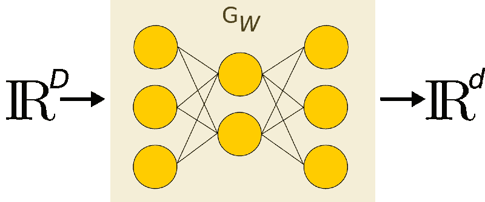

Reducing high dimensional input to a low dimensional representation (D < d)

我们想要学习输入 **X1** 和 **X2 之间的参数化距离函数 **Dw** 。**这是 **Gw** 的输出之间的欧几里德距离。

注意 **m** 是**余量**。它定义了围绕 **Gw** 的半径。它控制不同图像对总损失函数的贡献。也就是说，来自不同人(类)的一对图像( **X1** ， **X2** )只有在它们之间的距离在容限内的情况下才对损失有贡献——如果( ***m -Dw) >*** 0。

换句话说，我们希望优化系统，以便:

*   如果图像对是相似的(标签 0)，我们最小化距离函数 **Dw** 。
*   如果图像对**不**相似(标签 1)，我们增加距离函数 **Dw** 。

最终损失函数及其在 Tensorflow 中的实现定义如下:

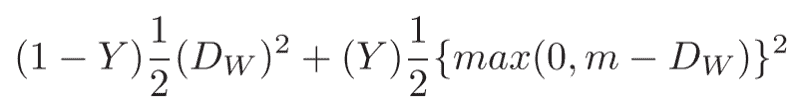

重要的是**要注意我们如何计算第二行中的距离。由于这个损失函数**相对于模型的权重必须是可微的**，我们需要确保负面的副作用不会发生。**

注意，在等式的**平方根**部分，我们在计算平方根之前添加了一个小的ε。而且原因很微妙。在平方根里面的内容是零的情况下，0 的平方根也是 0——这没问题。

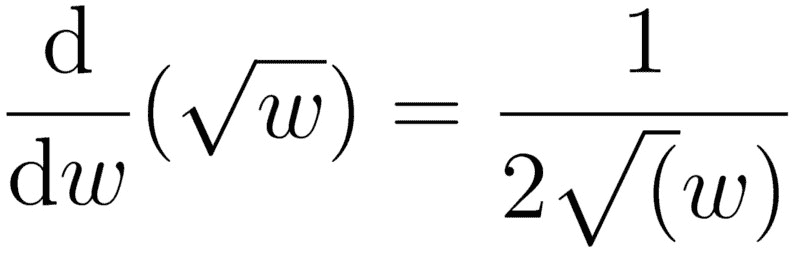

At w=0, the derivative of the **sqrt()** ope would result in a divide by 0\. This would break your code or result in a NaN in python.

然而，如果内容是 0 并且我们正在计算梯度，**平方根的导数将具有除以 0 的运算**。这很糟糕。

作为一个收获，**总是**确保你正在使用的程序在计算上是安全的。

此外，当使用随机梯度下降(SGD)最小化对比损失时，有两种可能的情况。

首先，如果输入样本对( **X1** 、 **X2** )属于同一类(标签为 0)，则等式的第二部分被置零。在这种情况下，我们只最小化同一类的两个图像之间的距离。在实践中，我们推动这两种表示尽可能地相互接近。

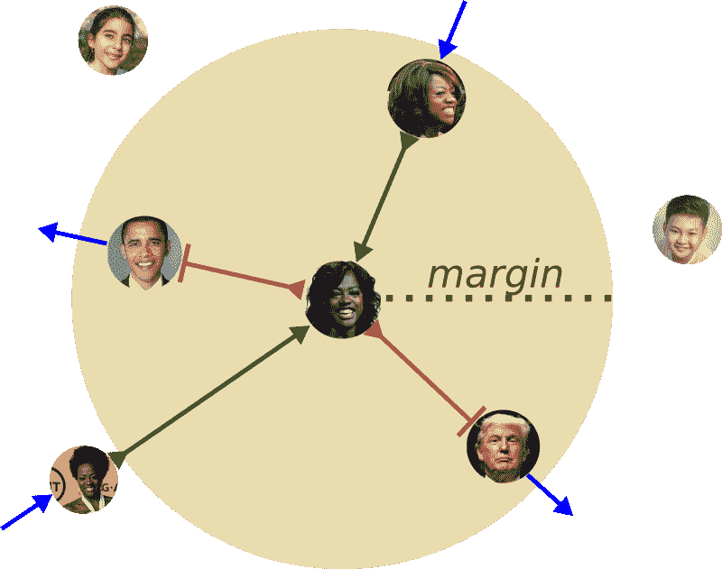

The Contrastive loss clusters similar faces together (inside a given area) and pushes not similar samples apart.

在第二种情况下，如果输入对( **X1** 、 **X2** )不是来自同一个类(标签 1)，则等式的第一部分被取消。然后，在求和的第二项，可能会出现两种情况。

首先，如果两个图像对 **X1** 和 **X2** 之间的距离大于 **m** ，则什么都不会发生。注意，如果**Dw>；m，那么它们之间的差也将是负的。因此，剩余函数的导数将为 0——没有梯度就等于没有学习。**

但是，如果输入对 **X1** 和 **X2** 之间的距离 **Dw** 小于 **m** ，则会出现相反的情况。现在梯度信号将作为排斥力。在实践中，它将推动两个代表远离彼此。

### 资料组

为了训练暹罗 CNN 的面部相似性，我们使用了流行的[大规模名人面孔属性(CelebA)数据集](http://mmlab.ie.cuhk.edu.hk/projects/CelebA.html)。它包含来自 10，177 个不同身份的超过 20 万张名人图片。为了简化数据预处理，我们选择了数据集的对齐和裁剪面部分。下图显示了一些数据集示例。

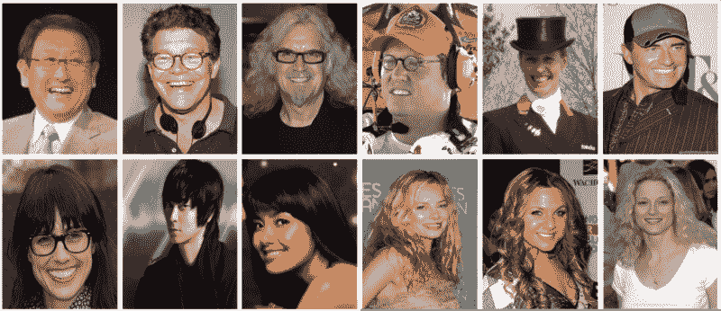

CelebA sample images.

为了使用对比损失，我们需要以非常具体的方式构建数据集。基本上，我们需要建立一个包含大量人脸图像对的数据集。有些来自同一个人，有些来自不同的人。

简单来说，给定一幅输入图像 **Xi** 我们需要找到一组样本 **S = {X1，X2，…，Xj}** 使得 **Xi** 和 **Xj** 属于同一类。换句话说， **Xi** 和 **Xj** 是同一个人的脸部图像。

同理，我们需要找到一组图片 **D = {S1，S2，…，Sj}** 使得 **Sj** 与 **Xi** 不属于同一类。

最后，我们将输入图像 **Xi** 与来自相似和不相似集合的样本相结合。对于每一对( **Xi，Xj** )如果 **Xj** 属于相似样本集 **S** ，我们给这对分配一个标签 0，否则，它得到一个标签 1。

### 培训详情

我们使用原始论文中描述的 DenseNet-121 设计[。生长速率参数(k)设定为 32。代替最后的 1000D 全连接层，我们学习大小为 32 的嵌入向量。](https://liuziwei7.github.io/projects/FaceAttributes.html)

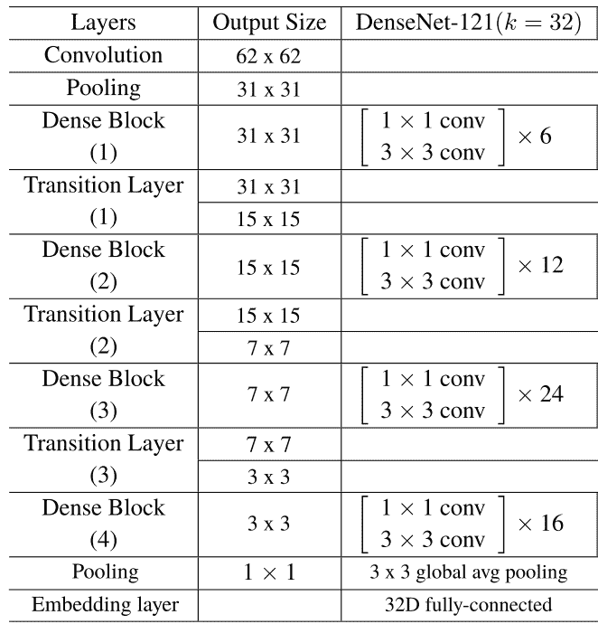

为了优化模型参数，我们使用了 Adam 优化器和循环学习率计划。受 fast.ai 超收敛的启发，我们将 **beta2** Adam 参数固定为 0.99，并对 **beta1** 应用了循环策略。

这样，两个参数:—学习率和**β1**—**在最大值和最小值之间循环变化。简单地说，当学习率增加时，T4β1 在固定的时间间隔内减小。**

**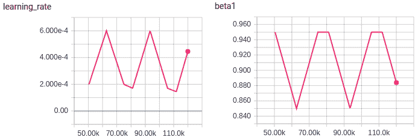**

### **结果**

**效果非常好。**

**对于这些示例，单个阈值 1 将正确分类大多数样本。此外，该网络对输入图像的许多变换是不变的。这些变换包括亮度和对比度、面部大小、姿势和对齐的变化。它对人们外貌的微小变化是不变的，比如年龄、发型、帽子和眼镜。**

**下面的相似性值对于相似的面较小，对于不相似的面较大。标签为 0 意味着这对图像来自同一个人。**

**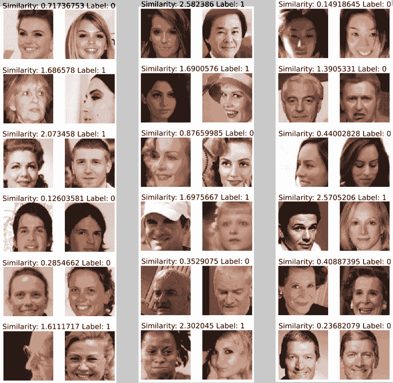**

****感谢阅读！****

### **关于深度学习的更多酷的东西，请查看**

**[**一头扎进高级 GANs:探索自我关注与光谱常态**](https://medium.freecodecamp.org/dive-head-first-into-advanced-gans-exploring-self-attention-and-spectral-norm-d2f7cdb55ede)
[*最近，生成模型吸引了很多关注。其中很大一部分来自生成式对抗网络……*medium.freecodecamp.org](https://medium.freecodecamp.org/dive-head-first-into-advanced-gans-exploring-self-attention-and-spectral-norm-d2f7cdb55ede)[**深入研究深度卷积语义分割网络和 Deep lab _ V3**](https://medium.freecodecamp.org/diving-into-deep-convolutional-semantic-segmentation-networks-and-deeplab-v3-4f094fa387df)
[*深度卷积神经网络(DCNNs)在各种计算机视觉应用中取得了显著的成功……*medium.freecodecamp.org](https://medium.freecodecamp.org/diving-into-deep-convolutional-semantic-segmentation-networks-and-deeplab-v3-4f094fa387df)**

****