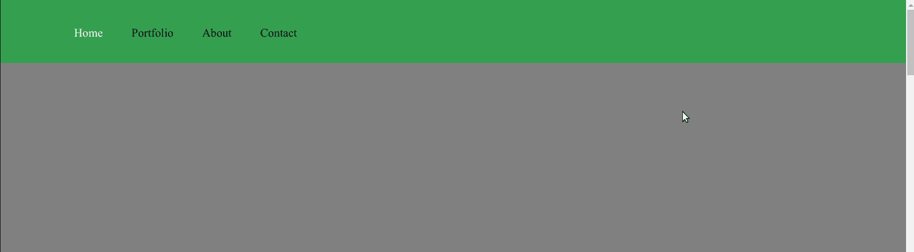

# 如何将 jQuery 代码翻译成普通的 JS

> 原文：<https://www.freecodecamp.org/news/how-to-translate-jquery-code-into-vanilla-js/>

jQuery 曾经是最流行的 JS 库之一。它解决了很多问题，比如使跨所有不同浏览器的 DOM 操作和 Ajax 调用成为标准，这些浏览器处理 JavaScript 的方式略有不同。

许多 jQuery 曾经的前沿特性已经变成了普通的 JavaScript，所以没有必要为了几个功能而加载整个库。考虑到这一点，将 jQuery 重写为普通的 JavaScript 并不罕见。

### 如何将 jQuery 重写为 vanilla JS

假设您有以下代码:

```
<div class="m1 menu">
    <div id="menu-center">
        <ul>
            <li><a class="active" href="#home">Home</a>

            </li>
            <li><a href="#portfolio">Portfolio</a>

            </li>
            <li><a href="#about">About</a>

            </li>
            <li><a href="#contact">Contact</a>

            </li>
        </ul>
    </div>
</div>
<div id="home"></div>
<div id="portfolio"></div>
<div id="about"></div>
<div id="contact"></div>
```

```
body, html {
    margin: 0;
    padding: 0;
    height: 100%;
    width: 100%;
}
.menu {
    width: 100%;
    height: 75px;
    background-color: rgba(0, 0, 0, 1);
    position: fixed;
    background-color:rgba(4, 180, 49, 0.6);
    -webkit-transition: all 0.3s ease;
    -moz-transition: all 0.3s ease;
    -o-transition: all 0.3s ease;
    transition: all 0.3s ease;
}
.light-menu {
    width: 100%;
    height: 75px;
    background-color: rgba(255, 255, 255, 1);
    position: fixed;
    background-color:rgba(4, 180, 49, 0.6);
    -webkit-transition: all 0.3s ease;
    -moz-transition: all 0.3s ease;
    -o-transition: all 0.3s ease;
    transition: all 0.3s ease;
}
#menu-center {
    width: 980px;
    height: 75px;
    margin: 0 auto;
}
#menu-center ul {
    margin: 15px 0 0 0;
}
#menu-center ul li {
    list-style: none;
    margin: 0 30px 0 0;
    display: inline;
}
.active {
    font-family:'Droid Sans', serif;
    font-size: 14px;
    color: #fff;
    text-decoration: none;
    line-height: 50px;
}
a {
    font-family:'Droid Sans', serif;
    font-size: 14px;
    color: black;
    text-decoration: none;
    line-height: 50px;
}
#home {
    background-color: grey;
    height: 100%;
    width: 100%;
    overflow: hidden;
    background-image: url(images/home-bg2.png);
}
#portfolio {
    background-image: url(images/portfolio-bg.png);
    height: 100%;
    width: 100%;
}
#about {
    background-color: blue;
    height: 100%;
    width: 100%;
}
#contact {
    background-color: red;
    height: 100%;
    width: 100%;
}
```

```
$(document).ready(function () {
    $(document).on("scroll", onScroll);

    //smoothscroll
    $('a[href^="#"]').on('click', function (e) {
        e.preventDefault();
        $(document).off("scroll");

        $('a').each(function () {
            $(this).removeClass('active');
        })
        $(this).addClass('active');

        var target = this.hash,
            menu = target;
        $target = $(target);
        $('html, body').stop().animate({
            'scrollTop': $target.offset().top+2
        }, 500, 'swing', function () {
            window.location.hash = target;
            $(document).on("scroll", onScroll);
        });
    });
});

function onScroll(event){
    var scrollPos = $(document).scrollTop();
    $('#menu-center a').each(function () {
        var currLink = $(this);
        var refElement = $(currLink.attr("href"));
        if (refElement.position().top <= scrollPos && refElement.position().top + refElement.height() > scrollPos) {
            $('#menu-center ul li a').removeClass("active");
            currLink.addClass("active");
        }
        else{
            currLink.removeClass("active");
        }
    });
}
```

当您向下滚动页面时，导航条会随着您到达不同部分而改变颜色:



处理这个的函数是`onScroll`:

```
function onScroll(event){
    var scrollPos = $(document).scrollTop();
    /* console.log(scrollPos); */
    $('#menu-center a').each(function () {
        var currLink = $(this);
        var refElement = $(currLink.attr("href"));
        if (refElement.position().top <= scrollPos && refElement.position().top + refElement.height() > scrollPos) {
            $('#menu-center ul li a').removeClass("active");
            currLink.addClass("active");
        }
        else{
            currLink.removeClass("active");
        }
    });
}
```

要将`onScroll`翻译成普通的 JS，您有几个选择。

### 选项 1:使用在线编译器

你可以使用在线工具，比如谷歌的[闭包编译器](https://closure-compiler.appspot.com/)来压缩代码，去掉任何不必要的 jQuery。

问题是，本质上您仍然只剩下 jQuery 代码，所以浏览器仍然需要加载库。

### 选项 2:手动翻译代码

最好的选择是在重写 jQuery 代码之前，检查一下像[你不需要 jQuery](https://github.com/nefe/You-Dont-Need-jQuery) 和[你可能不需要 jQuery](http://youmightnotneedjquery.com/) 这样的资源。您将能够找到最流行的 jQuery 方法的原生 JS 版本，其中一些可以在您自己的代码中使用。

下面是 vanilla JS 中的`onScroll`函数:

```
function onScroll(event) {
  var sections = [...document.querySelectorAll('#menu-center a')];
  var scrollPos = window.pageYOffset || document.documentElement.scrollTop || document.body.scrollTop;
  sections.forEach(function(currLink) {
    var val = currLink.getAttribute('href');
    var refElement = document.querySelector(val);
    if (refElement.offsetTop <= scrollPos && (refElement.offsetTop + refElement.offsetHeight > scrollPos)) {
      //document.querySelector('#menu-center ul li a').classList.remove('active');
      currLink.classList.add('active');
    } else {
      currLink.classList.remove('active');
    }
  });
}

document.addEventListener('scroll', onScroll);
```