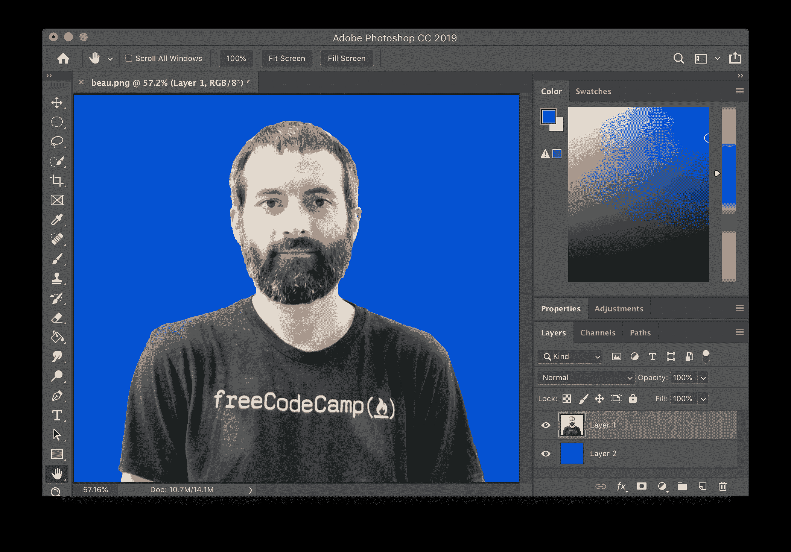
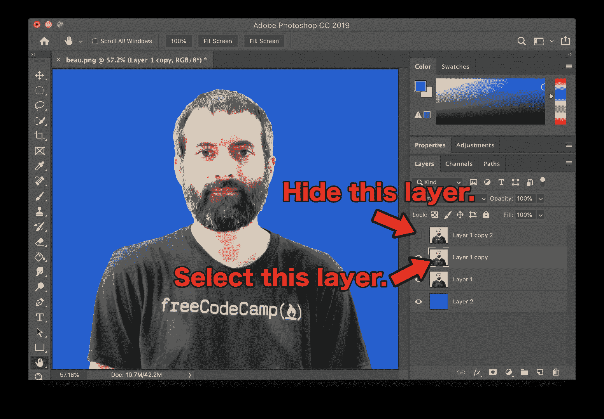
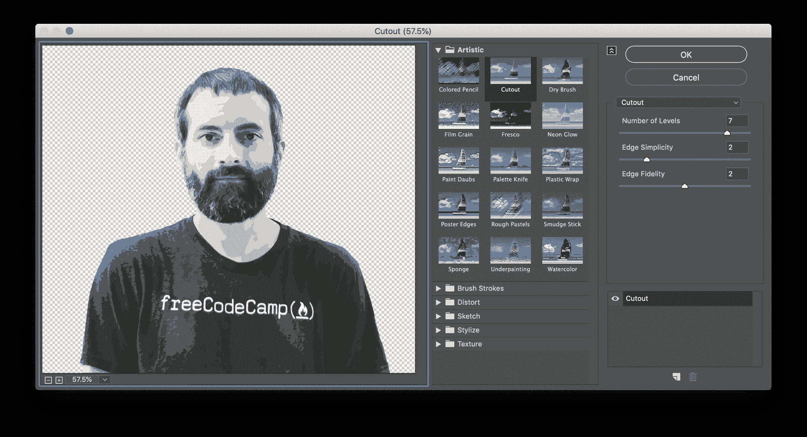
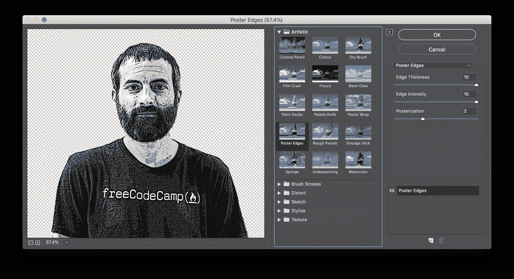
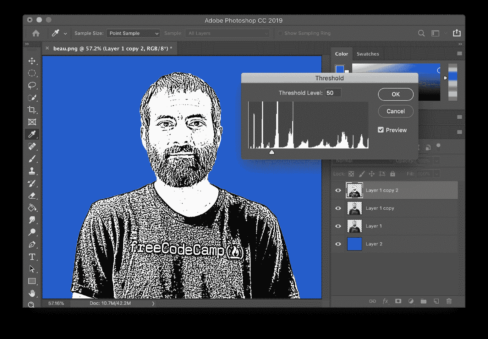
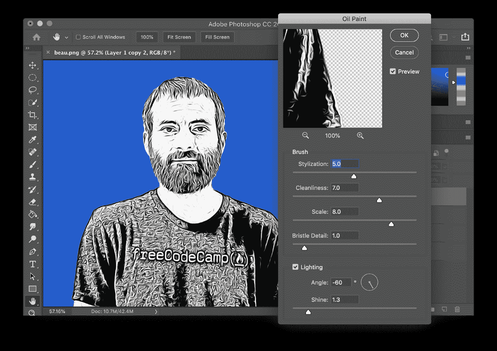
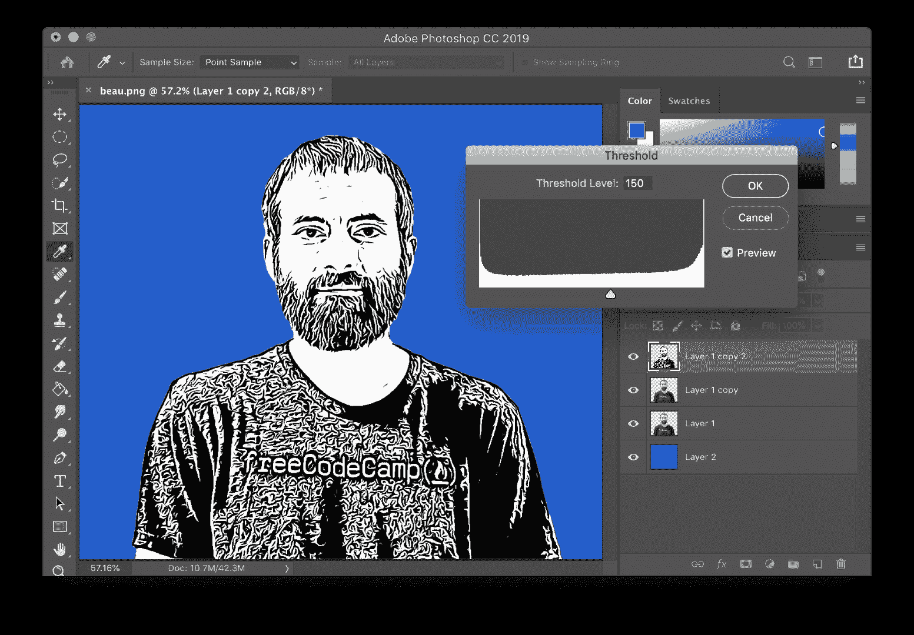
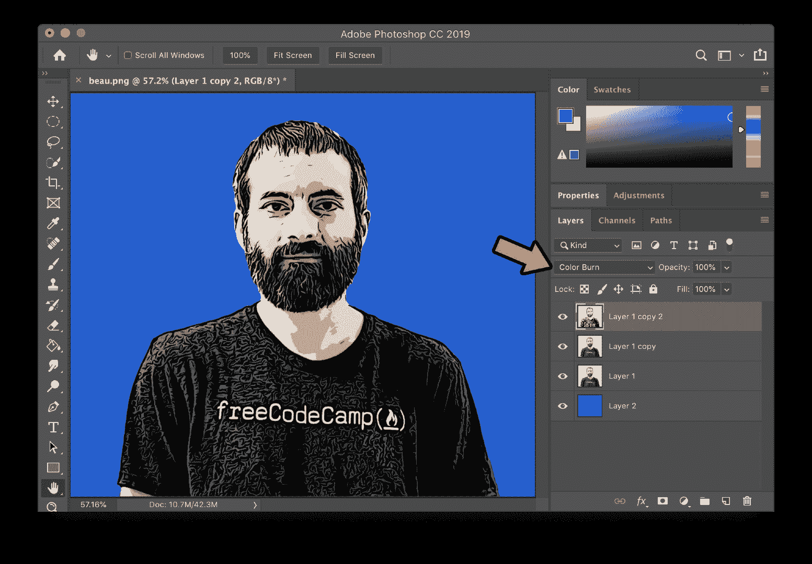

# 如何用 Photoshop CC 把一张图片变成漫画

> 原文：<https://www.freecodecamp.org/news/how-to-turn-a-picture-into-a-cartoon-with-photoshop/>

有趣的照片效果是使照片看起来像卡通。在本教程中，你将学习如何使用 Photoshop CC 使照片看起来像漫画。

### 第一步:打开照片，确保它有一个坚实的背景。

如果你需要帮助移除照片的背景，看看这个背景橡皮擦教程。

### 步骤 2:复制图层两次。

要复制一个层，右击该层并选择“复制层…”。复制图层两次后，隐藏顶部图层，选择第二个图层。

### 步骤 3:添加一个剪切过滤器到第二层。

要添加抠图滤镜，首先选择**滤镜>滤镜库...**然后选择“切断”。将级别数设置为 7，将边缘简单性设置为 2，将边缘保真度设置为 2。如果您愿意，可以尝试其他数字。单击“确定”。

### 步骤 4:添加一个海报边缘过滤器到顶层。

取消隐藏并选择顶层。就像上一步一样，选择**滤镜>滤镜库...**这次选择“海报边缘”。将边缘厚度设置为 10，边缘强度设置为 10，色调分离设置为 2。单击“确定”。

### 第五步:调整顶层的阈值。

选择**图像>调整>阈值...**将阈值水平设置为 50。根据你的形象，其他值可能看起来更好。选择“确定”。

### 第六步:在顶层添加油彩滤镜。

选择**滤镜>风格化>油彩...**将风格化设置为 5.0，清洁度设置为 7.0，比例设置为 8.0，刷毛细节设置为 1.0。选择“确定”。

### 第七步:在顶层再次调整阈值。

选择**图像>调整>阈值...**这次将阈值水平设置为 150。根据你的形象，其他值可能看起来更好。选择“确定”。

### 第八步:将顶层的混合模式改为“颜色加深”。

在混合模式下拉菜单中，选择“颜色加深”。

你完了！你的照片现在看起来像卡通。