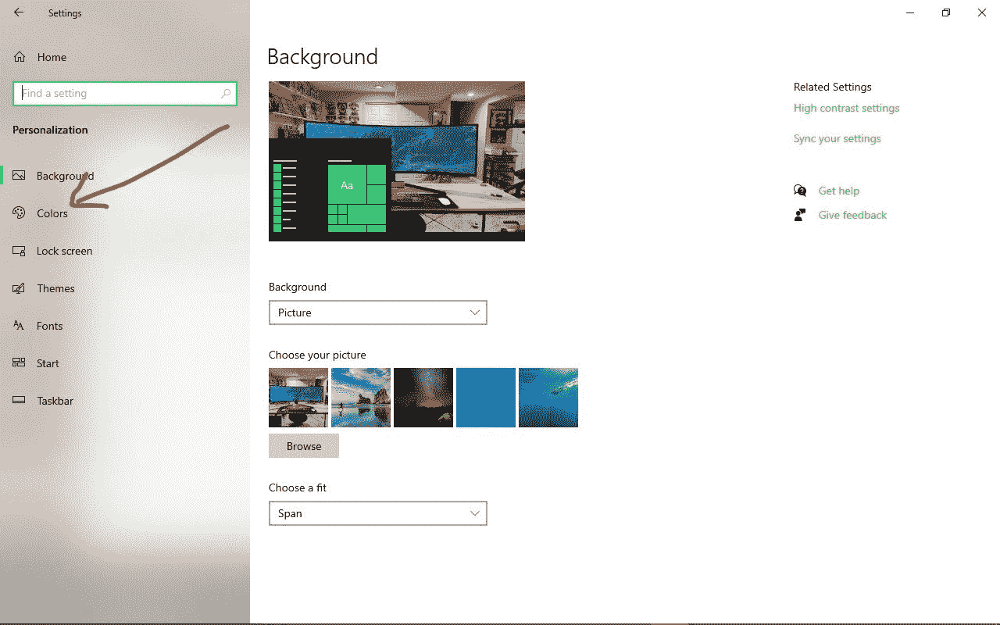
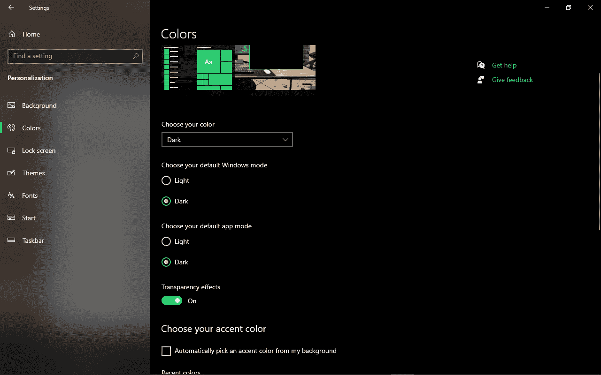
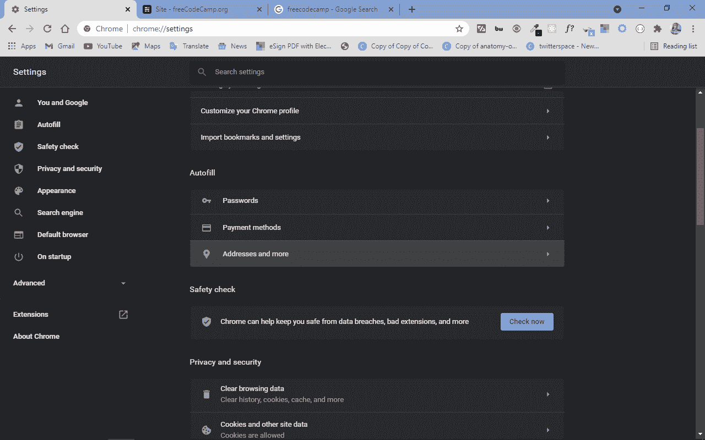
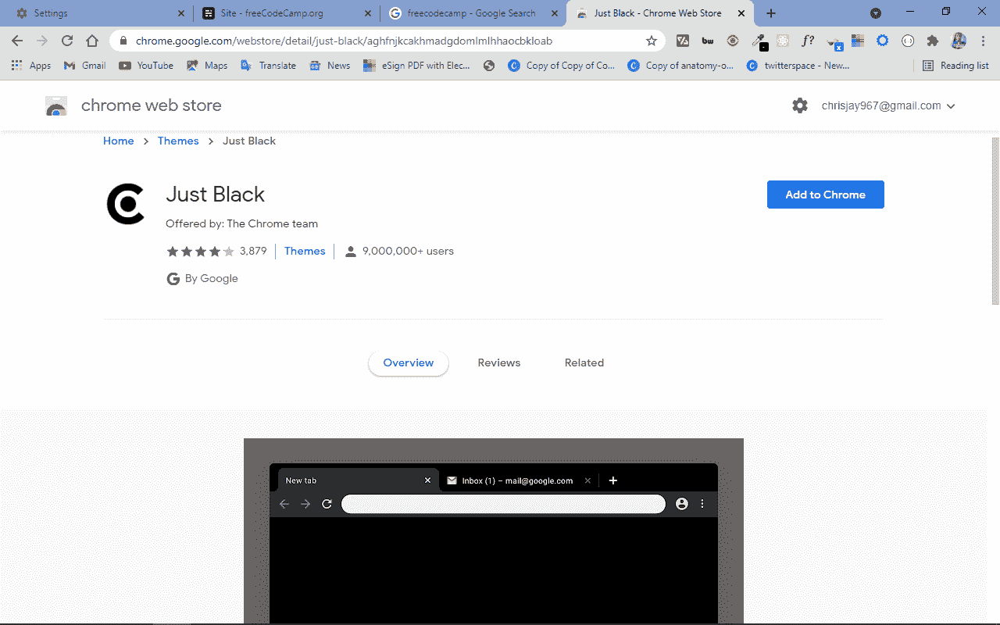
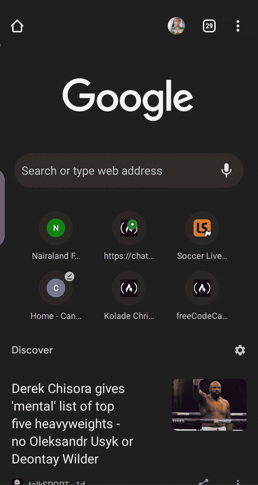

# 如何在谷歌上打开黑暗模式——铬黑主题教程

> 原文：<https://www.freecodecamp.org/news/how-to-turn-on-dark-mode-on-google-chrome-black-theme-tutorial/>

如今，许多开发人员喜欢使用黑暗模式。这并不奇怪，因为激活黑暗模式可以减少眼睛疲劳，并导致更好的眼睛健康。这也有助于机器和人类整体表现更好。

在这篇文章中，我将向你展示如何在 Windows 机器和 Android 手机上打开谷歌 Chrome 应用程序的黑暗主题。我们还将学习如何用一些 Chrome 扩展为 Google 打开黑暗主题。

这还没有结束——阅读本文后，你还可以在黑暗模式下运行你的 Windows 应用程序。

## 如何在 Windows 10 上为谷歌开启黑暗模式

**第一步**:要在你的 Windows 10 PC 上开启谷歌黑暗主题，点击开始，或者按`WIN` (Windows)键。

**第二步**:点击设置

**第三步**:点击个性化

**第四步**:从菜单标签
中选择颜色

**第五步**:最后，在“选择你的默认应用模式”下，选择深色。

设置应用程序本身将更改为黑暗模式，这意味着您机器上的所有应用程序现在都在黑暗模式下运行。

为了确认谷歌现在运行在黑暗模式下，打开 Chrome 应用程序，在谷歌上搜索任何内容:

Chrome 的其他部分也将在黑暗主题上运行:

## 如何使用 Chrome 扩展为谷歌打开黑暗模式

要使用 chrome 扩展为谷歌打开黑暗主题，请从 Chrome 网络商店下载并激活 Just Black chrome 扩展。

该扩展由 Chrome 团队构建，因此安装和使用都是安全的。

## 如何在安卓手机上为谷歌开启黑暗模式

**步骤 1** :要在安卓手机上开启谷歌黑暗模式，打开你的 chrome 应用，点击右上角的三个点。

**第二步**:轻击设置

**第三步**:选择主题

**第四步**:最后选择黑暗

你的 Chrome 手机应用应该处于黑暗模式，包括谷歌搜索页面:

## 结论

在本文中，您了解了如何在 Windows 机器和 Android 手机上为 Google 打开黑暗模式。

您还了解了如何使用 chrome 扩展做同样的事情。

在 Chrome 上还有其他几个给你黑暗模式的扩展，所以你可以在 Chrome 网上商店随意查看。

感谢您的阅读，祝您愉快。