# 如何在 Mac 上键入带重音的字母

> 原文：<https://www.freecodecamp.org/news/how-to-type-letters-with-accents-on-mac/>

如果你用英语以外的语言写作，你可能需要知道如何添加重音符号。你知道，就像 voilà，olé，或über。

幸运的是，在 Mac 上有一些简单的方法可以做到这一点。在这篇文章中，我们将通过主要的方法，让您可以轻松地添加重音到您的文本。

## Mac 上的按住重音方法

如果你不急着想一目了然地看到所有常见的口音选项，有一个简单的方法可以做到这一点。

只需按住您希望重音出现的键，字母上方会出现多个选项，如下所示:

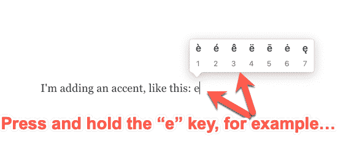

Press and hold accent method

当您看到想要添加的重音类型时，只需键入该数字，重音将被添加到字母中。您也可以使用左右箭头键(和 enter)来选择您想要的。

例如，如果你想要上面的第二个选项，你可以按住 e，然后按 2(或者按一下右箭头键，然后回车)。

如果你不介意弹出这个小菜单所花的时间，这种方法效果很好。但它并不总是包括每种语言的所有口音。它确实会降低你的速度，尤其是当你用另一种语言打整篇文章的时候。咻，那是很多额外的时间。

幸运的是，还有另一种涉及键盘快捷键的常用方法。也给了你所有的选择。

## Mac 上的 Option 键重音方法

Option 键帮助您给文本添加各种重音和音调符号。只需按住 Option 键(与 Alt 键相同)，然后按下“e”键，然后松开并按下您想要添加重音的字母键。

例如，如果您想要给字母 a、e、I、o 或 u 添加一个重音符( )，您可以按下 Option + e，然后按下您想要添加重音符的字母。所以，选项+e+a 得到你á。

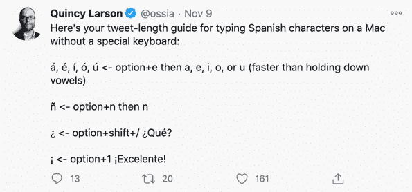

Accent insights from freeCodeCamp's founder.

但是如果你想要一种不同的口音，比如重音符或元音变音呢？不要担心——也有选项键组合(以及更多)。

*   Option + ` + letter =重音符à、è、ì、或(像这样:瞧)
*   Option + i + letter =扬抑符重音-,或(像这样:Crêpe)
*   Option + n + letter = e 字符------------------------------------------或---------------------就像这样:厄尔尼诺现象
*   Option + u + letter =变音重音δ、θ、θ或ü(像这样:ber)
*   Option + a 或 Shift + Option + A(大写 A) =或
*   Option +'或 Shift+Option+' =℃或℃(连字 ae)
*   Option + q 或 Shift + Option + Q(对于大写字母)=或
*   选项+ c 或 Shift +选项+ C(用于资本)=或
*   Option + o 或 Shift + Option + O(资本)= or
*   Shift + Option +？=
*   选项+ 1 =
*   选项+ 5 = ∞

一旦你记住了这些组合，你就可以将击键融入到你典型的打字流程中。如果你忘记了，你可以把这篇文章收藏起来:)。

## 额外奖励:Mac 上的其他选项组合键

如果你需要输入一些数学符号怎么办？还是欧元的符号？你需要的不仅仅是口音选项。

那么，你知道吗——你的基本英语键盘隐藏了所有那些(几乎)显而易见的特殊字符？

通过按住 option 键并按下任何字母/数字/标点符号，您可以创建一个与键盘上打印的完全不同的字符。

那么你怎么知道每个组合键能给你带来什么呢？别担心，你的 Mac 可以告诉你。只需几个步骤就能找到这些信息。

### 步骤 1:转到系统偏好设置

找到左上角的苹果图标，然后点按它。然后从下拉菜单中选择“系统首选项”。

选择键盘图标，您会看到这个框:

How to customize your keyboard.

确保“在菜单栏中显示键盘和表情符号查看器”被选中(如上图所示)。

### 第二步:点击顶部菜单栏中的键盘图标

现在，您会在顶部菜单栏中看到一个小键盘图标，紧挨着您的蓝牙和 wifi 符号/图标。点按它，然后选择“显示键盘显示程序”。

这将显示您在 Mac 上配置的键盘图像:

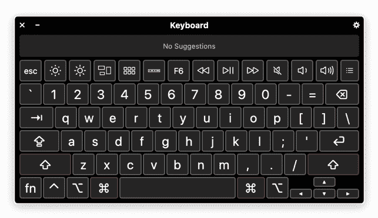

Your keyboard's basic configuration.

### 步骤 3:按下选项键

现在，如果您按住 Options 键，它会显示所有这些键还能做什么，就像这样:

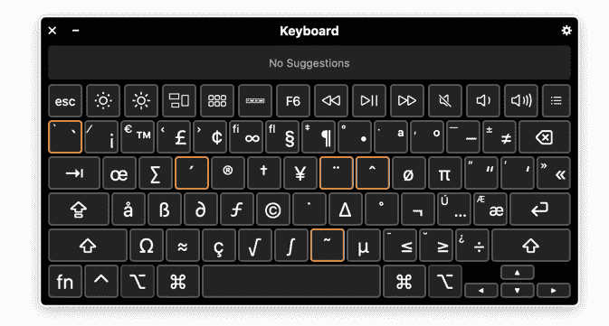

So many options...

你可以看到上面用橙色突出显示的最常见的重音符号。这些键在与 Option 键组合时，会给你那些重音符号(正如你在上面学到的)。

你还会看到各种其他有用的符号，比如货币符号、数学符号等等。因此，如果你需要一个快速的提示，比如当你需要写希腊字母(miu)时该按什么键，就参考这个图表。

## 如何使用国际键盘在 Windows 上添加重音

如果您想要使用快捷键来包含重音和特殊字符，而不切换到完全不同的键盘布局，您可以启用国际键盘。

首先，按 Windows 键，键入“语言”，然后单击“语言设置”打开语言菜单:

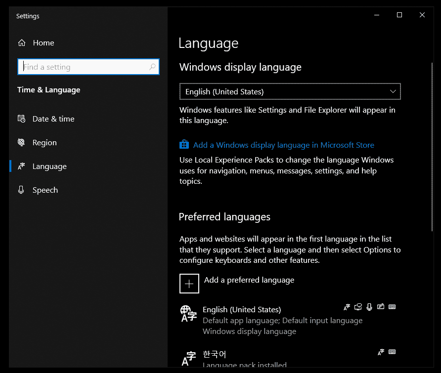

The Windows 10 language menu.

然后在“首选语言”下，单击“英语”和“选项”打开语言选项菜单:

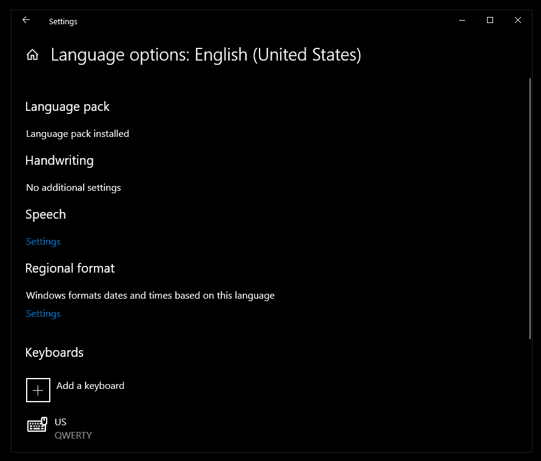

The Windows 10 English Language Options menu.

在“键盘”下，单击“添加键盘”按钮，然后单击“美国-国际”，将国际键盘添加到您的系统中。

要启用国际键盘，请将鼠标移至任务栏，单击“美国工程师”，然后单击“国际工程师”:

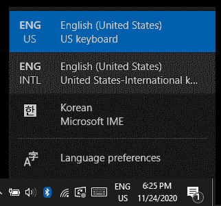

Use the keyboard select menu in the taskbar to enable the international keyboard.

或者，按住 Windows 键并按 Space 键来循环显示已安装的键盘布局。

普通美国键盘布局和国际键盘布局之间的主要区别在于，有些键就像一种“重音字符锁”。

例如，要在启用国际键盘的情况下键入单个撇号(')，只需键入'+空格。对于双引号，只需键入“+空格。对于`+空格，反勾号也是如此。

解决了这个问题，下面是如何使用 Windows 10 国际键盘键入一些常见的口音:

*   `+字母=重音符à、è、ì、或(像这样:瞧)
*   ^ +字母=扬抑音符β、ê、θ、θ或θ(像这样:Crêpe)
*   ~ + letter = e 字符ⅰ、γ或γ(如:厄尔尼诺)
*   "+ letter =元音变调重音,,或，或(像这样:或)
*   右 Alt+ w 或 Shift +右 Alt + W(大写 A) =或
*   右 Alt + z 或 Shift +右 Alt+Z =℃或℃(连字 ae)
*   右 Alt +
*   右 Alt + l 或 Shift +右 Alt + L(大写)=或
*   右 Alt +？=
*   右 Alt + 1 =

但是您可能已经注意到，在国际键盘上没有输入“、”或“∞”的快捷键。

为此，让我们快速了解一下在 Windows 10 上键入重音、特殊字符和符号的另一种方法。

## 如何使用表情面板在 Windows 上添加重音

表情符号面板可以轻松滚动所有可用的表情符号，并为消息添加一个表情符号。但是你也可以使用表情面板快速添加重音符号或特殊字符。

使用快捷键 Windows 键+。要打开表情面板:

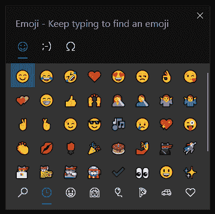

The Windows 10 emoji panel.

若要添加重音符号或特殊字符，请按顶部的符号按钮:

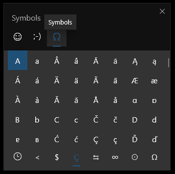

The Windows 10 emoji panel's Symbol options.

然后滚动菜单，点击您想要的重音符号或字符:

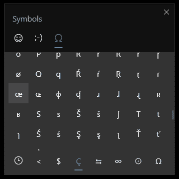

Selecting the œ character in the Windows 10 emoji picker.

此外，您可以点击底部不同类型符号的不同菜单。例如,∞位于“数学符号”部分:

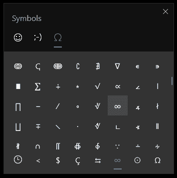

Selecting the ∞ character in the Windows 10 emoji picker.

这应该是你在 Mac 和 Windows 上输入重音和其他特殊字符所需要知道的一切。阿迪奥斯！