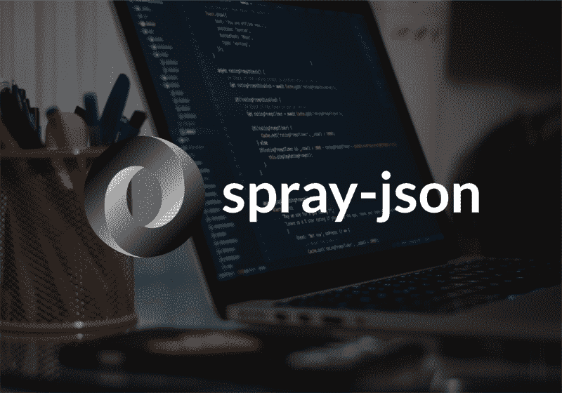
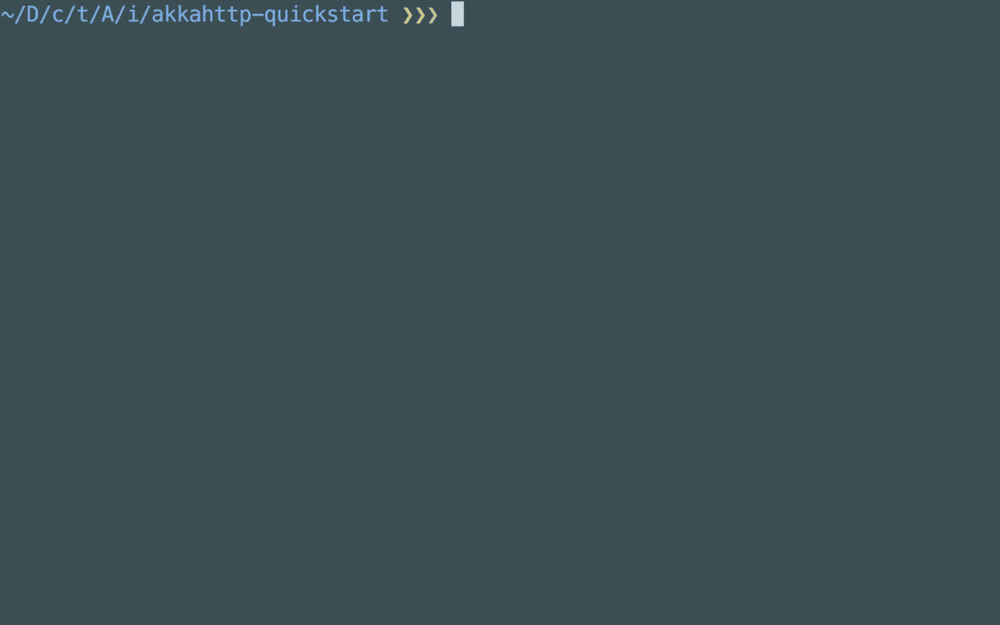
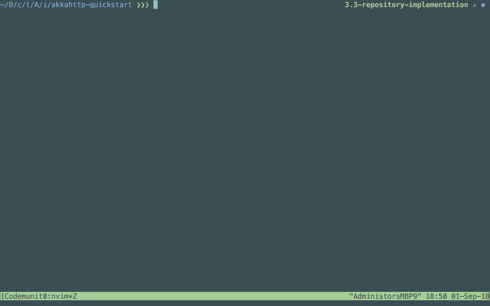
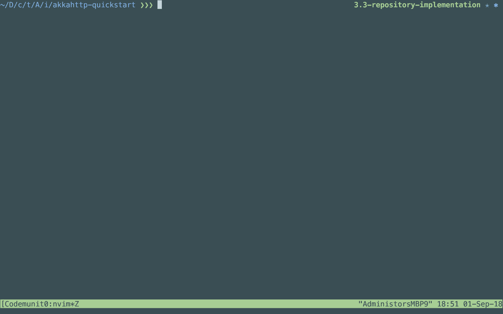
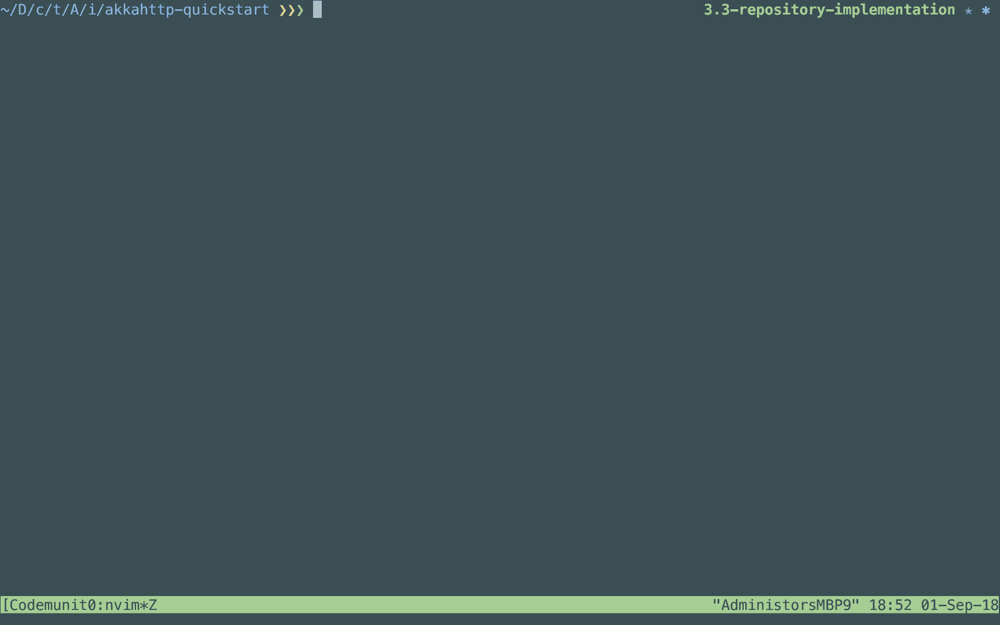

# 如何用 spray-json 在 Akka HTTP 中封送 JSON

> 原文：<https://www.freecodecamp.org/news/how-to-un-marshal-json-in-akka-http-with-spray-json-1407876373a7/>

米格尔·洛佩兹

# 如何用 spray-json 在 Akka HTTP 中封送 JSON



在[之前的文章](https://www.codemunity.io/tutorials/akka-http-json-circe)中，我们使用 circe 为我们的 Akka HTTP API 添加了 JSON 支持。

这一次我们将做同样的事情，但是使用 spray-json。Akka HTTP 通过提供官方库来支持它——我们不需要像 circe 那样的第三方库。

### 项目设置

我们将按照与上一教程相同的步骤来设置项目。

克隆[回购](https://github.com/Codemunity/akkahttp-quickstart)，检查分支`3.3-repository-implementation`。

我们还将做我们在上一个教程中所做的更改。

首先，我们将把 circe 依赖项替换为 spray-json 依赖项，因为在本教程中我们不需要它。用以下内容更新`build.sbt`文件:

```
name := "akkahttp-quickstart"version := "0.1"scalaVersion := "2.12.6"val akkaVersion = "2.5.13"val akkaHttpVersion = "10.1.3"libraryDependencies ++= Seq(  "com.typesafe.akka" %% "akka-actor" % akkaVersion,  "com.typesafe.akka" %% "akka-testkit" % akkaVersion % Test,  "com.typesafe.akka" %% "akka-stream" % akkaVersion,  "com.typesafe.akka" %% "akka-stream-testkit" % akkaVersion % Test,  "com.typesafe.akka" %% "akka-http" % akkaHttpVersion,  "com.typesafe.akka" %% "akka-http-testkit" % akkaHttpVersion % Test,  "com.typesafe.akka" %% "akka-http-spray-json" % akkaHttpVersion,  "org.scalatest" %% "scalatest" % "3.0.5" % Test)
```

接下来，我们将向`TodoRepository`添加一个`save`函数及其实现:

```
import scala.concurrent.{ExecutionContext, Future}trait TodoRepository {  def all(): Future[Seq[Todo]]  def done(): Future[Seq[Todo]]  def pending(): Future[Seq[Todo]]  def save(todo: Todo): Future[Todo]}class InMemoryTodoRepository(initialTodos: Seq[Todo] = Seq.empty)(implicit ec: ExecutionContext) extends TodoRepository {  private var todos: Vector[Todo] = initialTodos.toVector  override def all(): Future[Seq[Todo]] = Future.successful(todos)  override def done(): Future[Seq[Todo]] = Future.successful(todos.filter(_.done))  override def pending(): Future[Seq[Todo]] = Future.successful(todos.filterNot(_.done))  override def save(todo: Todo): Future[Todo] = Future.successful {    todos = todos :+ todo    todo  }}
```

这将允许我们创建一个 POST 请求来创建新的待办事项。

最后，更新`Main`对象以创建一个 todos 列表用于测试目的，并使用适当的路线:

```
import akka.actor.ActorSystemimport akka.http.scaladsl.Httpimport akka.stream.ActorMaterializerimport scala.concurrent.Awaitimport scala.util.{Failure, Success}object Main extends App {  val host = "0.0.0.0"  val port = 9000  implicit val system: ActorSystem = ActorSystem(name = "todoapi")  implicit val materializer: ActorMaterializer = ActorMaterializer()  import system.dispatcher  val todos = Seq(    Todo("1", "Record amazing gifs for the tutorials", "", done = false),    Todo("2", "Finish the spray-json tutorial", "", done = true),  )  val todoRepository = new InMemoryTodoRepository(todos)  import akka.http.scaladsl.server.Directives._  def route = path("todos") {    get {      complete(todoRepository.all())    } ~ post {      entity(as[Todo]) { todo =>        complete(todoRepository.save(todo))      }    }  }  val binding = Http().bindAndHandle(route, host, port)  binding.onComplete {    case Success(_) => println("Success!")    case Failure(error) => println(s"Failed: ${error.getMessage}")  }  import scala.concurrent.duration._  Await.result(binding, 3.seconds)}
```

有了这些，我们现在可以开始支持 JSON 解析了。

### 创建格式

这个项目现在不应该被编译，因为 Akka HTTP 不知道如何将 JSON 转换成我们的模型，反之亦然。

用 circe 添加 JSON 支持非常简单。它只涉及添加几个导入语句。

遗憾的是，对于 spray-json，情况并非如此。努力也没那么大。

那么，我们开始吧。

因为我们想在 Akka HTTP 中使用 spray-json，所以我们可以看看 [Akka HTTP 的官方文档](https://doc.akka.io/docs/akka-http/current/common/json-support.html)来了解如何完成我们想要的。

我们需要扩展 trait `SprayJsonSupport`来让 Akka HTTP 知道如何从 JSON 解析我们的模型(通过 trait 提供的`FromEntityUnmarshaller`和`ToEntityMarshaller`)。

为了创建实际的*格式*，我们将使用 spray-json 的特征`DefaultJsonProtocol`。

在`Todo`模型下添加以下对象:

```
object TodoFormat extends SprayJsonSupport with DefaultJsonProtocol {  implicit val todoFormat = jsonFormat4(Todo)}
```

这是我们在使用 spray-json 时需要的额外步骤。我们的每一款车型都必须如此。

为了让我们的项目正常工作，我们需要在我们的`Main`对象中导入`TodoFormat`:

```
import TodoFormat._import akka.http.scaladsl.server.Directives._def route = path("todos") {  get {    complete(todoRepository.all())  } ~ post {    entity(as[Todo]) { todo =>      complete(todoRepository.save(todo))    }  }}
```

运行应用程序，它应该工作正常。

我们来做些测试吧！

### 测试我们的 API

我们需要确保我们的 API 按预期工作。因此，让我们像在上一教程中一样查询它，以检查功能是否相同。

向`localhost:9000/todos`发送一个 GET 请求应该会给我们最初的 todos:



太好了，那是一样的。

让我们看看发送无效的 JSON 是否会得到类似的结果:



确实如此。错误信息是不同的，但是我们得到了相同的`400 Bad Request`,这是重要的部分。

让我们用有效的 JSON 创建一个新的 todo:



最后，让我们再次查询 todos 以确保它已被保存:



我们走吧。我们有一个使用 spray-json 的工作应用程序。

很酷，不是吗？

### 包扎

尽管使用 spray-json 涉及一些额外的手工工作，但您不需要额外的第三方依赖来使它与 Akka HTTP 一起工作。

这实际上是一个偏好问题。

在未来，我们将探索如何用两者完成不同的用例来比较它们。敬请关注！

如果你喜欢这个教程，并且想学习如何为一个 todo 应用程序构建一个 API，请查看我们新的**免费**课程！？？？

[**Akka HTTP 快速入门**](http://link.codemunity.io/website-akka-http-quickstart)
[*在这个免费课程中学习如何用 Akka HTTP 创建 web 应用程序和 API！*link . codecommunity . io](http://link.codemunity.io/website-akka-http-quickstart)

最初发布于[www . code unity . io](https://www.codemunity.io/tutorials/akka-http-spray-json/)。