# 如何在 Instagram 上解锁某人

> 原文：<https://www.freecodecamp.org/news/how-to-unblock-someone-on-instagram/>

如果你使用 Instagram，你可能需要不时屏蔽某些账户。但是，如果事情发生了变化，您想要解除对某人的封锁，该怎么办呢？

在本文中，我将向您介绍使用 iPhone 和 Android 手机应用程序在 Instagram 上取消阻止某人的三种方法。

## 如何通过设置解锁 Instagram 上的某人

解除阻止的第一种方法是通过“设置”选项卡。以下是您需要遵循的步骤:

1.  登录 Instagram 应用程序。
2.  单击位于右下角的个人资料图标。

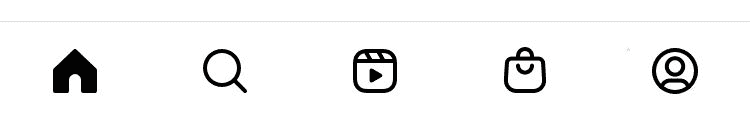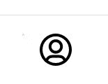

3.点击右上角的汉堡菜单。

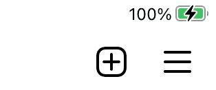

4.从选项下拉列表中单击设置。

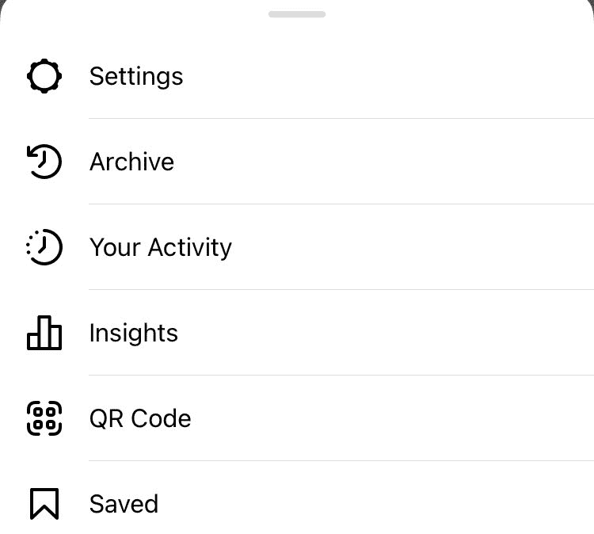

5.点击隐私。

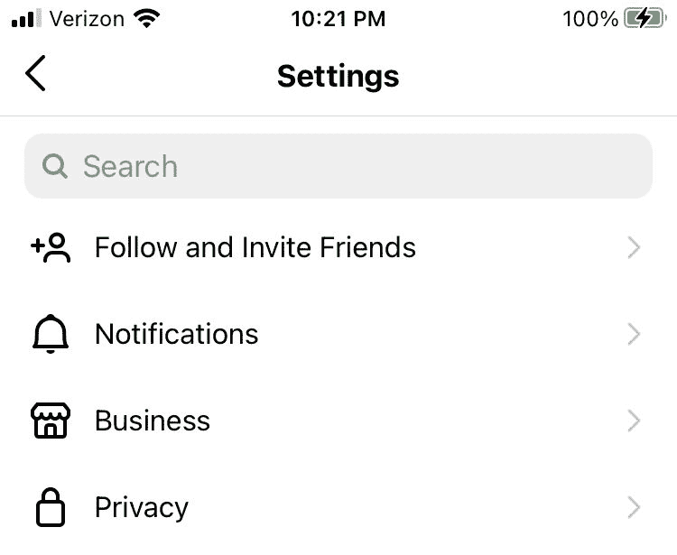

6.向下滚动并点击被封锁的帐户。

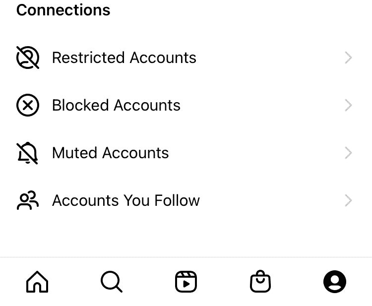

7.单击配置文件旁边的取消阻止。

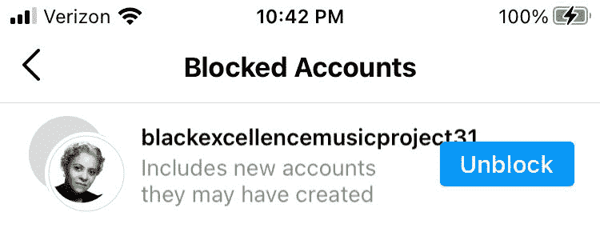

8.单击红色的解锁文本进行确认。

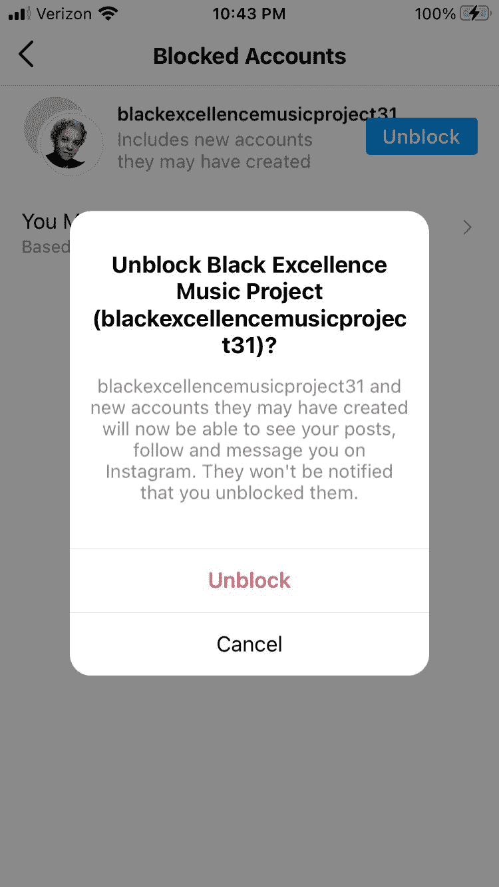

如果成功，您应该会看到以下消息:

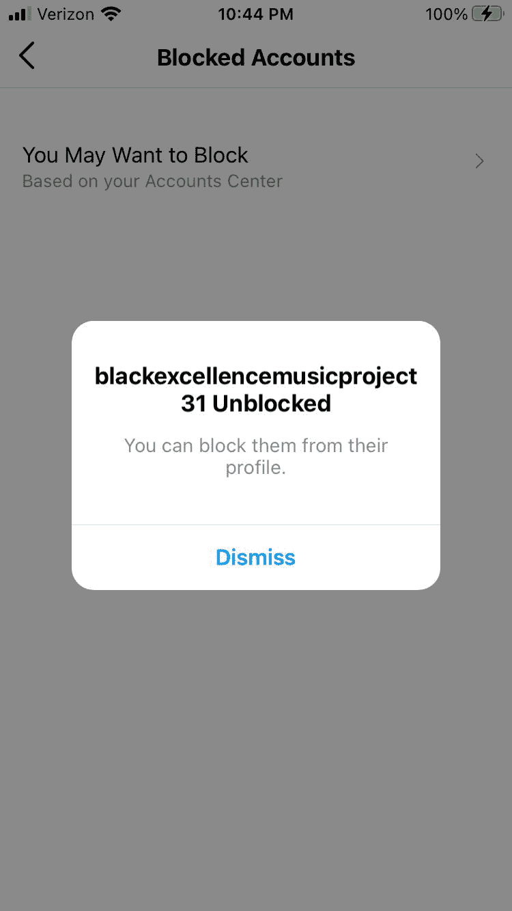

## 如何通过直接消息取消阻止 Instagram 上的某人

如果您已经通过直接消息与某人通信，您可以在那里解除对他们的阻止。

1.  点击位于屏幕右上角的消息图标。

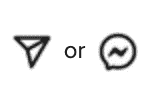

2.单击要取消阻止的配置文件。

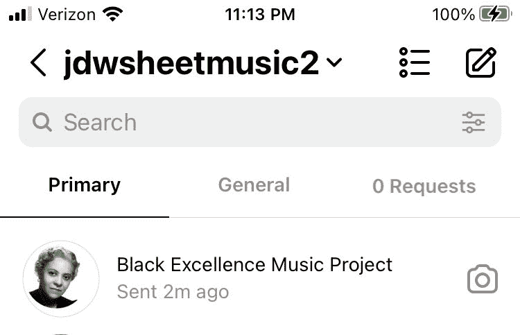

3.单击位于邮件主题底部的“解除阻止”。

4.点击红色解锁文本进行确认。

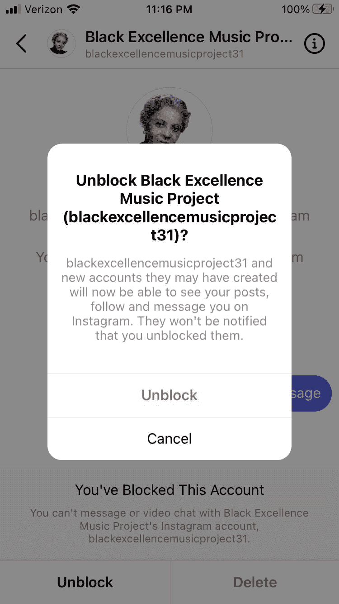

## 如何通过个人资料在 Instagram 上取消阻止某人

1.  转到您阻止的人的个人资料。
2.  点击他们个人资料中的解锁按钮。

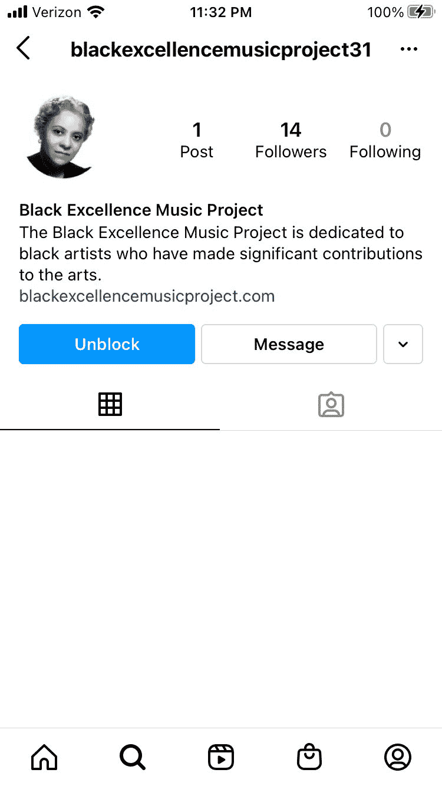

4.点击红色解锁文本进行确认。

### 比较选择方案

1.  在他们的个人资料上，你可以点击右上角的三个点。在 Android 上，这三个点可能是垂直的。

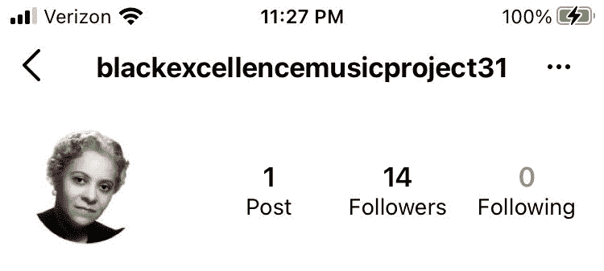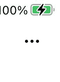

2.点击解锁。

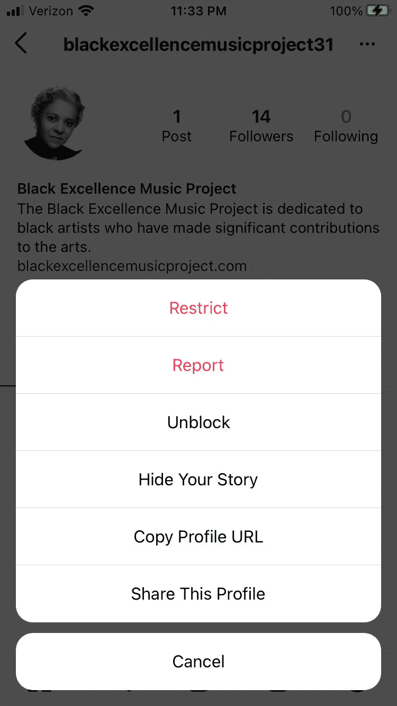

3.点击红色解锁文本进行确认。

这是你在 Instagram 上解锁某人的三种方式。