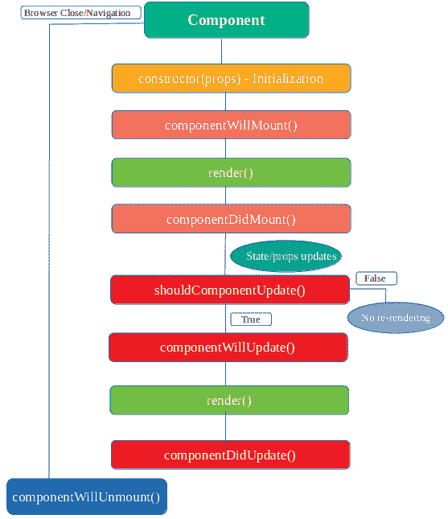

# 如何理解 ReactJS 中组件的生命周期方法

> 原文：<https://www.freecodecamp.org/news/how-to-understand-a-components-lifecycle-methods-in-reactjs-e1a609840630/>

在本文中，我们将探讨 ReactJS 的生命周期方法。但是，在继续研究 React 的不同生命周期方法之前，我们应该了解它是什么。

我们知道，这个世界上的一切都是遵循一个周期的(比如说人类或者树木)。我们出生，成长，然后死亡。几乎所有东西在其生命周期中都遵循这个循环，React 组件也是如此。组件被创建(安装在 DOM 上)，通过更新成长，然后消亡(在 DOM 上卸载)。这被称为组件生命周期。

在组件生命周期的不同阶段，React 提供了不同的生命周期方法。React 根据组件所处的阶段自动调用负责的方法。这些方法给了我们对组件更好的控制，我们可以使用这些方法操纵它们。

目前，我们知道什么是生命周期方法，以及它们为什么重要。那么这些不同的方法是什么呢？让我们来看看它们。

### 生命周期方法

组件的生命周期大致分为四个部分:

*   **初始化**
*   **安装**
*   **更新，和**
*   **卸载**。

让我们讨论在这些不同阶段(即初始化、安装、更新和卸载)可用的不同生命周期方法。

#### **初始化**

在这个阶段，组件将通过设置状态(见下文)和道具开始它的旅程。这通常是在构造函数方法内部完成的(见下文以更好地理解初始化阶段)。

```
class Initialize extends React.Component {
    constructor(props)
    {
    // Calling the constructor of
    // Parent Class React.Component
    super(props);
    // initialization process
    this.state = {
       date : new Date(),
       clickedStatus: false
     };
}
```

#### **安装**

这个名字不言自明。挂载是将 React 组件挂载到 DOM 上的阶段(即创建并插入到 DOM 中)。

这个阶段在初始化阶段完成后出现。在这个阶段，我们的组件第一次呈现。此阶段可用的方法有:

**1\. componentWillMount()**

这个方法在组件装载到 DOM 之前被调用，或者 render 方法被调用。在这个方法之后，组件被挂载。

注意:不应在此方法中使用 this.setstate 进行 API 调用或任何数据更改，因为它是在 render 方法之前调用的。因此，不能对 DOM 做任何事情(也就是用 API 响应更新数据)，因为它还没有被挂载。因此，我们不能用 API 响应来更新状态。

**2。componentidmount()**

这个方法在组件挂载到 DOM 上之后被调用。像 componentWillMount 一样，它在一个生命周期中被调用一次。在执行这个方法之前，会调用 render 方法(也就是说，我们可以访问 DOM)。我们可以进行 API 调用，并用 API 响应更新状态。

看一看了解这些安装方法:

```
class LifeCycle extends React.Component {
  componentWillMount() {
      console.log('Component will mount!')
   }
  componentDidMount() {
      console.log('Component did mount!')
      this.getList();
   }
  getList=()=>{
   /*** method to make api call***
  }
  render() {
      return (
         <div>
            <h3>Hello mounting methods!</h3>
         </div>
      );
   }
}
```

#### **更新**

这是组件经过的第三个阶段。在创建了组件的挂载阶段之后，更新阶段就开始了。这是组件状态改变的地方，因此，重新渲染发生。

在这个阶段，组件(state & props)的数据会更新，以响应用户事件，如单击、键入等。这将导致组件的重新呈现。此阶段可用的方法有:

1.  **shouldcomponentdupdate()**

此方法确定组件是否应该更新。默认情况下，它返回 true。但是在某些时候，如果你想在某些条件下重新呈现组件，那么 shouldComponentUpdate 方法是合适的地方。

例如，假设您只想在属性发生变化时重新渲染组件，那么就利用这种方法的强大功能。它接收像 nextProps 和 nextState 这样的参数，通过与当前的 prop 值进行比较来帮助我们决定是否重新渲染。

**2。componentWillUpdate()**

和其他方法一样，它的名字也是不言自明的。它在组件重新呈现之前被调用。在' **shouldComponentUpdate** '方法之后调用一次。如果您想在重新渲染组件之前和更新状态和属性之后执行一些计算，那么这是最好的地方。与“shouldComponentUpdate”方法一样，它也接收 nextProps 和 nextState 之类的参数。

**3。ComponentDidUpdate()**

该方法在组件重新呈现后立即被调用。在新的(更新的)组件在 DOM 上更新后，执行' **componentDidUpdate** '方法。此方法接收 prevProps 和 prevState 之类的参数。

看一看，更好地了解更新方法:

```
class LifeCycle extends React.Component {
      constructor(props)
      {
        super(props);
         this.state = {
           date : new Date(),
           clickedStatus: false,
           list:[]
         };
      }
      componentWillMount() {
          console.log('Component will mount!')
       }
      componentDidMount() {
          console.log('Component did mount!')
          this.getList();
       }
      getList=()=>{
       /*** method to make api call***
       fetch('https://api.mydomain.com')
          .then(response => response.json())
          .then(data => this.setState({ list:data }));
      }
       shouldComponentUpdate(nextProps, nextState){
         return this.state.list!==nextState.list
        }
       componentWillUpdate(nextProps, nextState) {
          console.log('Component will update!');
       }
       componentDidUpdate(prevProps, prevState) {
          console.log('Component did update!')
       }
      render() {
          return (
             <div>
                <h3>Hello Mounting Lifecycle Methods!</h3>
             </div>
          );
       }
}
```

#### **卸载**

这是组件生命周期的最后一个阶段。顾名思义，组件在这个阶段从 DOM 中卸载。此阶段可用的方法是:

**1\. componentWillUnmount()**

在卸载组件之前调用此方法。在从 DOM 中删除组件之前，将执行' **componentWillUnMount'** 。这个方法表示组件生命周期的结束。

下面是生命周期方法的流程图表示:



这就是 React 世界的重要部分——生命周期方法。我希望你喜欢读它。

谢谢！