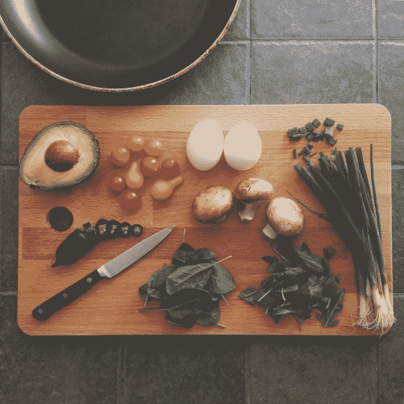
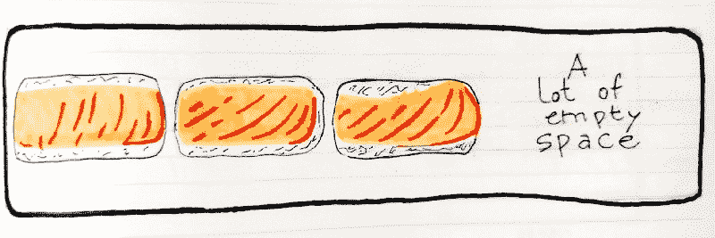
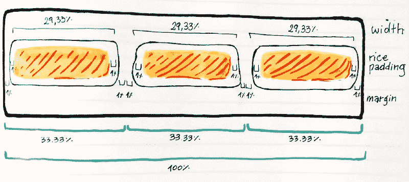

# 如何用两个简单的寿司布局食谱理解 CSS 浮动

> 原文：<https://www.freecodecamp.org/news/how-to-understand-css-floats-with-two-simple-sushi-layout-recipes-dded925706b9/>

安娜贝拉·斯皮内利

# 如何用两个简单的寿司布局食谱理解 CSS 浮动

Photo by [Katie Smith](https://unsplash.com/photos/uQs1802D0CQ?utm_source=unsplash&utm_medium=referral&utm_content=creditCopyText) on [Unsplash](https://unsplash.com/?utm_source=unsplash&utm_medium=referral&utm_content=creditCopyText)

几周前，我决定我应该承认我从来没有理解过的关于 CSS 的事情。我会试着有意识地深入了解它们，并抓住它们。似乎现在，在第一次学习 CSS 几年后，我可以利用我收集的所有经验。这一次应该会更容易，更清晰。

我也对自己说:*我不可能是唯一一个第 n 次(或第一次)与这些属性斗争的人。记录我对最难以捉摸的 CSS 属性的探索之旅将会是一大堆其他人可以利用的文章。*

上个月，我以[介绍职位属性](https://medium.freecodecamp.org/an-intro-to-the-mysterious-pairings-of-css-position-flavors-92b3625176ea)的神秘配对开始了这篇文章。这是我旅程的第二站:

烹饪食谱形式的`float`属性。

#### 食谱索引

*   **寿司排** —使元素以均匀的方式覆盖一整排
*   **清除肉汤** —使浮子下的内容正常动作

### 寿司排？

我们将使用浮点和百分比值在整个(容器)宽度上均匀分布元素。就像盘子里的寿司一样。

#### 成分:

*   1 个容器或板
*   一些你需要并排分发的寿司。
*   `%`标志
*   1 **`float: left;`**

#### 说明:

准备好你的寿司件，也就是你要排成一排展示的元素。他们可以是 makis，项目卡，nigiris，图标，任何适合你的口味。

您还可以添加任何非定位样式:颜色、文本对齐、字体、酱油。

把它们放在一个像木板一样的 T2 容器里。在其最基本的形式中，这应该是一个 div(但是您可以使用任何其他 HTML5 语义元素，例如 header、footer、section、article、main)。为它们添加一个描述类。我将使用`nigiri`。

现在，在类`nigiri`上，我们将应用一些样式，包括我们的`**float: left;**`。花点时间通读它们:

`**float: left;**`所做的是告诉每个元素贴在一边——在这个例子中是左边——并且从左到右排成一排。

请注意，我们正在将`height`添加到板上。通常我们不需要这个:板子会扩展以适应里面的任何东西。但是浮动元素，比如我们的 nigiris，就不一样了。它们不会占用真正的文档空间，也不会影响其他非浮动元素。这就是为什么我们使用一个固定的，像素大小的高度。

现在，您应该在一行中看到所有的元素。但是有些事情不太对劲。它们都堆积在左边，你的棋盘右边可能有很多空位。

我们需要让它们均匀分布。

我们可以通过使用百分比值将 nigiri 的宽度设置为相对于其容器(在本例中为棋盘)的宽度来实现。

现在这是棘手的部分:你需要设置的百分比将取决于三件事

*   你有多少件物品
*   它们的内部结构(填充)
*   以及它们之间需要多大的空间。

你希望它们并排贴在一起，还是它们之间需要一些间隔？如果寿司块有*米饭**填料*** **，**会导致它们比其内容物大。你必须通过减少它们的宽度来补偿。为此，建议在填充值中使用%。

我知道这可能会让人困惑。这里有一个手工制作的单按插画，希望能说明清楚。

Each nigiri is 33.33% of the board’s full width: 2% for margin on each side, 2% for padding on each side and then 29.33% of their actual width.

但这是食谱，不是数学课。亲爱的读者，为了让你更容易理解，这里有一些肩并肩和空白元素的常见组合，都有 1%的大米填充:

您可能已经注意到了这里的模式:我们假设元素带有 1%的**填充**。他们需要通过从元素的百分比宽度中减去 2%(每边 1%)来进行补偿。我们 1%的**利润**也是如此。现在，对于一行中的 3 个元素，不使用 33.33%的宽度更有意义。取而代之的是，在每张纸上留出 2%的空白和 2%的边距后，将其设置为 29.33%。

唉…那是一大堆数学问题*。*好了，现在，不管你的寿司卷被切了多少块，你都知道如何把它们很好地放在纸板上。

如果你想试试这个设置，这里有一个专门为此制作的码笔。

如果你喜欢 CSS 寿司，不要错过 Sasha Tran 非常鼓舞人心的 [CSS 寿司委员会](https://codepen.io/sashatran/pen/bgZVdm)。

### 清汤？

完美的汤，配上漂浮的寿司，同时确保你的食物不会在里面游泳。

#### 成分:

*   一个装有漂浮寿司的容器或板
*   接下来是汤或肉汤。
*   一个 **`clear: broth;`**

#### 说明:

一旦你准备好一排漂浮的寿司，把你的汤容器放在它们下面。

我们的寿司旨在优雅地浮在文档流的“上方”,而不影响其他元素。如果我们不小心的话，它们可能最终会漂浮在汤里，而寿司拉面不是这个世界已经准备好要吃的东西。

记住浮动元素没有真正的文档高度。这也意味着他们不会把汤“推”下去。现在看看这可怕的混乱:

为了防止这种暴行，我们需要加上我们的`clear: broth;` …我是说`**both**;`！

我们有两个选择:

我们可以简单地把汤放在碗里或容器里，给碗一个`clear: both;`的风格。这在某种程度上可以完成工作，*但是*会导致像`**margin-top**`这样的东西在碗上根本不起作用。

所以，如果我们想让寿司完全不受汤水的影响，并且不失去任何特色，我们需要把它们放在一个边缘很高的盘子里。为了实现这一点，我们将在寿司盘中添加一个`**:after**` *伪元素*(也就是我们的小浮动器的容器):

下面还有一个例子供你参考。我已经使用高度和背景色使盘子可见。尽管这对于汤的摆放来说并不是必要的，但这只会让汤看起来更美味？

你可以把这想象成让寿司有一堵很高的南墙，以防止汤涌入。但是……像……一面漂亮的墙。

好的，我非常高兴你能做到这一步，我希望这本小小的食谱能帮助你更好地了解浮动是如何工作的……以及我们如何使用浮动。请继续关注更深入的基本但难以捉摸的东西，比如这个？