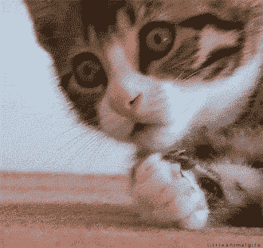
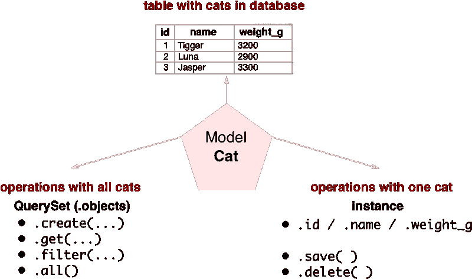
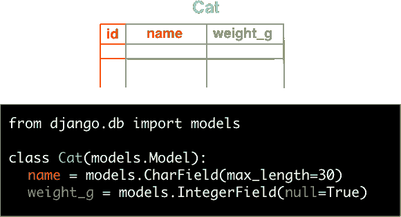
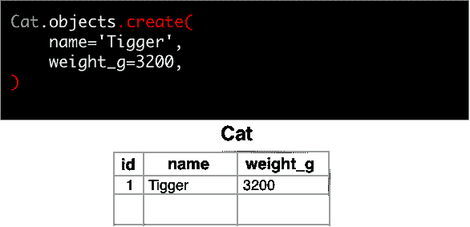
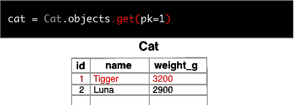
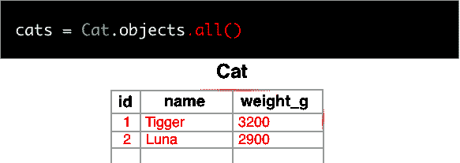
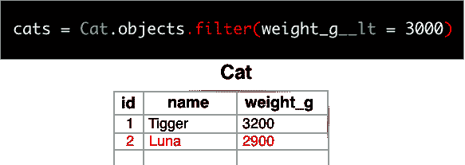
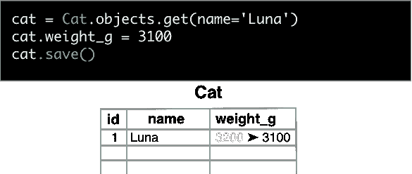
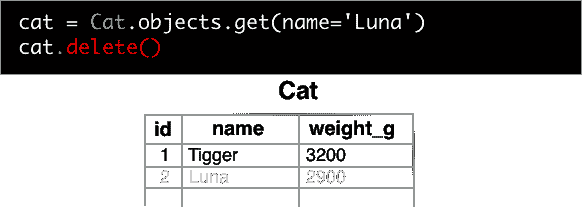

# 如何简单地理解 Django 模型

> 原文：<https://www.freecodecamp.org/news/how-to-understand-django-models-the-simple-way-20c39d234870/>

由蒂姆

# 如何简单地理解 Django 模型

你有没有尝试过通过查阅 Django Docs 来学习模型？你是带着答案离开的，还是带着更多的问题？

就我个人而言，我开始怀疑编程是否真的适合我。

我写这篇文章是为了帮助您理解 Django 模型，以便您可以使用它们执行基本操作。模型是处理数据的绝佳方式。

假设我们想跟踪我们神奇的猫。我们可以创建一个`Cat`模型——但是到底什么是模型呢？

事实证明，模型是三合一的:

现在，让我们走过每一个街区。

### 数据库中有猫的表

我们创建了一个名为`Cat`的类。

当我们添加列时，我们必须告诉 Django 每个列中将包含哪种数据。它可以是字符串、数字或布尔值等。

在这种情况下，猫的名字应该在文本中——这是 Django 中的一个`CharField`。不要忘记设置这个字段的最大长度，因为数据库需要知道它。以克为单位的猫的重量是一个整数，所以我们使用一个`IntegerField`。注意:`id`列是自动生成的。

最后，`null`允许将一列留空。例如，我们可能不知道重量。注意，任何字段都可以标记为`null`。

最后，我们将把更改(比如创建一个模型或添加一列)传播到数据库模式中。为此，我们使用`python manage.py makemigrations`和`python manage.py migrate`。每当你在模型中改变一些东西时，这样做是很重要的。

现在我们有一张桌子，但是里面什么也没有。让我们解决这个问题。

### 所有猫的手术

#### 创建条目

`create()`函数帮助我们创建一些行。我们只需要把所有可爱的细节传递进去。

#### 找到一个特别的

如果你想获得猫的 FBI 文件——喵-x 对不起，我指的是猫的信息——只需使用带有一个猫参数的`get()`函数。在这个例子中，我使用了`pk`，它的意思是“主键”通常，这与使用`id`是一样的。

`get()`将查找与参数匹配的所有行，并将只返回第一行。

#### 找到所有记录

最重要的是，您可以使用`all()`函数从数据库中访问所有的猫。

#### 过滤掉

还是需要比 3000g 轻的猫？

一个名为`filter`的函数已经准备好帮助你了。

我们将`field__lookuptype = 'value'`传递给它以过滤掉猫。

在本例中，`lt`表示“小于”所以`weight_g__lt=3000`的意思是“体重小于 3000 克。”

### 一只猫的操作

#### 更新

上次我们称露娜的体重，她是 3200 克。但是现在她的体重是 3100g。这很容易改变。

我们只要按名字从数据库里得到露娜，然后把她的体重改成 3100。就这么简单。只有一件事——我们换完衣服后必须打电话给`.save()`。

#### 删除，就像，永远

我们可以删除我们的一只猫。我们得到猫并调用`.delete()`函数。

很难过。但这就是生活。

你喜欢这篇文章吗？请给我一些掌声，让更多的人看到它。谢谢！

这篇文章最初发表在我的博客上。

[在原帖末尾订阅](https://arevej.me/django-models/)把我的新文章收进你的收件箱，一起学习 Django。