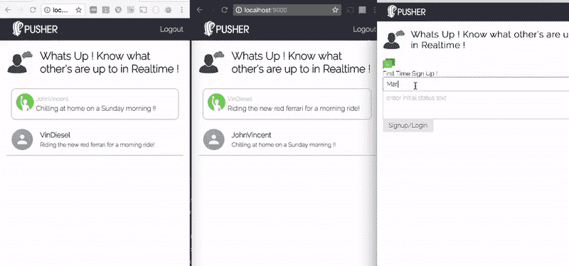
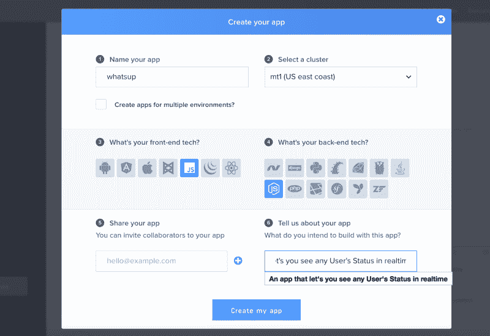
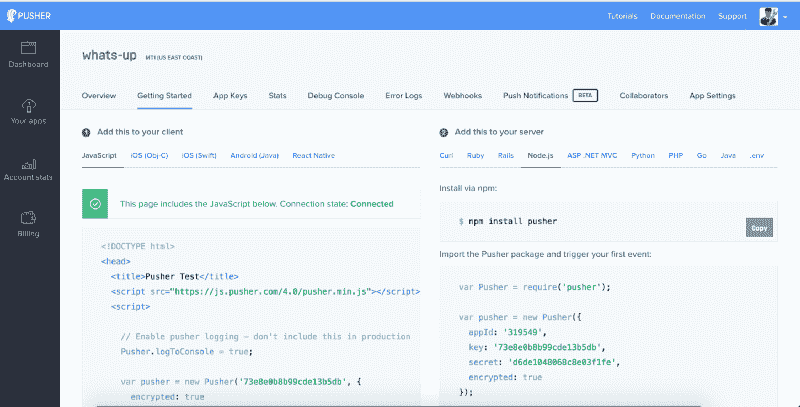
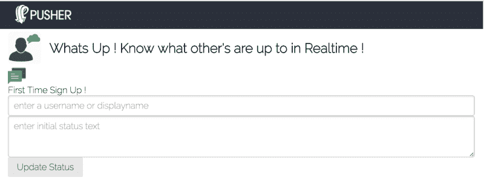

# 如何使用 JavaScript 和 Pusher 实时更新用户状态

> 原文：<https://www.freecodecamp.org/news/how-to-update-a-users-status-in-realtime-using-javascript-and-pusher-2cae8f4aaafa/>

作者拉哈特·卡纳

# 如何使用 JavaScript 和 Pusher 实时更新用户状态


Photo by [Karolina Szczur](https://unsplash.com/photos/avMrNpjvnoM?utm_source=unsplash&utm_medium=referral&utm_content=creditCopyText) on [Unsplash](https://unsplash.com/search/photos/hello?utm_source=unsplash&utm_medium=referral&utm_content=creditCopyText)

“嘿，怎么了？”这年头我们不需要问别人这句话。这些天来，知道某人在做什么变得如此容易，因为我们在 WhatsApp、Snapchat、脸书等网站上不断看到我们所有朋友的更新状态。

在本文中，我们将了解如何在实时组件中更新用户的状态以及所有在线成员的列表。

我们将使用 [Node.js](https://nodejs.org/en/) 作为应用服务器，前端使用普通 JavaScript，服务器和前端之间使用 [Pusher](https://pusher.com/) 进行实时通信。

我们将建立一个应用程序，就像你的朋友列表或一个公共聊天室，在那里你可以看到谁在线，他们的最新状态实时更新。我们将了解 Pusher 的 **presence** 频道，以及如何通过该频道了解在线会员。



在这篇博文中，我们将构建以下组件:

使用 Express.js 框架的 Node.js 服务器:

*   **/register** API —通过创建新用户的会话并保存其信息，将新用户注册/登录到我们的频道和服务器
*   **/isLoggedIn** API —在刷新浏览器时检查用户是否已经登录
*   **/user system/Auth**API——推送者在向我们的应用程序注册并订阅在线状态或私人频道后进行的身份验证
*   **/logout** API —注销用户并删除会话

使用 JavaScript 的前端应用程序:

*   注册/登录表单—通过填写用户名和初始状态来注册/登录新用户
*   成员列表—查看在线的每个人及其更新的状态
*   更新状态—单击现有状态，并在状态文本编辑控件模糊时更新它

在这里找到[链接](https://github.com/mappmechanic/whats-up-realtime-status-update)到 Github 库以供参考。

### 推杆简介

Pusher 是一个平台，它抽象了我们自己使用 WebSockets 或长轮询实现实时系统的复杂性。我们可以使用 Pusher 立即将实时特性添加到我们现有的 web 应用程序中，因为它支持各种各样的软件开发工具包(SDK)。

集成工具包可用于各种前端库，如 Backbone、React、Angular 和 jQuery，也可用于后端平台/语言，如。NET，Java，Python，Ruby，PHP，还有 GO。

### 与 Pusher 签约

您可以在 Pusher [这里](http://pusher.com/signup)创建一个免费账户。注册并首次登录后，您将被要求创建一个新的应用程序，如下图所示。你将不得不填写一些关于你的项目的信息，并且提供你将用来构建你的应用的前端库或者后端语言。



对于这篇文章，我们将选择 JavaScript 作为前端，Node.js 作为后端，如上图所示。

这只会向您显示这些选择的一组入门示例代码，但是您可以在以后使用任何集成工具包来使用这个应用程序。



### Node.js 服务器

作为该项目的先决条件，Node.js 应该安装在系统中。现在让我们开始使用 Express 构建 Node.js 服务器和所有需要的 API。通过以下命令初始化新的节点项目:

```
npm init
```

### 安装依赖项

我们将通过以下命令安装所需的依赖项，如 Express、express-session、Pusher、body-parser、cookie-parser:

### 基础服务器

我们现在将为 Node.js 服务器创建基础，并使用`express-session`模块在其中启用会话。

在上面的代码中，我们创建了一个基本的 Express 服务器，并使用方法`.use`启用了 cookie-parser、body-parser 和一个来自`**public**`文件夹的静态文件服务。我们还使用`express-session`模块启用了会话。这将使我们能够在适当的用户请求会话中保存用户信息。

### 添加推动器

Pusher 有一个用于 Node.js 集成的开源 npm 模块，我们将使用它。它提供了一套使用独特的`appId`、`key`和`secret`与 Pusher APIs 集成的实用方法。我们将首先使用以下命令安装推杆`npm`模块:

```
npm install pusher --save
```

现在，我们可以使用`require`来获取`Pusher`模块，并创建一个新的实例，传递一个带有重要键的 options 对象来初始化我们的集成。对于本文，我选择了随机键——您必须从 Pusher 仪表盘为您的应用程序获取它们。

你必须用你自己的应用特有的值来替换`appId`、`key`和`secret` 。在此之后，我们将为一个新的 API 编写代码，该 API 将用于创建一个新的注释。

### 注册/登录 API

现在，我们将开发我们的应用程序的第一个 API 路径，新用户可以通过它注册/登录，并在我们的应用程序上可用。

在上面的代码中，我们在路由`/register` 上公开了一个`POST` API 调用，它期望在请求体中传递`username`和`status`参数。我们将把这个用户信息保存在`request session`中。

### 用户系统验证 API

为了使任何客户端能够订阅推送器`**Private**`和`**Presence**` 通道，我们需要实现一个`auth` API，它将通过在服务器端调用`**Pusher.authenticate**`方法来验证用户请求。在服务器中添加以下代码，以满足这一条件:

我们需要在 Pusher 客户端库的初始化中提供具体的路由，我们将在后面看到。Pusher 客户端库将自动调用这个路由，并传入`channel_name`和`socket_id` 属性。我们将同时从用户会话对象中获取用户信息，并将其作为`presenceData`传递给`Pusher.authenticate`方法调用。

### is 登录和注销 API

如果用户刷新浏览器，客户端应用程序应该检测用户是否已经注册。我们将为此实现一个`isLoggedIn` API 路由。此外，我们需要一个`logout`路由，使任何用户都能从应用程序中注销。

### 使用普通 JavaScript 的前端应用程序

我们现在将开发前端应用程序，以注册一个初始状态的新用户，并查看在线成员及其状态。我们还将为登录用户构建更新其用户的功能，所有其他用户将实时看到更新的状态。

### 步骤 1:创建一个名为 public 的文件夹，并创建一个 index.html 文件

我们已经在我们的`server.js`中编写了代码来提供来自`public`文件夹的静态内容，所以我们将在这个文件夹中编写我们所有的前端代码。

请创建一个新文件夹`public`并创建一个空的`index.html` 文件。

### 步骤 2:向我们的 index.html 添加样板代码

我们将添加一些基本的样板代码来为我们的 web 应用程序建立基础结构，比如可以放置注册表单和成员列表的`Header`和`Sections`。

在上面的样板代码中，我们引用了我们的主 JavaScript 文件`app.js`和 Pusher 客户端 JavaScript 库。我们还有一个脚本标记，我们将在其中放置成员列表中成员行的模板。此外，我们有两个 id 为`**me**`和`**membersList**` 的空 div 标签来包含登录的成员名称和信息，以及所有其他成员及其状态的列表。

### 第三步:Style.css

请注意，我们将首次显示注册表单，默认情况下，`MembersList`和`Logout`按钮将被隐藏。请创建一个名为`**style.css**`的新文件，并将以下 CSS 添加到其中:

请尝试在您的浏览器中打开 URL[**http://localhost:9000**](http://localhost:9000/)，应用程序将加载带有用户名和状态的基本注册或登录表单。输出将类似于下面的屏幕截图:



### 步骤 4:添加 app.js 基本代码

现在，我们将添加 JavaScript 代码，在自调用函数中包含基本的实用程序元素，为应用程序变量创建私有范围。我们不想污染 JavaScript 的全球范围。

在上面的代码中，我们引用了所有我们需要的重要变量。我们还将使用`new Pusher`初始化 Pusher 库，并将 API 键作为第一个参数传递。第二个参数包含一个可选的 config 对象，我们将在其中添加带有自定义节点 API 路由 `/usersystem/auth` 的键`authEndpoint`，还将添加键 `**encrypted**` ，并将其设置为值`true`。

我们将创建几个通用函数来显示或隐藏传递唯一 id 的元素。我们还添加了一个名为`**ajax**`的公共方法，使用普通 JavaScript 中的 XMLHttp 对象发出 AJAX 请求。

在页面加载时，我们发出一个 AJAX 请求来检查用户是否登录。如果用户已经登录，我们将直接使用 Pusher 实例为用户订阅一个名为 `presence-whatsup-members`的存在通道。您可以将此作为您想要报告/跟踪在线成员的唯一聊天室或应用程序位置。

我们还使用 AJAX 请求在 Node.js 中构建的`register` API route 编写了一个方法到上面的`addNewMember`。我们将传递输入到表单中的名称和初始状态。

我们也有一个基于登录状态更新用户视图状态的方法。这个方法只更新成员列表、注销按钮和注册表单的可见性。当用户登录时，我们使用了一个`bindChannelEvents`方法，我们将在稍后的博客文章中实现它。

请在`**style.css**`文件中添加以下 CSS，以显示带有用户名和登录用户状态的`me`元素。

### 步骤 5:添加代码以呈现成员列表和 bindChannelEvents

现在，在订阅了通道之后，我们需要绑定某些事件，这样我们就可以知道何时有新成员被添加到通道或者从通道中删除。我们还将绑定到一个自定义事件，以了解何时有人更新他们的状态。

将以下代码添加到`**app.js**`文件中:

在上面的`bindChannelEvents`方法中，我们使用`channel.bind`方法为 3 个内部事件— `**usher:subscription_succeeded**`、`**pusher:member_added**`、`**pusher:member_removed**` 和 1 个自定义事件— `**client-status-update**`绑定事件处理程序。

现在我们将添加 JavaScript 代码来呈现成员列表。要知道我从`.subscribe`方法返回的对象有一个名为`members`的属性，可以用来知道`me`键引用的登录用户和`members`键引用的其他成员的信息。将以下代码添加到`**app.js**`文件中:

我们为新成员添加/删除事件添加了事件处理程序，以重新呈现成员列表，这样它就只更新在线成员。为了显示成员列表，我们需要将以下样式添加到我们的文件`**style.css**`中:

现在，我们将编写代码来触发通道上的客户端事件，以通知所有用户登录用户的状态变化。将以下代码添加到您的`**app.js**`文件中:

**重要提示**:当我们在浏览器中运行这段代码，更新状态，模糊状态控制时，我们会在 Pusher 库的 JavaScript 控制台中得到一个错误。要解决这个问题，请转到 Pusher.com 网站[的控制台，进入设置，并启用直接从客户端发送事件。](https://pusher.com)

我们只能直接为`Presence`或`Private` 通道发送来自客户端的事件。官方文档链接—[https://pusher . com/docs/client _ API _ guide/client _ events # trigger-events](https://pusher.com/docs/client_api_guide/client_events#trigger-events)

### 结论

我们已经构建了一个应用程序，它将显示特定`presence`频道的所有在线成员及其状态。如果任何在线用户更新他们的状态，每个用户都将被通知更新后的状态。

这个组件或代码可以用来开发当今大多数网络应用中的社交网络部分。这是一个重要的用例，用户需要知道其他可用的参与者。例如:在线课堂应用程序可以看到其他参与者，状态可以对应于任何参与者想问演示者的任何问题。


我们刚刚使用 Node.js 和普通 JavaScript 实现了上述功能。你可以将 JavaScript 用于任何流行的框架，如 [React](https://reactjs.org/) 或 [Angular](https://angular.io/) 。后端也可以是 [Java](https://java.com/en/) 或者 [Ruby](https://www.ruby-lang.org/en/) 。有关这方面的更多信息，请参考 Pusher 文档。

这篇博文最初发表在 [Pusher 的博客](https://blog.pusher.com/update-users-status-realtime-javascript/)上。