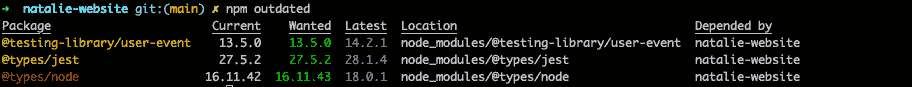
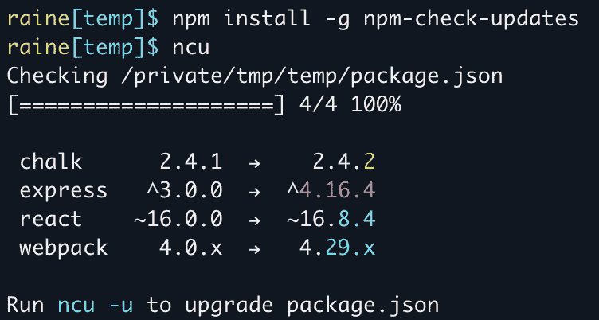
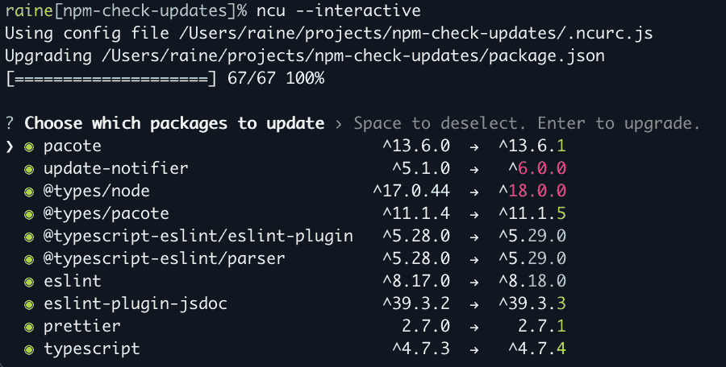
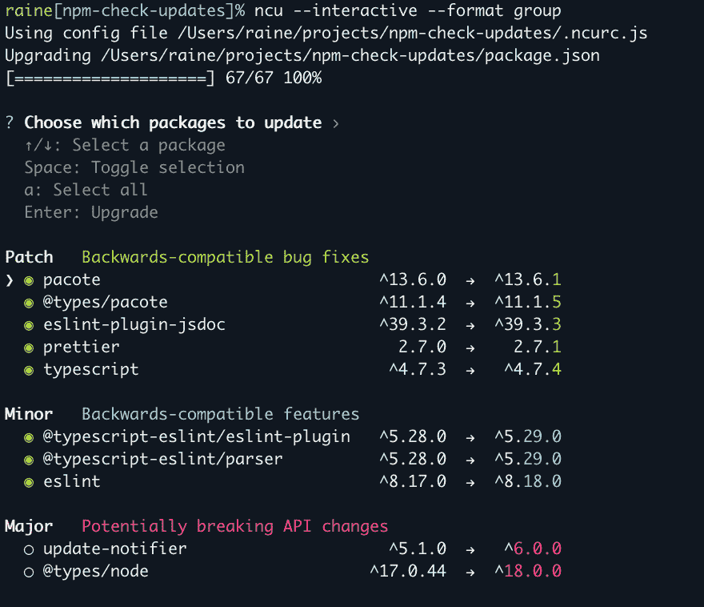

# 如何更新 NPM 相关性

> 原文：<https://www.freecodecamp.org/news/how-to-update-npm-dependencies/>

节点包管理器(npm)提供了各种功能来帮助您安装和维护项目的依赖项。

随着时间的推移，由于错误修复、新功能和其他更新，依赖关系可能会过时。您拥有的项目依赖性越多，就越难跟上这些更新。

过时的包会对安全性造成威胁，并对性能产生负面影响。最新的软件包可以防止漏洞。这意味着定期的依赖性检查和更新非常重要。

## 如何使依赖关系保持最新

现在，您可以逐个检查 package.json 中的每个单独的包来更改版本，并运行`npm install <package>@latest`来获得最新版本。但这不会是最有效的方法。

想象一下，如果您有 20 个或更多的软件包可以使用版本碰撞。相反，您应该开发一个工作流来定期检查新版本，以免过时的依赖项数量增加，升级变得越来越困难。

这里有一个工作流程帮助我保持在更新的顶端:首先，发现哪些包需要更新，版本落后多少。接下来，选择单独更新软件包或批量更新软件包。总是测试更新，以确保没有发生重大变化。

我更喜欢单独执行主要版本更新。随着重大更新，你可能会遇到突破性的变化。与多个包相比，撤销或处理与一个包相关的代码更改要容易得多。

在本文中，我将详细介绍检查和升级依赖项的方法。

## 如何使用`npm outdated`命令

```
npm outdated
```

该命令将检查每个已安装的依赖项，并将当前版本与 [npm 注册表](https://www.npmjs.com/)中的最新版本进行比较。它被打印到一个列出可用版本的表格中。

它内置于 npm 中，因此不需要下载额外的包。`npm outdated`是了解所需依赖项更新数量的良好起点。



*   当前是安装的当前版本。
*   想要的是根据[sever](https://docs.npmjs.com/misc/semver)范围的最大版本的包。
*   最新是在 npm 注册表中标记为最新的软件包版本。

使用这种方法，要为每个软件包安装更新，您只需运行:

```
npm update
```

请记住，在`npm update`中，它永远不会更新到一个重大突破性变化的版本。它更新 package.json 和 package-lock.json 中的依赖项。它将使用“想要的”版本。

要获得“最新”版本，请将`@latest`附加到单个安装中，例如`npm install react@latest`。

## 如何使用`npm-check-updates`

对于高级和可定制的升级体验，我推荐 [`npm-check-updates`](https://www.npmjs.com/package/npm-check-updates) 。这个包可以做所有`npm outdated`和`npm upgrade`可以做的事情，还增加了一些定制选项。但是，它确实需要安装软件包。

首先，全局安装 [`npm-check-updates`](https://www.npmjs.com/package/npm-check-updates) 软件包:

```
npm install -g npm-check-updates
```

然后，运行`ncu`来显示要升级的包。与`npm outdated`类似，它不会应用任何更改。

```
ncu
Checking package.json
[====================] 12/12 100%

 @testing-library/user-event    ^13.5.0  →  ^14.2.1
 @types/jest                    ^27.5.2  →  ^28.1.4
 @types/node                  ^16.11.42  →  ^18.0.1

Run ncu -u to upgrade package.json
```

要升级依赖项，您只需运行:

```
ncu --upgrade

// or 
ncu -u
```



Resource: [npm-check-updates](https://www.npmjs.com/package/npm-check-updates)

*   红色=主要
*   青色=次要
*   绿色=补丁

这将仅更新 package.json 文件中的依赖项，并将选择最新版本，即使它包含重大更改。使用这种方法，`npm install`不会自动运行，所以一定要在运行之后更新 package-lock.json。

要选择您喜欢的版本类型，请运行`ncu --target [patch, minor, latest, newest, greatest]`。

### 如何使用`npm-check-updates`的交互模式

```
ncu --interactive

// or 
ncu -i
```

交互模式允许您选择要更新的特定软件包。默认情况下，选择所有包。

向下浏览每个软件包，使用空格取消选择，并在准备好升级所有选定的软件包时输入。



Resource: [npm-check-updates](https://www.npmjs.com/package/npm-check-updates)

有几种方法可以提升互动体验。

```
ncu --interactive --format group
```

该命令将软件包分组和组织为主要版本、次要版本和修补程序版本。



Resource: [npm-check-updates](https://www.npmjs.com/package/npm-check-updates)

`npm-check-updates`提供其他有用的工具，如[医生模式](https://github.com/raineorshine/npm-check-updates#doctor-mode)，它安装升级并运行测试来检查重大变更。

我强烈建议总体上看一下[文档](https://github.com/raineorshine/npm-check-updates),以了解更多关于这个包所提供的内容。这个项目维护得很好，在我写这篇文章的时候，每周的下载量已经攀升到了 294，467[。](https://www.npmjs.com/package/npm-check-updates)

## 摘要

养成定期更新依赖项的习惯将有助于提高应用的安全性和性能。

`npm outdated`和`npm-check-updates`都是有用的工具，用来检查可能使用版本碰撞的包。

我建议尝试这两种方法，看看哪一种能提供更好的开发者体验。

希望这些方法在更新的道路上有所帮助！