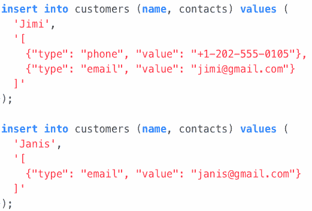
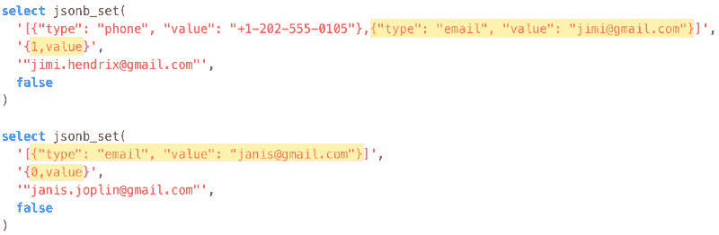
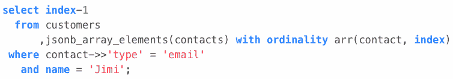
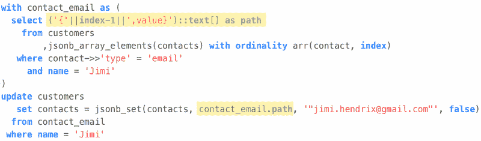

# 如何用 PostgreSQL 更新 JSONB 数组中的对象

> 原文：<https://www.freecodecamp.org/news/how-to-update-objects-inside-jsonb-arrays-with-postgresql-5c4e03be256a/>

莱安德罗·塞斯奎尼·佩雷拉

# 如何用 PostgreSQL 更新 JSONB 数组中的对象


Photo by [Jan Antonin Kolar](https://unsplash.com/@jankolar?utm_source=medium&utm_medium=referral) on [Unsplash](https://unsplash.com?utm_source=medium&utm_medium=referral)

### 如何更新 JSONB 数组上的特定值

假设您决定将数据以 json 或 jsonb 的形式存储在数据库中，并且发现您只是为自己制造了以前没有的新问题。你并不孤单。

JSONB 是一个强大的工具，但是它有一定的代价，因为您需要调整查询和处理数据的方式。

将整个 jsonb 对象加载到内存中，使用您喜欢的编程语言对其进行转换，然后将其保存回数据库，这种情况并不少见。但是，您刚刚创造了另一个问题:性能瓶颈和资源浪费。

在本文中，让我们看看如何用一个查询更新数组中一个对象的特定值。

**TL；博士**:最后的查询在文章的最后，你可以在 [DB Fiddle](https://www.db-fiddle.com/f/e8aeGk7cRNYnpjsqi1ncrs/1) 查看一个实例，复制&粘贴并使用。

假设您正在实现一个客户屏幕来存储每个客户的动态联系人。然后，您想到将联系人存储为 JSONB 列，因为他们是动态的，因此使用非关系数据结构是有意义的。

然后创建一个带有 JSONB contacts 列的 customers 表，并向其中插入一些数据:



很简单，对吧？但是，如何更新特定客户的特定联系人呢？怎么换 Jimi 的邮箱或者 Janis 的电话？？

幸运的是，PostgreSQL 是你的朋友，它提供了 *jsonb_set* 函数:

*jsonb_set(目标 jsonb，路径 text[]，new_value jsonb[，create_missing boolean])*

给定一个 jsonb 列，您可以在指定的路径上设置一个新值:



Reference: [PostgreSQL Json functions](https://www.postgresql.org/docs/9.5/functions-json.html)

以上选择将返回:

```
[{“type”: “phone”, “value”: “+1–202–555–0105”}, {“type”: “email”, “value”: “jimi.hendrix@gmail.com”}]

[{“type”: “email”, “value”: “janis.joplin@gmail.com”}]
```

要更改联系人列表中 Jimi 的电子邮件，您需要告知 path " **1，value"** ，这意味着数组中的第二个对象(从 0 开始)和键值**T3。那就是*路径*。这同样适用于 change Janis 的 email，但是它的 email 对象位于索引 0 处。**

你可能在想:我只需要在 update 语句上使用 jsonb_set 就全部完成了？想法是这样，但这还不够。

非关系数据的问题在于它们是动态的。这是使用 JSONB 的原因之一，但这也带来了一个问题:在数组中，Jimi 的 email 对象位于索引 1，Janis 的 email 对象位于索引 0，而另一个客户可能有一个索引不同的数组。那么，如何才能发现每种联系类型的索引呢？？

答案是对数组的元素进行排序并获取其索引:



该查询返回 **1** ，这是客户 Jimi 的 contacts 数组中的*电子邮件对象(类型 email)* 的*索引*。

现在我们有了拼图的所有部分:我们知道如何更新 jsonb 值，以及如何发现要更新的对象的索引。

剩下的唯一一步就是更新本身。综上所述，我们有:



这个查询最重要的部分是带有块的*。这是一个强大的资源，但是对于这个例子，你可以把它想成一个“存储变量的方法”,即你需要更新的联系人的*路径*,它将根据记录而动态变化。*

让我解释一下这一部分:

```
(‘{‘||index-1||’,value}’)::text[] as path
```

它只是将路径构建为 *'{1，value}'* ，但是我们需要将其转换为 *text[]* ，因为这是 *jsonb_path* 函数所期望的类型。

#### 包扎

JSONB 是解决许多问题的一个很好的有价值的工具。但是请记住，您还需要查询和更新这类数据。这带来了一个成本，当你决定选择使用哪个工具时，你必须考虑这个成本。

附注:这个解决方案来自与卢卡斯·塞加蒂的结对编程会议。

你正在寻找一家创意公司来实现你的下一个想法吗？检查一下 [LNA 系统](https://lnasystems.com.br)，让我们谈谈。