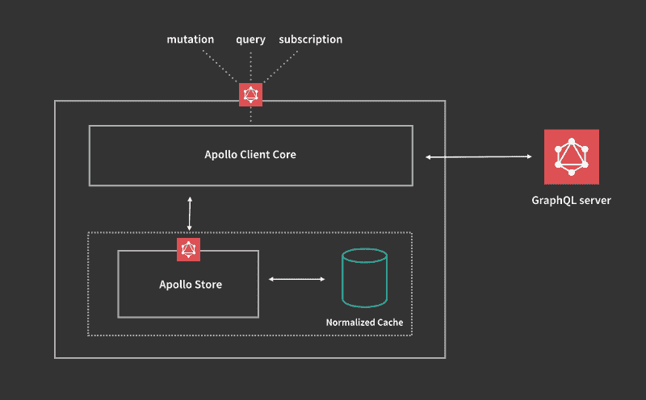

# 如何在发生突变后更新 Apollo 客户端的缓存

> 原文：<https://www.freecodecamp.org/news/how-to-update-the-apollo-clients-cache-after-a-mutation-79a0df79b840/>

通过 ric0

# 如何在发生突变后更新 Apollo 客户端的缓存



### Apollo 客户端及其缓存

[Apollo 客户端](https://www.apollographql.com/docs/react/)用于从任何 GraphQL 服务器获取数据。这个客户端很小，但是很灵活，有很多很棒的特性，其中最受赞赏的可能是客户端自带的自动缓存更新。

基本上，Apollo 客户机代表您自动检查查询和变异的流量，并使用它在响应中看到的最新版本的数据，以便本地缓存总是最新的。

### 简单的更新

例如，我们有一个要求所有文章的查询:

```
query articles { articles {    id    title    published     author {       name    }  }}
```

我们得到这些数据:

```
{  data: {    articles: [      {        id: '6543757061',        title: 'Does It Pay to Be a Writer?',        published: true,        author: {          name: 'John Doe',        }      },      {        id: '6543757062',        title: 'The Genius of Insomnia',        published: true,        author: {          name: 'Mike Kinski',        }      }    ]  }}
```

后来我们修改了 id 为“6543757061”的文章的标题:

```
// MUTATIONmutation updateArticle($id: ID! $title: String) {  updateArticle(id: $id, title: $title) {    id    title    published    author {      name    }  }}
```

```
// _update-article.js...this.props.mutate({  mutation: UPDATE_ARTICLE,  variables: {    id: '6543757061',    title: 'I am a new title',   },});...
```

结果:

```
articles: [      {        id: '6543757061',        title: 'I am a new title',        published: true,        author: {          name: 'John Doe',        }      },      {        id: '6543757062',        title: 'The Genius of Insomnia',        published: true,        author: {          name: 'Mike Kinski',        }      }    ]
```

变异成功后，我们的缓存会自动更新，原因有二:

*   我们在突变反应中包括了文章 id
*   我们在回复中加入了标题

事实上，如果两个结果上的`id`字段匹配，那么 UI 中的`title`字段将自动更新。

基本上，您应该使您的变异结果拥有更新以前获取的查询所需的所有数据。

这也是为什么最佳实践是使用[片段](https://www.apollographql.com/docs/react/advanced/fragments.html)在所有相关的查询和变异之间共享字段。

然而，更新作者姓名不会有与前一个相同的结果，因为我们在`author`中没有`id`字段。为了使它工作，查询和变异都应该包括作者的 id:

```
idtitlepublishedauthor {  id  name}
```

### 扩展用例

然而，以上是就地更新绰绰有余的唯一场景类型。事实上，自动更新还不包括许多其他常见情况，例如:

*   文章创作
*   文章删除
*   文章的过滤列表

诸如此类。

一般来说，任何需要根据缓存中当前数据更新缓存的情况。

这些情况只能用两种方法解决:

*   刷新浏览器**突变后的:D
*   使用`update`功能直接访问本地缓存，该功能允许您在发生突变后手动更新缓存，而无需重新提取数据

**考虑到您正在使用`cache-first` 默认[获取策略](https://www.apollographql.com/docs/react/api/react-apollo.html#graphql-config-options-fetchPolicy)

虽然 [refetchQueries](https://www.apollographql.com/docs/react/api/react-apollo.html#graphql-mutation-options-refetchQueries) 是第三种选择，但是`update`是 Apollo 推荐的在查询后更新缓存的方式。在这里有完整的[解释。](https://www.apollographql.com/docs/react/api/react-apollo.html#graphql-mutation-options-update)

### 更新功能的使用

但是，由于使用 update 函数使您可以完全控制缓存，允许您以自己喜欢的任何方式对数据模型进行更改，因此管理自己的缓存很快就变得复杂了。

默认情况下，关闭 Apollo 缓存是一种诱惑，但这种情况永远不会发生。

让我们来解决您在开始直接管理自己的缓存时可能面临的最常见的挑战。

#### 始终使用 try/catch 块

你看到的大多数例子，也是在官方的 Apollo 文档中，看起来像下面这样:

```
const query = gql`{ todos { ... } }`export default graphql(gql`  mutation ($text: String!) {    createTodo(text: $text) { ... }  }`, {  options: {    update: (proxy, { data: { createTodo } }) => {      const data = proxy.readQuery({ query });      data.todos.push(createTodo);      proxy.writeQuery({ query, data });    },  },})(MyComponent);
```

这很酷，但是如果查询还没有被获取，所以不在您的缓存中，会发生什么呢？会抛出一个错误，应用程序会崩溃。

确保查询在那里只有在简单的情况下才是安全的。您需要使用一个 try/catch 块:

```
update: (proxy, { data: { createTodo } }) => {      try {        const data = proxy.readQuery({ query });        data.todos.push(createTodo);        proxy.writeQuery({ query, data });      }      catch(error) {        console.error(error);      }},
```

否则，您应该非常确定查询已经在缓存中了。

这里的信息是，你最好不要做任何假设。丹·阿布拉莫夫在他的[博客](https://overreacted.io/the-elements-of-ui-engineering/)中写道:

> 我们无法预测确切的用户交互及其顺序。在任何时候，我们的应用程序都可能处于令人难以置信的多种状态中的一种。我们尽最大努力使结果可预测，并受我们的设计限制。我们不想看着一个 bug 截图，然后想“那个是怎么发生的*。*

请记住， *proxy.readQuery* 和 *proxy.writeQuery* 都可能独立抛出错误。例如，您可以成功地从缓存中读取一个查询，而写操作会因为数据中的一个缺失字段而抛出一个错误，这个缺失字段通常是`__typename`

#### 始终定义查询中使用的变量

现在想象一下，我们有一个突变，它创建了一篇已经标记为已发布的新文章。

一般来说，简单的例子显示了一个检索所有文章的查询，然后在客户端进行过滤(例如 articles . filter(article = > article . published))

为了说明我们的观点，让我们假设我们有一个查询，只从服务器检索已发布的文章。

此时，在新文章突变完成后，我们需要使用`published: true`变量来读/写缓存的查询，以匹配我们需要在缓存中更新的精确查询。

```
update: (proxy, { data: { createPublishdedArticles } }) => {      try {        const data = proxy.readQuery({ query, variables: { published: true } });        data.articles.push(createPublishdedArticles);        proxy.writeQuery({ query, variables: { published: true }, data });      }      catch(error) {        console.error(error);      }},
```

就是这样。虽然这个用例是可管理的，因为我们只有一个布尔变量，但是一旦有了更复杂的用例，包括多个查询和变量，就变得非常棘手了。

### 日益增加的复杂性

到目前为止，我们只讨论了基本的情况。在开发任何应用程序时，在缓存管理方面，事情很容易变得更加苛刻。

事实上，当使用 Apollo 客户端更新本地缓存时，当它需要包括多个变量、包括多个查询或覆盖 Apollo 的就地更新可能不够充分的场景时，它变得非常复杂:

*   添加/删除到列表
*   从一个列表移动到另一个列表
*   更新过滤列表

诸如此类。

#### 突变后更新多个查询

通常发生的情况是，在一个突变之后，我们想要更新不止一个查询。例如，假设我们正在检索 dashboard 组件中的所有文章，但也检索其他两个不同组件中已发布的文章和未发布的文章。

Apollo 客户机不仅将每个查询写入缓存，还会将具有不同变量的相同查询存储为两个不同的条目。例如，这是我们的两个查询:

```
// query 1query articles { articles {    id    title    published     author {       name    }  }}// will be stored as: articles
```

```
// query 2query articles($where: JSON) { articles(where: $where) {    id    title    published     author {       name    }  }}/* will be stored as:articles({"where":{"published":true,"sort":"asc"})
```

```
when the query is invoked with:{ variables: { where: { published: true, sort: "asc" } } }*/
```

正如人们所料，在 Apollo 的缓存中有两个不同的查询。然而，我们还想检索所有未发表的文章。为此，我们需要使用变量`where: { published: false, sort: 'asc' }`额外调用“查询 2”

这样做的结果是缓存中有 3 个条目:

```
articlesarticles({"where":{"published":true,"sort":"asc"}})articles({"where":{"published":false,"sort":"asc"}})
```

为什么这很重要？如果您要添加一篇新文章，并希望在突变后更新本地缓存，您将需要读取多个查询，并且多次读取同一个查询(每组变量一次)。像这样:

```
// STEP #1// update 'articles'try {  const dataQuery = proxy.readQuery({    query: getArticles  });
```

```
 dataQuery.articles.push(newArticle);
```

```
 proxy.writeQuery({    query: getArticles,    data: dataQuery  });}catch(error) {  console.error(error);}
```

```
// STEP #2// articles({"where":{"published":true,"sort":"asc"}})try {  const dataQuery = proxy.readQuery({    query: getArticles,    variables: {      {        where:{          published: true,          sort: "asc",        },      },    },  });
```

```
 dataQuery.articles.push(newArticle);
```

```
 proxy.writeQuery({    query: getArticles,    variables: {      {        where:{          published: true,          sort: "asc",        },      },    },    data: dataQuery  });}catch(error) {  console.error(error);}
```

```
// STEP #3// articles({"where":{"published":false,"sort":"asc"}})try {  const dataQuery = proxy.readQuery({    query: getArticles,    variables: {      {        where:{          published: false,          sort: "asc",        },      },    },  });
```

```
 dataQuery.articles.push(newArticle);
```

```
 proxy.writeQuery({    query: getArticles,    variables: {      {        where:{          published: false,          sort: "asc",        },      },    },    data: dataQuery  });}catch(error) {  console.error(error);}
```

您应该已经看到了这一点，以及为每个查询/变量组合添加更多样板文件是多么容易。

#### 变量的顺序和值

同样值得注意的是，变量的顺序非常重要。

以下两个查询被认为是不同的，将分别存储在缓存中:

```
// Calling a query
```

```
export default graphql(gql`  query ($width: Int!, $height: Int!) {    dimensions(width: $width height: $height) {    ...   }   ...  }`, {  options: (props) => ({    variables: {      width: props.size,      height: props.size,    },  }),})(MyComponent);
```

```
// Calling the same query above, but with a different order of variables fieldsexport default graphql(gql`  query ($width: Int!, $height: Int!) {     dimensions(width: $width height: $height) {    ...   }   ...  }`, {  options: (props) => ({    variables: {      height: props.size,      width: props.size,    },  }),})(MyComponent);
```

最终，同一个查询以不同的变量顺序在缓存中存储了两次:

```
dimensions({"width":600,"height":600})dimensions({"height":600,"width":600})
```

使用不同的 props.size 再次调用相同的查询，您会在缓存中获得一个额外的条目:

```
dimensions({"width":600,"height":600})dimensions({"height":600,"width":600})dimensions({"height":100,"width":100})
```

很疯狂吧。你看，如果天真地对待，这很容易失去控制。

#### 边缘案例

如果这还不够，还有更多。

当您用变量定义查询时，通常也会用到它们。

让我们考虑下面的例子:

```
query articles($sort: String, $limit: Int) {    articles(sort: $sort, limit: $limit) {      _id      title      published      flagged    }  }
```

你可能会这样调用它:

```
export default graphql(gql`${ABOVE_QUERY}`, {  options: (props) => ({    variables: {      sort: props.sort,      limit: props.limit,    },  }),})(MyComponent);
```

但是如果调用它时根本没有 variables 对象(variables 对象不存在)或者传递了一个 variables 空对象，比如`variables: {}`，该怎么办呢？当以编程方式生成变量时，可能会发生这种情况。

例如:

```
export default graphql(gql`${ABOVE_QUERY}`, {  options: (props) => ({    variables: props.varObj, // props.varObj might be an empty object  }),})(MyComponent);
```

将`articles({"sort":null,"limit":null})`存储在缓存中；

同时:

```
export default graphql(gql`${ABOVE_QUERY}`)(MyComponent);
```

将`articles({})`存储在缓存中。

上述边缘情况更多的是不想要的/意想不到的行为的结果，而不是故意的。但是，最好记住查询将如何在缓存中结束以及以什么形式结束。

#### 在缓存查询之间移动项目

也可能有这样的情况，我们想取消发布一篇文章。这意味着将它从已发布的查询移动到未发布的查询。

基本上，我们首先需要保存发布列表中的项目，然后删除它，最后将保存的项目添加到未发布列表中。让我们来看看如何做到这一点:

```
const elementToMoveId = '1';let elementToMove;
```

```
try {  const dataQueryFrom = proxy.readQuery({    query: getArticles,    variables: {      {        where:{          published: true,          sort: "asc",        },      },    },  });  elementToMove = dataQueryFrom.articles.filter(item => item.id === elementToMoveId)[0];  dataQueryFrom.articles  = dataQueryFrom.articles.filter(item => item.id !== elementToMoveId)
```

```
proxy.writeQuery({    query: getArticles,    variables: {      {        where:{          published: true,          sort: "asc",        },      },    },    data: dataQueryFrom  });}catch(error) {  console.error(error);}
```

```
if (elementToMove) {  try {    const dataQueryTo = proxy.readQuery({      query: getArticles,      variables: {        {          where:{            published: false,            sort: "asc",          },         },      },    });
```

```
 dataQueryTo.articles.push(elementToMove);
```

```
proxy.writeQuery({      query: getArticles,      variables: {        {          where:{            published: true,            sort: "asc",          },        },      },      data: dataQueryTo,    });  }  catch(error) {    console.error(error);  }}
```

### 阿波罗缓存更新程序

正如您所看到的，仅仅为了处理非常常见的用例，就有很多东西需要包装。

有大量的代码需要编写，并且很容易出错。

出于这些原因，我发布了 [Apollo 缓存更新器](https://github.com/ecerroni/apollo-cache-updater)，这是一个 [npm 包](https://github.com/ecerroni/apollo-cache-updater)，它是一个在突变后更新 Apollo 缓存的零依赖助手。它帮助我在处理缓存时保持理智:)

它试图通过 Apollo 的`update`变量配置变异的结果缓存行为，将视图从缓存层中分离出来。

目标是通过传递一个配置对象来涵盖上述所有场景。

在您可能使用不同的变量、分页等运行多个查询之后，它会做什么。就是迭代 ROOT_QUERY 中的每个对象，代表您执行您在传递的配置对象中定义的操作。

### 结论

在任何语言中，管理缓存都是困难的。Apollo 客户端给了我们很多优势，尽管在更复杂的场景中，它让我们，开发者，自己处理所有的事情。Apollo Cache Updater 试图减轻这种痛苦，同时等待一个官方的、易于使用的解决方案来自动添加/删除缓存查询的条目。

在这里获取 npm 包[。](https://github.com/ecerroni/apollo-cache-updater)