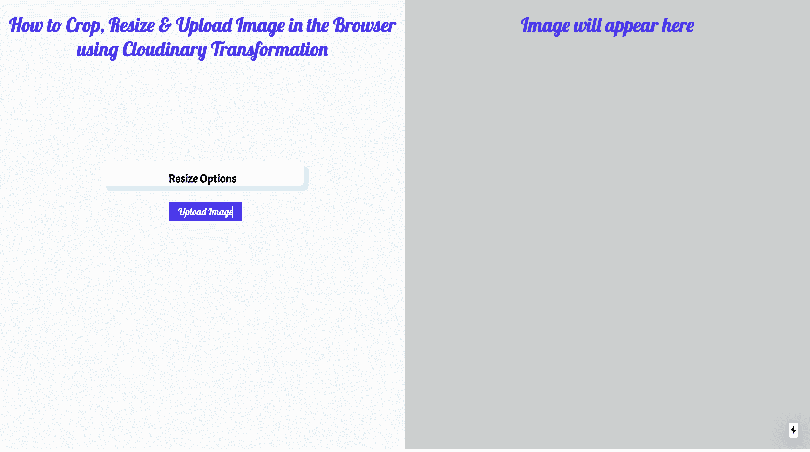
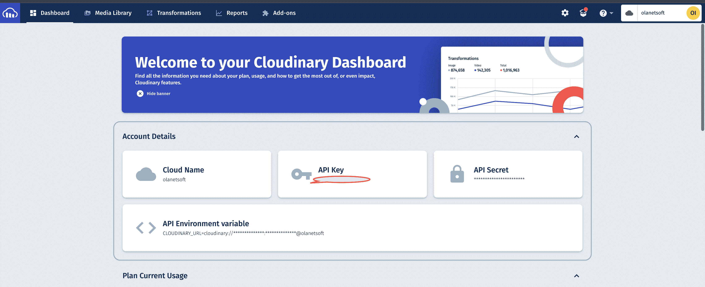
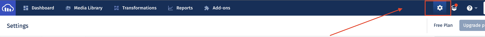
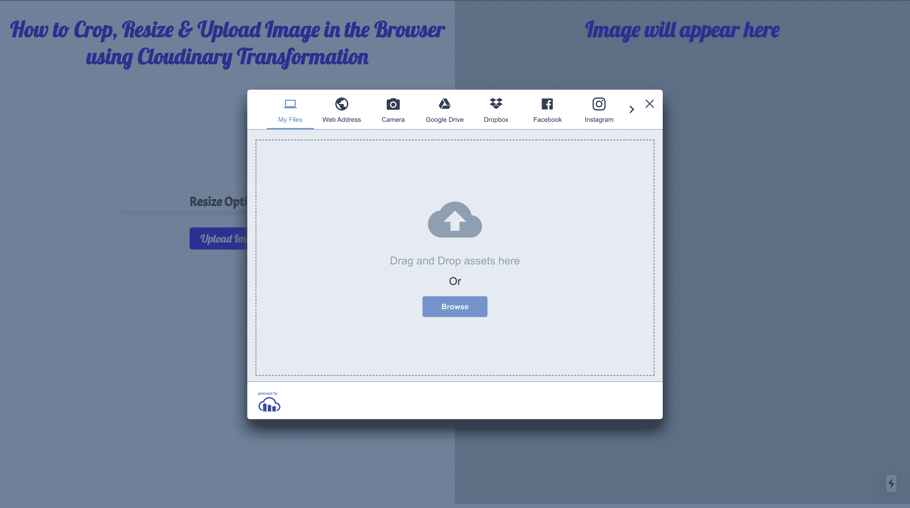
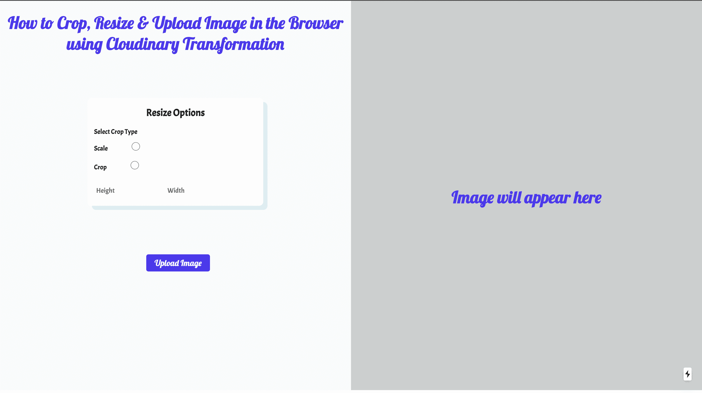
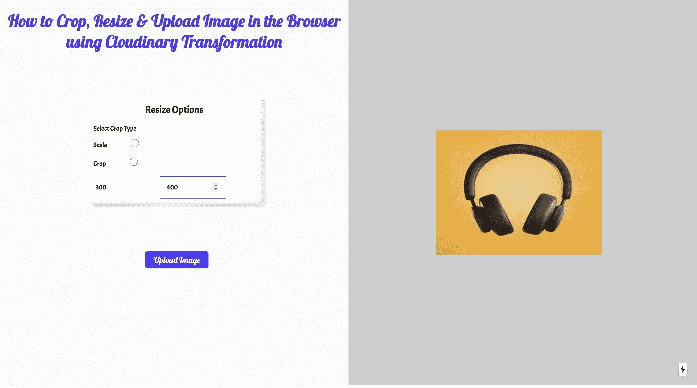

# Next.js 图像教程–如何在 Next 的浏览器中上传、裁剪和调整图像大小

> 原文：<https://www.freecodecamp.org/news/how-to-upload-crop-resize-images-in-the-browser-in-nextjs/>

两个最基本的图像编辑功能是调整大小和裁剪。但是你应该小心地做这些，因为它们有可能降低图像质量。

裁剪总是包括删除原始图像的一部分，从而导致一些像素的丢失。

这篇文章将教你如何在浏览器中上传、裁剪和调整图片大小。

我在一个[代码沙箱](https://codesandbox.io/s/serverless-leaf-vc9rls?file=/pages/index.js)中构建了这个项目。要快速开始，分叉 [Codesandbox](https://codesandbox.io/s/serverless-leaf-vc9rls?file=/pages/index.js) 或者运行项目。

## 先决条件

要跟随本教程，您应该有一些 JavaScript 和 React.js 经验。使用 Next.js 的经验不是必需的，但是拥有它是很好的。

你还需要一个[云账户](https://cloudinary.com/users/register/free)来存储媒体文件。

[Cloudinary](https://cloudinary.com/documentation/image_video_and_file_upload#upload_options_overview) 提供了一个安全完整的 API，可以快速高效地从服务器、浏览器或移动应用程序上传媒体文件。

最后，你需要 [Next.js](https://nextjs.org/) 。这是一个开源的基于 React 的前端开发 web 框架，允许服务器端渲染和生成静态网站和应用程序。

## 项目设置和安装

使用`npx create-next-app`命令在您选择的目录中搭建一个新项目，以创建一个新项目。

您可以使用以下命令来完成此操作:

```
npx create-next-app <project name> 
```

要安装依赖项，请使用以下命令:

```
cd <project name> 
npm install cloudinary-react 
```

创建应用程序并安装依赖项后，您将看到一条消息，其中包含导航到您的站点并在本地运行该应用程序的说明。

您可以使用以下命令来完成此操作:

```
npm run dev 
```

Next.js 将在`http://localhost:3000`启动默认可访问的热重装开发环境。

## 如何构建用户界面

对于我们的项目，我们希望用户界面在主页上上传、裁剪和调整图像大小。为此，我们将把`pages/index.js`文件更新为一个组件:

```
import React, { useState } from "react";
import Head from "next/head";

const IndexPage = () => {

  return (
    <>
      <div className="main">
        <div className="splitdiv" id="leftdiv">
          <h1 className="main-h1">
            How to Crop, Resize & Upload Image in the Browser using Cloudinary
            Transformation
          </h1>
          <div id="leftdivcard">
            <h2 className="main-h2">Resize Options</h2>
          </div>

          <button type="button" id="leftbutton">
            Upload Image
          </button>
        </div>

        <div className="splitdiv" id="rightdiv">
        <h1> Image will appear here</h1>
        </div>
      </div>
    </>
  );
};
export default IndexPage; 
```

不过，目前的用户界面看起来并不太好。我们将在`style.css`文件中添加一些 CSS 样式，如下所示:

```
@import url("https://fonts.googleapis.com/css?family=Acme|Lobster");

/* This allow me to have the full width of the page without the initial padding/margin*/
body,
html {
  margin: 0;
  padding: 0;
  height: 100%;
  width: 100%;
  font-family: Acme;
  min-width: 700px;
}

.splitdiv {
  height: 100%;
  width: 50%;
}

/* This part contains all of the left side of the screen */
/* ----------------------------------------- */
#leftdiv {
  float: left;
  background-color: #fafafa;
  height: 932px;
}

#leftdivcard {
  margin: 0 auto;
  width: 50%;
  background-color: white;
  margin-top: 25vh;
  transform: translateY(-50%);
  box-shadow: 10px 10px 1px 0px rgba(78, 205, 196, 0.2);
  border-radius: 10px;
}

#leftbutton {
  background-color: #512cf3;
  border-radius: 5px;
  color: #fafafa;
  margin-left: 350px;
}

/* ----------------------------------------- */

/* This part contains all of the right side of the screen */
/* ----------------------------------------- */
#rightdiv {
  float: right;
  background-color: #cbcfcf;
  height: 932px;
}

#rightdivcard {
  margin: 0 auto;
  width: 50%;
  margin-top: 50vh;
  transform: translateY(-50%);
  background-position: bottom;
  background-size: 20px 2px;
  background-repeat: repeat-x;
}

/* ----------------------------------------- */

/* Basic styling */
/* ----------------------------------------- */

button {
  outline: none !important;
  font-family: Lobster;
  margin-bottom: 15px;
  border: none;
  font-size: 20px;
  padding: 8px;
  padding-left: 20px;
  padding-right: 20px;
  margin-top: -15px;
  cursor: pointer;
}

h1 {
  font-family: Lobster;
  color: #512cf3;
  text-align: center;
  font-size: 40px;
}

input {
  font-family: Acme;
  font-size: 16px;
  font-family: 15px;
}

input {
  width: 30%;
  height: 20px;
  padding: 16px;
  margin-left: 1%;
  margin-right: 2%;
  margin-top: 15px;
  margin-bottom: 10px;
  display: inline-block;
  border: none;
}

input:focus {
  outline: none !important;
  border: 1px solid #512cf3;
  box-shadow: 0 0 1px round #719ece;
}

/* ----------------------------------------- */

.main {
  height: 100%;
  width: 100%;
  display: inline-block;
}

.main-h2 {
  padding-top: 20px;
  text-align: center;
}

.body-h1 {
  padding-top: 20px;
  text-align: center;
  color: white;
}

.inner-p {
  color: white;
  text-align: center;
}

.main-align {
  text-align: center;
}

.form-control {
  margin-left: 15px;
} 
```

我们的应用程序现在在 [http://localhost:3000/:](http://localhost:3000/:) 上应该是这样的



## 如何创建图像上传小部件

Cloudinary 的上传小工具让我们可以从多个来源上传媒体资产，包括 Dropbox、脸书、Instagram 和直接从我们设备的摄像头拍摄的图像。我们将在这个项目中使用上传小部件。

创建一个免费的 cloudinary 帐户以获取您的云名称和 upload_preset。

`upload_presets`允许我们集中定义一组资产上传选项，而不是在每次上传调用中提供它们。Cloudinary `cloud name`是与您的 Cloudinary 帐户相关联的唯一标识符。

首先，从内容交付网络(CDN)中，我们将在位于`pages/index.js.`中的`index.js`中添加 Cloudinary 小部件的 JavaScript 文件。我们将使用`next/head`包含所有元标签来包含该文件，这允许我们在 React 中将数据添加到 HTML 文档的头部。

接下来，在`pages/index.js`文件中，我们将从 next/head 导入 Head 并添加脚本文件。

```
import React, { useState } from "react";
import Head from "next/head";

const IndexPage = () => {

  return (
    <>
      <Head>
        <title>How to Crop and Resize Image in the Browser</title>
        <link rel="icon" href="/favicon.ico" />
        <meta charSet="utf-8" />
        <script
          src="https://widget.Cloudinary.com/v2.0/global/all.js"
          type="text/javascript"
        ></script>
      </Head>
      <div className="main">
          [...]
      </div>
    </>
  );
};
export default IndexPage; 
```

在`pages/index.js`文件中，我们将在单击按钮和状态变量`imagePublicId.`时触发的方法中创建小部件的实例。

```
import React, { useState } from "react";
import Head from "next/head";

const IndexPage = () => {
  const [imagePublicId, setImagePublicId] = useState("");

  const openWidget = () => {
    // create the widget
    const widget = window.cloudinary.createUploadWidget(
      {
        cloudName: "olanetsoft",
        uploadPreset: "w42epls7"
      },
      (error, result) => {
        if (
          result.event === "success" &&
          result.info.resource_type === "image"
        ) {
          console.log(result.info);
          setImagePublicId(result.info.public_id);
        }
      }
    );
    widget.open(); // open up the widget after creation
  };

  return (
    <>
      //...
    </>
  );
};
export default IndexPage; 
```

小部件需要我们的 Cloudinary `cloud_name`和`uploadPreset.``createWidget()`函数创建一个新的上传小部件。成功上传图像后，我们将资产的`public_id`分配给相关的状态变量。

为了得到我们的`cloudname`和`uploadPreset,`,我们遵循以下步骤:

您可以从您的 Cloudinary 仪表板获取云名称，如下所示。



您可以在您的 Cloudinary 设置页面的`Upload`选项卡中找到一个上传预设。您可以通过单击仪表板页面右上角的齿轮图标来访问它。




向下滚动到页面底部的上传预设部分，在那里您将看到您的上传预设，或者如果您没有任何预设，可以选择创建一个。

我们将继续调用图像上传按钮的`onClick`处理程序中的`openWidget`函数，如下所示:

```
//...

const IndexPage = () => {
//...
  return (
    <>
     //....
      <div className="main">
        <div className="splitdiv" id="leftdiv">
          //...
          <div id="leftdivcard">
            <h2 className="main-h2">Resize Options</h2>
             //...
            </div>

          <button type="button" id="leftbutton" onClick={openWidget}>
            Upload Image
          </button>
        </div>

        <div className="splitdiv" id="rightdiv">
        <h1> Image will appear here</h1>
        </div>
      </div>
    </>
  );
};
export default IndexPage; 
```

当我们在浏览器中打开应用程序并点击`Upload Image`按钮时，我们应该会看到类似这样的内容:



## 如何实现自定义转换函数

我们需要创建一个组件，根据传递给它的属性来处理转换。我们将在根文件夹中创建一个`components/`目录。在其中，我们将创建一个名为`image.js`的文件，其内容如下:

```
import { CloudinaryContext, Transformation, Image } from "cloudinary-react";

const TransformImage = ({ crop, image, width, height }) => {
  return (
    <CloudinaryContext cloudName="olanetsoft">
      <Image publicId={image}>
        <Transformation width={width} height={height} crop={crop} />
      </Image>
    </CloudinaryContext>
  );
};

export default TransformImage; 
```

在上面的代码片段中，我们导入了`CloudinaryContext`，一个包装 Cloudinary 组件，用于管理所有其子 Cloudinary 组件之间的共享信息。渲染的`TransformImage`组件将图像变换的数据作为道具。

当我们将上传的图像导入到`pages/index.js`中时，上面的代码块将呈现该图像:

```
//...
import TransformImage from "../components/image";

const IndexPage = () => {
  const [imagePublicId, setImagePublicId] = useState("");
  const [alt, setAlt] = useState("");
  const [crop, setCrop] = useState("scale");
  const [height, setHeight] = useState(200);
  const [width, setWidth] = useState(200);

  return (
    <>
     //...
      <div className="main">
        <div className="splitdiv" id="leftdiv">
          //...
       </div>
        <div className="splitdiv" id="rightdiv">
          <h1> Image will appear here</h1>
          <div id="rightdivcard">
            {imagePublicId ? (
              <TransformImage
                crop={crop}
                image={imagePublicId}
                width={width}
                height={height}
              />
            ) : (
              <h1> Image will appear here</h1>
            )}
          </div>
        </div>
      </div>
    </>
  );
};
export default IndexPage; 
```

接下来，我们将添加`Resize Options`单选按钮，这样我们可以使用下面的代码片段选择不同的调整大小和裁剪选项:

```
//...

const IndexPage = () => {
//...

  return (
    <>
    //...
      <div className="main">
        <div className="splitdiv" id="leftdiv">
          //...
          <div id="leftdivcard">
            <h2 className="main-h2">Resize Options</h2>

          <label className="form-control">Select Crop Type</label>
            <div>
              <label className="form-control">Scale</label>
              <input
                type="radio"
                value="scale"
                name="crop"
                onChange={(event) => setCrop(event.target.value)}
              />
            </div>
            <div>
              <label className="form-control">Crop</label>
              <input
                type="radio"
                value="crop"
                name="crop"
                onChange={(event) => setCrop(event.target.value)}
              />
            </div>
            <input
              type="number"
              placeholder="Height"
              onChange={(event) => setHeight(event.target.value)}
            />
            <input
              type="number"
              placeholder="Width"
              onChange={(event) => setWidth(event.target.value)}
            />
          </div>

          <button type="button" id="leftbutton" onClick={openWidget}>
            Upload Image
          </button>
        </div>

        <div className="splitdiv" id="rightdiv">
          //...
        </div>
      </div>
    </>
  );
};
export default IndexPage; 
```

在上面的代码片段中，我们:

*   增加了作物类型以及宽度和高度选项
*   添加了一个`onChange`属性来分别跟踪高度和宽度输入字段的变化

我们的应用程序的最终输出应该类似于下面的内容:





如果你想看完整的代码，这里是该项目的 GitHub 存储库:[https://GitHub . com/Olanetsoft/how-to-upload-crop-and-resize-images-in-the-browser-in-next . js](https://github.com/Olanetsoft/how-to-upload-crop-and-resize-images-in-the-browser-in-next.js)

## 结论

这篇文章展示了如何在 Next.js 的浏览器中上传、裁剪和调整图片大小。

## 资源

您可能会发现这些资源很有帮助。

*   [云二进制转换 URL 引用](https://cloudinary.com/documentation/transformation_reference)
*   [云状图像变换](https://cloudinary.com/documentation/image_transformations)