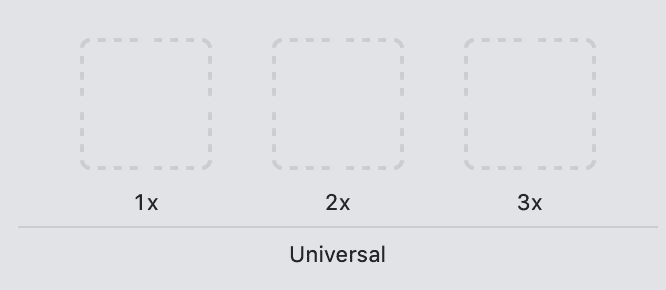
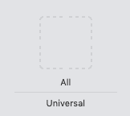
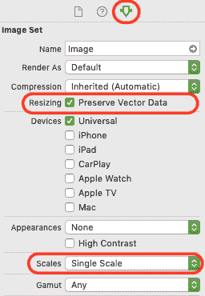
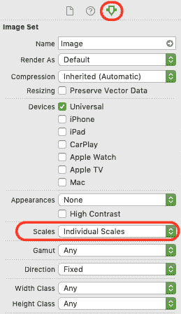
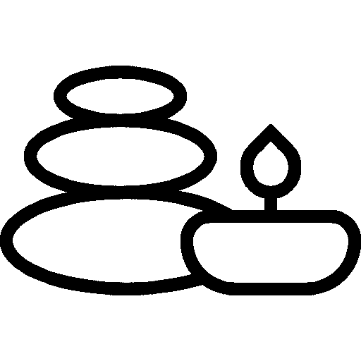
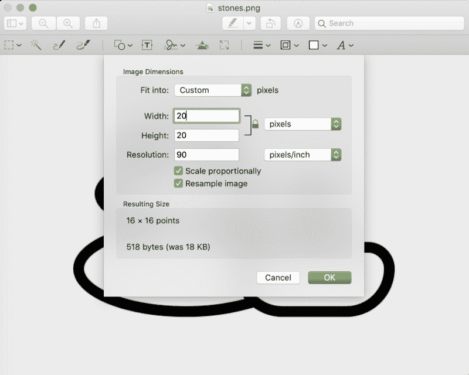

# 如何将图像上传到 Xcode

> 原文：<https://www.freecodecamp.org/news/how-to-upload-images-to-xcode/>

要在 Xcode 中使用图像，您需要将它们上传到位于`Supporting Files`文件夹中的`Assets.xcassets`。有两个选项可以选择:位图(又名。`png`文件)或矢量文件(又名`.pdf`文件)。第一步是决定你想使用哪种文件类型。

# 位图和矢量资源之间的区别

大多数在线教程使用位图资源，即`.png`文件。这需要您将图像的 3 个以上副本拖到 Xcode 中。

Drag and drop the three copies of your .png images here

然而，有一个学派认为矢量资产更优越。[这篇文章](https://support.goanimate.com/hc/en-us/articles/203029524-Vector-vs-Bitmap-Images-How-to-Get-The-Best-Results-in-GoAnimate)很好地解释了为什么会这样。向量资源是`.svg`文件(对于 Xcode 是`.pdf`)。如果您选择使用 vectors 资源，您只需将图像的一个版本上传到 Xcode。

Drag and drop your .pdf file here

以下是我从那些比我聪明得多的人那里听到的——Android 手机使用来自 vector 资产的算法来生成任何所需大小的图像。考虑到 Android 设备和屏幕尺寸的广泛性，这是有意义的。

然而，iPhones 中的矢量资产实际上并不与算法成比例(显然)。所以你不能通过使用矢量而不是位图来获得更高质量的图像。相反，你得到的是和位图一样的质量。iPhone 只需将“vector”资源转换为相同的三种位图大小。

抛开上面的算法逻辑，iPhones 使用矢量资产还有几个更客观的好处。

1.  ****减少人为错误的可能性。**** 现在有三种位图尺寸(1x，2x，3x)。这意味着您需要上传三个图像到您的资产。这是三次不小心拖放错误图像的机会。当您使用矢量资源(在 Xcode 中是通用的)时，您只需要上传一个图像，而不是三个。上传不正确尺寸或图片的可能性更小。
2.  ****速度。**** 原因同#1。如果你在应用程序中使用了大量图片，那么使用矢量资源可以将你需要上传的图片数量减少三分之一。
3.  ****面向未来。****iPhone 目前只使用三种图像尺寸(1x、2x、3x)。这是因为屏幕的视网膜质量提高了。当苹果几年前推出高视网膜屏幕时，每点的像素数量增加了，图像更清晰。
    类似的技术进步极有可能继续发生。将来，我们可能需要上传 4x、5x 和 6x 的图像。如果我们使用矢量资产，应用程序将为我们缩放图像。这使我们不用再增加位图资源的新尺寸。
    虽然我不得不承认我对此有点困惑，但鉴于 iPhone 向量资产似乎实际上并不能用于算法。所以我不确定它们如何自动缩放到更大的尺寸。但我明智的导师解释了这一点，我相信他！

在 Xcode 中使用矢量资源的一个大缺点是大多数地方不提供`.pdf`文件。需要你自己从`.svg`转换过来。

**2017 年 6 月 18 日更新** :苹果在 WWDC 宣布 iOS 现在支持真标量图像！或者至少，我认为他们是这么宣布的。现在有更多的理由使用单一的尺度。

# 如何上传矢量资产

Options to upload a vector asset

前往属性菜单。将比例更改为“单一比例”，并选中调整大小框以“保留矢量数据”。这将把上传选项改为“全部”，而不是 1x、2x、3x。

Drag and drop your .pdf file here

接下来，将您的`.pdf`文件拖放到一个插槽中。我还不太确定如何将`.svg`转换成`.pdf`，但我认为使用预览版相当容易。

# 如何上传。png 文件

如果你决定继续使用`.png`，你需要上传你的文件的三个版本。这是为了涵盖不同 iPhones 的不同屏幕分辨率。

Options for bitmap assets

首先，确保属性菜单中的“秤台”选项设置为“单独秤台”。这是默认选项，它将显示您应该填充的三个插槽:

Drag and drop your three copies of your image here

其次，找到一张你想在应用中使用的图片。让我们假设是[这个图标](https://www.flaticon.com/free-icon/stones_1209405#term=zen&page=1&position=25):

Icons of a tower of three stones and a candle

哇，真大。因为我从网站上下载了 512 像素的版本。然而，我只希望我的应用程序中的图像是 20 x 20 像素。为了将图像转换为 20 像素，我将在预览中调整它的大小。

将原始图像复制三份。你的图片的名字应该是这样的:`zen.png`、`zen@2x.png`、`zen@3x.png`。重要的是这些文件都有相同的名字(这里我用的是`zen`，其中两个以`@2x`和`@3x`结尾。当您使用这种命名约定时，Xcode 将能够根据设备类型自动找到正确的大小。

接下来，在预览中打开图像，进入工具>调整大小，调出下面的菜单。指定 20 x 20 像素。按确定并保存更改。这是你的基本图像。

对`zen@2x.png`做同样的事情。只有这个应该是 40 x 40 像素。再来一次`zen@3x.png`。这将是 60 x 60 像素。

现在，您可以在 Xcode 中将图像拖放到正确的框中。搞定了。