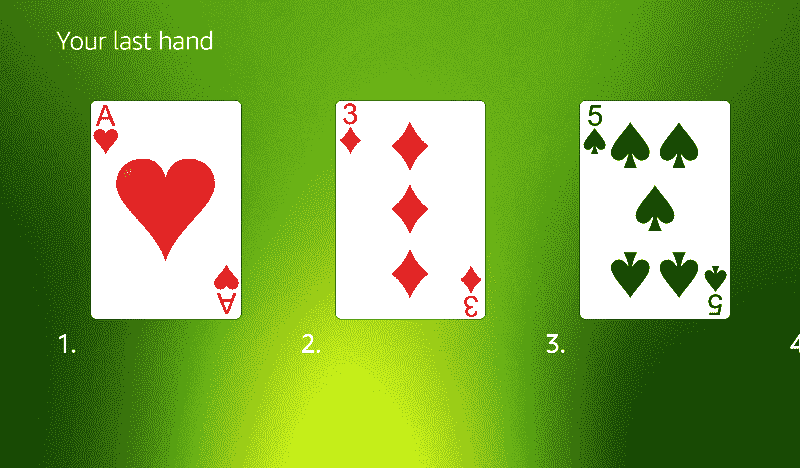
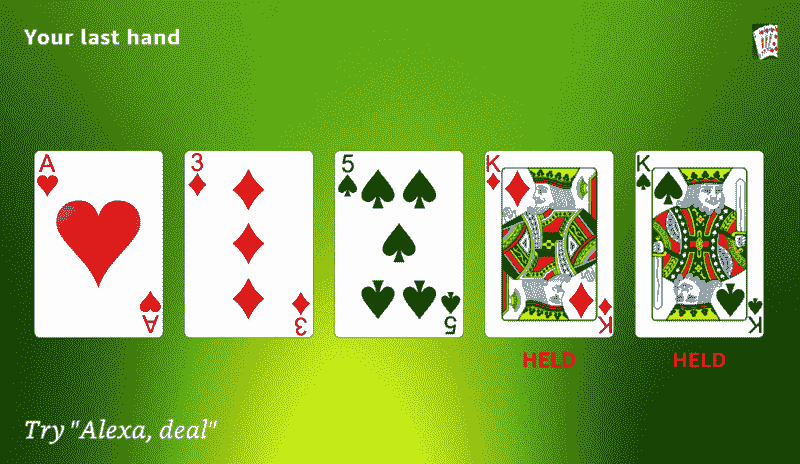
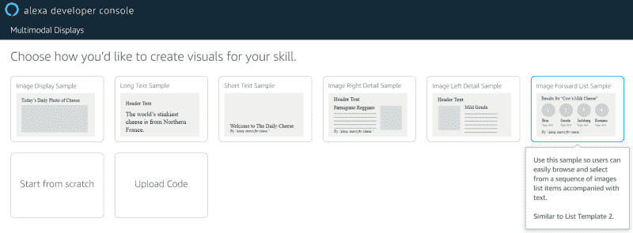
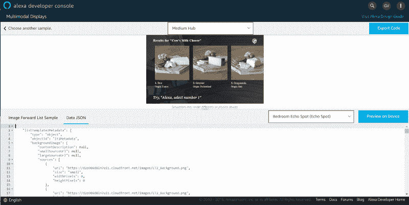
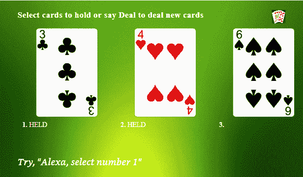

# 如何在你的技能中使用 Alexa 演示语言

> 原文：<https://www.freecodecamp.org/news/how-to-use-alexa-presentation-language-in-your-skill-3c49961825c5/>

加勒特·瓦格斯

# 如何在你的技能中使用 Alexa 演示语言

亚马逊最近发布了 Alexa 表示语言(APL)。APL 为多模态技能提供了更丰富的展示。它基于将显示元素从数据源中分离出来的现代框架。它让您可以灵活地包含许多视觉元素，如图形、图像和幻灯片，并让您为不同的设备定制显示。

在这篇文章中，我将介绍我是如何更新自己的一项技能来使用 APL 的。如果你正在创造一项新技能，你也可以使用这些技巧和技术。

我的大部分技能都支持使用[显示界面](https://developer.amazon.com/docs/custom-skills/display-interface-reference.html)的多模式。我决定通过更新我现有的技能来学习 APL。我专注于我的[电动扑克](https://www.amazon.com/Garrett-Vargas-Video-Poker/dp/B07465B5ZK)技能，因为我对现有的客户体验不满意。

视频扑克为用户提供了一手 5 张牌的扑克，能够在抽牌完成一手牌之前握牌和弃牌。用户可以通过语音命令(“保留第一张牌”或“保留一对插孔”)或通过触摸可视显示器上的牌来完成此操作。ListTemplate2 是用显示界面做到这一点的最佳方式。然而，这带来了一个限制，一次只允许三张卡片出现在屏幕上，并且在列表中的每张卡片下面放置数字。



Video Poker using ListTemplate2 Display Directive

使用 APL，我修改了 ListTemplate2 布局，以缩小列表项的大小，减少它们之间的间距，并在屏幕上显示完整的五手牌。我可以从列表中的条目中删除数字，并用红色粗体显示哪些牌。我能够针对不同的屏幕尺寸优化布局，比如像 Echo Spot 这样的较小显示器。



Video Poker using APL template modified from ListTemplate2

#### APL 创作工具

我这样做是通过 APL 创作工具。这个方便的工具提供了一系列不同的视觉设计，你可以用它来为你的技能创造引人注目的视觉效果。它还允许您保存和上传布局，因此您可以将它们提取到您的技能代码中，或者在您进行离线更新时上传它们。对于这个用例，我从基于 ListTemplate2 的**图像转发列表示例**开始。



Selecting a visual design from the APL Authoring Tool

一旦您在工具中选择了这个可视化设计，您将看到一个带有奶酪样本的列表的通用示例。您会看到屏幕底部的 APL 文档分为两个选项卡:

*   提供布局的“图像转发列表示例”
*   “数据 JSON”选项卡提供了文档数据的视图。



Editing your APL Document in the Authoring Tool

花点时间查看一下图像转发列表示例选项卡(布局代码)和数据 JSON 选项卡(内容代码)上的 JSON。您会注意到在布局中有几个对包含在`${}`中的值的引用，比如`${payload.listTemplate2ListData.listPage.listItems.length}`。如果您查看内容文件，您会看到这是内容中一个值的路径。这就是 APL 将数据绑定到表示层并允许您进行更改的方式。

#### 更新数据源

作为第一步，我想更新数据，以便显示与我的技能相关的卡片图像和文本。这样，当我开始更新布局本身时，我将能够看到它与我的实际图像的外观。创作工具实时显示渲染的屏幕图像，在您尝试完善布局时使用起来非常方便。为了更新数据，我采取了以下步骤:

*   点击数据 JSON 选项卡
*   在`listTemplate2Metadata`中，将`title`和`logo`元素更改为与电动扑克相关的内容
*   在这个相同的元素中，将`backgroundImages.sources`字段中的`url`更改为指向我想要使用的背景图像
*   在`listTemplate2ListData.listPage`中，我更新了`listItems`数组中的每一项。具体来说，我将这个数组更新为 5 个条目(我的卡片)，并将`listItemIdentifier`和`token`设置为“card.x”(其中 x 的范围是 0–4)。我去掉了`secondaryText`，因为我只想要一行文本(要么是空白的，要么是“HELD”)。我更新了`image.sources`来指向包含我的卡片图片的 URL。现在，我只是随机选择了一些卡片图像——我的技能代码将在游戏过程中用实际用户的手更新数据
*   更新提示文本以使用转换。如果用户已经更改了提示，您可以使用转换将提示更改为使用与设备相关联的唤醒词的提示，而不是使用 Alexa 关键字对提示字符串进行硬编码。您可以通过从 listTemplate2ListData 中删除`hintText`并将以下内容添加到 lastTemplate2Metadata 中来实现:

```
"properties": {    "hintText": "select number 1"},"transformers": [    {        "inputPath": "hintText",        "transformer": "textToHint"    }],
```

一旦我对数据源做了这些，我的图像看起来就像这样——非常类似于 ListTemplate2 显示的技巧，这是有意义的，因为在这一点上我仍然使用基于 ListTemplate2 的布局，只做了内容更改。



Updated view with relevant Video Poker content

#### 更新布局

现在到了有趣的部分——更新布局，一次在屏幕上显示五幅图像。对于这一部分，我对“图像转发列表示例”选项卡上的布局进行了更新。为了进行这些更改，我单击了滑块，让您在嵌套 APL 组件的可视视图和原始 JSON 视图之间切换。我发现查看完整的文档 JSON 比点击每个组件并在组件中编辑 JSON 更容易。但是你可以玩它，并遵循任何你认为最自然的方法。

在讨论我所做的更改之前，我想指出这个布局模板的一些元素:

*   JSON 中有一个`ListTemplate2`节点，它在一个`items`节点中提供了两个容器——一个适用于圆形屏幕(比如 Echo Spot ),另一个适用于其他屏幕类型。在这篇博客中，我将重点讨论非点显示，但是你应该明白，你也可以针对不同的屏幕布局进行修改。
*   查看我们将要更改的第二个容器，您会看到一组`items`，包括一个图像(背景图像)、一个 **AlexaHeader** (屏幕上的标题)、一个**序列**(卡片列表)和一个 **AlexaFooter** (屏幕底部的提示)
*   您将看到序列指向`HorizontalListItem`，这是这个 JSON 文档中的另一个容器。它包含由一个图像和两个文本元素(主要文本和次要文本)组成的项目

考虑到这一背景，我对该文档进行了以下更改:

*   在`HorizontalListItem`中，我改变了图像项目的尺寸——具体来说，我将`height`设置为 40vh，将`width`设置为 17vw。这将每个卡片的高度设置为视窗高度的 40%，宽度设置为视窗宽度的 17%。
*   然后我把`midWidth`更新为 100。这使得每个列表项的宽度变小，并允许五个卡片图像出现在屏幕上
*   我将`paddingLeft`和`paddingRight`更改为 6，以减少元素之间的间距
*   我添加了`paddingTop`，并将其设置为 100，以在标题和卡片图像之间添加一些间隔
*   我去掉了次要文本元素，因为我的显示器上没有两行文本
*   我改变了主文本元素，所以它不画序数。所以这个元素中的`text`由`<b>${ordinal}.</b>${data.textContent.priam`ryTe`xt.text} to <b>${data.textContent.pri`Mary text . text }</b>变成了。
*   在这个相同的元素中，我希望文本是红色和居中的。我通过添加一个值为“center”的`textAlign`字段和一个值为“red”的`color`字段来实现这一点。
*   为了从适当的位置获取提示文本(现在是元数据的一部分，而不是列表数据)，我需要更新 AlexaFooter 元素以从`${payload.listTemplate2Metadata.properties.hintText}`获取提示

最后，我需要使列表中的卡片可选，这样当用户在屏幕上触摸其中一张卡片时，我就可以做出响应。为此，我需要将与`Sequence`元素相关联的条目从`FullHorizontalListItem`更改为`TouchWrapper`，后者又包含一个`FullHorizontalListItem`。在代码中，这意味着我改变了这个:

```
"item": [  {    "type": "FullHorizontalListItem",    "listLength": "${payload.listTemplate2ListData.listPage.listItems.length}"  }]
```

对此:

```
"item": [  {    "type": "TouchWrapper",    "onPress": {      "type": "SendEvent",      "arguments": [        "${data.token}"      ]    },    "item": {      "type": "FullHorizontalListItem",      "listLength": "${payload.listTemplate2ListData.listPage.listItems.length}"    }  }]
```

注意该项中的`onPress`元素。具体来说就是参数列表。当一个项目被选中时，你可以指定一组不同的参数发送给你的技能。因为我现有的代码正在处理所选卡的令牌，所以我决定继续这样做，以尽量减少我需要更改的代码量。但是您也可以传入`${ordinal}`,它会告诉您所选项的索引，而无需处理令牌。

#### 技能代码的更新

在创作工具中完成更改后，您可以选择 Export Code 按钮，它会将您的布局和数据文件打包成一个 JSON 文件。我选择在代码中使用两个不同的 JSON 文件，一个名为 main，用于布局，另一个名为 datasources，用于数据。我喜欢在我的源代码中保持布局和内容的分离，作为一个通用的最佳实践。令人惊讶的是，亚马逊的创作工具并不鼓励这样做。

现在我们已经下载了文档和内容，我们需要修改代码来合并它，并在用户使用我们的技能时更新数据。我们可以通过操作数据元素，然后将它们传递回技能来做到这一点。我使用了 Alexa 的响应拦截器功能(我在另一篇博客文章中谈到了这个功能)。我从一个 JSON 文件中加载数据源，然后在发送给 Alexa 之前更新结构中的卡片和文本。我用下面的代码做到了这一点:

```
const main = require('./main.json');const datasource = require('./datasource.json');
```

```
function drawTable(handlerInput) {  const event = handlerInput.requestEnvelope;  const attributes = handlerInput.attributesManager.getSessionAttributes();  const game = attributes[attributes.currentGame];  let i;  let cardText;  let url;
```

```
 // Update the images  for (i = 0; i < game.cards.length; i++) {    const card = game.cards[i];    url = GetCardURL(card);    cardText = (card.hold) ? 'HELD' : '';    datasource.listTemplate2ListData.listPage.listItems[i]      .textContent.primaryText.text = cardText;    datasource.listTemplate2ListData.listPage.listItems[i]      .image.sources[0].url = url;    datasource.listTemplate2ListData.listPage.listItems[i]      .image.sources[1].url = url;  }  // Give an appropriate hint  if (game.state === 'FIRSTDEAL') {      if (game.cards[0].hold) {        datasource.listTemplate2ListData.hintText = 'discard the first card';      } else {        datasource.listTemplate2ListData.hintText = 'hold the first card';      }      datasource.listTemplate2Metadata.title = 'Select cards to hold or say Deal';    } else {      datasource.listTemplate2ListData.hintText = 'deal';      datasource.listTemplate2Metadata.title = 'Your last hand';    }  }  return handlerInput.responseBuilder    .addDirective({      type: 'Alexa.Presentation.APL.RenderDocument',      version: '1.0',      document: main,      datasources: datasource,    });}
```

我必须修改代码的第二个地方是处理用户触摸我的列表中的一个项目。在我的旧代码中，我解析了“card.x”形式的条目标记，其中 x 是列表中卡片的序号位置。对于显示界面，这意味着寻找一个`ElementSelected` 请求。在 APL 中，您的代码将收到一个`APL.Presentation.APL.UserEvent`，您可以按如下方式处理请求，以确定选择了哪张卡:

```
module.exports = {  canHandle(handlerInput) {    const request = handlerInput.requestEnvelope.request;       // Was this a touch item selected?    if (request.type === 'Alexa.Presentation.APL.UserEvent') {      return ((request.source.type === 'TouchWrapper')        && (request.source.handler === 'Press'));    }    return false;  },  handle(handlerInput) {    let index;    const event = handlerInput.requestEnvelope;    // Was this a touch item selected?    if (event.request.type === 'Alexa.Presentation.APL.UserEvent') {      const cards = event.request.arguments[0].split('.');      if (cards.length === 2) {        index = cards[1];      }            // Do something with the selected card...
```

```
 }  },};
```

有了这些改变，我有了一个看起来更整洁的视频扑克技巧，这肯定会比我使用的旧格式更让我的客户高兴。就 APL 的能力而言，我刚刚开始触及皮毛。但是我可以告诉你，它将为语音驱动的多模态技能开辟一个新的可能性世界！请在评论中告诉我你对这个新框架的看法。