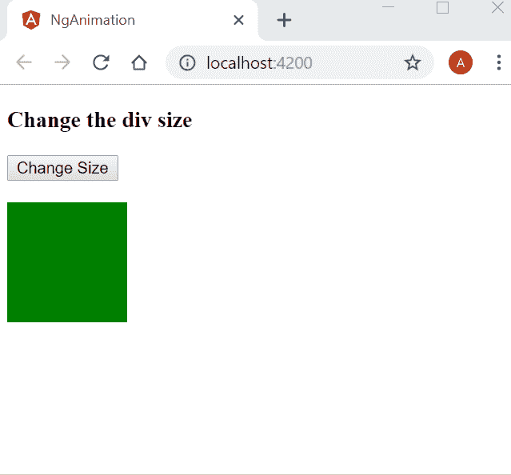
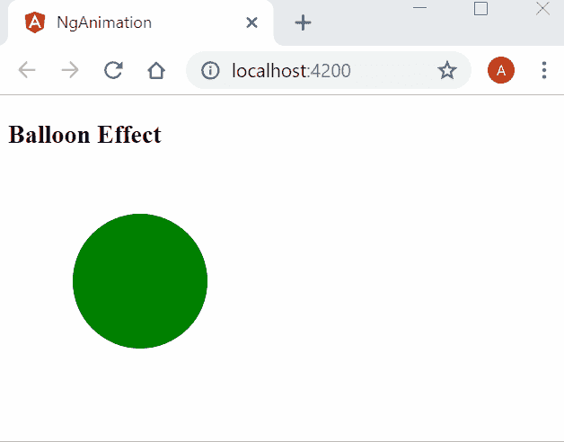
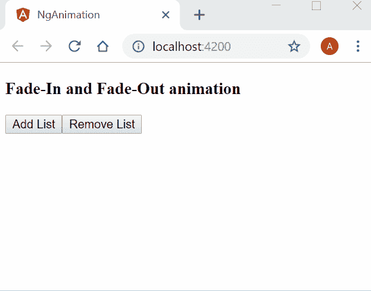
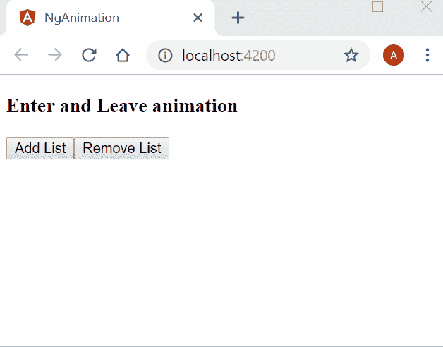

# 如何使用 Angular 6 的动画

> 原文：<https://www.freecodecamp.org/news/how-to-use-animation-with-angular-6-675b19bc3496/>

### 介绍

动画被定义为从初始状态到最终状态的过渡。它是任何现代 web 应用程序不可或缺的一部分。动画不仅帮助我们创建了一个伟大的用户界面，而且还使应用程序变得有趣和好玩。一个结构良好的动画可以让用户参与到应用程序中，并增强用户体验。

Angular 允许我们创建动画，为我们提供类似 CSS 动画的本地性能。在这篇文章中，我们将学习如何使用 Angular 6 创建动画。

我们将使用 Visual Studio 代码进行演示。

### 先决条件

安装 VS 代码和 Angular CLI。

如果你是 Angular 新手，那么参考我之前的文章【Angular 6.0 入门在你的机器上设置 Angular 6 开发环境。

### 源代码

从 [GitHub](https://github.com/AnkitSharma-007/angular-6-animations) 下载源代码。

### 了解角度动画状态

动画包括元素从一种状态到另一种状态的转换。角度定义了元素的三种不同状态:

1.  Void state —表示不属于 DOM 的元素的状态。当元素已创建但尚未放入 DOM 中，或者元素已从 DOM 中移除时，就会出现这种状态。当我们在 DOM 中添加或删除元素时想要创建动画时，这个状态非常有用。为了在我们的代码中定义这种状态，我们使用关键字`void`。
2.  通配符状态—这也称为元素的默认状态。为此状态定义的样式适用于该元素，而不管其当前动画状态如何。为了在我们的代码中定义这种状态，我们使用了`*`符号。
3.  自定义状态—这是元素的自定义状态，需要在代码中明确定义。为了在我们的代码中定义这个状态，我们可以使用我们选择的任何自定义名称。

### 动画过渡计时

为了显示从一种状态到另一种状态的动画转换，我们在应用程序中定义了动画转换时间。

角度提供了以下三种计时属性:

#### 持续时间

该属性表示我们的动画从开始(初始状态)到完成(最终状态)所花费的时间。我们可以通过以下三种方式定义动画的持续时间:

*   使用整数值表示以毫秒为单位的时间。例如- 500
*   使用字符串值表示以毫秒为单位的时间。例如“500 毫秒”
*   使用字符串值来表示以秒为单位的时间。例如“0.5 秒”

#### 耽搁

此属性表示动画触发和实际过渡开始之间的持续时间。该属性也遵循与 duration 相同的语法。要定义延迟，我们需要在持续时间值后添加一个字符串格式的延迟值——“持续时间延迟”。延迟是一个可选属性。

例如:

*   0.3 秒 500 毫秒。这意味着过渡将等待 500 毫秒，然后运行 0.3 秒

#### 松开

此属性表示动画在执行过程中如何加速或减速。我们可以通过将它添加为字符串中 duration 和 delay 之后的第三个变量来定义缓动。如果延迟值不存在，则缓动将是第二个值。这也是一个可选属性。

例如:

*   “0.3 秒 500 毫秒缓入”-这意味着转场将等待 500 毫秒，然后运行 0.3 秒(300 毫秒)的缓入效果。
*   300 毫秒放松。—这意味着转场将运行 300 毫秒(0.3 秒)，并带有渐出效果。

### 创建角度 6 应用程序

在您的计算机中打开命令提示符，并执行以下命令集:

*   mkdir nganimationdemo 演示
*   nganimationdemo 演示 cd
*   ng 新动画

这些命令将创建一个名为`ngAnimationDemo`的目录，然后在该目录中创建一个名为`ngAnimation`的 Angular 应用程序。

使用 VS 代码打开 ngAnimation app。现在我们将创建我们的组件。

导航至`View >> Integrated Te`终端。这将在 VS 代码中打开一个终端窗口。

执行以下命令创建组件。

```
ng g c animationdemo
```

这将在`/src/app`文件夹中创建我们的组件`animationdemo`。

为了使用角度动画，我们需要导入`BrowserAnimationsModule`，这是我们应用程序中的一个动画专用模块。打开 app.module.ts 文件并包含导入定义，如下所示:

```
import { BrowserAnimationsModule } from '@angular/platform-browser/animations';
// other import definitions

@NgModule({ imports: [BrowserAnimationsModule // other imports]})
```

#### **理解角度动画语法**

我们将在组件的元数据中编写动画代码。动画的语法如下所示:

```
@Component({
// other component properties.
  animations: [
    trigger('triggerName'), [
      state('stateName', style())
      transition('stateChangeExpression', [Animation Steps])
    ]
  ]
})
```

这里我们将使用一个名为`animations`的属性。该属性将接受一个数组作为输入。该数组包含一个或多个“触发器”。每个触发器都有一个唯一的名称和一个实现。我们的动画的状态和转换需要在触发器实现中定义。

每个状态函数都有一个“stateName ”,用来唯一地标识状态，还有一个 style 函数，用来显示该状态下元素的样式。

每个转换函数都有一个定义的`stateChangeExpression`来显示元素状态的变化，以及相应的动画步骤数组来显示转换将如何发生。我们可以将多个触发函数作为逗号分隔值包含在动画属性中。

这些功能触发，状态和转换在`@angular/animations`模块中定义。因此，我们需要在组件中导入这个模块。

要在元素上应用动画，我们需要在元素定义中包含触发器名称。在元素标记中包含触发器名称，后跟`@`符号。请参考下面的示例代码:

```
<div @changeSize></div>
```

这将触发`changeSize`到`<d` iv >元素。

让我们创建几个动画来更好地理解角度动画的概念。

### 更改动画大小

我们将创建一个动画来改变按钮点击时`<d` iv >元素的大小。

打开`animationdemo.component.ts`文件并添加以下导入定义:

```
import { trigger, state, style, animate, transition } from '@angular/animations';
```

在组件元数据中添加以下动画属性定义:

```
animations: [
  trigger('changeDivSize', [
    state('initial', style({
      backgroundColor: 'green',
      width: '100px',
      height: '100px'
    })),
    state('final', style({
      backgroundColor: 'red',
      width: '200px',
      height: '200px'
    })),
    transition('initial=>final', animate('1500ms')),
    transition('final=>initial', animate('1000ms'))
  ]),
]
```

这里我们定义了一个触发器`changeDivSize`和触发器内部的两个状态函数。该元素在“初始”状态下是绿色的，在“最终”状态下是红色的，宽度和高度增加。

我们已经定义了状态变化的转换。从“初始”状态转换到“最终”状态需要 1500 毫秒，从“最终”状态转换到“初始”状态需要 1000 毫秒。

为了改变元素的状态，我们将在组件的类定义中定义一个函数。在`AnimationdemoComponent`类中包含以下代码:

```
currentState = 'initial';

changeState() {
  this.currentState = this.currentState === 'initial' ? 'final' : 'initial';
}
```

这里我们定义了一个`changeState`方法来切换元素的状态。

打开`animationdemo.component.html`文件，添加以下代码:

```
<h3>Change the div size</h3>
<button (click)="changeState()">Change Size</button>
<br />
<div [@changeDivSize]=currentState></div>
<br />
```

我们已经定义了一个按钮，单击它将调用`changeState`函数。我们已经定义了一个`<d` iv >元素，并对其应用了动画 tr `igger changeD` ivSize。当我们点击按钮时，它将翻转`f the` < div >元素的状态，并且它的大小将随着过渡效果而改变。

在执行应用程序之前，我们需要在`app.component.html`文件中包含对我们的`Animationdemo`组件的引用。

打开`app.component.html`文件。你可以看到我们在这个文件中有一些默认的 HTML 代码。删除所有代码，并将我们组件的选择器如下所示:

```
<app-animationdemo></app-animationdemo>
```

要执行代码，请在 VS 代码终端窗口中运行`ng serve`命令。运行这个命令后，它会要求在浏览器中打开`http://localhost:4200`。所以，打开你机器上的任何一个浏览器，导航到这个 URL。您可以看到如下所示的网页。点击按钮观看动画。



Change Div size using Angular animation

### 气球效果动画

在上一个动画中，过渡发生在两个方向上。在本节中，我们将学习如何从各个方向改变尺寸。这将类似于膨胀和缩小气球，因此得名气球效果动画。

在 animation 属性中添加以下触发器定义:

```
trigger('balloonEffect', [
   state('initial', style({
     backgroundColor: 'green',
     transform: 'scale(1)'
   })),
   state('final', style({
     backgroundColor: 'red',
     transform: 'scale(1.5)'
   })),
   transition('final=>initial', animate('1000ms')),
   transition('initial=>final', animate('1500ms'))
 ]),
```

这里，我们没有定义 width 和 height 属性，而是使用 transform 属性从各个方向更改大小。当元素的状态改变时，将发生转换。

在`app.component.html`文件中添加以下 HTML 代码:

```
<h3>Balloon Effect</h3>
<div (click)="changeState()" 
  style="width:100px;height:100px; border-radius: 100%; margin: 3rem; background-color: green"
  [@balloonEffect]=currentState>
</div>
```

这里我们定义了一个 div 并应用 CSS 样式使它成为一个圆形。单击 div 将调用`changeState`方法来切换元素的状态。

打开浏览器查看动画效果，如下所示:



Balloon effect animation using Angular 6

### 淡入淡出动画

有时我们想在 DOM 上添加或删除元素时显示动画。我们将会看到如何用淡入淡出的效果来动画化一个条目在列表中的添加和删除。

在`AnimationdemoComponent`类定义中添加以下代码，用于添加和删除列表中的元素:

```
listItem = [];
list_order: number = 1;

addItem() {
  var listitem = "ListItem " + this.list_order;
  this.list_order++;
  this.listItem.push(listitem);
}
removeItem() {
  this.listItem.length -= 1;
}
```

在 animation 属性中添加以下触发器定义:

```
trigger('fadeInOut', [
  state('void', style({
    opacity: 0
  })),
  transition('void <=> *', animate(1000)),
]),
```

这里我们已经定义了触发器`fadeInOut`。当元素被添加到 DOM 时，它是从 void 到通配符(*)状态的转换。这用`void =>`表示；*.当元素从 DOM 中移除时，它是从通配符(*)到 void 状态的转换。这被称为 usi`ng * =>`；无效。

当我们对动画的两个方向使用相同的动画计时时，我们使用简写语法`<`；= >。按照这个触发器的定义，动画 `from voi` d = & g `t; * and` * = > void 需要 1000 毫秒才能完成。

在 app.component.html 文件中添加以下 HTML 代码。

```
<h3>Fade-In and Fade-Out animation</h3>

<button (click)="addItem()">Add List</button>
<button (click)="removeItem()">Remove List</button>

<div style="width:200px; margin-left: 20px">
  <ul>
    <li *ngFor="let list of listItem" [@fadeInOut]>
      {{list}}
    </li>
  </ul>
</div>
```

这里我们定义了两个按钮，用于向列表中添加条目和从列表中删除条目。我们将 fadeInOut 触发器绑定到`<` li >元素，当它被添加到 DOM 和从 DOM 中移除时，将显示淡入和淡出效果。

打开浏览器查看动画效果，如下所示:



Fade-in and Fade-out animation using Angular 6

### 进入和离开动画

当添加到 DOM 时，元素将从左边进入屏幕。删除时，元素会从右边离开屏幕。

从`void => *`到`* => void`的过渡很常见。因此，Angular 为这些动画提供了别名:

*   对于 void => *我们可以使用':enter '
*   for * => void 我们可以用':leave '

别名使这些转换更具可读性，也更容易理解。

在 animation 属性中添加以下触发器定义:

```
trigger('EnterLeave', [
  state('flyIn', style({ transform: 'translateX(0)' })),
  transition(':enter', [
    style({ transform: 'translateX(-100%)' }),
    animate('0.5s 300ms ease-in')
  ]),
  transition(':leave', [
    animate('0.3s ease-out', style({ transform: 'translateX(100%)' }))
  ])
])
```

这里我们已经定义了触发器`EnterLeave`。“:enter”转场将等待 300 毫秒，然后运行 0.5 秒，并带有渐强效果。而“:离开”转场将运行 0.3 秒，具有渐出效果。

在`app.component.html`文件中添加以下 HTML 代码:

```
<h3>Enter and Leave animation</h3>

<button (click)="addItem()">Add List</button>
<button (click)="removeItem()">Remove List</button>

<div style="width:200px; margin-left: 20px">
  <ul>
    <li *ngFor="let list of listItem" [@EnterLeave]="'flyIn'">
      {{list}}
    </li>
  </ul>
</div>
```

这里我们定义了两个按钮，用于向列表中添加条目和从列表中删除条目。我们将`EnterLeave`触发器绑定到`<` li >元素，该元素将显示在 DOM 中添加和删除时的 enter 和 leave 效果。

打开浏览器查看动画效果，如下所示:



Enter and leave animation using Angular 6

### 结论

在本文中，我们学习了 Angular 6 动画。我们探讨了动画状态和转换的概念。在示例应用程序的帮助下，我们还看到了一些动画。

请从 [GitHub](https://github.com/AnkitSharma-007/angular-6-animations) 获取源代码，并四处播放，以便更好地理解。

如果你正在为面试做准备，请阅读我关于技术面试的 C#编码问题的文章。

### 请参见

*   [ASP.NET 岩心——使用角度为 5 的高图表](http://ankitsharmablogs.com/asp-net-core-using-highcharts-with-angular-5/)
*   [ASP.NET 核心—使用 Angular 5 和实体框架核心的 CRUD】](http://ankitsharmablogs.com/asp-net-core-crud-using-angular-5-and-entity-framework-core/)
*   [使用角度 5°和 ADO.NET 的 ASP.NET 堆芯的积垢操作](http://ankitsharmablogs.com/crud-operations-asp-net-core-using-angular-5-ado-net/)
*   [ASP.NET 核心 Blazor 入门](http://ankitsharmablogs.com/asp-net-core-getting-started-with-blazor/)
*   [使用 Blazor 和 MongoDB 进行 CRUD】](http://ankitsharmablogs.com/crud-using-blazor-with-mongodb/)
*   [使用 Blazor 的 Razor 页面创建 SPA](http://ankitsharmablogs.com/creating-a-spa-using-razor-pages-with-blazor/)

最初发表于[https://ankitsharmablogs.com/](https://ankitsharmablogs.com/)