# 如何使用 Apache Airflow 来调度和管理工作流

> 原文：<https://www.freecodecamp.org/news/how-to-use-apache-airflow-to-manage-workflows/>

Apache Airflow 是一个开源的工作流管理系统，可以轻松编写、调度和监控工作流。

从开始到结束，工作流是一系列的操作。使用标准 Python 编程将 Airflow 中的工作流创作为有向无环图(DAG)。

您可以配置 DAG 应该何时开始执行以及应该何时完成。您还可以通过非常直观的 Airflow UI 设置工作流监控。

您可以立即在 Airflow 上运行——它很容易使用，您只需要一些基本的 Python 知识。它也是完全开源的。

Apache Airflow 还有一个有用的操作者集合，可以轻松地与 Google Cloud、Azure 和 AWS 平台一起工作。

在这篇文章中，我们将讨论

*   什么是有向无环图(Dag)？
*   什么是运算符？
*   如何创建您的第一个 DAG
*   Dag 的一个用例
*   如何设置云合成器
*   如何在 Composer 上运行管道

## 什么是有向无环图，或 Dag？

有向无环图有节点和边。Dag 不应包含任何循环，并且它们的边应始终是有方向的。

简而言之，DAG 是一个数据管道，DAG 中的每个节点都是一个任务。节点的一些例子是从 GCS (Google Cloud Storage)下载一个文件到本地，使用 Pandas 对一个文件应用业务逻辑，查询数据库，进行 rest 调用，或者将一个文件再次上传到 GCS bucket。

### 可视化 Dag

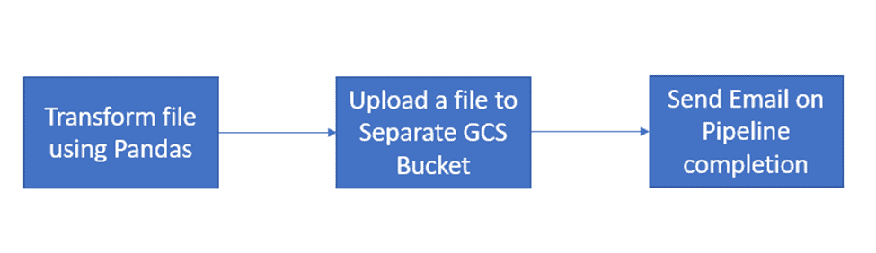

Correct DAG with no loops

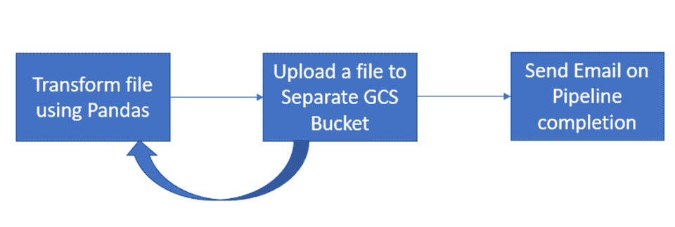

Incorrect DAG with Loop

您可以使用 schedule_interval 属性在 Airflow 中调度 Dag。默认情况下，它是“None ”,这意味着 DAG 只能使用 Airflow UI 运行。

您可以使用 cron 预设选项(@小时、@天、@周、@小时、@月、@年)安排 DAG 每小时、每天、每周、每月或每年运行一次。

如果您需要每 5 分钟、每 10 分钟、每天 14:00 或者在特定的一天(如每周四上午 10:00)运行一次 DAG，那么您应该使用这些基于 cron 的表达式。

*/5 * * * * =每 5 分钟

0 14 * * * =每天 14:00

## 什么是运算符？

DAG 由多个任务组成。您可以使用图中的节点操作符在 DAG 中创建任务。

Airflow 中有各种现成的操作器，例如:

*   localfilesystemtogcsmoperator–使用它将文件从本地上传到 GCS bucket。
*   Python operator——用它来执行 Python 调用。
*   function email operator–用它来发送电子邮件。
*   SimpleHTTPOperator——用它来发出 HTTP 请求。

## 如何创建您的第一个 DAG

我们将要创建的示例 DAG 只包含一个执行 Python 函数的操作符(Python 操作符)。

```
from airflow import DAG
from datetime import datetime
from airflow.operators.python_operator import PythonOperator

def message():
    print("First DAG executed Successfully!!")

with DAG(dag_id="FirstDAG", start_date=datetime(2022,1,23), schedule_interval="@hourly",
         catchup=False) as dag:

    task = PythonOperator(
        task_id="task",
        python_callable=message)

task 
```

第一步是导入 DAG 开发所需的必要模块。线`with DAG`是 DAG，它是一条数据管道，有基本参数如`dag_id`、`start_date`和`schedule_interval`。

`schedule_interval`配置为@hourly，表示 DAG 每小时运行一次。

DAG 中的任务是在日志中打印消息。我们在这里使用了 PythonOperator。该运算符用于执行任何可调用的 Python 函数。

一旦执行完成，我们应该在日志中看到消息“第一个 DAG 执行成功”。我们将在 GCP 云作曲家上执行我们所有的 Dag。

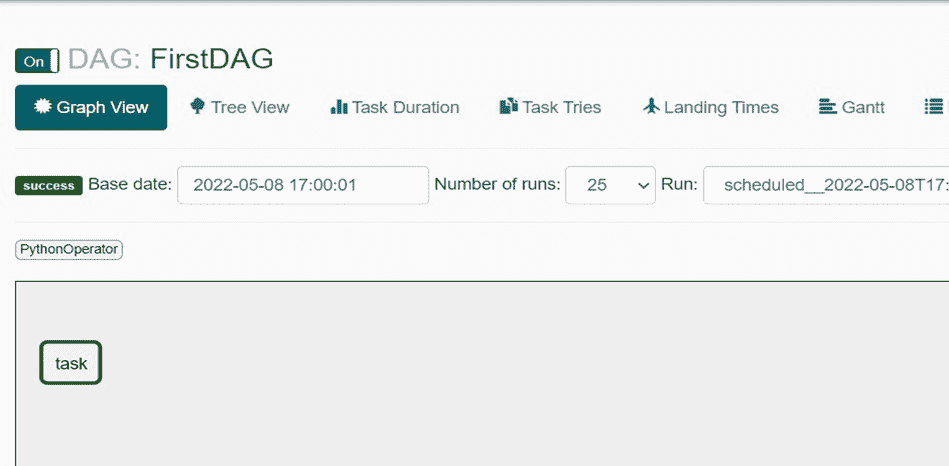

Airflow UI

成功执行后，消息将打印在日志上:

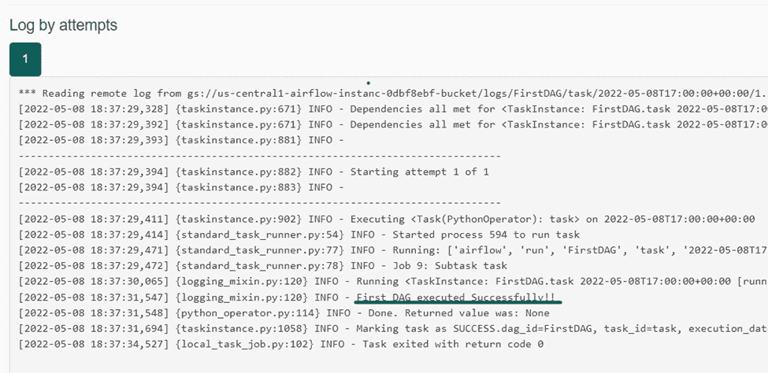

Logs

## Dag 的一个用例

我们将在本文中讨论的用例包括一个三步过程。

在第一步中，我们将在某个输入 GCS 桶中上传一个. csv 文件。这个文件应该由 DAG 中的 PythonOperator 处理。将由 PythonOperator 执行的函数由 Pandas 代码组成，该代码表示用户如何使用 Pandas 代码来转换气流数据管道中的数据。

第二步，我们将上传转换后的。csv 文件到另一个 GCS 存储桶。这项任务将由 GCSToGCSOperator 处理。

第三步是发送状态电子邮件，表明管道执行已完成，将由电子邮件操作员处理。

在这个用例中，我们还将介绍如何在执行的任何步骤失败时通过电子邮件通知团队。

## 如何安装 Cloud Composer

在 GCP，Cloud Composer 是基于 Apache Airflow 的托管服务。Cloud Composer 默认与 GCS、BigQuery、Cloud Dataflow 等其他 GCP 服务集成。

首先，我们需要创建 Cloud Composer 环境。因此，在搜索栏上搜索 Cloud Composer，然后单击“创建环境”，如下所示:

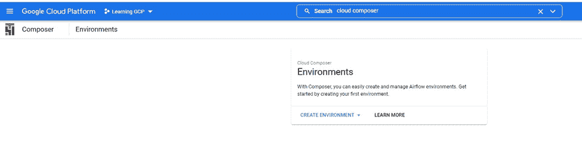

Create Environment

在环境选项中，我选择了“Composer 1”选项，因为我们不需要自动缩放。

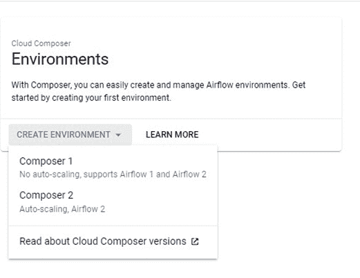

一旦我们选择了我们需要的 composer 类型，我们就需要做一些基本的配置，就像在任何 GCP 托管服务中一样(“实例名”、“位置”等等)。

此处的节点数应始终为 3，因为 GCP 将设置气流所需的 3 个服务。

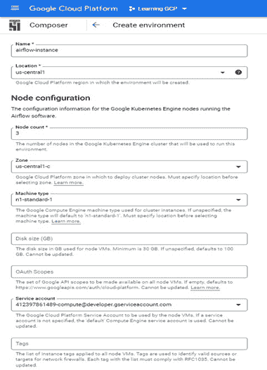

一旦我们完成了，它将为我们建立一个气流实例。要上传 DAG，我们需要打开“DAG 文件夹”部分中显示的 DAG 文件夹。


Airflow Instance

如果你去 GCP 的“Kubernetes 引擎”部分，我们可以看到 3 个服务正在运行:

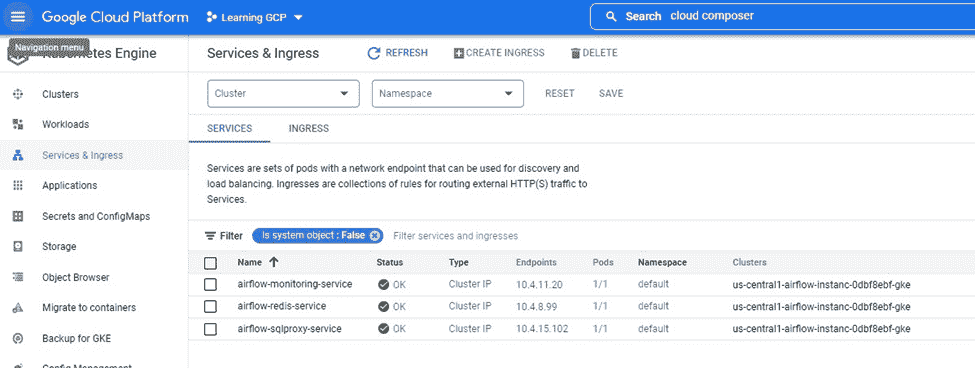

Kubernetes Engine

所有 Dag 将驻留在由气流产生的桶中。

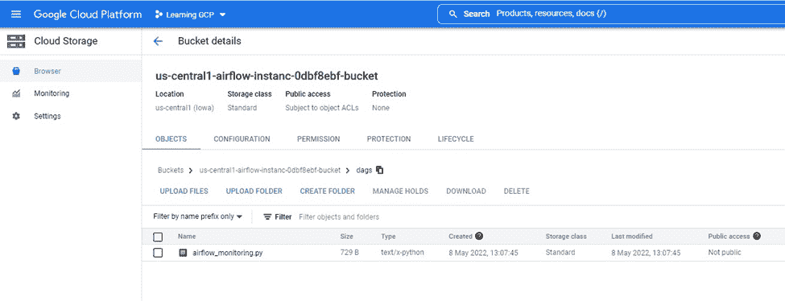

Airflow Instance bucket for DAGs

## 如何在 Composer 上创建和运行管道

在管道中，我们有两个桶。input_csv 将包含需要一些转换的 csv，transformed_csv bucket 将是转换完成后文件上传的位置。

整个管道代码如下:

```
from airflow import DAG
from datetime import datetime
import pandas as pd

from airflow.utils.email import send_email
from airflow.operators.python_operator import PythonOperator
from airflow.operators.email_operator import EmailOperator
from airflow.providers.google.cloud.transfers.gcs_to_gcs import GCSToGCSOperator

def transformation():
    trainDetailsDF = pd.read_csv('gs://input_csv/Event_File_03_16_2022.csv')
    print(trainDetailsDF.head())

with DAG(
        dag_id="pipeline_demo",
        schedule_interval="@hourly",
        start_date=datetime(2022, 1, 23),
        catchup=False
) as dag:
    buisness_logic_task = PythonOperator(
        task_id='ApplyBusinessLogic',
        python_callable=transformation,
        dag=dag)

    upload_task = GCSToGCSOperator(
        task_id='upload_task',
        source_bucket='input_csv',
        destination_bucket='transformed_csv',
        source_object='Event_File_03_16_2022.csv',
        move_object=True,
        dag=dag
    )

    email_task = EmailOperator(
        task_id="SendStatusEmail",
        depends_on_past=True,
        to='youremail',
        subject='Pipeline Status!',
        html_content='<p>Hi Everyone, Process completed Successfully! <p>',
        dag=dag)

    buisness_logic_task >> upload_task >> email_task 
```

在第一个任务中，我们所做的就是从输入文件创建一个数据帧并打印 head 元素。在日志中，它看起来像这样:

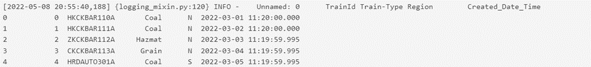

DataFrame Head

在第二个任务 GCSToGCSOperator 中，我们使用了属性 move_object=True，它将从源 bucket 中删除文件。

一旦我们将文件上传到存储桶，我们可以看到 DAG 正在被调度。DAG 的名称是“pipeline_demo”。

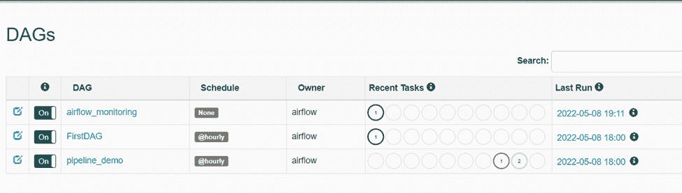

DAGs

请注意，如果您在上传或执行 DAG 后遇到任何“导入错误”,如下所示:

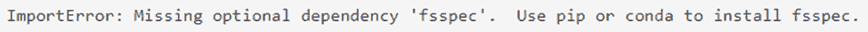

你可以通过 GCP 的“PYPI 包”选项上传这些丢失的包。这将在几分钟后更新环境。

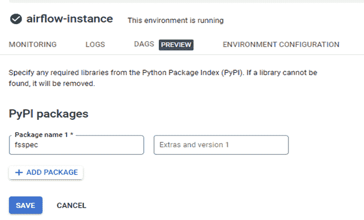

Updating environment with missing Packages

要打开 Airflow UI，请单击 Airflow webserver 下的“Airflow”链接。

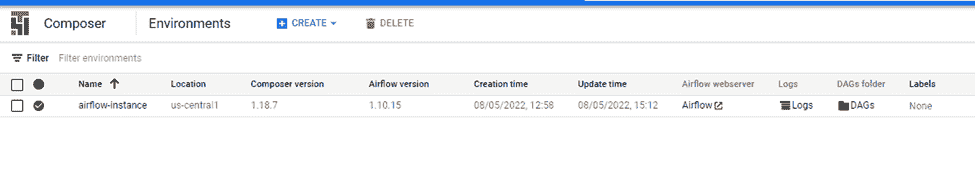

Airflow Instance, click Airflow link to Open UI

气流用户界面如下所示:

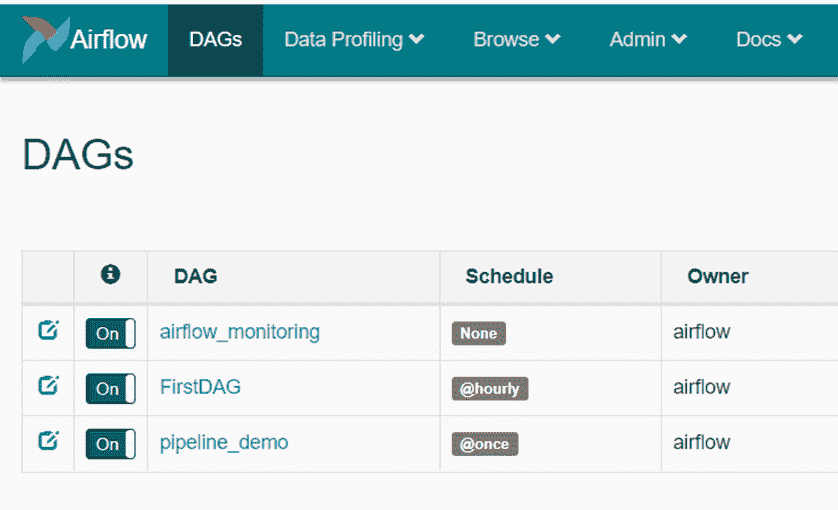

成功执行管道后，您应该会看到以下内容:

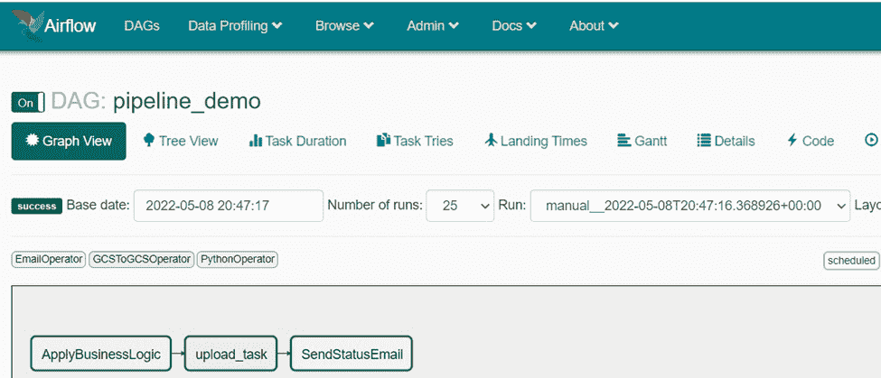

为了在任务失败时发送电子邮件，您可以像这样使用 on_failure_callback:

```
def notify_email(contextDict, **kwargs):
    title = "Airflow alert: {task_name} Failed".format(**contextDict)
    body = """
    Task Name :{task_name} Failed.<br>
    """.format(**contextDict)
    send_email('youremail’, title, body)

buisness_logic_task = PythonOperator(
    task_id='ApplyBusinessLogic',
    python_callable=transformation,
    on_failure_callback=notify_email,
    dag=dag) 
```

我们正在通过 Sendgrid 在 composer 上进行通知电子邮件配置。此外，一旦使用完 Cloud Composer，不要忘记删除实例，因为它无法停止。

## 结论

Apache Airflow 是一个相当易用的工具。现在互联网上也有很多帮助，社区也在成长。

GCP 通过为其创建单独的托管服务，大大简化了与 Airflow 的合作。