# 如何使用 API 优先的平台更快地建立你的网站

> 原文：<https://www.freecodecamp.org/news/how-to-use-api-first-platforms-to-build-your-websites-faster-e917e8318ee/>

作者:迈克·塞齐勒夫斯基


Photo by [Chris Becker](https://unsplash.com/photos/6ErV8fw0l34?utm_source=unsplash&utm_medium=referral&utm_content=creditCopyText) on [Unsplash](https://unsplash.com/?utm_source=unsplash&utm_medium=referral&utm_content=creditCopyText)

# 如何使用 API 优先的平台更快地建立你的网站

像[杰基尔](https://jekyllrb.com/)、[雨果](https://gohugo.io/)或 [Hexo](https://hexo.io/) 这样的工具近年来已经普及了静态网站。所谓的 [JAMstack](https://jamstack.org/) 可以让你在完全没有后端层的情况下交付高度动态的内容。此外，开发人员优先的 API 使前端开发人员能够构建更复杂的功能。他们可以在不离开浏览器沙箱的情况下做到这一点。让我们看看如何利用现代的 API 优先平台来发布一个业务应用程序的可靠原型。本文中介绍的方法可能会成为您的解决方案架构师工具箱中的有用资产。

本教程由两部分组成:

*   第一个将向您展示如何设计应用程序以获得所谓的快乐路径。我们将构建一个半自动的原型，您可以使用它在演示会话中获得用户反馈
*   第二部分解释了如何加快业务流程自动化，以便应用程序可以处理生产中的早期流量

### 什么是 API 优先的平台？

正如来自 ChartMogul 的 Ed Shelley 所描述的，这种服务有几个不容错过的特点:

*   没有用户界面(GUI)。或者在某些情况下，有一个图形用户界面，但它是次要的核心产品。
*   与服务的交互是通过基于 web 的 API 进行的。这是一种以机器可读的方式通过 web 连接服务和传输数据的编程方式。
*   服务的价值通常体现在(通过 API)交付的数据中。
*   定价通常是基于使用的，这意味着成本是基于对 API 的请求数量。

基本上，他们提供的是一套构建模块，通常是 SaaS 模式。这些可以用来用更少的代码构建特定的功能。第一个也可能是最著名的代表是 [Stripe。](https://stripe.com) Stripe 有助于处理支付。然而，你可能听说过最近出现在市场上的其他大鱼，如 [Twilio](https://www.twilio.com/) 或 [Algolia](https://www.algolia.com/) 。

### 为什么要使用 API 优先的平台？

先说一个小小的免责声明。本教程描述了如何在完全没有服务器端的情况下开发应用程序。然而，我们认为这不是一种实用的软件架构方法。

相反，我们想强调您的后端机制中不需要从头实现的部分。当某个特定特性的业务需求不是一成不变的并且你的目标是实际找出它们时，这一点尤其正确。换句话说，就是看看这个功能是否得到了用户的积极响应，并最终在你的产品中占有一席之地。

同时，您不希望将您的产品局限于提供开箱即用解决方案的供应商。这是因为你知道它迟早会导致“工作区地狱”。而且，正如你所知道的，从那里回来是很难的。

举个例子，假设你的公司想要建立一个博客。此外，他们已经表示，他们希望扩展它，并将其货币化。在这种情况下，在提出技术堆栈之前，您需要考虑两个隐含的要求:

*   你想快速发布博客功能——企业不能为一个简单的博客等很久。
*   你不会想以玩弄 Wordpress 插件而告终。

我们想要展示的工具类型可能就是答案。他们给你一些功能性的构建模块，你唯一的任务就是让他们适应你的业务。

您很高兴，因为您可以完全控制您的代码库。此外，管理层也很高兴，因为他们从第一天就获得了价值。另外，他们不必预先付款！

因此，现在让我们向您展示这些工具如何节省数周的工程时间，同时仍然保持您的代码库开放以供更改。

**注意:**我们将要使用的工具也可以在服务器端模式下工作。当使用安全 API 密钥连接时，它们实际上提供了更多的功能。因此，我们认为将它集成在服务器端更加实用。尽管如此，作为实验，我们将只使用客户端功能。此外，我们将使用一些 [Zapier](https://zapier.com/) 胶水来快速自动化不同的业务流程。

### nostalgia.io

我们将为传统网络技术顾问建立一个市场——怀旧网。如果你有机会在基于 Struts 或 Google Web Toolkit 的旧系统上寻求帮助，这是一个好去处。在本教程的第一部分，我们将学习如何利用几个 API 优先的平台来提供以下功能:

*   浏览传统技术
*   专家的全文搜索和过滤
*   预约专家会议
*   优惠券折扣

技术堆栈将包括:

*   作为技术和专家的数据库
*   [Algolia](https://www.algolia.com/) —用于全文搜索
*   [Timekit](https://www.timekit.io/) —用于可用性检查和预订
*   [类型表单](https://www.typeform.com/) —用于表单
*   [凭证](https://www.voucherify.io/) —用于优惠券管理(免责声明:这是我们的产品)

**注意:**我们不会涉及认证和支付处理本身。你可以试着把它们当作作业来实现(提示: [auth0](https://auth0.com/) 和 [Stripe](https://stripe.com) 可能会有帮助)。

让我们直接进入代码。

**注 1:** 为了简洁起见，我们将不描述详细的分步指南。您应该在规范中查找缺失的部分——幸运的是，API 优先的提供商往往有开发人员友好的文档、全面的 API 参考和许多有用的指南。

注 2: 有很多方法可以托管你的静态网站。我们将使用 [glitch](https://glitch.com) 开发平台，这样你就可以很容易地[重新混合](https://glitch.com/about/)它并自己玩它。

**注 3:** 我们不在乎应用程序的外观，以免混淆集成部分，再加上它在某种程度上符合业务主题，不是吗？:)

### 数据模型—内容丰富

通常，应用程序的设计从数据关系模型开始。这也应该是我们首先关注的问题。但是让我们暂时跳过数据库提供商的讨论，直接进入模型。为什么

遇见[心满意足的](https://www.contentful.com/)——一个无头 CMS。简单来说，你可以把它想象成一个没有前端的 Wordpress。

它支持:

*   **开发人员**通过 RESTful API 交付适应媒体的内容，无论是网站、移动应用还是虚拟现实设备
*   **营销人员**在内容建模仪表板和富文本编辑器的支持下，创建、管理和发布内容而无需处理格式

我们将使用 Contentful 创建两个基本实体——技术和专家。一个专家知道一种或多种技术。让我们看看创建这样的实体，添加一些真实的对象，并在静态页面上显示它们是多么容易。

### 技术浏览器

使用 Contentful 的模型管理器，设计实体就像将新字段拖放到数据内容模型管理器中一样简单。有 8 种不同的类型。这些包括默认值，如字符串或数字。还有一些特定的类型，如位置或媒体，它们具有有用的属性。

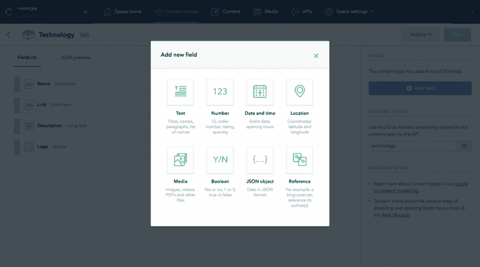

创建一个免费帐户。然后按照登机指南创建一个空间。

最后，创建您的第一个模型，类似于您在下面的截图中看到的内容:

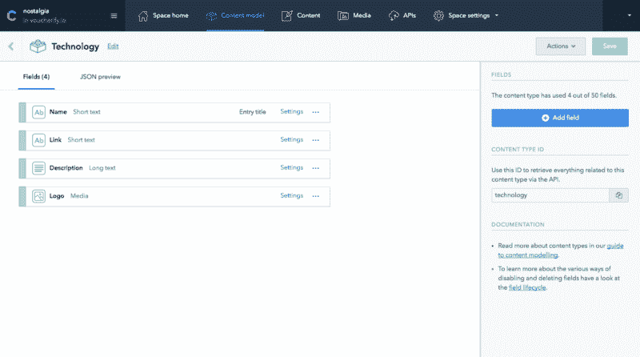

现在您已经有了技术模型，转到 Content 选项卡来创建几个实例。如您所见，Contentful 为数据输入提供了一个直观的编辑器。它负责数据验证、本地化、发布状态、版本控制等等。它首先是一个开发者至上的平台。然而，这些功能也让营销人员和内容管理者感到满意。

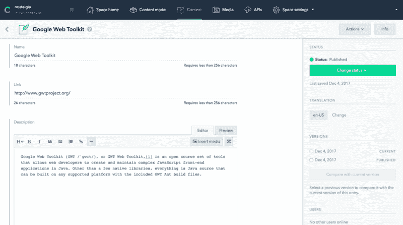

点击够了，让我们开始编码。第一项任务是展示我们刚刚创造的技术。为此，我们将使用 Contentful JavaScript [SDK](https://github.com/contentful/contentful.js) 。

它使获取技术变得简单，并归结为 3 个步骤:

*   创建一个新的 [glitch](https://glitch.com) 网站项目，加载`contentful.js`脚本，并使用您可以在 API 部分找到的凭证对其进行初始化。

**注意:**在 Contentful 中有两种类型的键可用。一个用于内容管理，一个用于内容交付。
第一种类型可用于以编程方式创建、更新或删除新模型或它们的实例。
第二种方式为您提供了一种将内容发布到网站或应用程序的方式。
这种区分是出于安全原因。你不想在你的网站上发布你的内容管理密钥，是吗？这同样适用于我们在本教程中使用的其他 API 优先的平台。

*   调用 [getEntries](https://contentful.github.io/contentful.js/contentful/5.0.5/ContentfulClientAPI.html#.getEntries) 方法。这将根据您的查询参数加载内容。在我们的例子中，我们只想加载“技术”实体。在数据之上构建一些前端。你从 Contentful 得到的是纯粹的 JSON ( [例子](https://gist.github.com/sedzia/56d83d61c35720ecdbe7302c53154888))。现在，您可以随心所欲地向您的用户显示它。当您希望或必须让您的内容适应多种设备时，这是最大的优势之一。

看看这个要点:

```
const client = contentful.createClient({
    space: SPACE_ID,
    accessToken: ACCESS_TOKEN
  })

  const techCards = document.querySelector('#cards');

  function fetchTechnologies () {
    return client.getEntries({
        content_type: "technology"
      })
    .then((response) => response.items)
    .catch((error) => {
      console.log(`\nError occurred while fetching Entries for Technology:`)
      console.error(error)
    })
  }

  fetchTechnologies().then((technologies) => {
    techCards.innerHTML += technologies.map(technology => 
      `<div class="col-md-4">
        <div class="card">
          <a href="${technology.fields.link}"></a>
          <h2><a href="/experts.html?t=${technology.fields.name}">${technology.fields.name}</a></h2>
          <p>${technology.fields.description}</p>
        </div>
      </div>`).join('')
  })
```

contentful.js

又短又甜，不是吗？这里可以看到整体效果[。](https://glitch.com/edit/#!/meteor-rooster?path=index.html)

### 添加专家和搜索

所以，现在我们想在有人选择某项技术时显示专家列表。这应该类似于我们刚刚用技术做的事情。但是让我们把它变得更高级一点。如果我们想让专家变得可搜索呢？想想他们个人资料中的全文搜索和价格过滤器。

当然，你可以在 Contentful 的基础上构建它。比如再添加一个实体，用`getEntries`配置搜索机制和 UI，但是有更快的方法。我所说的更快是指实现时间和加载搜索结果的速度。

我们将使用另一个 API 提供者— [Algolia](https://www.algolia.com/) 。他们的平台使得构建和维护超快速全文搜索变得容易。他们负责错别字容忍、同义词、地理搜索和其他小问题。当你的搜索功能投入生产时，这些问题是你最有可能碰到的。

它是如何工作的？您只需使用 RESTful API 向他们的引擎提供数据。然后，您可以配置哪些属性应该是可搜索的，以及应该如何对结果进行排序。最后，使用他们的 JavaScript SDK，您可以向任何网站提供即时搜索体验。现在就让我们的专家变得可搜索吧！

我们将首先在 Contentful 中创建一个数据模型，并创建与技术实体的关系。然后，我们将构建一个 Algolia 索引，并将我们的实体(JSON 格式)添加到其中。

使用您可以在下面看到的字段添加另一个内容模型:

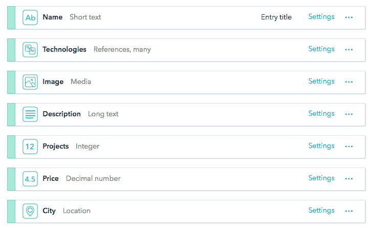

请注意，我们已经使用引用字段类型建立了一对多关系。我们只是想反映出，任何专家都可能知道不止一种技术。一旦准备好，添加一些专家，并手动分配他们的技术。为一个专家使用多种技术。

您最终应该会得到一个类似的列表:

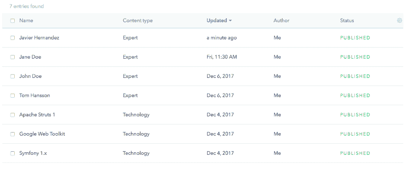

JSON 结构看起来像这样:

```
 {
   "sys":{
      "space":{
         "sys":{
            "type":"Link",
            "linkType":"Space",
            "id":"n763nxcwuf4y"
         }
      },
      "id":"1mn1mwlwAcQWqgQamsIEmW",
      "type":"Entry",
      "createdAt":"2017-12-05T11:29:35.202Z",
      "updatedAt":"2017-12-13T10:04:52.381Z",
      "revision":7,
      "contentType":{
         "sys":{
            "type":"Link",
            "linkType":"ContentType",
            "id":"expert"
         }
      },
      "locale":"en-US"
   },
   "fields":{
      "name":"Javier Hernandez",
      "technologies":[
         {
            "sys":{
               "type":"Link",
               "linkType":"Entry",
               "id":"5oKmKwfdjGO2cCaCkwamKW"
            }
         },
         {
            "sys":{
               "type":"Link",
               "linkType":"Entry",
               "id":"7Dtej0GnXqw6cSIMmA6Cko"
            }
         }
      ],
      "image":{
         "sys":{
            "type":"Link",
            "linkType":"Asset",
            "id":"4RZoQOCwvCMEWMMCuqA0ey"
         }
      },
      "description":"Lorem ipsum dolor sit amet, consectetur adipiscing elit, sed do eiusmod tempor incididunt ut labore et dolore magna aliqua. Sed faucibus turpis in eu mi bibendum. Mauris in aliquam sem fringilla ut. Tincidunt nunc pulvinar sapien et ligula. ",
      "projects":53,
      "price":40,
      "city":{
         "lon":2.2247314453125,
         "lat":41.36933709640475
      }
   }
}
```

expert.json

让我们把我们的专家上传到 Algolia。注册一个免费账户，进入指数部分并运行`NEW INDEX.`

现在我们需要将我们的实体从 Contentful 转移到 Algolia。我们可以使用专用的[迁移器](https://github.com/drublic/contentful-to-algolia)。这是一个神奇的工具，可以自动加载你的内容。然后，它从有效的 JSONs 中删除内容丰富的系统信息(参见上面的要点),在这种情况下，这是多余的。也可以化解关系。例如，当涉及到“技术”字段时，您将发送实际的名称，而不是 id。最后，它与阿尔戈利亚指数同步。

但是我们会故意手动操作。我们需要在构建索引的方式上做一点小小的改进。因此，在我们的情况下，一对一地与迁移器同步不是一个选项。

当我们在一个技术网站中使用搜索输入时，我们自然希望在搜索结果中只包括所选技术的专家。正如您在专家 JSON 示例中看到的，技术被表示为一组对象。问题是你不能用 Algolia 构建一个基于嵌套对象数组过滤数据的方面。

他们建议将专家对象分成与技术数量一样多的子对象。因此，在哈维尔·埃尔南德斯的例子中，他知道两个框架，我们应该添加两个对象:

```
{
  name: "Javier Hernandez", 
  technologies: { 
    name: “Google Web Toolkit”
    … // other properties
  }
  … // other properties
} 
{
  name: "Javier Hernandez" 
  technologies: { 
    name: “Apache Struts 1”
    … // other properties
  }
  … // other properties
}
```

作为练习，您可以创建一个脚本来拆分专家，并通过 Algolia API 将他们添加到索引中。您将需要 Algolia 服务器端认证密钥。这里有一个处理分割逻辑的片段。请注意，该脚本还会清除 Contentful 的系统信息。

这使得物体更轻会使搜索更快:

```
client.getEntries({ content_type: "expert" })
  .then((response) => {

    const denormalized = [].concat(...response.items.map(item => {
      let arr = []

      item.fields.contentfulID = item.sys.id
      delete item.sys

      item.fields.technologies.forEach(tech => {
        const i = JSON.parse(JSON.stringify(item))
        i.fields.technologies = tech.fields
        i.fields.image = item.fields.image.fields
        arr.push(i.fields)
      })
      return arr
    }))
    console.log(JSON.stringify(denormalized))
  })
  .catch((error) => {
    console.log(`\nError occurred while fetching Entries for Expert:`)
    console.error(error)
  })
```

split.js

因为我们有 6 个专家，其中 2 个知道 2 种技术，所以我们应该在索引中有 8 个对象。作为 API 插入方法的替代方法，您可以使用仪表板上传它们。上传后，您可以尝试使用仪表板中的搜索来查看 Algolia 过滤数据的速度。

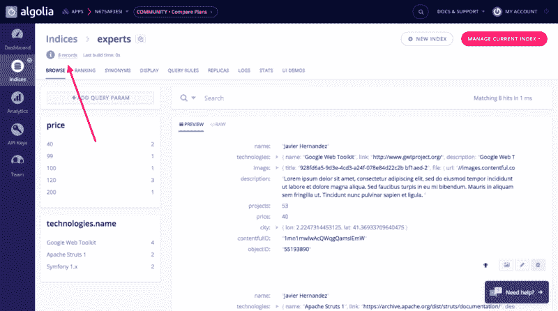

现在，我们几乎准备好将我们的搜索连接到 Algolia。几乎是——因为我们需要创建一个方面，允许我们通过技术和价格过滤结果。转到显示器，在“刻面属性”中选择`technology.name`和`price` ，然后保存。

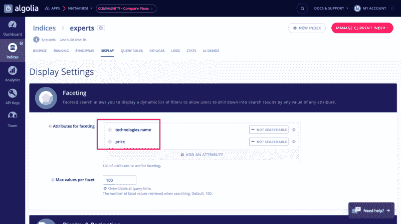

最后，我们可以将我们的搜索连接到我们的索引，以便它检索和显示结果。Algolia 附带了一个高级 JavaScript 库，使它变得非常简单。

看一下这段代码:

```
const isConfig = {
    appId: 'N675AF3ESI',
    apiKey: '14b65c352deb9a505131d3d00cba2f6c',
    indexName: 'experts',
    urlSync: false
  }

isConfig.searchParameters = {
  filters: `technologies.name:"${selectedTechnology}"`
}

const search = instantsearch(isConfig)

search.addWidget(
  instantsearch.widgets.searchBox({
    container: '#search-input'
  })
)

search.addWidget(
  instantsearch.widgets.hits({
    container: '#hits',
    hitsPerPage: 10,
    templates: {
      item: document.getElementById('hit-template').innerHTML,
      empty: "We didn't find any results for the search <em>\"{{query}}\"</em>"
    },
    cssClasses: {
      root: 'row',
      item: 'col-md-4'
    }
  })
)

search.addWidget(
  instantsearch.widgets.rangeSlider({
    container: '#price-refinement',
    attributeName: 'price',
    tooltips: {
      format: function(rawValue) {
        return '

algolia.js

注意我们在第 8–10 行是如何配置搜索来使用技术过滤器的。看看将结果页面调整到相应的容器有多容易——第 28 行(尽管在文档中很难找到)。

总的来说，大约有 24 行，你会得到这个:

[https://giphy.com/embed/3o751QR0q4ELZfyICs](https://giphy.com/embed/3o751QR0q4ELZfyICs)

到目前为止，我们已经构建了一个简单的支持全文搜索和价格滑块的专家浏览器。在这个阶段添加新专家很麻烦，因为你必须首先在 Contentful 中手动创建他们，然后与 Algolia 同步。我们将在第二部分中自动完成这项工作。

好消息是，您已经可以使用这个原型为技术浏览和专家筛选获得一些早期反馈。下一步是创建专家资料页面并启用预订。

搜索演示代码可以在[experts.html](https://glitch.com/edit/#!/nostalgia?path=experts.html)中找到。

### 登记

正如您可能已经猜到的，我们也不会从头开始实现日历功能。我们将使用[时间套件](https://www.timekit.io/)。他们提供 API + dashboard 来管理人员和资源的日历和预订。可以把它想象成一个用 REST API 公开的 Google/Outlook 日历引擎。

使用 Timekit 使专家可预订的过程如下:

*   创建资源实体和分配的日历实体
*   将资源和日历 id 存储在 Contentful 中相应的专家实体中
*   使用 Timekit JS SDK 在专家的个人资料页面上显示日历

就这样，您就可以开始预订了！不相信我？请继续阅读:

*   创建一个帐户并开始一个[免费试用](https://www.timekit.io/)(没有免费版本)。
*   创建一个项目，您将在其中定义基本的日历机制。例如，事件持续时间、最少通知和提醒。
*   定义预订请求是应该自动接受还是必须手动确认。

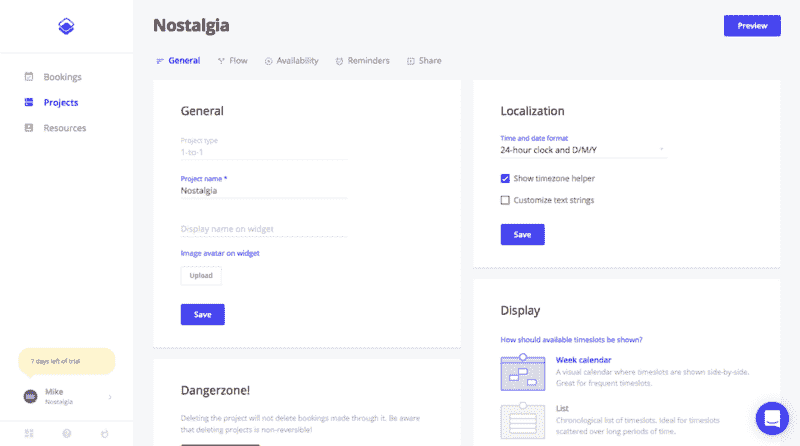

为每个专家创建一个资源，并在该资源中创建一个日历。请注意，一个资源可能有多个日历。

当我们计划对怀旧公司的商业模式进行升级时，这是一个很好的特点。

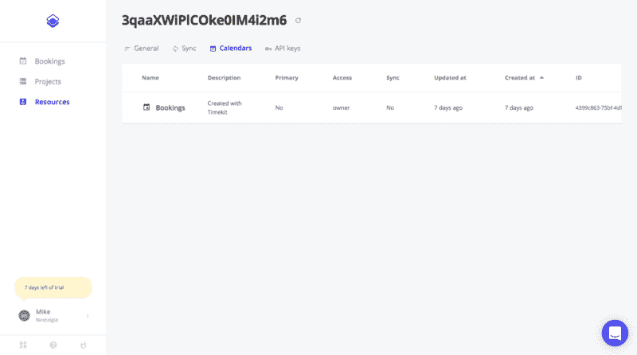

现在，我们必须将资源的电子邮件、新创建的日历 ID 和客户端 API 键存储在 Contentful 中相应的专家实体中。

您可以编辑专家内容模型并添加一个名为`timekit`的 JSON 字段。然后，修改专家实体以添加`timekit`细节。

最后一步是在专家的个人资料页面中显示实际的日历。你已经知道流程了。包括一个 SDK 脚本，并对其进行适当配置以呈现小部件。

但是这次我们需要加载两个库:

*   Contentful —加载客户详细信息，包括 Timekit 凭据
*   Timekit —放置分配给给定专家的日历

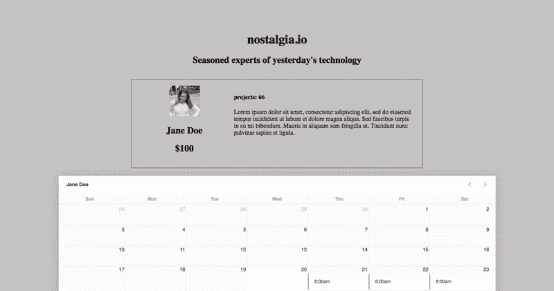

代码如下:

```
const widget = new TimekitBooking()

const client = contentful.createClient({
  space: SPACE_ID,
  accessToken: ACCESS_TOKEN
})

client.getEntries({'sys.id': expertId}).then((response) => {
  const e = response.items[0].fields

  expertWidget.innerHTML=
  `
  <div class="row card hit">
    <div class="col-md-4">
        <div class="hit-image">
          
          <h2 class="hit-name">${e.name}</h2>
          <h2 class="hit-price">$<span id="priceTag">${e.price}</span></h2>
        </div>
    </div>
    <div class="col-md-8 start-xs">
        <div class="hit-content">
          <h4 class="hit-price">projects: ${e.projects} </h4>
          <p class="hit-description">${e.description}</p>
        </div>
    </div>
  </div>
  `

  const timekitConf = e.timekit

  widget.init({
      targetEl: '#bookingjs',
      app:      'nostalgia-4592',
      apiToken: timekitConf.apiToken,
      email:    timekitConf.email,
      calendar: timekitConf.calendar,
      name:     'Jane Doe',
      timekitFindTime: {
        length: '3 hours',
        start: 'tomorrow',
        filters: {
          and: [
            { specific_time: { start: '8', end: '17' }}
          ]
        }
      },
      fullCalendar: {
        defaultView: 'month'
      }
    })    

})
.catch((error) => {
  console.log(`\nError occurred while fetching Entries for Expert:`)
  console.error(error)
})
```

timekit.js

注意我们如何调整预订细节，比如时间段(第 39 行)。Timekit 提供了更多的定制功能，所以请务必阅读 [booking.js](https://github.com/timekit-io/booking-js) 规范。

这种效果让我们大吃一惊。二十行代码，我们就有了预订小部件。Timekit 为您监督整个过程。它有助于解决冲突，并向专家和客户发送电子邮件确认。

最重要的是，这种方法非常灵活。这都是代码。这个机制的每一部分都可以通过 API 进行调整。

例如，假设我们想在接受预订请求之前查看它。碰巧的是，Timekit 使单一标志成为可能。这些选项是 API 优先解决方案的真正力量。请务必阅读教程和文档以了解所有特性。

### 优惠券

怀旧还不是一个广为人知的行业。我们需要找到一些方法来吸引早期用户。最古老和最成功的方法之一是折扣。折扣可能在兑现优惠券后应用，也可能因为购物车中的产品数量而应用。为了实现这两种情况，您可能想要使用 [Voucherify](https://www.voucherify.io/) 。

为什么要凭证？当你想正确处理优惠券以节省大量工程时间时，有几件基本的事情你应该做好:

*   优惠券代码的唯一性——减少欺诈，精确跟踪促销活动
*   可扩展优惠券验证机制—这是一种通用方法，能够添加/删除/终止多个优惠券代码
*   轻松监控兑换——这将立即回答营销和客户服务部门的问题

你可以自己处理这三件事。然而，使用 Voucherify API 端点的几行代码可以得到相同的结果。通过这样做，您可以立即忘记优惠券滥用，维护“如果”阶梯验证代码是否有效。你也可以放弃向营销团队提供优惠券活动结果。您也不会深入查看日志来了解客户赎回失败的原因。

让我们创建一个批量 1000 优惠券。这些我们将发送给我们的早期用户。最后，让我们给客户在我们的网站上实际使用它们的可能性，以享受折扣价格。

注册一个优惠券账户，然后去[活动经理](http://support.voucherify.io/article/17-how-do-i-create-my-first-campaign)那里创建第一批优惠券代码。假设每张优惠券都有 25%的折扣。

在管理器中，您可以指定折扣详细信息和其他业务限制。例如，指定到期日、最大总金额或符合折扣条件的特定客户群。

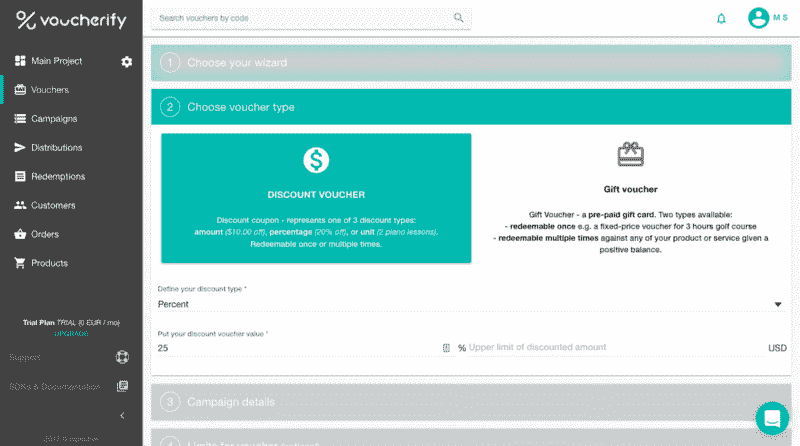

经理搞定了，你就可以开始通过各种渠道发放优惠券了。Voucherify 提供电子邮件、短信、推送通知、内部通信或开箱即用。但是由于 REST API 和 webhooks，还有很多其他的方法。

在发送之前，您应该给客户一个赎回的选择。这可以通过使用 API 中的[赎回](https://docs.voucherify.io/reference#redeem-voucher)端点来实现。然而，你也可以使用来自 [voucherify.js](https://github.com/rspective/voucherify.js) 的预建部件。

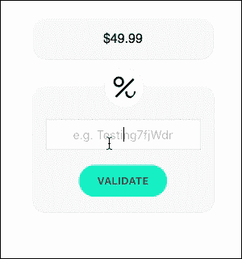

Voucherify 允许您验证或兑换优惠券。

验证检查是否:

*   优惠券来自你的优惠券账户
*   未过期或被禁用
*   它符合所有的商业规则

兑换首先进行验证，随后****将优惠券标记为已使用**。在这一部分中，我们将连接验证，只向客户显示折扣价。在第二篇文章中，当预订被确认时，我们将发送一个赎回请求。**

**包括`voucherify.js`片段和可选的相应 CSS 文件，以获得更好的外观和感觉。然后，输入以下代码:**

```
`Voucherify.initialize(
    "4dde7477-d8d1-4057-8f91-8a9e7137acee",
    "404c6c0b-4445-4f14-84b1-f4a58f1da2f6"
)

Voucherify.render("#voucher-widget", {
    textPlaceholder: "Your coupon...",
    onValidated: function(response) {
      if (response) {
        const priceTag = document.querySelector('#priceTag') 
        priceTag.innerHTML = Voucherify.utils.calculatePrice(parseInt(priceTag.innerHTML), response)
      }
    }
})`
```

**voucherify.js**

**该库将呈现一个优惠券小部件，该部件根据 Voucherify API 自动验证代码。**

**你可以用我们用活动管理器预先生成的代码来测试一下:
*七五折: *nstlg-CCAMIDFf、nstlg-wZK4CoLs、nstlg-V8eV9A3p*
* $5 折: *uub-nstlg、afl-nstlg、yeq-nstlg*
*** 过期代码 *: VuFF2Wyy***

**请注意，您可以轻松定制代码模式、前缀和后缀，这对跟踪和报告非常有用。**

**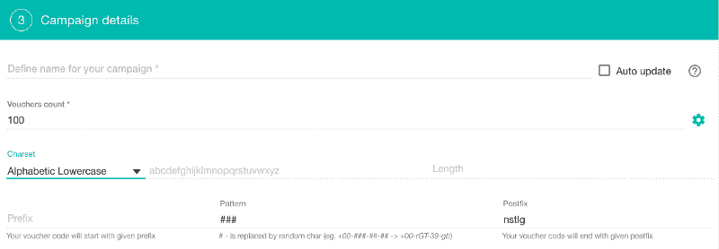**

**现在，将任何优惠券代码粘贴到小部件中，并查看应用的相应折扣:**

**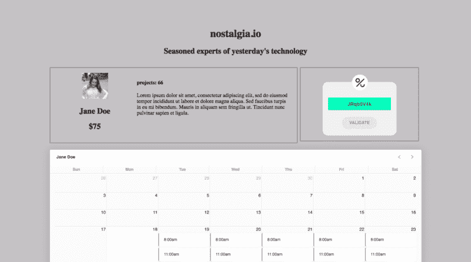**

**在第二篇文章中，我们将向您展示如何监控成功和失败的优惠券兑换，以了解您的促销活动是否正常进行。**

**Voucherify 提供的远不止这些。查看[文档](https://docs.voucherify.io)和[示例](http://docs.voucherify.io/docs/examples)，了解如何在几天内而不是几个月内建立高级促销和推荐计划。**

**你可以在这里找到预订页面代码([scheduler.html](https://glitch.com/edit/#!/nostalgia?path=scheduler.html))。**

### **概述**

**我们计划为一个新的商业应用——怀旧. io 建立一个概念验证，一个我们可以用来收集早期用户的大脑的原型。我们可以在适当的时间框架内交付，但不完全是一次性的。**

**希望我们已经让你相信，有了像 **Contentful** 、 **Algolia** 、 **Timekit** 或**vouchi fy**这样的开发者优先的工具，你就可以实现它。更重要的是，您根本不需要设置任何后端层就可以做到这一点。**

**它仍然需要一些手动工作来保持工具之间的数据同步。然而，这些唾手可得的 API 优先工具的灵活性和迭代速度无疑弥补了这一点。**

**当然，这些工具并不都是轻便明亮的。例如，在阅读本文时，我们碰到了以下几个问题:**

*   **Contentful `getEntry()`方法不解析链接。我们不得不使用`getEntries()`来获得一个带有个人资料图片 URL 的专家实体**
*   **我们花了不少时间来理解如何使用列布局(默认为行)显示结果**
*   **Timekit 不允许使用外部 id 获取日历实例配置。这就是为什么我们需要在 Contentful 的专家实体中存储日历令牌**
*   **Voucherify 小部件不允许您在不刷新网站的情况下尝试另一个有效代码**

**我敢肯定还有很多。但是，与从头开始构建这些功能相比，您可以用更少的时间来解决这些小问题。最重要的是，您避免了这些平台的团队在您之前所犯的严重且耗时的架构错误。**

**项目的源代码可以在[这里](https://glitch.com/edit/#!/nostalgia?path=index.html:1:0)找到。这里是现场演示！**

### **硬化和结垢**

**如您所见，有些流程仍然是手动的，因此很繁琐:**

*   **添加新专家**
*   **让专家变得可搜索**
*   **为专家创建日历**

**在下一部分中，我们将使用 [Zapier](https://zapier.com/) 来粘合这些服务。Zapier 是一个有助于连接 API 优先平台的平台。这样，我们将减少运行上述业务流程所需的手工工作。例如，专家可以自己报名。此外，该平台将以编程方式创建所有必要的实体。**

**最后，我们将把原型推向生产。它仍将是一个早期的应用程序，但它将更加强大，并准备好为真正的客户服务。敬请期待！**

****更新**:你可以在这里找到第二部[。](https://www.freecodecamp.org/news/how-to-use-api-first-platforms-to-build-your-websites-faster-part-2-68085d7cdf36/)** + Math.round(rawValue).toLocaleString();
      }
    }
  })
)

search.start()
```

algolia.js

注意我们在第 8–10 行是如何配置搜索来使用技术过滤器的。看看将结果页面调整到相应的容器有多容易——第 28 行(尽管在文档中很难找到)。

总的来说，大约有 24 行，你会得到这个:

[https://giphy.com/embed/3o751QR0q4ELZfyICs](https://giphy.com/embed/3o751QR0q4ELZfyICs)

到目前为止，我们已经构建了一个简单的支持全文搜索和价格滑块的专家浏览器。在这个阶段添加新专家很麻烦，因为你必须首先在 Contentful 中手动创建他们，然后与 Algolia 同步。我们将在第二部分中自动完成这项工作。

好消息是，您已经可以使用这个原型为技术浏览和专家筛选获得一些早期反馈。下一步是创建专家资料页面并启用预订。

搜索演示代码可以在[experts.html](https://glitch.com/edit/#!/nostalgia?path=experts.html)中找到。

### 登记

正如您可能已经猜到的，我们也不会从头开始实现日历功能。我们将使用[时间套件](https://www.timekit.io/)。他们提供 API + dashboard 来管理人员和资源的日历和预订。可以把它想象成一个用 REST API 公开的 Google/Outlook 日历引擎。

使用 Timekit 使专家可预订的过程如下:

*   创建资源实体和分配的日历实体
*   将资源和日历 id 存储在 Contentful 中相应的专家实体中
*   使用 Timekit JS SDK 在专家的个人资料页面上显示日历

就这样，您就可以开始预订了！不相信我？请继续阅读:

*   创建一个帐户并开始一个[免费试用](https://www.timekit.io/)(没有免费版本)。
*   创建一个项目，您将在其中定义基本的日历机制。例如，事件持续时间、最少通知和提醒。
*   定义预订请求是应该自动接受还是必须手动确认。


为每个专家创建一个资源，并在该资源中创建一个日历。请注意，一个资源可能有多个日历。

当我们计划对怀旧公司的商业模式进行升级时，这是一个很好的特点。


现在，我们必须将资源的电子邮件、新创建的日历 ID 和客户端 API 键存储在 Contentful 中相应的专家实体中。

您可以编辑专家内容模型并添加一个名为`timekit`的 JSON 字段。然后，修改专家实体以添加`timekit`细节。

最后一步是在专家的个人资料页面中显示实际的日历。你已经知道流程了。包括一个 SDK 脚本，并对其进行适当配置以呈现小部件。

但是这次我们需要加载两个库:

*   Contentful —加载客户详细信息，包括 Timekit 凭据
*   Timekit —放置分配给给定专家的日历


代码如下:

[PRE5]

timekit.js

注意我们如何调整预订细节，比如时间段(第 39 行)。Timekit 提供了更多的定制功能，所以请务必阅读 [booking.js](https://github.com/timekit-io/booking-js) 规范。

这种效果让我们大吃一惊。二十行代码，我们就有了预订小部件。Timekit 为您监督整个过程。它有助于解决冲突，并向专家和客户发送电子邮件确认。

最重要的是，这种方法非常灵活。这都是代码。这个机制的每一部分都可以通过 API 进行调整。

例如，假设我们想在接受预订请求之前查看它。碰巧的是，Timekit 使单一标志成为可能。这些选项是 API 优先解决方案的真正力量。请务必阅读教程和文档以了解所有特性。

### 优惠券

怀旧还不是一个广为人知的行业。我们需要找到一些方法来吸引早期用户。最古老和最成功的方法之一是折扣。折扣可能在兑现优惠券后应用，也可能因为购物车中的产品数量而应用。为了实现这两种情况，您可能想要使用 [Voucherify](https://www.voucherify.io/) 。

为什么要凭证？当你想正确处理优惠券以节省大量工程时间时，有几件基本的事情你应该做好:

*   优惠券代码的唯一性——减少欺诈，精确跟踪促销活动
*   可扩展优惠券验证机制—这是一种通用方法，能够添加/删除/终止多个优惠券代码
*   轻松监控兑换——这将立即回答营销和客户服务部门的问题

你可以自己处理这三件事。然而，使用 Voucherify API 端点的几行代码可以得到相同的结果。通过这样做，您可以立即忘记优惠券滥用，维护“如果”阶梯验证代码是否有效。你也可以放弃向营销团队提供优惠券活动结果。您也不会深入查看日志来了解客户赎回失败的原因。

让我们创建一个批量 1000 优惠券。这些我们将发送给我们的早期用户。最后，让我们给客户在我们的网站上实际使用它们的可能性，以享受折扣价格。

注册一个优惠券账户，然后去[活动经理](http://support.voucherify.io/article/17-how-do-i-create-my-first-campaign)那里创建第一批优惠券代码。假设每张优惠券都有 25%的折扣。

在管理器中，您可以指定折扣详细信息和其他业务限制。例如，指定到期日、最大总金额或符合折扣条件的特定客户群。


经理搞定了，你就可以开始通过各种渠道发放优惠券了。Voucherify 提供电子邮件、短信、推送通知、内部通信或开箱即用。但是由于 REST API 和 webhooks，还有很多其他的方法。

在发送之前，您应该给客户一个赎回的选择。这可以通过使用 API 中的[赎回](https://docs.voucherify.io/reference#redeem-voucher)端点来实现。然而，你也可以使用来自 [voucherify.js](https://github.com/rspective/voucherify.js) 的预建部件。


Voucherify 允许您验证或兑换优惠券。

验证检查是否:

*   优惠券来自你的优惠券账户
*   未过期或被禁用
*   它符合所有的商业规则

兑换首先进行验证，随后****将优惠券标记为已使用**。在这一部分中，我们将连接验证，只向客户显示折扣价。在第二篇文章中，当预订被确认时，我们将发送一个赎回请求。**

**包括`voucherify.js`片段和可选的相应 CSS 文件，以获得更好的外观和感觉。然后，输入以下代码:**

[PRE6]

**voucherify.js**

**该库将呈现一个优惠券小部件，该部件根据 Voucherify API 自动验证代码。**

**你可以用我们用活动管理器预先生成的代码来测试一下:
*七五折: *nstlg-CCAMIDFf、nstlg-wZK4CoLs、nstlg-V8eV9A3p*
* $5 折: *uub-nstlg、afl-nstlg、yeq-nstlg*
*** 过期代码 *: VuFF2Wyy***

**请注意，您可以轻松定制代码模式、前缀和后缀，这对跟踪和报告非常有用。**

****

**现在，将任何优惠券代码粘贴到小部件中，并查看应用的相应折扣:**

****

**在第二篇文章中，我们将向您展示如何监控成功和失败的优惠券兑换，以了解您的促销活动是否正常进行。**

**Voucherify 提供的远不止这些。查看[文档](https://docs.voucherify.io)和[示例](http://docs.voucherify.io/docs/examples)，了解如何在几天内而不是几个月内建立高级促销和推荐计划。**

**你可以在这里找到预订页面代码([scheduler.html](https://glitch.com/edit/#!/nostalgia?path=scheduler.html))。**

### **概述**

**我们计划为一个新的商业应用——怀旧. io 建立一个概念验证，一个我们可以用来收集早期用户的大脑的原型。我们可以在适当的时间框架内交付，但不完全是一次性的。**

**希望我们已经让你相信，有了像 **Contentful** 、 **Algolia** 、 **Timekit** 或**vouchi fy**这样的开发者优先的工具，你就可以实现它。更重要的是，您根本不需要设置任何后端层就可以做到这一点。**

**它仍然需要一些手动工作来保持工具之间的数据同步。然而，这些唾手可得的 API 优先工具的灵活性和迭代速度无疑弥补了这一点。**

**当然，这些工具并不都是轻便明亮的。例如，在阅读本文时，我们碰到了以下几个问题:**

*   **Contentful `getEntry()`方法不解析链接。我们不得不使用`getEntries()`来获得一个带有个人资料图片 URL 的专家实体**
*   **我们花了不少时间来理解如何使用列布局(默认为行)显示结果**
*   **Timekit 不允许使用外部 id 获取日历实例配置。这就是为什么我们需要在 Contentful 的专家实体中存储日历令牌**
*   **Voucherify 小部件不允许您在不刷新网站的情况下尝试另一个有效代码**

**我敢肯定还有很多。但是，与从头开始构建这些功能相比，您可以用更少的时间来解决这些小问题。最重要的是，您避免了这些平台的团队在您之前所犯的严重且耗时的架构错误。**

**项目的源代码可以在[这里](https://glitch.com/edit/#!/nostalgia?path=index.html:1:0)找到。这里是现场演示！**

### **硬化和结垢**

**如您所见，有些流程仍然是手动的，因此很繁琐:**

*   **添加新专家**
*   **让专家变得可搜索**
*   **为专家创建日历**

**在下一部分中，我们将使用 [Zapier](https://zapier.com/) 来粘合这些服务。Zapier 是一个有助于连接 API 优先平台的平台。这样，我们将减少运行上述业务流程所需的手工工作。例如，专家可以自己报名。此外，该平台将以编程方式创建所有必要的实体。**

**最后，我们将把原型推向生产。它仍将是一个早期的应用程序，但它将更加强大，并准备好为真正的客户服务。敬请期待！**

****更新**:你可以在这里找到第二部[。](https://www.freecodecamp.org/news/how-to-use-api-first-platforms-to-build-your-websites-faster-part-2-68085d7cdf36/)**