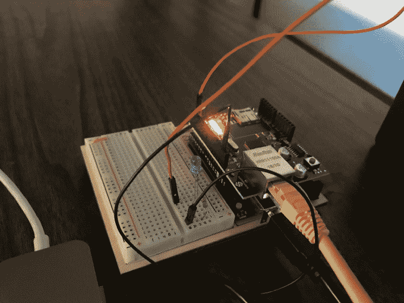

# 如何使用 Arduino 检查您的 web 服务器的响应状态

> 原文：<https://www.freecodecamp.org/news/how-to-use-arduino-to-check-your-web-servers-response-status-9e47e02a61cc/>

作者 Harshita Arora

# 如何使用 Arduino 检查您的 web 服务器的响应状态

Photo by [Mathew Schwartz](https://unsplash.com/photos/iGheu30xAi8?utm_source=unsplash&utm_medium=referral&utm_content=creditCopyText) on [Unsplash](https://unsplash.com/search/photos/arduino?utm_source=unsplash&utm_medium=referral&utm_content=creditCopyText)

去年，我创建了[加密价格追踪器](https://itunes.apple.com/us/app/crypto-price-tracker/id1333696099?ls=1&mt=8)(一款今年被 Redwood City Ventures 收购的应用)。我团队的一名后端成员一直在使用 Arduino 设置来持续检查 web 服务器的响应状态，以便随时获得更新。我发现这个设置非常有用和有趣。

我对此进行了研究，并为自己重新创建了设置。在本文中，我也将向您展示如何自己构建它。

#### 你需要的东西:

1.  Arduino Uno
2.  [Arduino 的以太网屏蔽](http://a.co/d/cLNijNF)(将 Arduino 连接到互联网)
3.  以太网电缆
4.  A/B 型 USB 2.0 电缆(Arduino 的电源线)
5.  公对公跳线电缆(x2)
6.  试验板
7.  发光二极管(x1，任何颜色)
8.  电阻器(x1，> 100 欧姆起作用)

#### 设置它

1.  在 Arduino 上安装/插入以太网屏蔽。
2.  将 LED 的正极(较长)端插入试验板插槽 6a，负极(较短)端插入插槽 5a。
3.  将**电阻**的一端插入试验板插槽 1b，另一端插入插槽 5b。
4.  将**第一根**跨接电缆的一端插入试验板插槽 1e。将另一端插入以太网屏蔽的 GND 插槽中。
5.  将**第二根**跨接电缆的一端插入试验板插槽 6e。将另一端插入以太网屏蔽的引脚插槽 2。
6.  将**以太网**电缆从您的路由器连接到您的以太网屏蔽。

这是我的设置的样子:

7.在您的机器上打开一个命令行界面，检查并记下您的默认网关。这可以使用 Windows 上的`ipconfig` 命令或 Linux/Mac 上的`netstat -nr | grep default` 命令来完成。

8.如果您还没有安装 Arduino IDE，请下载并安装它。

9.打开 IDE 并转到文件`-&`gt；exampl`es`->Eth`er`net->webclient repeating。您应该会看到以下代码:

10.编辑**行 37** 成为默认网关 IP 范围(1–254)内的 IP 地址。例如，如果我的默认网关是 10.0.0.1，那么我可以使用从 10.0.0.2 到 10.0.0.254 的 IP 地址。但是，确保您使用的 IP 地址不与网络上的任何其他 IP 地址冲突是很重要的。

对于这个例子，我将代码行改为:

`**IPAddress ip(10, 0, 0, 2);**`

11.将第**行第 40** 行的 DNS 改为 8.8.8.8**(这是谷歌公共 DNS，只是我喜欢的，你可以使用你喜欢的 DNS)。**

**对于这个例子，我将代码行改为:**

**`**IPAddress myDns(8, 8, 8, 8);**`**

**12.将**行 45** 中的 URL 更改为与您的 web 服务器匹配的 URL。如果您想使用 IP 地址，那么注释**第 45 行**，取消注释**第 46 行**。因为我使用的是本地托管的 web 服务器，所以在这个例子中，我将使用一个 IP 地址。**

**对于这个例子，我将代码行改为:**

**`//char server[] = “[www.arduino.cc](http://www.arduino.cc)";`
**

**请注意，这里的端口或路径并不重要。只需要 IP 地址
。如果您想要更改用于 GET
请求的端口，您可以在**行 94** 上进行更改。**

**对于这个例子，我将本地 web 服务器托管在端口 3000 上。因此，我将把第 94 行中的代码修改成这样:**

**`if (client.connect(server, 3000)) {`**

**13.编辑预先写在**第 97 - 100 行**中的 **GET** 请求，以遵循此模式:**

**`client.println(“GET /path_to_url HTTP/1.1”);`
`client.println(“Host: 127.0.0.1”);`
`client.println(“Connection: close”);`** 

**14.我们现在可以开始根据 web 服务器的状态和响应对 LED 的行为进行编程。为此，我们必须首先声明我们用于以太网屏蔽上的 LED 的 pin。**

**在程序的前两个**包含** 语句后添加下面一行代码:**

**`int LED = 2;`**

**15.在 *setup()* 函数的开头添加以下几行代码。**

**`pinMode(LED, OUTPUT);`**

**`digitalWrite(LED, LOW); //program starts with the LED turned off`**

**16.在我们之前编辑的 GET 请求行之后添加以下代码行:**

**`digitalWrite(LED, LOW);`**

**17.最后，在 **else** 语句的开头添加这行代码的相同条件:**

**`digitalWrite(LED, HIGH);`**

**瞧，你完成了！**

**将程序上传到您的 Arduino。从 IDE 的右上角打开串行监视器，观察响应。如果您的服务器没有响应，LED 会亮起，如果有响应，LED 会保持熄灭:)**

**你可以在这里查看我的最终代码。**

#### **检查响应**

**如果你也想让**验证**从
网络服务器收到的响应，那么你可以将它们添加到
程序的以下条件中。**

**`if (client.available()) {`
`char c = client.read();`
`Serial.write(c);`** 

**变量 **c** 是存储响应的地方。
你可以这样检查:**

**`if (client.available()) {`**

**`char c = client.read();`
`if(c == “arduino is great”){`
`digitalWrite(LED, LOW); //correct response`
`}`
`else{`
`digitalWrite(LED, HIGH); //wrong response`
`}`
`Serial.write(c);`
`}`**

**请注意，如果您尝试这样做，那么最好在 get 请求后去掉
digitalWrite 语句。根据您的响应，
您可能还需要解析 JSON 值。有几种方法可以做到这一点
,周围也有大量的教程/文章！一定要把它们
检查出来！**

**玩得开心！如有任何问题、反馈或想法，请随时发送电子邮件至`harshita (at) harshitaapps.com`给我！**

**如果你对加密货币感兴趣/投资，请务必查看[加密价格追踪器](https://itunes.apple.com/us/app/crypto-price-tracker/id1333696099?ls=1&mt=8)应用程序！:)**