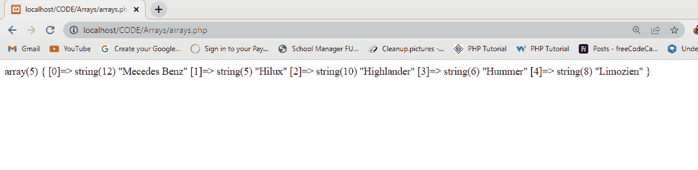
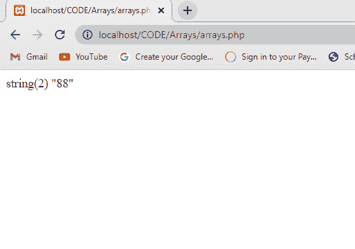

# PHP 数组——如何在你的 PHP 项目中使用数组

> 原文：<https://www.freecodecamp.org/news/how-to-use-arrays-in-php/>

数组是一个特殊的变量，我们用它在一个变量中存储或保存多个值，而不必创建更多的变量来存储这些值。

为了在 PHP 中创建一个数组，我们使用了数组函数`array( )`。

默认情况下，任何变量的数组都以索引`0`开始。所以每当你想调用数组的第一个值时，你从`0`开始，然后下一个是`1`...诸如此类。

PHP 中有不同类型的数组。它们是:

*   数字/索引数组
*   关联数组
*   多维数组

让我们更详细地看看每一个是如何工作的。

## 什么是数值数组或索引数组？

数字数组是一种可以存储字符串、数字和对象的数组。下面是一个数值数组的示例:

```
<?php
// Numeric/ index arrays
$cars = array('Mecedes Benz', 'Hilux', 'Highlander', 'Hummer', 'Limozien');
var_dump($cars);
?>
```

在上面的代码中，我有一个变量`$cars`，它存储了一个由 5 个元素组成的数组。上面的关键字`var_dump($cars)`将显示数组中元素的总数、每个数组的索引号以及数组中每个元素的长度。

您也可以选择使用`echo( )`关键字，但是在我的例子中，我更喜欢使用`var_dump( )`,因为它对我们得到的结果给出了更详细的解释。



您也可以选择在 web 浏览器中只显示数组的一个元素/项目，方法是:

```
<?php
$numbers = array('8', '20', '40', '58', '88', '200', '400', '500');
var_dump ($numbers [4]);
?>
```

上面的代码遵循与我们的数组定义相同的模式，即从零开始计数。我们想要显示索引为`4`的元素。从`0 to 4`开始计数，我们可以看到`88`位于索引`4`之下，这表明`88`是我们正在寻找的数字，并且将显示给浏览器。



## 什么是关联数组？

关联数组是一种键有自己的值的数组。在关联数组中，我们使用了`key`和`value`。

是用于访问数组值的数组元素的描述性标题。而`value`是赋给数组元素的值。

有些情况下不应该使用数值/索引数组，例如:

*   当您想要存储不同学生的年龄以及他们的姓名时。
*   当您想要记录员工的工资时。
*   当您想要存储学生在不同科目的分数时

诸如此类。

假设我们想给一组有名字的高中生分配年龄。

我们可以使用关联数组方法来完成它。例如:

```
<?php
$student_age = array (
'Scott_Mcall' => 17,
'Stalenski' => 18,
'Lydia' => 16,
'Allision' => 17,
);

echo $student_age ['Scott_Mcall']; //this code will display the age of Scot_Mcall as 17
echo $student_age ['Stalenski']; //this code will display the age of stalenski as 18
echo $student_age ['Lydia']; //this code will display the age of Lydia as 16
echo $student_age ['Allision']; //this code will display the age of Allision as 17
?>
```

上面的代码是一个关联数组的例子。数组中的`key`是`scott_Mcall`、`Stalenski`、`Lydia`、`Allision`，我们用它们来给每个学生分配年龄。数组的`value`是`17`、`18`、`16`和`17`。

## 什么是多维数组？

您可以将多维数组视为数组的数组。这意味着数组中的每个元素都包含一个子数组。通常，多维数组允许您在一个变量中存储多个数组。

假设我们想要存储在特定公司工作的一些员工的姓名、注册号码和电子邮件。我们可以用多维数组来存档。

例如:

```
<?php
$Staffs = [
	[
		'Name' => 'Derek Emmanuel',
		'Reg_No' => 'FE/30304',
		'Email' => 'derekemmanuel@gmail.com'
	],
	[
		'Name' => 'Rubecca Michealson',
		'Reg_No' => 'FE/20003',
		'Email' => 'rmichealsongmail.com'
	],
	[
		'Name' => 'Frank Castle',
		'Reg_No' => 'FE/10002',
		'Email' => 'fcastle86@gmail.com'
	]
];
echo $Staffs [2] ['Email']; // This displays the email of the last staff which is fcastle86@gmail.com

echo $staffs [0] ['Name']; //This displays the Name of the staff in the first array (index 0) which is Derek Emmanuel 

// you can access the information of any staff you wish to by using echo $(variable name) [index number] ['array element key'].

?>
```

记住，数组从索引`0`开始计数。上面的代码是一个多维数组的例子，因为它包含不止一个数组(数组的数组)，其中只有一个变量`$staff`。

`echo $staff [2] [‘Email’]`显示属于`2`索引的员工的邮件。在我们的例子中它会显示 [`fcastle86@gmail.com`](mailto:fcastle86@gmail.com) 。

如果我想访问第一个数组中员工的电子邮件，我们将执行以下操作:

`echo $staff [0] ['Email'];`

使用上面的方法，您可以从上面的代码中访问和显示数组中的任何信息。

## 结论

至此，在 PHP 项目中，您应该能够使用三种不同类型的数组。

感谢您的阅读。

祝编码愉快！