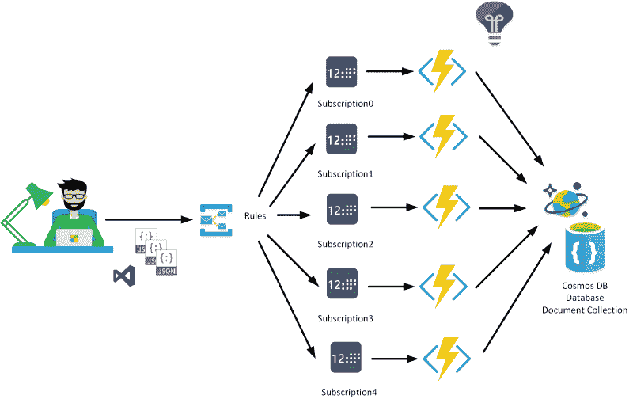
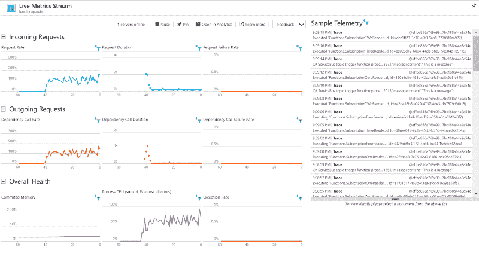
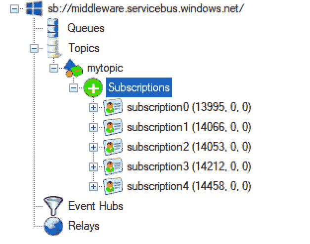
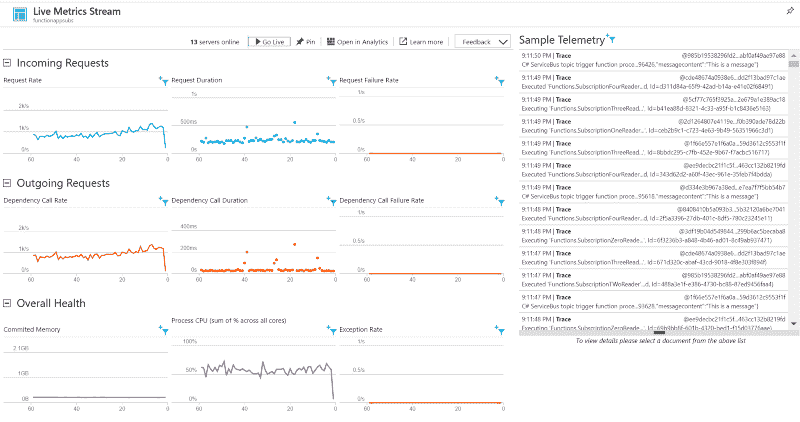
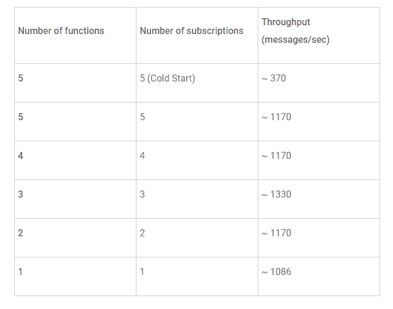
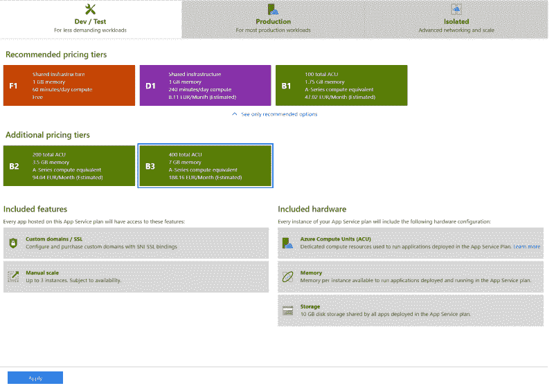
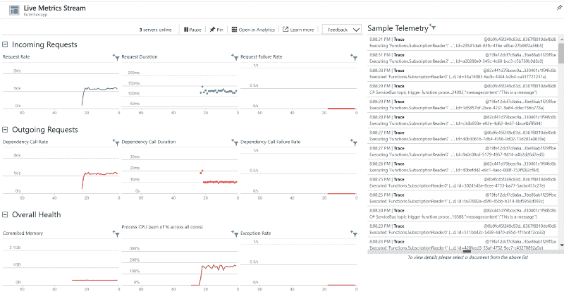
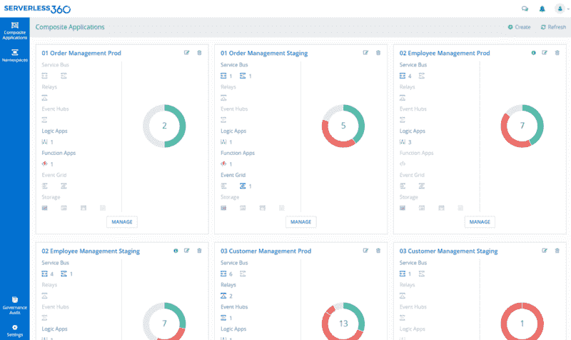

# 如何使用 Azure 函数处理高吞吐量消息

> 原文：<https://www.freecodecamp.org/news/how-to-use-azure-functions-to-process-high-throughput-messages-996d05d4ab23/>

与史蒂夫-简·威格斯，Azure MVP 共同创作。

借助微软 Azure，客户可以将所有类型的工作负载推送到其服务中。工作负载从用于机器学习目的的数据集到用于服务总线的大量消息。无论如何，Azure 像任何云提供商一样，有足够的弹性来处理任何规模的工作负载。可伸缩性和可用性是云计算的常用词。此外，您还可以利用云技术，并为使用它付费。

### 消息传递场景

在这篇博文中，我们将研究一个特定的消息传递场景。假设我们有大量从 LOB 应用程序推送到服务总线主题的消息。此外，一个主题的订阅会附带多个侦听器。每个订阅的消息数量是每秒 50 到 100 条——对于服务总线来说，这很容易处理。这个场景中的挑战是如何以相同的速率扩展使用这些消息的 Azure 服务。您会使用功能、web 作业还是服务结构？

对于这篇博文，我们选择了一个每分钟生成大约 100，000 条消息或每秒大约 1，666 条消息的客户端应用程序。每条消息被发送到 Azure 中的一个主题，有五个订阅。每个订阅都有一个相应的 Azure 函数来消费消息(服务总线主题触发器)并将其插入到 Cosmos DB 文档集合中。



### Azure 函数

Azure 功能是 Azure Web +移动应用服务套件的一部分。它们被设计成能够创建小块的有意义的、可重用的方法。这些方法很容易跨服务共享。这些无服务器、事件驱动的方法通常被称为*“纳米服务”*，因为它们的尺寸很小。尽管 Azure 函数可以包含相当多的代码，但它们通常被设计为服务于单一目的，并响应连接服务中的事件。

在我们的场景中，函数可以响应服务总线队列或主题(订阅)中的消息。吞吐量的挑战在于托管函数。功能可以在消费计划或应用服务计划上运行。后者允许扩大尺寸。当基于消费运行时，您需要为功能应用中支持您的功能的底层基础设施付费。

我们选择使用主题触发器绑定和 Cosmos DB 绑定来开发一个简单的输出函数。功能代码如下所示:

```
using System;
using System.Threading.Tasks;
public static void Run(string mySbMsg, ILogger log, out object outputDocument)
{
log.LogInformation($"C# ServiceBus topic trigger function processed message: {mySbMsg}");
outputDocument = new
{
mySbMsg
};
}
```

传入的消息作为输出(文档)发送到 CosmosDB 中的一个集合。Cosmos DB 端的潜在限制因素是指定的每秒[请求单位数(RU/s)](https://docs.microsoft.com/en-us/azure/cosmos-db/request-units) 。当此设置设置得太低时，将发生限制，您将看到 HTTP 429 消息出现。

此外，预留性能是针对每秒请求单位(RU)指定的。因此，Azure Cosmos DB 中的每个操作，包括写入、更新、读取和查询，以及更新文档，都会消耗 CPU、内存和 IOPs。通过指定请求单元，您可以在任何规模下获得有保证的性能和弹性。对于我们的设置，我们选择 10000 RU/s。

### 使用 Azure 函数测试设置

一旦我们运行测试，我们注意到我们的消息生成器向 Azure(西欧)中的服务总线主题发送 100000 条消息需要 90 秒。因此，我们每秒钟有超过 1000 条消息的出站流。随后，五个函数还需要大约 180 秒的时间来读取相应的订阅并写入 Cosmos DB 集合。每个文档的大小约为 1Kb。

一旦我们开始测试，我们会看到入站和出站请求的数量增加到每秒 100 个，并在试验期间增加到每秒 500 个。

在试用期间，我们看到订阅被消息填满，随后随着时间的推移减少到零。最终，在应用程序发送完消息后大约 180 秒。第一次运行测试时，可以观察到这种行为。



在读取了所有订阅，并且函数完成了对应用洞察的实时指标中的传入和传出请求的处理之后，该指标降为零。



### 经过几次测试后，结果如下:



消息发送者在 90 秒内向服务总线发送 100000 条消息主题:> 1100 条消息/秒。

这五个函数在 270 秒内消耗和处理 100000 条消息:> 350 条消息/秒。一次测试后，功能预热。第一个测试之后的任何测试都会产生超过 1000 条消息/秒的吞吐量。这符合 Cosmos DB 在编写 1 Kb 左右的消息时承诺的延迟。

请注意，当运行消费计划的功能时，您的应用程序可能会进入睡眠状态，从而导致冷启动问题。根据 MVP 克里斯·奥布莱恩的帖子:



> 目前，Azure 函数的超时期限是 20 分钟——所以如果有一段时间你的函数无法运行，你就会受到这个问题的困扰。

这种行为在第一次测试场景时表现出来。功能预热后，吞吐量增加了两倍，从大约 350 消息/秒增加到大约 1150 消息/秒。

我们使用应用服务计划 B3(标准版)对功能应用中的功能重新进行测试，并将实例数量设置为三个。此外，函数和订阅的数量被限制为三个。

在没有任何预热问题的情况下，使用 B3 的 App 服务计划的测试导致每次约 1150 条消息/秒的吞吐量。



上图显示了传入和传出请求的数量与测量的吞吐量相近。



您可以进一步尝试使用高级或独立的应用服务计划，获得更多资源。

### Azure WebJobs

在云中自动化任务的一个有用的方法是利用 Azure App Service 上托管的 Azure WebJobs。使用 App Service，您可以从服务总线主题(订阅)或队列中连续读取消息，而不会遇到预热问题。对于我们的场景，消费计划上的 Azure 功能就足够了，不考虑预热问题。

### 服务结构

通过 Service Fabric，您可以利用 Azure 基础设施构建大规模的分布式应用程序。该服务是一个开源项目，支持核心 Azure 服务，如 Azure Event Hubs、Cosmos DB 和 Dynamics 365。您可以使用 Service Fabric 来开发基于需求自动伸缩的服务，从而获得任何所需的吞吐量。因此，当您期望 Web 作业或 Azure 功能无法实现的性能时，您可以选择服务结构实现。对于我们的场景，Azure Functions 足以满足每秒 50 到 100 条消息的吞吐量。

### 包裹

在这篇博文中，我们看到了一个场景，实现了从一个主题到 Cosmos DB 的给定的消息吞吐量。通过一个函数，利用服务总线和 Cosmos DB 绑定，我们可以轻松地每秒处理 300 多条消息，并将这些消息插入到 Cosmos DB 集合中。如果我们排除预热问题，这些函数每秒可以有效地处理超过 1000 条消息。

> 因此，我们可以得出结论，在适当的服务计划下，Azure Functions 是一个每秒处理大约 1000 条消息的好选择。

请注意，这篇博客描述了一个小实验，在 Azure 中可以使用更多选项来处理大量消息。

### 管理和监测

人们可能需要更深入地了解 Azure 无服务器实体才能利用它。借助第三方工具 [Serverless360](https://www.serverless360.com/?utm_source=Freecodecamp-blog&utm_medium=&utm_campaign=) ，您可以在一个地方管理您的复合云原生解决方案。该工具监控您的 Azure 集成服务，如逻辑应用程序、函数、事件中心、服务总线和 API 端点。此外，您还可以:

*   在您的服务总线队列或主题中，访问活动消息以了解更多细节，处理死信消息以修复、重新提交或仅仅清除它们。
*   检测您的复合集成解决方案中出现的违规情况并发出警报。
*   将您的 Azure 无服务器监控与基本通知工具集成，如 PagerDuty、Microsoft Teams、ServiceNow、Slack、SMTP 和 OMS。
*   完全控制您的同事或顾问在您的环境中可以看到的 Azure 资源和可以做的事情。
*   治理和审计报告提供了有关四个 W 的详细信息—世卫组织访问了什么、何时访问的以及为什么访问。Serverless360 收集、整合和启用帐户日志的搜索过滤器。



Serverless360 Composite Application

> *最初发布于 2018 年 11 月 27 日[www.serverless360.com](https://www.serverless360.com/blog/azure-functions-to-process-high-throughput-messages?utm_source=medium-freecodecamp&utm_medium=link&utm_campaign=blog-resurfacing)。*