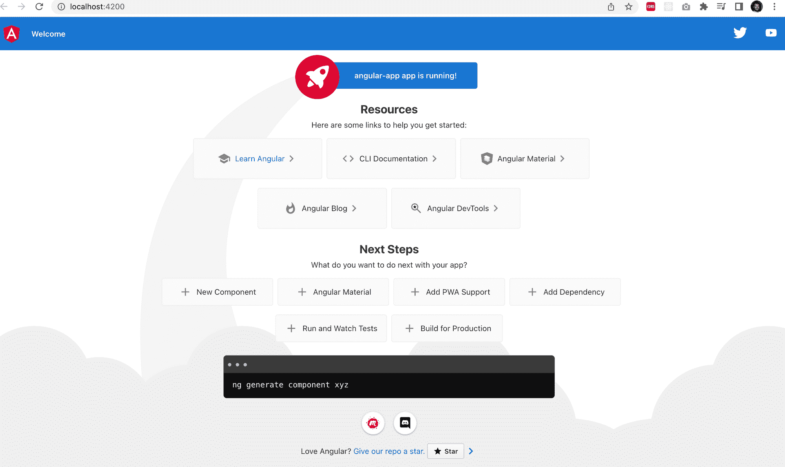
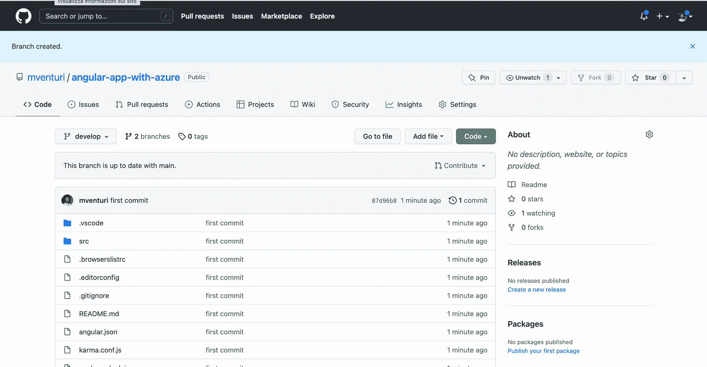
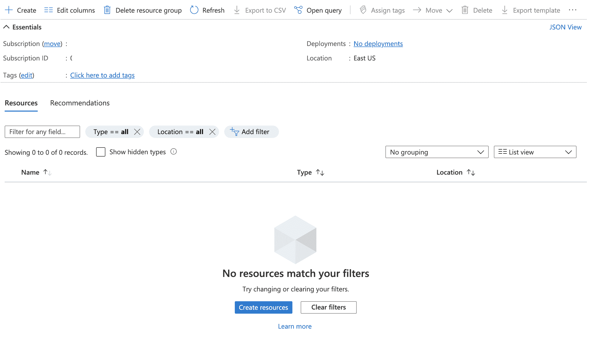
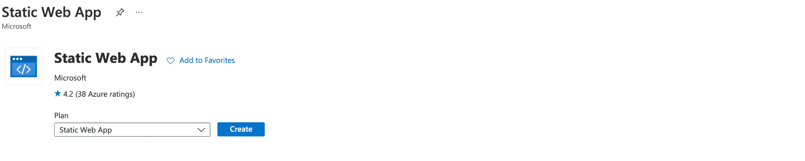
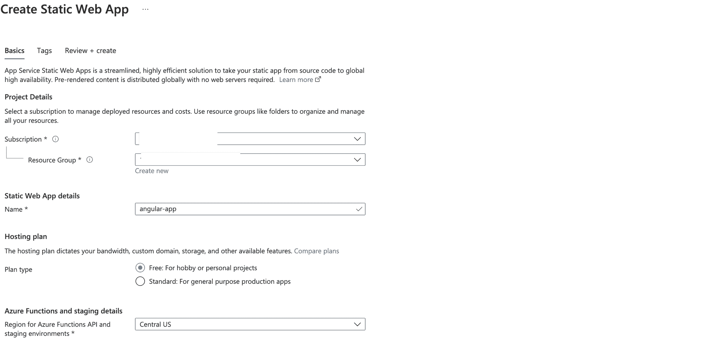
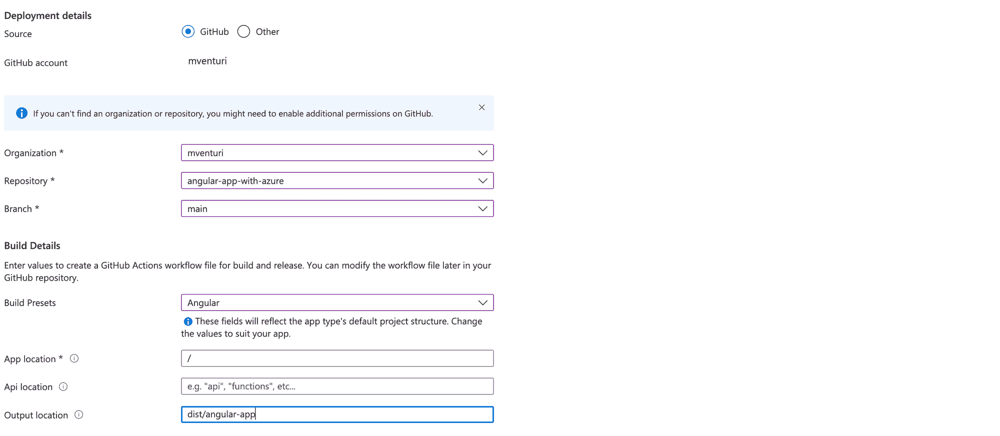
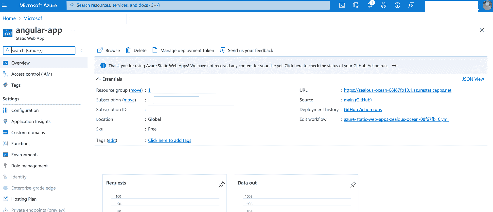
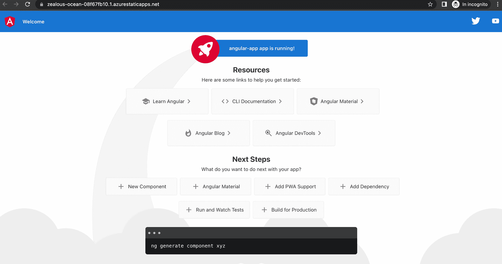
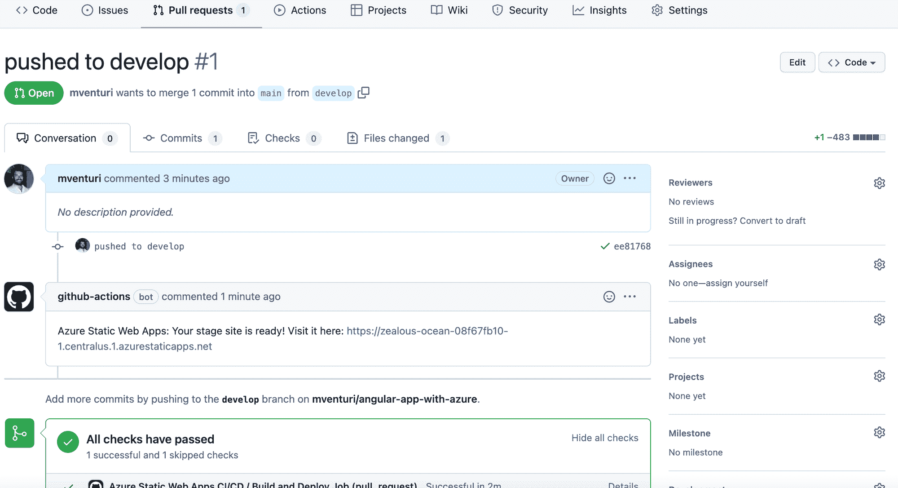
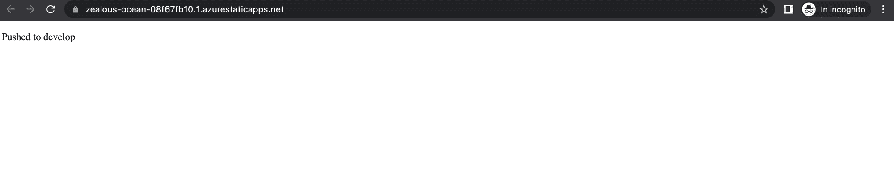

# 如何使用 Azure 静态 Web 应用部署 Angular 应用

> 原文：<https://www.freecodecamp.org/news/how-to-use-azure-static-web-apps-to-deploy-angular-app/>

CI/CD 改变了 IT 团队发布新软件版本的方式。

在本教程中，我将分享我使用 Azure 静态 Web 应用的经验——Azure 的 PaaS 解决方案。我将向您展示如何利用它的灵活性来部署 Angular 应用程序，只需将您的代码推送到 Git 存储库即可。

网上有很多关于 CI/CD 的文献，在本文中，我想重点介绍 Azure Web Apps，向您展示它如何显著简化您的工作流程。

如果你想了解更多关于 CI/CD 的信息，Atlassian 的[博客](https://www.atlassian.com/continuous-delivery/principles/continuous-integration-vs-delivery-vs-deployment)有一些不错的信息。这里有一个关于主题的有帮助的、深入的、基于[项目的指南。](https://www.freecodecamp.org/news/how-to-setup-a-ci-cd-pipeline-with-github-actions-and-aws/)

## 这个项目我们需要什么？

在本教程中，我们将使用以下技术和工具:

*   GitHub 账户
*   Node.js(你可以在这里下载
*   Npm (Node.js 包管理器。包括在节点安装中。)
*   Angular CLI(创建、开发和维护 Angular 应用程序的命令行界面工具。你可以在这里下载[。)](https://angular.io/cli)
*   Azure 帐户(您可以通过在此创建您的帐户[免费开始。一旦你的免费试用期到期，看看你正在发生的费用。云技术非常强大，可以让你的生活更加轻松。但如果管理不善，它们可能会膨胀。)](https://azure.microsoft.com/en-us/free/)

如果您想在本文中跟随我并复制我正在构建的东西，您需要准备好这些工具。

## 我们将在这里构建什么–大画面

让我们看看如何创建我们的 Angular 应用程序，并使用 Azure Web App 部署它。我们将在本地创建我们的 Angular 应用程序，并将其推送到我们专门为此项目创建的 GitHub 存储库。

存储库将有两个分支:“主”和“开发”。我们将在 Azure 上创建一个静态 web 应用程序，并将其连接到存储库的“主”分支。

回到你的机器，编辑代码并把它推到“开发”分支。然后你将“开发”分支与“主”分支合并，在线查看你的应用程序的新版本。

为了更清楚，我认为快速列表将帮助我们回顾每一个步骤:

*   您将使用 Angular CLI 在本地创建 Angular 应用程序
*   您将把它推送到 GitHub 存储库
*   您将在 Azure 上创建一个静态 web 应用程序，并将其连接到项目存储库的“主”分支
*   您将创建一个“开发”存储库
*   您将在本地编辑应用程序代码，并将其推送到“开发”存储库
*   您将在 GitHub 项目上创建一个从“develop”到“main”的 pull 请求，并合并它
*   您将检查 web 应用程序上是否有新的应用程序版本

## 步骤 1–在本地创建角度应用程序

首先，让我们在您的计算机上创建一个特定的目录并移入其中。我在 Mac 上，所以我将打开我的终端并键入:

```
mkdir angular_azure
cd angular azure
```

完成后，创建名为“angular_app”的新 Angular 应用程序:

```
ng new angular_app
```

Angular CLI 会问您几个问题:


我们想添加角路由器，我们也想使用 CSS 样式的应用程序。收到 Angular CLI 的积极反馈后，在本地启动您的应用程序，查看是否一切正常:

```
ng serve —-open
```

选项“- open”告诉 Angular CLI 您希望使用默认浏览器打开应用程序。这意味着您不需要将 URL 复制并粘贴到浏览器的地址栏中。所以，这是你应该看到的:



看起来一切正常。您可以停止应用程序(Ctrl + C)并移动到下一步

## 第二步——将 Angular 应用程序推送到 GitHub 库

你应该已经在你的 GitHub 帐户上为这个项目创建了一个新的资源库。我把我的名字叫做“蓝色棱角应用”。如果你不知道如何创建一个新的存储库，你可以[在这里](https://docs.github.com/en/get-started/quickstart/create-a-repo)了解更多。

一旦存储库准备好了，就把你的 Angular 应用从你的机器推送到你的存储库。如果您在创建 repo 时没有添加自述文件，您应该可以在您的存储库页面上看到关于如何直接推送代码的说明。但是，我将在这里重复这些说明:

```
git init
git add .
git commit -m "first commit"
git branch -M main
git remote add origin https://github.com/<REPO>.git
git push -u origin main
```

成功运行这些命令后，您应该会看到如下内容:



让我们现在就开始吧。

## 第 3 步——是时候切换到 Azure 了

现在，您将创建一个全新的 Azure 静态 Web 应用程序，并将其连接到您的存储库。首先进入 Azure 门户[这里](https://portal.azure.com)，到你的资源组。然后你会看到这个:



点击“创建”，你会看到 Azure 上可用资源的列表。通过“静态 Web App”过滤资源并选择。



然后转到 Azure 的向导来创建资源。让我们看看你应该如何填写它。

首先，选择订阅和资源组。然后继续静态 Web 应用程序的细节:选择名称——“angular-App”——并坚持免费计划。然后选择您的地区，我的是“美国中部”。



然后继续提供一些信息:



您可以在“部署细节”部分同步您的 GitHub 帐户，然后指定您将从中获取代码库的组织、存储库和分支。

正如我在本教程开始时所说的，我选择“主”分支作为生产分支。

现在让我们来关注“构建细节”。您将选择“角度”作为“构建预置”，并指定应用程序位于根目录下的“应用程序位置”。

然后，您将输入输出位置的路径(“dist”目录加上项目名称目录。在我的例子中，它是“距离/角度-应用程序”。这是 Angular CLI 定位项目构建的位置。我花了很长时间寻找这些信息，我认为与你分享是件好事)。

现在，您已经准备好创建静态 Web 应用程序了。点击“创建”,看看会发生什么。这是我的应用程序的概述:



接下来，点击“URL”链接，这是您应该看到的内容:



## 
步骤 4–创建新的分支机构

因此，现在您将返回到您的本地代码库，创建您的“开发”分支并检查它:

```
git checkout -b develop
```

然后转到:

```
src/app/app.component.html
```

像这样编辑代码:

```
<p>Pushed to develop</p>
<router-outlet></router-outlet>
```

然后将新的分支推送到远程存储库:

```
git push origin develop
```

## 步骤 5–合并时间

你的 angular App 还是老版本在线。您需要将“开发”分支合并到“主”分支，以便在线查看更改。

在 GitHub 上创建一个 pull 请求并合并它。这是你最后应该看到的:



等待几分钟，然后你会在线看到你的应用的新版本:



## 快速回顾和有用的资源

我希望本教程向您展示了如何使用 CI/CD 和 Azure Static Web App 轻松地将代码部署到生产环境中。

在实践这些技术时，我在网上发现了许多关于它们的有趣内容。我觉得把它们都放在一个地方对你有好处:

*   [Git 是什么？Git 版本控制初学者指南](https://www.freecodecamp.org/news/what-is-git-learn-git-version-control/)
*   [如何使用 Git 和 Git 工作流——实用指南](https://www.freecodecamp.org/news/practical-git-and-git-workflows/)
*   [GitHub 动作文档](https://docs.github.com/en/actions/learn-github-actions/understanding-github-actions)
*   [角度文件](https://angular.io/)
*   [我在 GitHub 上的回购](https://github.com/mventuri/angular-app-with-azure)

别忘了...继续学习，继续编码！