# 如何使用 CodePen——初学者指南

> 原文：<https://www.freecodecamp.org/news/how-to-use-codepen/>

CodePen 是一个流行的在线代码编辑器，被世界各地的许多开发者使用。它也是你可以用于[免费代码营课程的推荐编辑器之一。](https://www.freecodecamp.org/learn)

CodePen 仅用于前端项目，支持 HTML、CSS 和 JavaScript。如果您需要用后端组件构建一个项目，那么您将需要使用不同的编辑器。

在本文中，我将讨论以下内容:

*   [如何注册免费账户](#how-to-sign-up-for-a-free-account)
*   [笔和项目的区别](#differences-between-pens-and-projects)
*   [钢笔编辑器的基本功能](#basic-features-of-the-pen-editor)
*   [如何叉笔](#how-to-fork-a-pen)
*   [如何将预处理器和包添加到笔中](#how-to-add-preprocessors-and-packages-to-a-pen)
*   [项目编辑器的基本功能](#basic-features-of-the-project-editor)
*   付费订阅能给你带来什么？
*   什么是 CodePen 挑战？

## 如何注册一个免费账户

当您访问 [CodePen](https://codepen.io) 网站时，您将能够使用以下选项登录:

*   Twitter 账户
*   脸书账户
*   GitHub 帐户

您也可以注册一个电子邮件地址，在那里您将创建一个用户名和密码。

创建帐户后，您应该会收到来自 CodePen 的电子邮件。打开邮件并验证您的电子邮件地址。

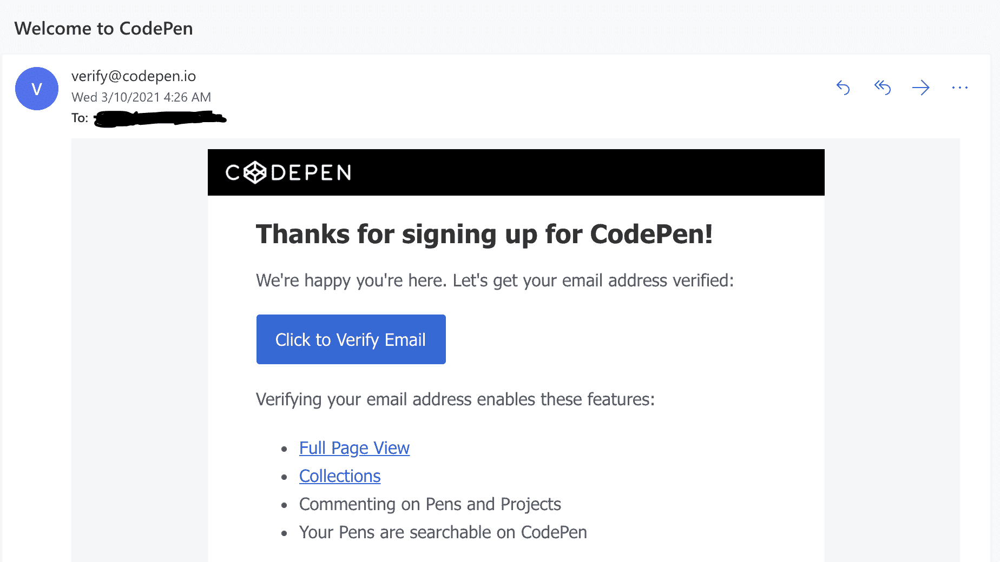

## 笔和项目之间的区别

### 钢笔

验证您的电子邮件地址后，您应该被直接带到笔编辑器。如果编辑器没有出现，那么你可以点击主页左侧的笔。

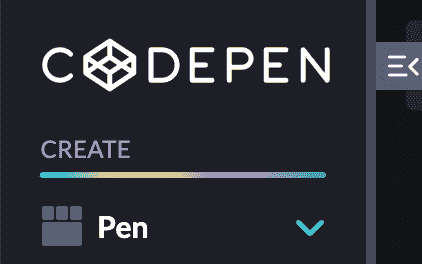

笔编辑器分为三个部分:HTML、CSS 和 JavaScript。

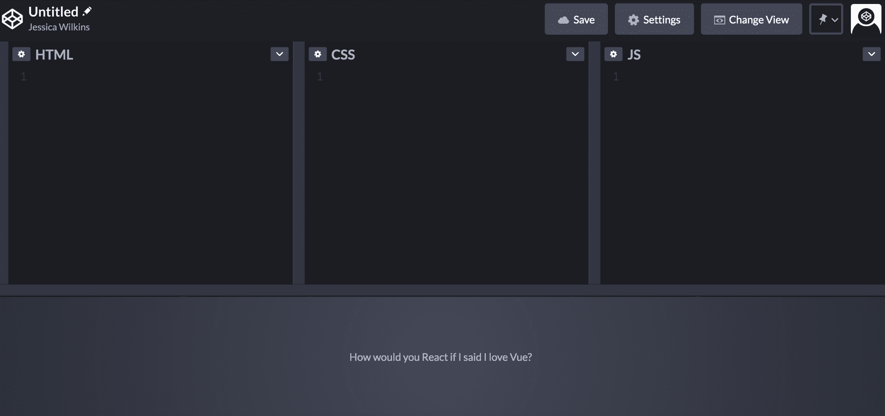

此编辑器不支持多个 HTML、CSS 和 JavaScript 文件。钢笔非常适合小规模创作。

如果你打算写超过 5000 行的代码，那么你应该考虑一个项目。

有了免费账户，你想拿多少笔都可以。

### 项目

如果你想创建一个项目，那么点击项目，它位于主页的左上角。

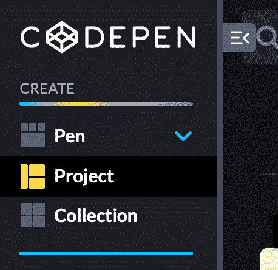

项目编辑器支持多个 HTML、CSS 和 JavaScript 文件。

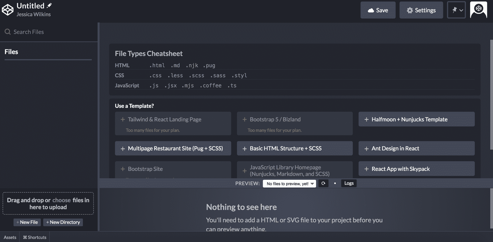

使用免费帐户，您只能有一个项目和 10 个文件。如果你有兴趣创建更多的项目，你需要升级到专业帐户。

## 钢笔编辑器的基本功能

### 格式选项

如果你点击三个编辑器中任何一个的下拉箭头，你会看到一个格式化你的代码的选项。

这是一个非常有用的工具，可以确保您的代码格式正确，并且可供其他开发人员阅读。

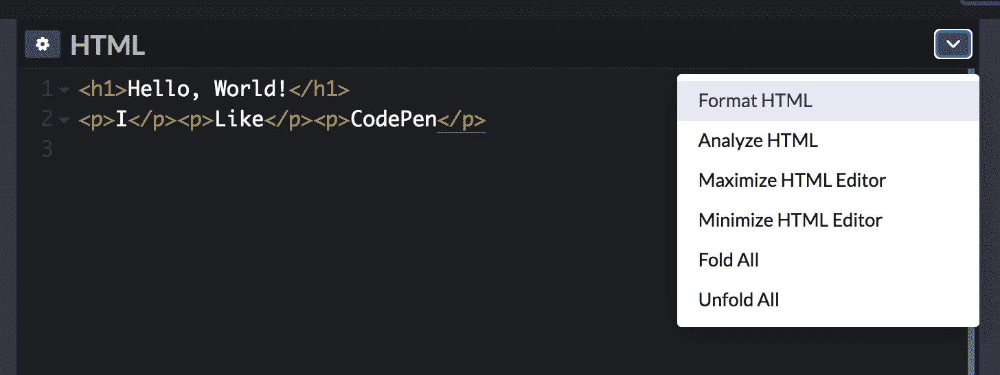

您也可以转到“笔设置”的“行为”部分，并选择“保存时格式化”选项。

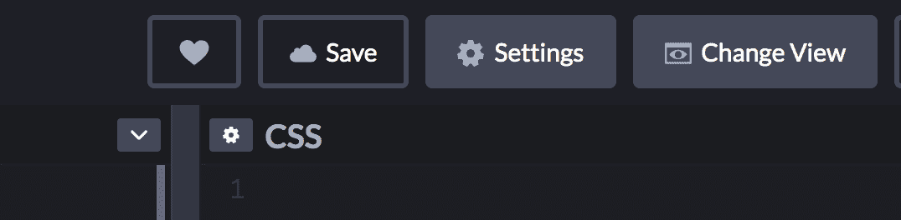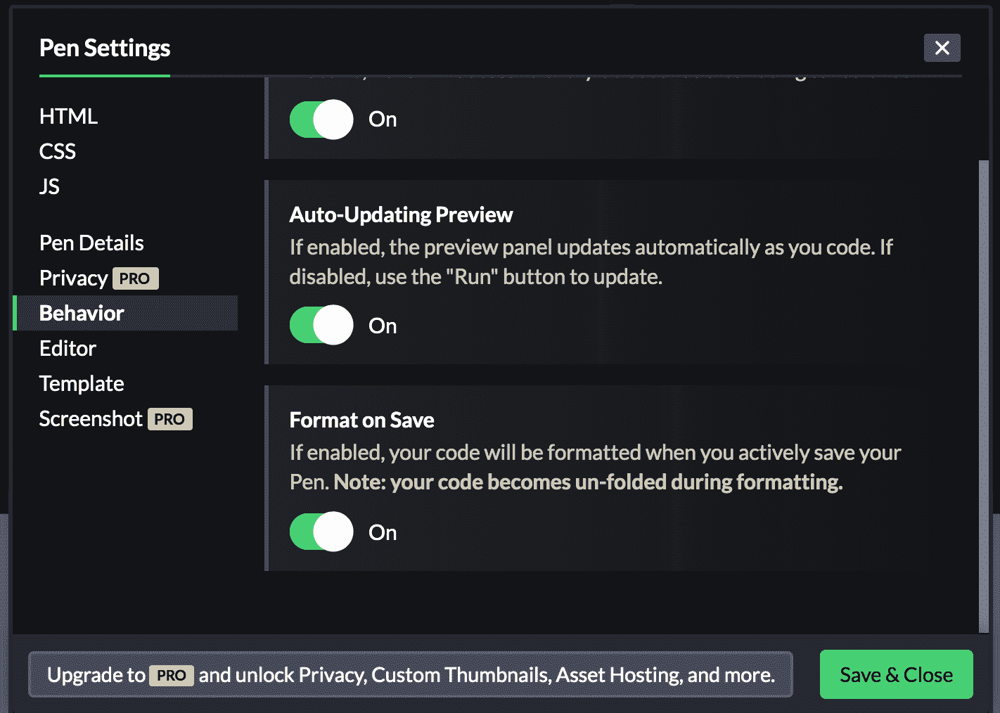

### 分析选项

如果你点击三个编辑器中任何一个的下拉箭头，你会看到一个选项来分析你的代码。

这是一个工具，将帮助您找到并修复代码中的错误。

### 查看选项

如果您单击更改视图，那么您可以自定义编辑器布局或在不同的视图选项之间切换。

### 使用控制台

控制台位于笔的左下角。这是调试代码的有用工具。

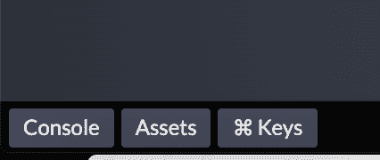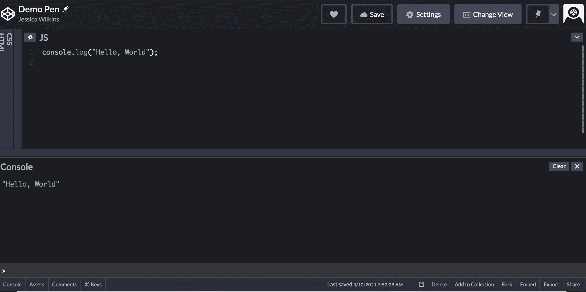

### 为标题部分添加链接(HTML)

当您创建笔时，您不必包含`DOCTYPE`、`html`、`head`或`body`标签。所有这些信息都已经内置到编辑器中。

如果你需要为标题部分添加链接，比如字体图标或者谷歌字体，那么你可以在 HTML 设置的标题部分添加。

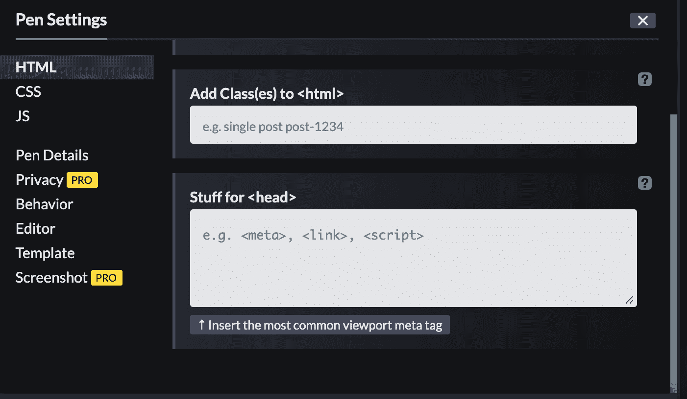

### 添加 CSS 库和框架

CodePen 在设置中有一个选项，可以将 CSS 库和框架添加到您的笔中。一些库和框架包括 Bootstrap、Tailwind CSS 和布尔玛。

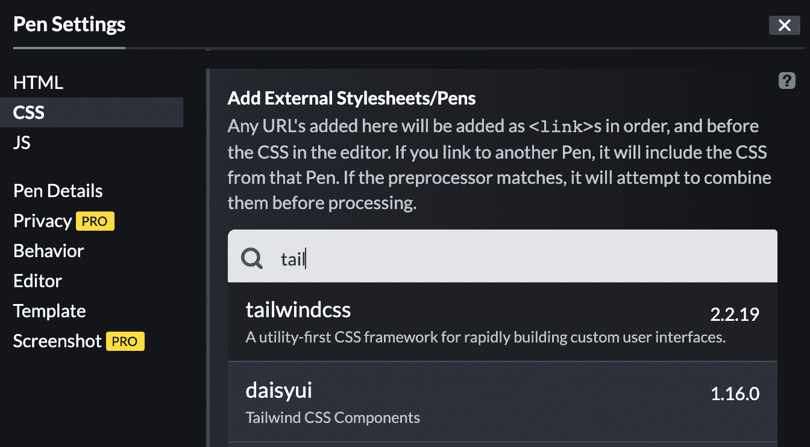

### 添加 JavaScript 库和框架

在 JavaScript 设置中，您可以将 React、Angular 和 Vue 等流行的库和框架添加到您的笔中。

### 在社交媒体上分享你的钢笔

如果你想在各种博客和社交媒体网站上分享你的笔，那么你可以点击右下角的分享按钮。

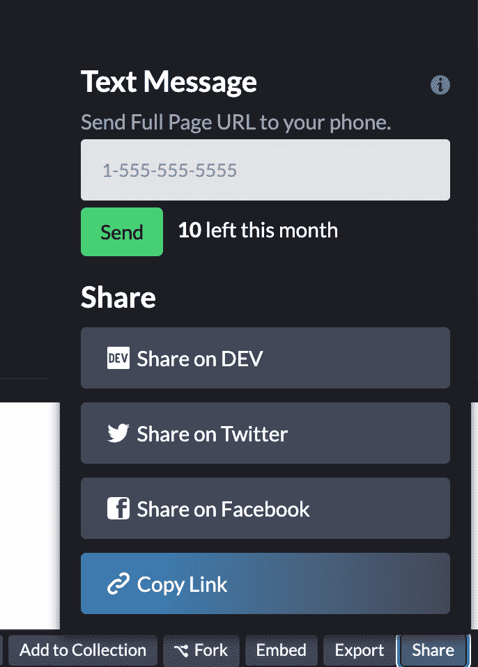

### 出口笔

如果你想把你的作品下载到你的电脑上，那么你可以使用右下角的导出按钮。

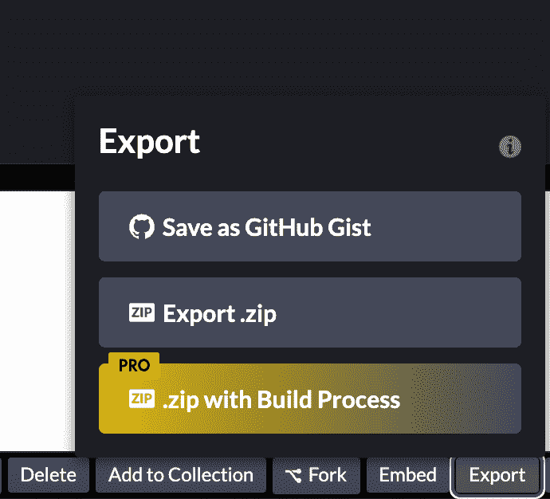

这将为您的所有文件创建一个文件夹。

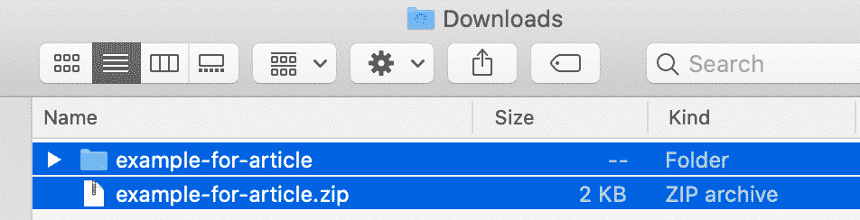

### 在博客和文章中嵌入笔

如果您想在您的博客文章中显示代码示例，那么您可以使用 embed 按钮将您的 CodePen 作品嵌入到页面中。这位于右下角。

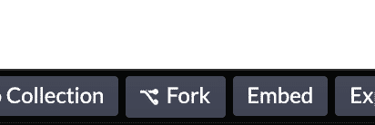

## 如何叉一支笔

分叉一支笔意味着创建该笔的副本。当您派生它时，您将可以访问所有的代码，并且能够根据您的喜好对其进行修改。

先去你感兴趣的那支笔分叉。然后点击右下角的叉按钮。

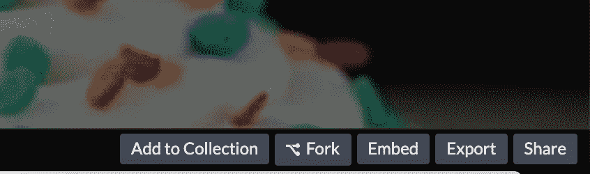

一旦你叉笔，然后它会为你的 CodePen 帐户创建一个副本。确保点击 save 按钮，然后就可以开始修改代码了。

## 如何向画笔添加预处理器和包

在 CodePen 中，您可以选择将 HTML、CSS 或 JavaScript 预处理程序以及 NPM 包添加到您的笔中。

在 HTML 设置中，你可以选择 Haml，Markdown，Slim 或者 Pug。

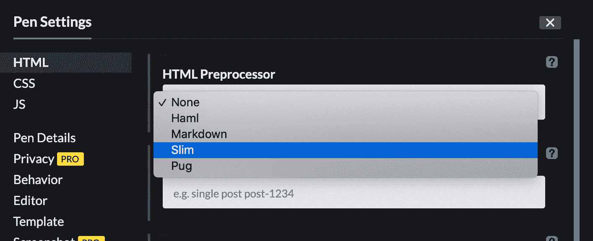

在 CSS 设置中，您可以从 Less、SCSS、Sass、Stylus 或 PostCSS 中进行选择。

在 JavaScript 设置中，你可以从 Babel、TypeScript、CoffeeScript 或 LiveScript 中选择。

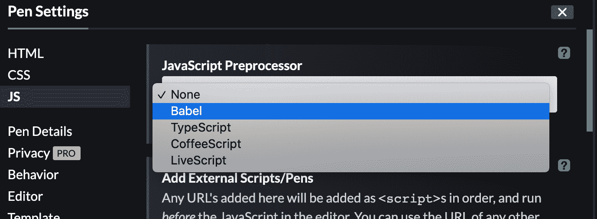

您还可以将 react-bootstrap 等 NPM 软件包添加到您的笔中。

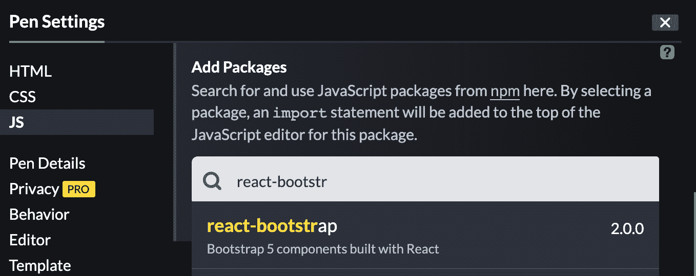

## 项目编辑器的基本功能

如果您正在处理一个需要多个文件的项目，那么您应该考虑使用项目编辑器而不是笔编辑器。对于免费帐户，你可以有一个项目。

### 模板

HTML 和 CSS 项目以及 React 项目有一些模板选项。

如果您选择升级到付费订阅，那么您将可以访问顺风 CSS 和引导模板。

### 文件和目录

要添加一个新的文件或文件夹，点击左下角的按钮。

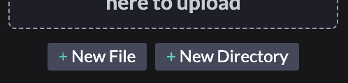

您也可以使用位于“新建文件”按钮正上方的拖放功能从您的计算机上传文件。

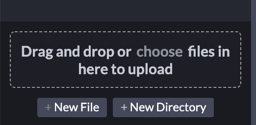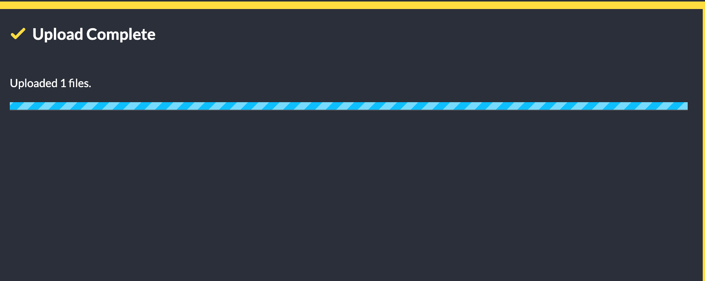

您可以向项目中添加总共 10 个文件。如果你需要添加更多的文件，那么你必须升级到一个付费的软件包。

### 共享项目

如果你想在社交媒体或博客平台上分享你完成的项目，你可以点击右下角的分享按钮。

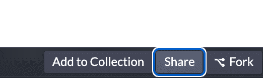

### 导出项目

您也可以使用右下角的“导出”按钮导出项目文件，并将其下载到您的电脑上。

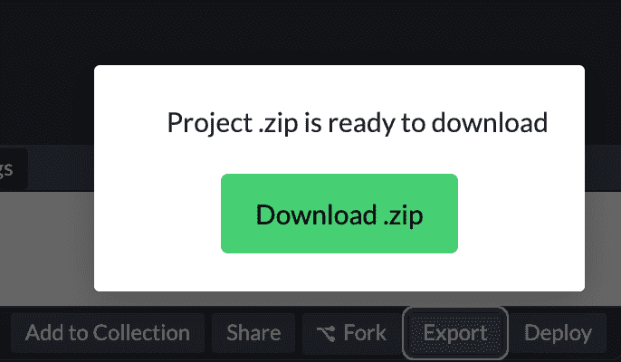

## 付费订阅能得到什么？

付费订阅计划提供更多 CodePen 功能，如协作模式、资产托管、更多模板和自定义域。

要了解有关不同付费订阅计划的更多信息，请访问 [CodePen PRO 页面](https://codepen.io/features/pro)。

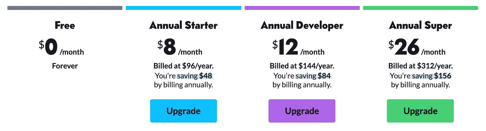

## 什么是 CodePen 挑战？

如果你想练习你的前端技能，那么你可以参加[月挑战](https://codepen.io/challenges)。每个月都有一个主题，每周你都要用一个新的挑战来练习技能。

您还可以参加之前的每月挑战。

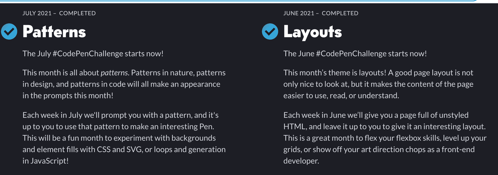

我希望您喜欢这篇文章，并祝您的前端开发之旅好运。