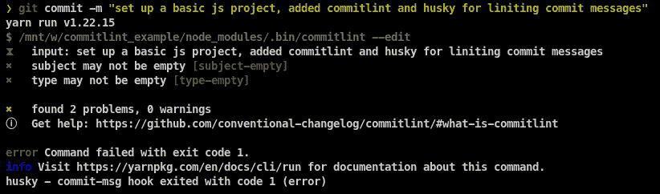
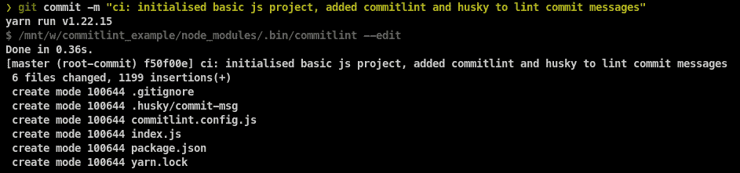
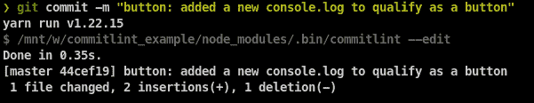
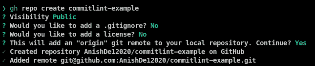
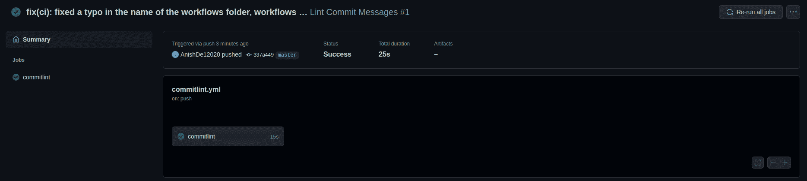
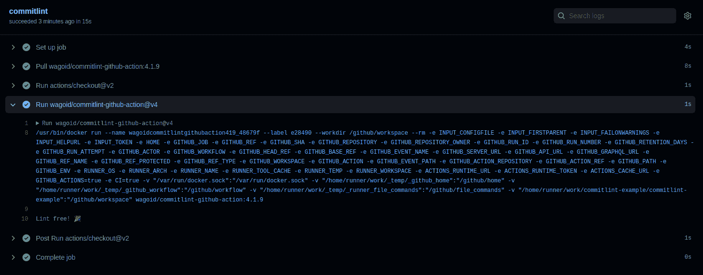

# 如何用提交编写好的提交消息

> 原文：<https://www.freecodecamp.org/news/how-to-use-commitlint-to-write-good-commit-messages/>

我们经常急于在 Git 中提交我们的更改，所以我们在提交消息中写一些随机的东西。事实上，我已经看到有人在他们的消息中加入日期和时间，甚至类似于`commit 1`、`commit 2`的内容。

这不是一个好的实践，因为提交消息应该是有帮助的和有意义的，以便从事项目工作的人、阅读代码的人或参与其中的人理解消息本身的变化。

现在让我们看一个简单的方法来解决这个问题。

# 什么是 Commitlint？

commit link 是一个简单的工具，它链接你的提交消息，并确保它们遵循一组规则。

它作为一个 husky 预提交挂钩运行，也就是说，它在代码提交之前运行，并在 lint 检查失败的情况下阻止提交。

## 如何在简单的 javascript 项目中使用提交

在这个例子中，我们将看到如何在一个简单的 JavaScript 项目中设置 commitlint。首先，让我们创建一个空项目:

```
mkdir commitlint_example && cd commitlint_example

npm init
# OR
yarn init
# Just accept the defaults when prompted to configure the project
```

Creates a directory named commitlint_example and initialises an empty JavaScript project with the respective package manager

现在，让我们初始化一个空的 Git 存储库:

```
git init
```

Initialises an empty git repository locally

我们还必须添加一个`.gitignore`文件来防止某些文件被提交:

```
node_modules/
```

现在我们将添加一个名为`index.js`的文件，暂时只记录一些内容:

```
console.log("Hello, World!!!")
```

Logs out "Hello, World!!!" to the console

运行`node .`应该在您的终端上打印出如下文本:


## 如何设置提交

我们将按照[官方本地设置文档在这里](https://commitlint.js.org/#/guides-local-setup)设置 commitlint。

首先，我们需要安装 commitlint CLI 并添加一个 commit link 配置(在本例中是默认的[常规提交配置](https://www.conventionalcommits.org/))。

```
npm install @commitlint/cli @commitlint/config-conventional --save-dev
# OR
yarn add -D @commitlint/cli @commitlint/config-conventional
```

Installs commitlint cli and the conventional commits config

我们需要向名为`commitlint.config.js`的文件添加一些配置，如下所示:

```
module.exports = {
    extends: [
        "@commitlint/config-conventional"
    ],
}
```

Adds the conventional commits config to the commitlint config

现在我们需要安装 [husky](https://typicode.github.io/husky/#/) 来运行 commitlint 作为预提交钩子。

```
npm install husky --save-dev
# OR
yarn add -D husky
```

Installs husky

我们还需要启用 husky 挂钩:

```
npx husky install
# OR
yarn husky install
```

Enables husky hooks

我们可以添加一个准备步骤，在安装时启用 husky 挂钩:

```
npm set-script prepare "husky install"
```

Adds a prepare script that will install husky hooks upon installation

现在我们已经完成了 husky 的安装，我们需要添加一个预提交钩子来在代码提交之前运行 commitlint。

```
npx husky add .husky/commit-msg "npx --no -- commitlint --edit $1"
# OR
yarn husky add .husky/commit-msg "yarn commitlint --edit $1"
```

adds a husky pre-commit hook that will run before the code is committed

现在我们完成了 commitlint 的设置。所以让我们测试一下，看看它是否有效。

首先，我们将转移所有文件以提交它们:

```
git add -A
```

Stages all files to be committed

现在，让我们尝试提交更改，不要遵循默认约定:

```
git commit -m "set up a basic js project, added commitlint and husky for liniting commit messages"
```

Try to commit with a message not following the default convention



Error that should occur due to not following the default convention

您应该得到上面的输出(或类似的东西),它排除了错误。如果提交成功，您可能在某个地方出错了。确保您已经运行了上面的所有命令，并尝试撤消提交、运行脚本，然后再次提交，直到失败。

现在是适当承诺的时候了。运行以下命令:

```
git commit -m "ci: initialised basic js project, added commitlint and husky to lint commit messages"
```



Code should get committed due to following the default convention

现在一切看起来都很好。

## 默认提交列表约定如何工作

默认的提交约定使用[传统的提交约定](https://www.conventionalcommits.org/en/v1.0.0/)，其中有一个类型、可选的范围、主题以及可选的主体和页脚。

例如，我可以修复一个与 UI 相关的错误，然后提交消息可以是`fix(ui): Button was not showing up properly on mobile view`。这里的类型是`fix`，也就是对一个 bug 的修复，范围是`ui`，因为这个修复与 ui 相关，主题提供了关于这个问题的更多上下文。

注意，我可以提供多个作用域，例如，`feat(ui,lang): added an option to save the image as svg and added language support for Spanish`。在这里，我们介绍 2 个功能-一个新的按钮，以保存图像为 svg 和语言支持西班牙语。这意味着有两个范围。范围可以由三个分隔符分隔- `,`、`/`和`\`。

这里有一个简短的提示:您通常应该保持提交小而具体，虽然可能有一些边缘情况，但这不是一个。我们只是用它作为例子。

重大变更通常用感叹号`!`来表示，但是你也可以在提交消息的页脚用粗体来表示。在页脚提供更多信息的地方，两者都做是最佳实践。这里有一个例子:

```
refactor(runtime)!: Dropped support for NodeJS v12

BREAKING CHANGE: Support for NodeJS v12 has been dropped due to the latest refactor, please upgrade to the latest LTS version of NodeJS
```

Example for breaking change commit message

这让我们想到了多行提交消息。有时候我们需要给一些东西更多的上下文。在这种情况下，最好将信息包含在提交消息中，以便让任何试图了解所有内容发生了什么变化以及为什么在提交中发生了变化的人都清楚。这里有一个例子:

```
docs: Added an aria-label in the IconButton example
aria-label is a required prop by the IconButton component. If it is not present, the build will fail
```

Example for multi-line commit message

### 使用 commitlint 的优势

*   自动变更日志——由于提交遵循标准惯例，像[标准版](https://github.com/conventional-changelog/standard-version)这样的工具可以自动生成变更日志
*   更好地理解提交——具有特定类型和范围的提交将帮助您理解提交更改了哪些代码
*   坚持特定的惯例——当你有一个大项目，很多人都致力于此时，人们可能会忘记使用惯例。commitlint 阻塞这样的提交，以便提交遵守定义的约定。

现在你知道 commitlint 的基本知识了。在本文的下一部分，我们将更深入一些，看看如何编写定制的提交规则，以及如何在 GitHub 操作中运行提交配置项。

# 如何创建自定义提交列表规则

传统的提交惯例适用于大多数项目。但是有时你可能想要添加一些特定于你的用例的规则。

> 要获得完整的参考资料，请[查看这里的官方文档](https://commitlint.js.org/#/reference-rules)。

对于我们这里的例子，我们将使用一个应用程序，它有一个用 TailwindCSS 制作的按钮库。您可以通过 pull 请求将您的作品添加到这个应用程序中。

现在这些提交可以有不同的类型，所以让我们以`button`为例。这需要我覆盖传统提交约定中的`type-enum`规则。

为此，我将在我的 commitlint 配置中创建一个`rules`对象，并添加`button`作为类型。这就是我们的`commitlint.config.js`应该有的样子:

```
module.exports = {
    extends: [
        "@commitlint/config-conventional"
    ],
    rules: {
        "type-enum": [2, "always", ["build", "chore", "ci", "docs", "feat", "fix", "perf", "refactor", "revert", "style", "test", "button"]],
    }
}
```

这里我只是在默认类型的基础上添加了按钮类型。现在让我们提交这个:

```
git add -A
git commit -m "ci(commitlint): added button as a type of commit"
```

现在我们将测试我们的`button`类型。对于这个例子，我将在我们的`index.js`文件中添加一个新行。它应该是这样的:

```
console.log("Hello, World!!!")
console.log("New Button")
```

现在，让我们提交它:

```
git add -A
git commit -m "button: added a new console.log to qualify as a button"
```



您应该得到上面的输出。

# 如何在 github 操作中使用 commitlist

提交消息在本地进行检查，但遗憾的是，这种检查可以在本地跳过。因此，我们可以在 CI/CD 工作流中添加一个步骤来进行复查。

在本例中，我们将使用 [GitHub 操作](https://github.com/features/actions)，但 Travis CI、Circle CI 和 GitLab CI 也有[官方指南](https://commitlint.js.org/#/guides-ci-setup)。

## 如何将我们的代码推送到 GitHub

首先，我们需要将代码推送到 GitHub 来使用 GitHub 动作。所以让我们尽快完成。

我将使用 [GitHub CLI](https://github.com/cli/cli) 来完成这项工作，但是您也可以通过 GUI 来完成——只是不要忘记将上游添加到存储库中。



我们可以使用`git push origin master`推送代码。

## 如何设置工作流

我们将在这个例子中使用一个预建的 GitHub 动作，你可以在这里找到:[https://github.com/wagoid/commitlint-github-action](https://github.com/wagoid/commitlint-github-action)。

我们需要创建一个名为`.github`的新文件夹，然后在其中创建一个名为`workflows`的新文件夹。然后我们可以添加一个名为`commitlint.yml`的文件并添加工作流配置。

`.github/workflows/commitlint.yml`

```
name: Lint Commit Messages
on: [pull_request, push]

jobs:
  commitlint:
    runs-on: ubuntu-latest
    steps:
      - uses: actions/checkout@v2
        with:
          fetch-depth: 0
      - uses: wagoid/commitlint-github-action@v4 
```

每次代码被推送到 GitHub 时，以及每次打开 pull 请求时，这个工作流都会运行。为了测试它，让我们提交并推送我们的代码。

```
git add -A
git commit -m "ci(commitlint,workflow): added GitHub action workflow to run commitlint on push and pr"
git push origin master
```

现在，我们可以转到 GitHub 存储库，然后转到 actions 选项卡，我们可以看到工作流程。

> 我在`workflows`文件夹的名称中犯了一个错别字，所以我必须修复它，然后再次提交和推送，这样提交名称就不同了。


当您查看细节时，您可以看到工作流是成功的，因为到目前为止所有的提交都遵守了约定。



我们还可以检查日志:



# 下一步是什么？

我希望到目前为止你一切顺利。如果你有任何问题，请随时在推特上联系我，我很乐意帮助你😃。

既然您已经设置了 commitlint，那么添加自动化的 changelogs 是一个好主意。所以去[标准版](https://github.com/conventional-changelog/standard-version)库，试着自己实现它吧！

### 有用的链接

*   演示存储库-[https://github.com/AnishDe12020/commitlint-example](https://github.com/AnishDe12020/commitlint-example)
*   提交网站和文件-[https://commitlint.js.org/#/](https://commitlint.js.org/#/)
*   Commitlint GitHub 动作-[https://github.com/wagoid/commitlint-github-action](https://github.com/wagoid/commitlint-github-action)
*   标准版 GitHub 库-[https://github.com/conventional-changelog/standard-version](https://github.com/conventional-changelog/standard-version)
*   哈斯基网站和文件-[https://typicode.github.io/husky/#/](https://typicode.github.io/husky/#/)
*   常规提交-[https://www.conventionalcommits.org/](https://www.conventionalcommits.org/)