# 如何使用 CSS 网格布局–用示例解释网格属性

> 原文：<https://www.freecodecamp.org/news/how-to-use-css-grid-layout/>

您是否遇到过在 web 浏览器上定位项目的问题？也许每次你试图想出一个解决方案时，你就会变得厌倦并放弃。

如果是这样，请继续关注，因为我揭示了一种新的方法，可以用最小的压力或没有压力来解决这类问题。

欢迎大家。在本教程中，我们将通过如何使用 CSS 网格布局。

首先，我们将学习什么是 CSS 网格，它的目的是什么。然后我们将介绍 CSS 网格的特性，为什么我们应该学习它，以及它给我们的项目带来的好处。最后，我们会讨论什么时候使用它最好。

## 什么是 CSS 网格？

那么什么是 CSS 网格呢？

CSS 网格是一种二维布局，可用于在 web 上创建响应项目。网格项目以列的形式排列，您可以轻松地定位行，而不必摆弄 HTML 代码。

下面是 CSS 网格布局的简明定义:

> CSS Grid 是一个强大的工具，它允许在 web 上创建列和行的二维布局。([来源](https://learncssgrid.com/))

## CSS 网格布局的功能

### 灵活的轨道尺寸

您可以使用`fr`单位(分数单位)将任何指定的像素值分配给网格。这将使你的网格组织有序，反应灵敏。

### 项目放置

CSS grid 使得在容器中将项目放置在任何你想要的位置变得更加容易，而不必弄乱 HTML 标记。

### 对齐控件

使用 CSS Grid，容器中元素/项目的对齐比以往任何时候都更容易。在容器中，您现在可以随意水平和垂直排列元素/项目。

## CSS 网格的优势

CSS 网格非常灵活，响应迅速。它使得创建二维布局变得容易。CSS Grid 也易于使用，并且被大多数浏览器所支持。

CSS 网格使你的标记更清晰(在你的 HTML 代码中),并给你更多的灵活性。这在一定程度上是因为您不必更改标记(HTML 代码)来使用 CSS 网格更改项目的位置。

总而言之，CSS 网格布局帮助我们使用列和行构建更复杂的布局。

## 什么时候应该使用 CSS 网格

尽管您可以在 web 开发的任何方面使用 CSS Grid，但是在某些情况下它是最理想的。

例如，当我们要实现复杂的设计布局时，CSS Grid 比 CSS float 属性更好。这是因为 Grid 是二维布局(具有列**和**行)，而 CSS float 属性是一维布局(具有列**或**行)。

当我们需要元素之间的空间或间隙时，网格也是一个不错的选择。通过使用 CSS grid `gap`属性，两个元素的间距要比使用 CSS `margin`和`padding`属性容易得多，后者可能会使事情变得复杂。

## CSS 网格属性

CSS 网格布局由许多网格属性组成。现在我们来看看其中的一些，这样我们就可以学习如何使用它们。

### 网格容器属性

这是一个 CSS 网格属性，包含网格项目/元素。我们通过将容器设置为`grid`或`in-line grid`的`display`属性来实现 CSS 网格容器属性。

例如:

```
display: grid;
```

或者

```
display: in-line grid;
```

### 网格-模板-列属性

这是一个用于设置每列宽度的属性。它还可以定义要为项目设置多少列。

您可以使用`grid-template-column`实现 CSS gird column 属性。

例如:

```
grid-template-column: 100px auto 100px;
```

上面的代码显示我们有三列。第一列(第一列)和第三列(第三列)的宽度被设置为`100px`。第二列(中间一列)的宽度设置为`auto`。

这意味着随着屏幕尺寸的增加，第一列和第三列占用屏幕宽度的`100px`，而第二列占用屏幕的剩余宽度(即`auto`)。

### 网格-模板-行属性

使用 CSS row 属性设置每列的高度。您还可以使用它来定义要在项目中设置多少行。

您可以使用`grid-template-row`实现 CSS 网格行属性，如下所示:

```
grid-template-row: 50px 50px;
```

上面的代码显示我们总共有两行，这两行是`50px`高。

注意，我们也可以通过简单地使用`gird-template`将列和行属性一次分配给我们的 HTML 代码。`Grid-template`是代表`grid-template column`和`grid-template-row`的另一种方式。

例如:

```
 grid-template: 50px 50px / 100px auto 100px;
```

上面的代码会给出与`grid-template-column`和`grid-template-row`相同的结果。

要使用`grid-template`属性，您必须先给行赋值，然后再给列赋值，就像上面的代码一样。`50px 50px`用于行，而`100px auto 100px`用于列。

记住这一点的一个方法是思考字母 L:


grid-template

试试这个，自己看看。

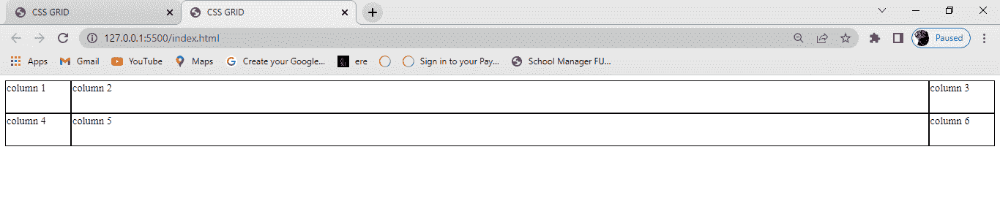

A gird with a column of 100px auto 100px and row of 50px 50px

### 列间隙属性

顾名思义，它是一个网格属性，在容器中的两列或多列之间分配一个空间。您可以通过使用`column-gap`属性并赋予它一个值来实现这一点。例如:

```
column-gap: 20px;
```

从上面的代码中，您可以看到为该列分配了一个间隙`20px`。

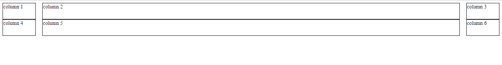

20px column-gap

### 行间隙特性

就像`column-gap`，`row-gap`是一个 CSS 属性，在容器中的两行或多行之间分配一个空格。例如:

```
row-gap: 50px;
```

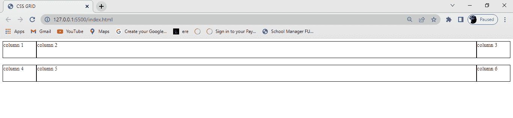

row-gap: 50px;

注意，我们也可以通过使用`gap`属性给容器的列和行分配一个间隙。为此，我们只为容器的列和行分配一个值，就像我们在上面的代码中所做的那样。

这里有一个例子:

```
gap: 20px;
```


gap: 20px

从上图中，我们可以看到,`20px`的一个`gap`被设置为容器的列和行，使它们等距。

### 对齐内容属性

这是一个网格属性，用于在容器中水平定位项目(列和行)。它显示 web 浏览器如何定位项目(列和行)周围的空间。

justify-content 属性有六个可能的值:

*   `Start`
*   `end`
*   `center`
*   `space-around`
*   `space-between`
*   `space-evenly`

#### 开始

这会将项目定位在浏览器的左侧，并且可以用以下代码执行:

```
justify-content: start;
```

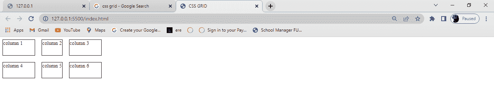

justify-content: start;

#### 结束

这会将项目定位在浏览器的右侧，并且可以用以下代码执行:

```
justify-content: end;
```

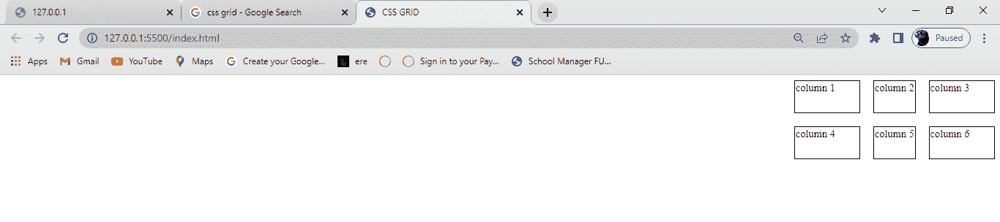

justify-content: end;

#### 中心

这将项目放置在浏览器的中心，可以用以下代码执行:

```
justify-content: center;
```

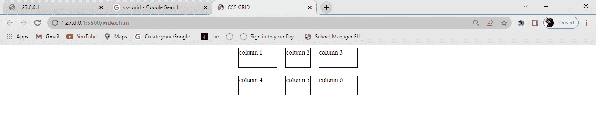

justify-content: center;

#### 周围空间

此属性均匀分布容器中的项，其中容器中的每一项与下一个容器具有相等的空间。

这段代码可以这样执行:

```
justify-content: space-around;
```

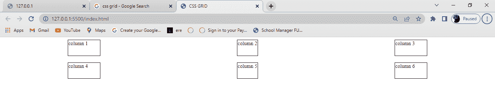

justify-content: space-around

#### 间距

就像`space-around`属性一样，`space-between`平均分配容器中的项目，其中容器中的每个项目与容器中的下一个项目具有相等的空间。它占据了容器的整个宽度。

这段代码可以这样执行:

```
justify-content: space-between;
```

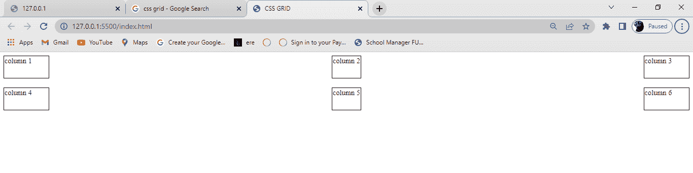

justify-content: space-between

#### 等间距

顾名思义，该属性平均分布容器中的项，其中容器中的每一项与容器中的下一项具有相等的空间。

这段代码可以这样执行:

```
justify-content: space-evenly;
```

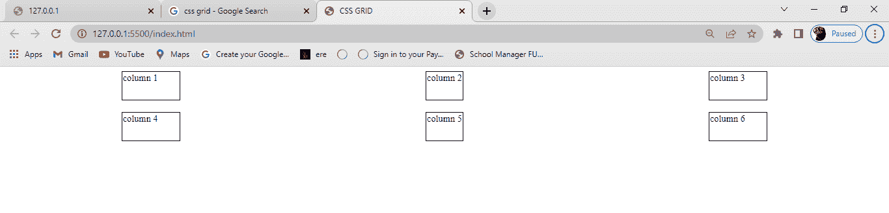

justify-content: space-evenly;

注意，所有的`justify-content`属性都水平放置它们的项目/元素。试着自己去做，才能更理解。

### 对齐内容属性

`Align-content`是`justify-content`的反义词。您可以使用`align-content`属性在容器中垂直定位项目。

与`justify-content`一样，`align-content`属性有六个可能的值:

*   `Start`
*   `end`
*   `center`
*   `space-around`
*   `space-between`
*   `space-evenly`

#### 开始

这将项目放置在浏览器的顶部，可以用以下代码执行:

```
align-content: start;
```

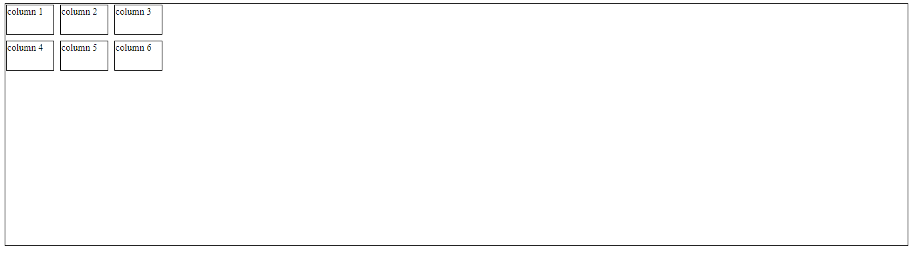

align-content: start;

#### 结束

这将项目放置在浏览器的底部，可以用以下代码执行:

```
align-content: end;
```

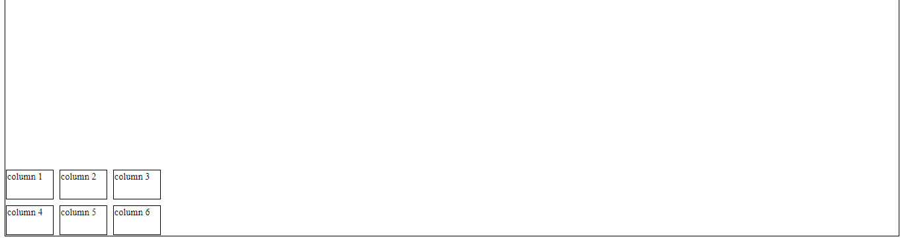

align-content: end

#### 中心

这将项目放置在浏览器的中心，可以用以下代码执行:

```
align-content: center;
```

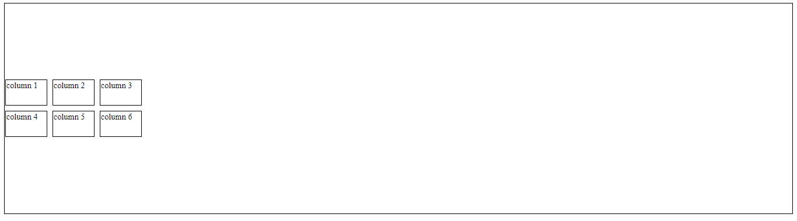

align-content: center;

#### 周围空间

此属性将项沿容器的侧面均匀分布，其中容器中的每个项与下一个项在垂直方向上有相等的间距。

这段代码可以这样执行:

```
align-content: space-around;
```

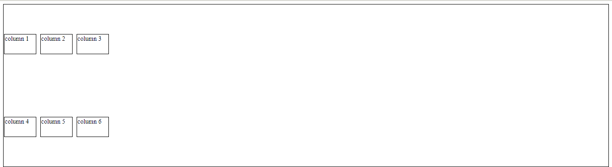

align-content: space-around

#### 间距

就像`space-around`属性一样，`Space-between`均匀分布容器中的项目，其中容器中的每个项目与容器中的下一个项目具有相等的空间，并且在垂直方向上占据容器的整个宽度。

这段代码可以这样执行:

```
align-content: space-between;
```

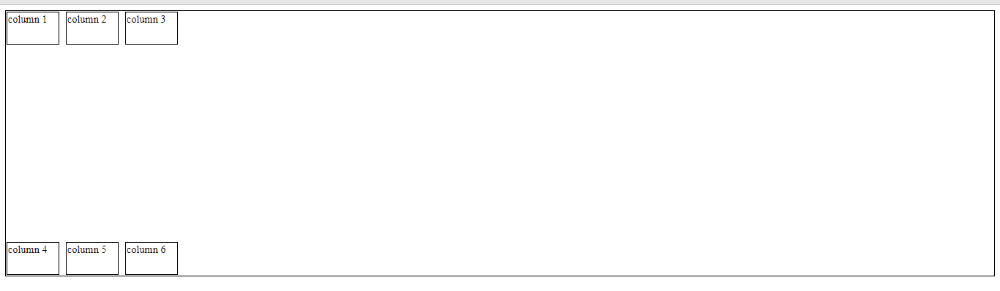

align-content: space-between

#### 等间距

顾名思义，该属性均匀分布容器中的项，其中容器中的每个项与下一个项在垂直方向上有相等的间距。

这段代码可以这样执行:

```
align-content: space-evenly;
```

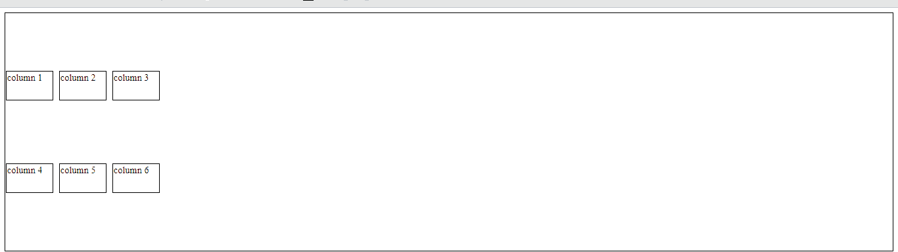

align-content: space-evenly

## 结论

在今天的文章中，我们学习了 CSS 网格布局是什么，为什么我们应该学习它，以及 CSS 网格的属性。

感谢您的阅读。

祝编码愉快！