# 如何在 Chrome 开发工具中使用 CSS 概述

> 原文：<https://www.freecodecamp.org/news/how-to-use-css-overview-in-chrome-developer-tools/>

如果你是一个网页开发者，你可能会欣赏一个设计良好且有吸引力的网站。

您可能会在特定网站上看到一种配色方案或字体，并希望将其整合到您的博客或 web 应用程序中。但你需要一个浏览器扩展来查看网站的配色方案和其他 CSS 功能。

Chrome 开发工具中的 **CSS 概述**功能可以让你看到这些 CSS 属性。

在这篇文章中，我们将回顾如何使用 Chrome 开发者工具中的 **CSS 概述**功能。我们还将学习如何使用 **CSS overview** 来获取你想要在创建网页时使用的颜色和其他 CSS 属性。

让我们开始吧。💃

## 什么是 CSS 总览面板？

CSS 总览面板是 Chrome 开发者工具的最新功能之一。它作为一个预览工具，允许您查看在创建网页时使用的不同 CSS 属性。

它显示 CSS 属性，例如:

*   网页上使用的颜色。
*   网页上使用的每个元素的行高。
*   网页上每个元素的字体大小
*   网页上每个元素的字体系列。
*   网页上使用的每个元素的字体粗细。

## 什么是 Chrome 开发者工具？

**Chrome 开发者工具**也被称为 Chrome 开发工具。

Chrome 开发工具是一套预装在 Chrome 浏览器中的网络开发工具。

查看这篇文章，了解更多关于 Chrome 开发者工具的信息。

以下是使用 Chrome 开发工具的一些优势:

*   它能让你在更短的时间内创建更好的网站。

*   它使您能够对代码进行更改、测试和检查。

*   Chrome 开发工具让开发人员能够更好地控制他们的网络应用和浏览器。

*   它使你能够评估一个网站的总体表现。

## 如何在浏览器中访问 Chrome 开发者工具

您可以通过三种不同的方式访问 Chrome 开发者工具:

1.  **Chrome 的菜单**:

*   点击 chrome 浏览器右上角的三个垂直点。它会在屏幕底部弹出一个带有`more tools`的下拉菜单。

*   点击更多工具。

*   点击开发者工具。

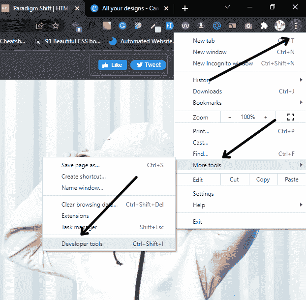

2.  **检查:**

*   右键点击 chrome 浏览器。

*   点击检查。

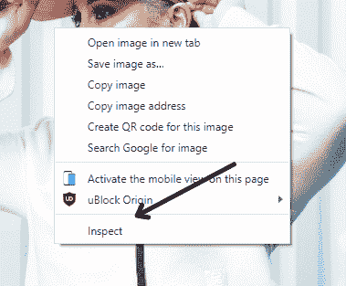

3.  **快捷键:**

*   对于 Windows - `CTRL` + `Shift` + `I`或`F12`。

*   对于 Mac - `CMD` + `Shift` + `I`。

一旦你点击快捷键，开发者工具就会打开。

当您按下`CTRL` + `Shift` + `I`时，默认显示您上次打开的面板。它显示了元素、控制台、网络或性能面板等。

`CTRL` + `Shift` + `C`默认先打开**元素面板**。

## 如何在 Chrome 开发工具中使用 CSS 概述

下面的步骤将带您了解如何使用 CSS 概述功能来获取在网页上使用的 CSS 属性。

## 步骤 1 -打开 Chrome 开发工具

我们已经介绍了访问 Chrome 开发者工具的各种方法。你现在应该对它们很熟悉了。

快速提醒一下，你可以在 Windows 和 Linux 上按`Ctrl` + `Shift` + `I`打开 Chrome dev 工具。在 Mac 上使用`CMD` + `Option` + `I`。

## 第 2 步-点击更多工具

点击 Chrome 开发工具右上角的三个垂直点。

从下拉菜单中选择“更多工具”。

点按“更多工具”时，您会发现各种选项从各种选项中，选择 **CSS 概述**功能。

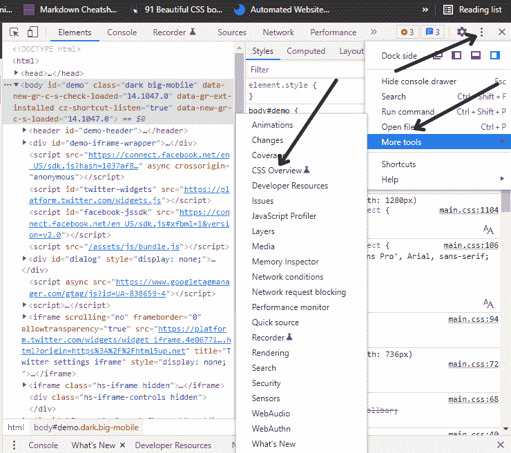

## 第 3 步-点击捕获概述

当你点击 **CSS Overview** ，你会看到它的功能列表。

功能包括:

*   捕获页面 CSS 的概览。

*   识别潜在的 CSS 改进。

*   在“元素”面板中找到受影响的元素。

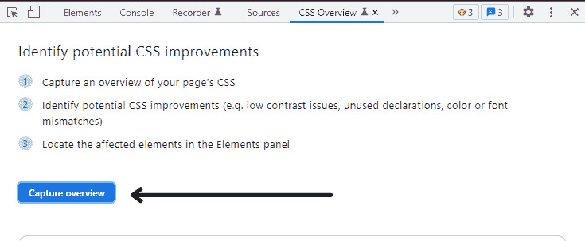

点击**捕捉概述按钮**。

单击“捕获概述”按钮后，会出现一个包含五个部分的菜单。

这五个部分是:

*   概述摘要
*   颜色；色彩；色调
*   字体信息
*   未使用的声明
*   媒体查询

让我们逐一查看这五个部分，看看它们是如何工作的。

## CSS 概述摘要

**Overview summary** 包含了构建网页时使用的 CSS 元素列表。

概述摘要显示网站上 CSS 的摘要，例如:

*   网页上使用的元素数量。
*   创建网页时使用的不同类型的选择器。
*   网页上使用的内联样式元素的数量。
*   网页上使用的外部样式表的数量。

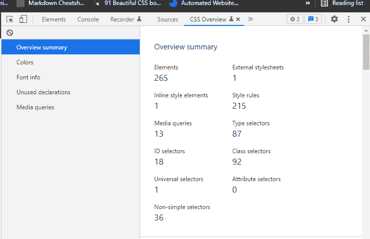

An Illustration of the overview summary.

上面的例子显示了用于构建网页的各种 CSS 元素。

## 颜色；色彩；色调

“颜色”面板显示创建网页时使用的所有颜色。它有一个用于背景、文本、填充和边框的调色板。它还突出了网页上低对比度文本的问题。

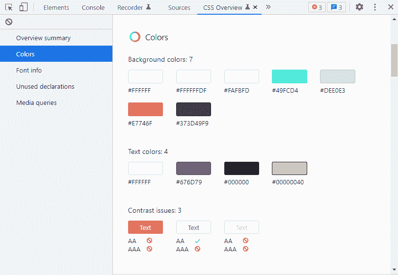

An illustration of the color panel.

上面的图像显示了创建网页时使用的不同颜色。

颜色面板的美妙之处在于每种颜色都是可以点击的。如果单击颜色面板中的特定颜色，会出现使用该颜色的元素列表。当您单击每个元素时，它会将您带到元素面板进行检查。

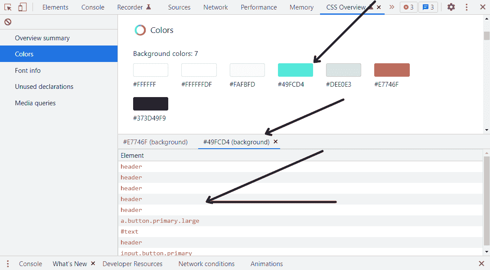

我点击了上图中的颜色`#49FCD4`,它显示了该颜色的元素列表。

您也可以将鼠标悬停在显示的元素列表中的元素上。当您将光标移动到该元素上时，它会在网页上突出显示该元素。

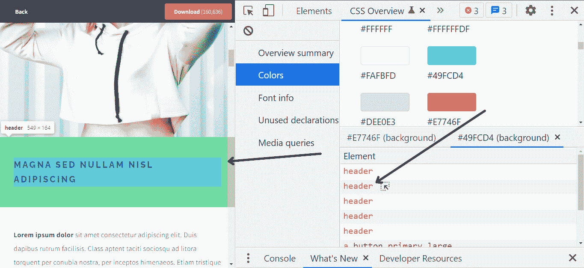

当我将鼠标悬停在上图中的`header`元素上时，它会高亮显示网页上的标题。

简单说明一下:悬停指的是将光标移动到任何物体上。它意味着将光标放在文本、图像或屏幕上的其他对象上，而不点击它们。

## 字体信息

字体信息面板显示网站开发中使用的字体。它显示了创建网站时使用的`font-size`、`line-height`、`font-weight`和`font families`。如果您点击**事件**，您将看到受影响元素的列表。

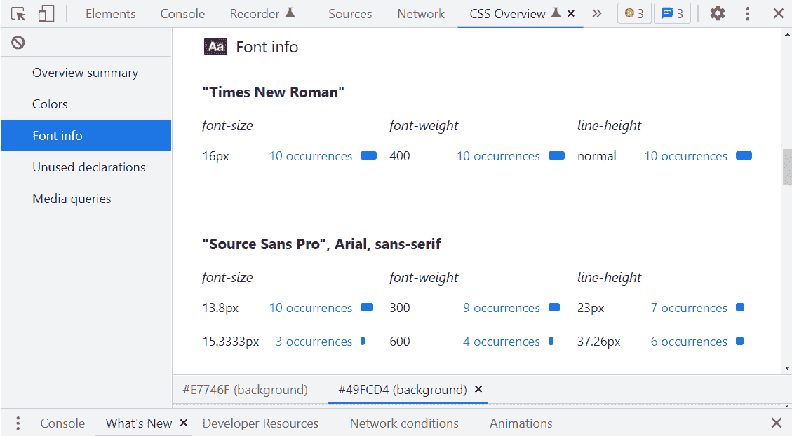

An illustration of the font info panel.

上图显示了创建网页时使用的不同字体。

## 未使用的声明

通过使用**未使用的声明**可以找到不影响网页的 CSS 样式。

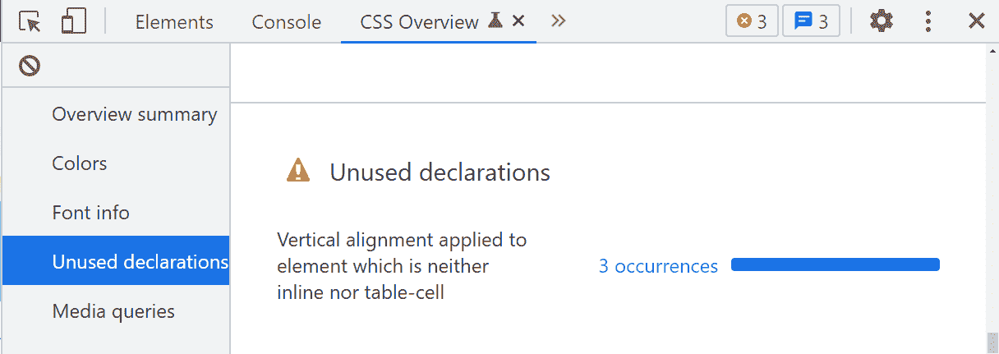

An illustration of the unused declaration panel.

上图显示了网页上未使用的声明的数量。应用于非内联元素或表格单元格的垂直对齐不会影响页面。

你也可以点击**事件**来查看受影响的元素列表，比如**字体信息**和**颜色面板**。

## 媒体查询

媒体查询面板显示在创建网页时使用的所有媒体查询的列表。您将能够检查创建网页时使用的各种宽度和屏幕分辨率。

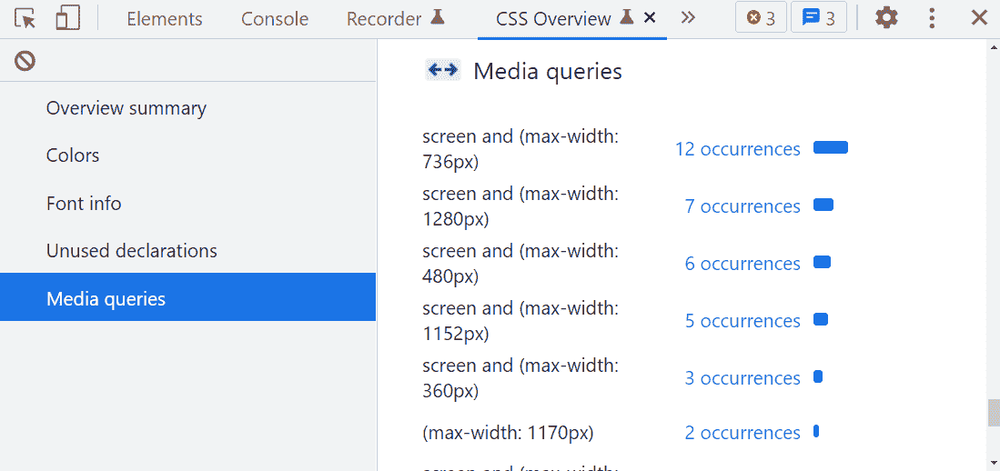

An illustration of the media query panel.

上述示例显示了创建网页时使用的媒体查询的数量。它按出现的顺序列出了使用的屏幕分辨率，从最高到最低。如果您单击**事件**，您将看到受影响元素的列表。

## 结论

在评估网页的 CSS 属性时， **CSS overview** 工具就派上了用场。它允许前端开发人员和设计人员检查网页上的 CSS 属性。

感谢您的阅读💙。如果你想聊天或有任何问题，请随时在 Twitter: [@cessss_](https://twitter.com/Cessss_) 和 linkedIn: [Success](https://www.linkedin.com/in/success-eriamiantoe/) 联系我。

还有，关注我的博客，看看我的其他一些东西 [@cesscode](https://cesscode.hashnode.dev) 。

编码快乐！💙