# 如何使用纯 CSS 为你的 App 创建一个漂亮的加载动画

> 原文：<https://www.freecodecamp.org/news/how-to-use-css-to-create-a-beautiful-loading-animation-for-your-app/>

如果你最近浏览过互联网，你很可能见过一个很好的微妙的加载动画，它在优雅地加载之前填充页面内容。

一些社交巨头，如脸书，甚至用这种方法给页面加载带来更好的体验。我们如何用一些简单的 CSS 做到这一点呢？

*   我们要建造什么？
*   [只想要片段？](#just-want-the-snippet)
*   [第 1 部分:创建我们的加载动画](#part-1-creating-our-loading-animation)
*   [第 2 部分:在动态应用中使用我们的加载动画](#part-2-using-our-loading-animation-in-a-dynamic-app)

[https://www.youtube.com/embed/auyZWWjXJCo?feature=oembed](https://www.youtube.com/embed/auyZWWjXJCo?feature=oembed)

## 我们要建造什么？

我们将使用一个 CSS 类来创建一个加载动画，你可以将它应用到任何你想要的元素上(在合理的范围内)。


Loading animation preview

这给你很大的灵活性来使用它，并使解决方案很好，简单，只有 CSS。

虽然这个代码片段很小，您可以直接复制并粘贴它，但是我将带您了解发生了什么，以及在加载数据时动态使用它的一个示例。

## 只想要片段？

可以在这里抢！

[CSS Loading AnimationCSS Loading Animation. GitHub Gist: instantly share code, notes, and snippets.262588213843476Gist](https://gist.github.com/colbyfayock/d155418975d1e0e04b2805e285296033)

## 在本教程开始之前，我需要知道如何制作动画吗？

不要！我们将详细介绍您需要做的事情。其实这个教程的动画还是比较简单的，大家来钻研一下吧！

## 第 1 部分:创建我们的加载动画

这第一部分将重点放在一起加载动画，并在一个静态的 HTML 网站上看到它。我们的目标是实际创建代码片段。这部分我们只使用 HTML 和 CSS。

### 步骤 1:创建一些示例内容

首先，我们需要一些示例内容。这里真的没有限制，你可以用基本的 HTML 和 CSS 创建它，或者你可以把它添加到你的 Create React 应用程序中！

在演练中，我将使用 HTML 和 CSS 以及一些内容示例，让我们看到这一点的效果。

首先，创建一个新的 HTML 文件。在 HTML 文件中，填充一些内容，让我们能够播放动画。我将使用我最喜欢的电视剧《T2 未来》中的台词！

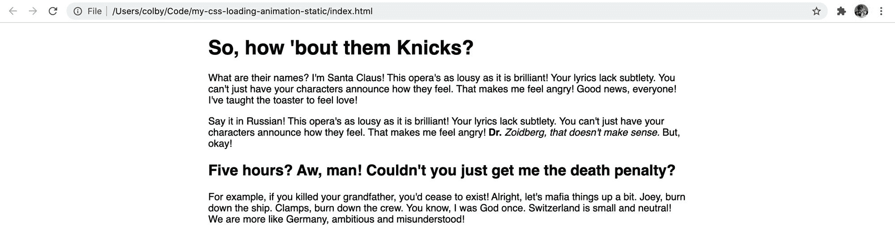

Static HTML & CSS webpage with content from fillerama.io

如果你打算跟我一起做，我的项目看起来是这样的:

```
my-css-loading-animation-static
- index.html
- main.css 
```

[跟随提交！](https://github.com/colbyfayock/my-css-loading-animation-static/commit/9aa7925f7048fa1b73fef74d0d56380c29fc5d73)

### 步骤 2:从基础加载类开始

对于我们的基础，让我们创建一个新的 CSS 类。在我们的 CSS 文件中，让我们添加:

```
.loading {
  background: #eceff1;
} 
```

有了这个类，让我们把它添加到一些或者所有的元素中。我把它添加到一些段落、标题和列表中。

```
<p class="loading">For example... 
```

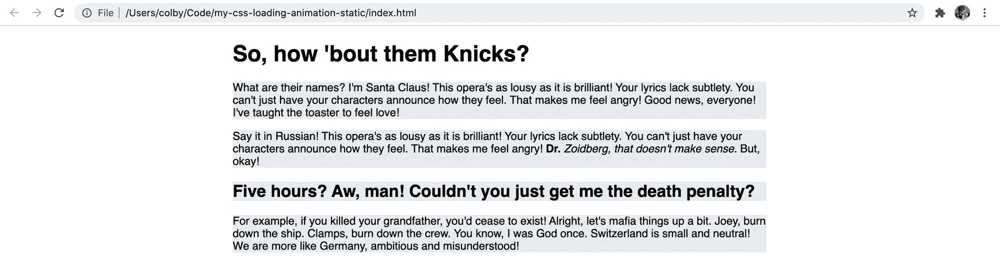

Static HTML & CSS webpage with a gray background for the content

这给了我们一个基本的背景，但我们可能想隐藏文本。当它被加载时，我们还没有那个文本，所以很可能我们想使用填充文本或固定高度。无论哪种方式，我们都可以将颜色设置为透明:

```
.loading {
  color: transparent;
  background: #eceff1;
} 
```

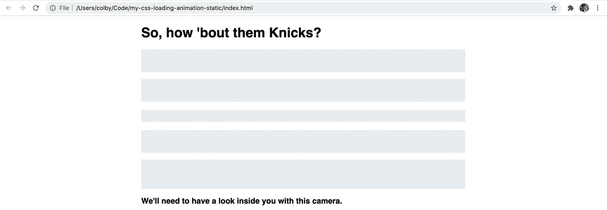

Static HTML & CSS webpage with a gray background and transparent color for the content

如果你注意到列表元素，不管你是将类应用到顶级列表元素(`<ol>`还是`<ul>`)还是列表项本身(`<li>`)，它看起来都像一个大块。如果我们在所有列表元素的底部添加一点空白，我们可以看到它们的显示方式有所不同:

```
li {
  margin-bottom: .5em;
} 
```

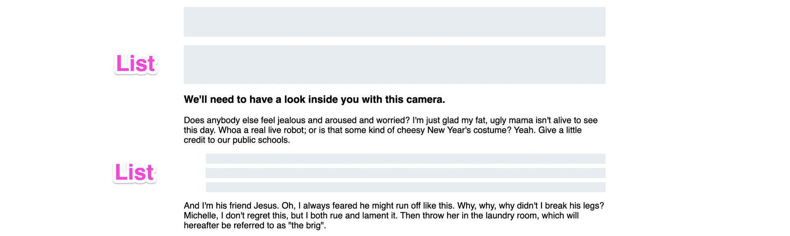

Style difference between applying to the top level list or the list items

现在它开始组合在一起，但看起来有点像占位符。让我们来制作动画，让它看起来像是正在加载。

[跟随提交！](https://github.com/colbyfayock/my-css-loading-animation-static/commit/f68cdef36be11311a5cc11a1d39e52ea7e7bb48d)

### 步骤 3:设计加载类的样式并制作动画

在给我们的类制作动画之前，我们需要一些东西来制作动画，所以让我们给我们的`.loading`类添加一个渐变:

```
.loading {
  color: transparent;
  background: linear-gradient(100deg, #eceff1 30%, #f6f7f8 50%, #eceff1 70%);
} 
```

这就是说，我们想要一个倾斜 100 度的[线性渐变](https://developer.mozilla.org/en-US/docs/Web/CSS/linear-gradient)，我们从`#eceff1`开始，渐变到 30%的`#f6f7f8`，再回到 70%的`#eceff1`；

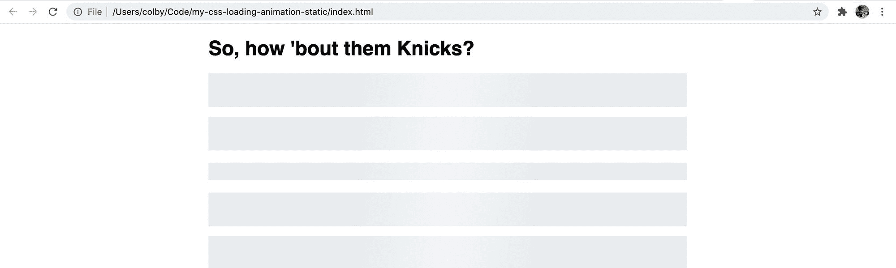

Subtle gradient background that might look like a glare

当它静止时，最初很难看到，它可能只是在你的计算机上看起来像一个眩光！如果你想在继续之前看到它，请随意使用上面的颜色来查看渐变。

既然我们已经有了动画，我们首先需要创建一个[关键帧](https://developer.mozilla.org/en-US/docs/Web/CSS/@keyframes)规则:

```
@keyframes loading {
  0% {
    background-position: 100% 50%;
  }
  100% {
    background-position: 0 50%;
  }
} 
```

应用此规则时，背景位置将从 x 轴的 100%开始更改为 x 轴的 0%。

根据规则，我们可以将我们的[动画](https://developer.mozilla.org/en-US/docs/Web/CSS/CSS_Animations/Using_CSS_animations)属性添加到我们的`.loading`类中:

```
.loading {
  color: transparent;
  background: linear-gradient(100deg, #eceff1 30%, #f6f7f8 50%, #eceff1 70%);
  animation: loading 1.2s ease-in-out infinite;
} 
```

我们的动画线是将关键帧设置为`loading`，告诉它持续 1.2 秒，将[计时功能](https://developer.mozilla.org/en-US/docs/Web/CSS/animation-timing-function)设置为`ease-in-out`使其平滑，告诉它用`infinite`永远循环。


No change – it's not animating

如果你注意到保存后，它仍然没有做任何事情。这样做的原因是我们从 DOM 元素的一端到另一端设置渐变，所以没有地方可以移动！

所以让我们试着在我们的`.loading`类上也设置一个`background-size`。

```
.loading {
  color: transparent;
  background: linear-gradient(100deg, #eceff1 30%, #f6f7f8 50%, #eceff1 70%);
  background-size: 400%;
  animation: loading 1.2s ease-in-out infinite;
} 
```

现在，由于我们的背景扩展到了 DOM 元素之外(你看不到那部分)，它有了一些空间来制作动画，我们得到了我们的动画！

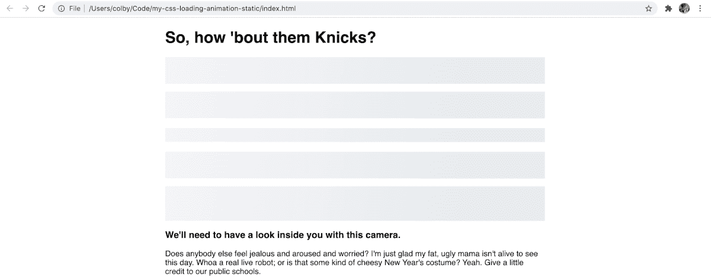

Our loading animation!

[跟随提交！](https://github.com/colbyfayock/my-css-loading-animation-static/commit/bc4b5ec955a0906fea032edbbaf90f037f76c91b)

## 第 2 部分:在动态应用程序中使用我们的加载动画

现在我们已经有了装载动画，让我们用一个基本的例子来模拟一个装载状态。

实际使用它的诀窍是我们通常没有实际可用的内容，所以在大多数情况下，我们必须伪造它。

为了向您展示我们如何做到这一点，我们将使用 [Next.js](https://nextjs.org/) 构建一个简单的 [React](https://reactjs.org/) 应用程序。

### 步骤 1:用 Next.js 创建一个示例 React 应用程序

导航到要在其中创建新项目的目录，然后运行:

```
yarn create next-app
# or
npm init next-app 
```

它将提示您一些选项，特别是一个名称，它将决定项目创建的目录和项目的类型。我用的是`my-css-loading-animation-dynamic`和“默认启动应用”。

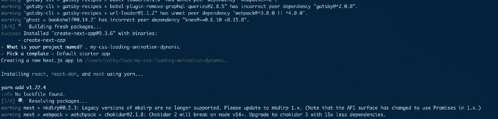

Creating a new project with Next.js

安装后，导航到新目录并启动开发服务器:

```
cd [directory]
yarn dev
# or 
npm run dev 
```

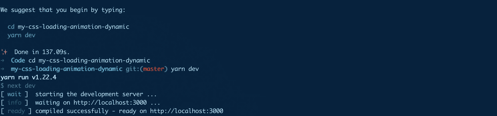

Starting development server with Next.js

接下来，让我们替换我们的`pages/index.js`文件中的内容。我将从前面的例子中获取内容，但是我们将创建它，就像我们期望它来自 API 一样。首先，让我们将内容作为一个对象添加到 return 语句之上:

```
const content = {
  header: `So, how 'bout them Knicks?`,
  intro: `What are their names? I'm Santa Claus! This opera's as lousy as it is brilliant! Your lyrics lack subtlety. You can't just have your characters announce how they feel. That makes me feel angry! Good news, everyone! I've taught the toaster to feel love!`,
  list: [
    `Yes! In your face, Gandhi!`,
    `So I really am important? How I feel when I'm drunk is correct?`,
    `Who are those horrible orange men?`
  ]
}
```

为了显示内容，在`<main>`中，让我们将内容替换为:

```
<main>
  <h1>{ content.header }</h1>
  <p>{ content.intro }</p>
  <ul>
    { content.list.map((item, i) => {
      return (
        <li key={i}>{ item }</li>
      )
    })}
  </ul>
</main> 
```

对于样式，您可以将第 1 部分`main.css`文件中的所有内容复制并粘贴到索引页面底部的`<style>`标签中。这将给我们留下:

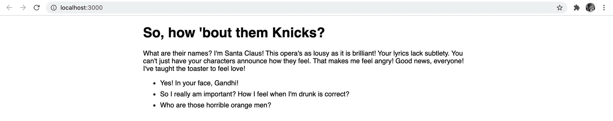

Basic content with Next.js

至此，我们应该回到了第 1 部分结束时的类似点，只是我们还没有主动使用任何加载动画。

[跟随提交！](https://github.com/colbyfayock/my-css-loading-animation-dynamic/commit/365e081522ec07b1754bf360a95b0bc373476c95)

### 步骤 2:假装从 API 加载数据

我们正在使用的例子非常简单。您可能会看到这是预先静态生成的，但这有助于我们创建一个真实的演示，我们可以用它来测试我们的加载动画。

为了伪造我们的加载状态，我们将使用 React 的`useState`、`useEffect`和一个老式的`setTimeout`来预加载一些“加载”内容，在`setTimeout`完成后，用我们的实际数据更新这些内容。与此同时，我们将知道我们正处于加载状态，有一个单独的`useState`实例。

首先，我们需要导入依赖项。在我们的`pages/index.js`文件的顶部，添加:

```
import { useState, useEffect } from 'react'; 
```

在我们的`content`对象之上，让我们添加一些状态:

```
const [loadingState, updateLoadingState] = useState(true);
const [contentState, updateContentState] = useState({}) 
```

在我们的内容中，我们可以更新实例以使用该状态:

```
<h1>{ contentState.header }</h1>
<p>{ contentState.intro }</p>
<ul>
  { contentState.list.map((item, i) => {
    return (
      <li key={i}>{ item }</li>
    )
  })}
</ul> 
```

一旦您保存并加载它，您将首先注意到我们得到一个错误，因为我们的`list`属性在我们的`contentState`上不存在，所以我们可以首先修复它:

```
{ Array.isArray(contentState.list) && contentState.list.map((item, i) => {
  return (
    <li key={i}>{ item }</li>
  )
})} 
```

准备好之后，让我们将我们的`setTimeout`添加到一个`useEffect`钩子中来模拟我们的数据加载。在我们的`content`对象下添加这个:

```
useEffect(() => {
  setTimeout(() => {
    updateContentState(content);
    updateLoadingState(false)
  }, 2000);
}, []) 
```

一旦保存并打开浏览器，您会注意到有 2 秒钟您没有任何内容，然后它加载进来，基本上模拟异步加载数据。

[跟随提交！](https://github.com/colbyfayock/my-css-loading-animation-dynamic/commit/f0cada8d696ffe3e983f5efc03dc9d75a2245fe1)

### 步骤 3:添加我们的加载动画

现在我们终于可以添加加载动画了。为此，我们将使用通过`useState`设置的加载状态，如果内容正在加载，则将`.loading`类添加到元素中。

在我们这样做之前，与其将这个类单独添加到 DOM 中的每一项，不如使用 CSS 将这个类添加到父类中，这样做可能更有意义，所以让我们先这样做。

首先，更新`.loading`类来定位我们的元素:

```
.loading h1,
.loading p,
.loading li {
  color: transparent;
  background: linear-gradient(100deg, #eceff1 30%, #f6f7f8 50%, #eceff1 70%);
  background-size: 400%;
  animation: loading 1.2s ease-in-out infinite;
} 
```

然后我们可以动态地将我们的类添加到我们的`<main>`标签中:

```
<main className={loadingState ? 'loading' : ''}> 
```

*注意:如果你使用 [Sass](https://sass-lang.com/) ，你可以通过[在你想要使用的实例中扩展](https://sass-lang.com/documentation/at-rules/extend)类或者创建一个[占位符](https://sass-lang.com/documentation/style-rules/placeholder-selectors)并扩展它来管理你的加载风格！*

如果你刷新页面，你会注意到它仍然只是一个 2 秒钟的空白页面！

问题是，当我们加载我们的内容时，我们的标签中没有任何东西可以允许元素的行高给它一个高度。

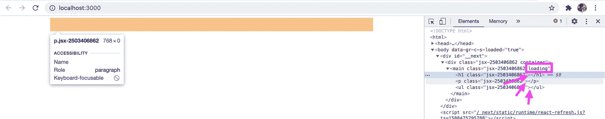

No height when there's no content

但是我们可以解决这个问题！因为我们的`.loading`类将我们的文本设置为透明，所以我们可以简单地为每段内容添加单词`Loading`:

```
const [contentState, updateContentState] = useState({
  header: 'Loading',
  intro: 'Loading',
  list: [
    'Loading',
    'Loading',
    'Loading'
  ]
}) 
```

注意:我们不能在这里使用空白空间，因为在 DOM 中渲染时，仅仅使用空白空间无法提供高度。

一旦您保存并重新加载页面，我们的前 2 秒将有一个反映我们内容的加载状态！

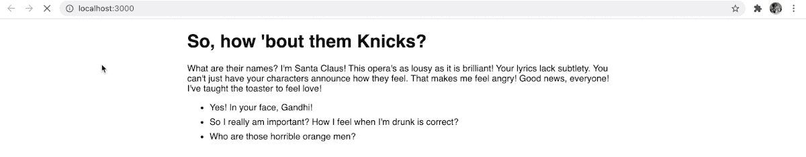

HTML & CSS loading animation

[跟随提交！](https://github.com/colbyfayock/my-css-loading-animation-dynamic/commit/5b7b1c40d1eebf97f65c966bb771a5f6787073ea)

## 一些附加的想法

这种技术可以广泛应用。作为一个 CSS 类，你可以很容易的添加任何你想要的东西。

如果您不喜欢为加载状态设置`Loading`文本，另一个选项是设置一个固定的高度。唯一的问题是它需要更多的维护来调整 CSS 以匹配加载的内容。

此外，这不会是完美的。通常情况下，你不会确切知道一页上有多少副本。目标是模拟和提示将会有内容，并且当前正在加载。

## 你最喜欢的加载动画是什么？

在 [Twitter](https://twitter.com/colbyfayock) 上告诉我！

## 加入对话吧！

> 如果你在等待一个页面加载，知道后台有什么东西在工作会很有帮助。所以你应该为你的应用程序创建一个漂亮的加载动画。
> 
> 这就是为什么 [@colbyfayock](https://twitter.com/colbyfayock?ref_src=twsrc%5Etfw) 写这个指南告诉你如何用纯 CSS 制作动画。[https://t.co/h8hGwqZ3sl](https://t.co/h8hGwqZ3sl)
> 
> — freeCodeCamp.org (@freeCodeCamp) [May 24, 2020](https://twitter.com/freeCodeCamp/status/1264557769547493376?ref_src=twsrc%5Etfw)