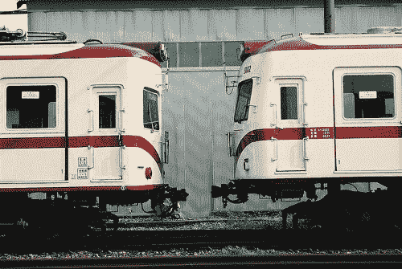
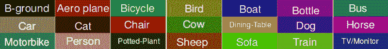
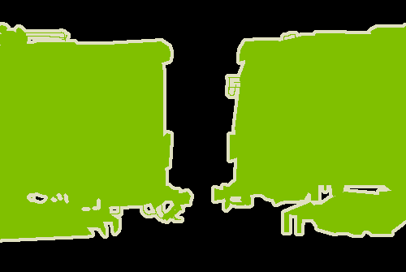

# 如何在 TensorFlow 中使用 DeepLab 进行使用深度学习的对象分割

> 原文：<https://www.freecodecamp.org/news/how-to-use-deeplab-in-tensorflow-for-object-segmentation-using-deep-learning-a5777290ab6b/>

作者:比伦·萨胡

# 如何在 TensorFlow 中使用 DeepLab 进行使用深度学习的对象分割

#### 修改 DeepLab 代码以在您自己的数据集上训练图像中的对象分割


Photo by [Nick Karvounis](https://unsplash.com/photos/FmD8tIkf8bo?utm_source=unsplash&utm_medium=referral&utm_content=creditCopyText) on [Unsplash](https://unsplash.com/search/photos/images?utm_source=unsplash&utm_medium=referral&utm_content=creditCopyText)

我在 [FlixStock](http://www.flixstock.com/) 担任研究科学家，专注于深度学习解决方案，以生成和/或编辑图像。我们使用语义分割来识别图像中属于各种对象的连贯区域。

[DeepLab](https://arxiv.org/abs/1706.05587) 是语义分割的理想解决方案。代码在 TensorFlow 中提供。

在这篇文章中，我将分享我们如何在 TensorFlow 中为我们自己的数据集训练 DeepLab 语义分割模型。但是在我们开始之前…

### 什么是 DeepLab？

[DeepLab](https://arxiv.org/abs/1706.05587) 是深度学习的**语义图像分割**最有前景的技术之一。语义分割是在像素级别理解图像，然后给图像中的每个像素分配一个标签，使得具有相同标签的像素共享某些特征。

### 装置

TensorFlow 中的 DeepLab 实现可在 GitHub [这里](https://github.com/tensorflow/models/tree/master/research/deeplab)获得。

### 正在准备数据集

在你创建自己的数据集和训练 DeepLab 之前，你应该非常清楚你想用它做什么。这里有两种情况:

*   从零开始训练模型:您可以自由选择任意数量的对象类别(标签数量)进行分割。这需要很长时间的训练。
*   使用预先训练好的模型:你可以自由选择任意数量的对象进行分割。使用预先训练的模型，并且仅使用迁移学习来更新您的分类器权重。与之前的场景相比，这将花费更少的培训时间。

让我们把你的新数据集命名为“PQR”。新建一个文件夹“PQR”为:`tensorflow/models/research/deeplab/datasets/PQR`。

首先，你只需要输入图像和它们的预分割图像作为训练的基础。输入图像需要是彩色图像，分割图像需要是彩色索引图像。参考 PASCAL 数据集。

在“PQR”中创建一个名为“数据集”的文件夹。它应该具有以下目录结构:

```
+ dataset    -JPEGImages    -SegmentationClass    -ImageSets+ tfrecord
```

#### jpeg 图像

它包含所有输入的`*.jpg`格式的彩色图像。



A sample input image from PASCAL VOC dataset

#### 分段类

该文件夹包含每个彩色输入图像的所有语义分割注释图像，这是语义分割的基础。

这些图像应该有颜色索引。每个颜色索引代表一个唯一的类(具有唯一的颜色)，称为颜色映射。



Sample Color Map [source: [https://github.com/DrSleep/tensorflow-deeplab-resnet](https://github.com/DrSleep/tensorflow-deeplab-resnet)]

**注意:**“segmentation class”文件夹中的文件应与相应图像分割文件对的“JPEGImage”文件夹中的文件同名。



A sample semantic segmentation ground truth image from PASCAL VOC dataset

#### 图像集

该文件夹包含:

*   train.txt:训练集的图像名称列表
*   val.txt:验证集的图像名称列表
*   trainval.txt:用于训练+验证集的图像名称列表

样本`*.txt`文件看起来像这样:

```
pqr_000032pqr_000039pqr_000063pqr_000068pqr_000121
```

#### 移除地面实况注释中的颜色映射

如果您的分段注释图像是 RGB 图像，而不是彩色索引图像。这里有一个 Python 脚本会有所帮助。

这里，调色板定义了“RGB:LABEL”对。在这个示例代码(0，0，0):0 是背景，而(255，0，0):1 是前景类。注意，new_label_dir 是存储原始分段数据的位置。

接下来，任务是将图像数据集转换为张量流记录。制作脚本文件`./dataset/download_and_convert_voc2012.sh`的新副本作为`./dataset/convert_pqr.sh`。下面是修改后的脚本。

转换后的数据集将保存在`./deeplab/datasets/PQR/tfrecord`

#### 定义数据集描述

打开**research/deep lab/datasets/**文件夹中的 **segmentation_dataset.py** 文件。添加以下代码段，为您的 PQR 数据集定义描述。

```
_PQR_SEG_INFORMATION = DatasetDescriptor(    splits_to_sizes={        'train': 11111, # number of file in the train folder        'trainval': 22222,        'val': 11111,    },    num_classes=2, # number of classes in your dataset    ignore_label=255, # white edges that will be ignored to be class)
```

进行如下所示的更改:

```
_DATASETS_INFORMATION = {    'cityscapes': _CITYSCAPES_INFORMATION,    'pascal_voc_seg': _PASCAL_VOC_SEG_INFORMATION,    'ade20k': _ADE20K_INFORMATION,    'pqr': _PQR_SEG_INFORMATION}
```

### 培养

为了在数据集上训练模型，您需要运行 **research/deeplab/** 文件夹中的 train.py 文件。因此，我们编写了一个脚本文件 train-pqr.sh 来为您完成这项任务。

在这里，我们使用了 xception_65 进行您的本地培训。您可以将训练迭代次数指定给变量 NUM_ITERATIONS。并将“— tf_initial_checkpoint”设置为您下载或预训练模型*.ckpt 的位置，训练完成后，可以在 TRAIN_LOGDIR 目录下找到最终训练好的模型。

最后，从…/research/deeplab 目录运行上面的脚本。

```
# sh ./train-pqr.sh
```

瞧啊。您已经成功地在数据集上训练了 DeepLab。

在接下来的几个月里，我将分享更多我在图像和深度学习方面的经验。如果你喜欢这篇文章，请继续关注，不要忘记给一些掌声。这将极大地鼓舞我。