# 如何在 JavaScript 中使用析构来编写更简洁、更强大的代码

> 原文：<https://www.freecodecamp.org/news/how-to-use-destructuring-in-javascript-to-write-cleaner-more-powerful-code-9d1b38794050/>

作者阿莎·曼德瓦娅？️?？

# 如何在 JavaScript 中使用析构来编写更简洁、更强大的代码

Photo by [Scott Rodgerson](https://unsplash.com/@scottrodgerson?utm_source=medium&utm_medium=referral) on [Unsplash](https://unsplash.com?utm_source=medium&utm_medium=referral)

> 有时候你必须破坏才能建立新的东西。

> -出生错误:时代的英雄

ES6 向我们介绍了最期待的 JavaScript 特性之一:析构。作为一个概念，析构不是新的或开创性的，一些语言已经有了析构(？？)很久以前。但这是 JavaScript 中非常需要和要求的特性。

解构是破坏一个结构的过程。在编程的上下文中，结构就是数据结构，而解构这些数据结构意味着从数据结构中解包各个值。在 JavaScript 中，析构可以应用于对象或数组。

解构会制造、破坏任何东西。我们对它有什么用？？

在回答这个问题之前，让我们对析构有一个正式的定义。MDN 来救援了！

> **析构赋值**语法是一个 JavaScript 表达式，它可以将数组中的值或对象中的属性解包到不同的变量中。-MDN

让我们看一些例子来更好地理解析构的基础。

#### 数组

样本 1:

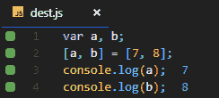

当我第一次看到这段简单的代码时，我很困惑。我不知道发生了什么。如果你像我一样，让我试着解释一下。

在第 1 行，我们定义了两个变量`a`和`b`。在下一行中，两个变量都在左侧的数组中，而左侧的数组又等同于驾驶侧的实际数组。在随后的几行中，我们打印出`a` & `b`的值，我们分别得到 7 和 8，它们是 RHS 数组中的元素。发生在第二行的魔术叫做解构。

LHS 析构 RHS，从解包元素中获得的值按顺序分配给变量。

但是为什么 LHS 在一个数组里面呢？？？

与 RHS 相比，析构赋值在 LHS 上使用类似的语法来定义从源变量中解包哪些值。

样本 2:

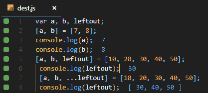

这里我们已经在代码中引入了另一个变量`leftout`。我们在代码中有两种不同类型的`leftout`用法。

*   `[a,b,leftout]-&`gt；这按照预期将数组中的第三个元素`to left`赋值出来。
*   `[a,b,…leftout]-&`gt；这分别给出了前两个值`t`o a`n`d b，数组的其余部分被赋给 t `he lefto` ut 变量。

解决方案在于`…`操作符。该操作符将所有剩余的参数( ***rest*** )折叠成一个数组。在后一点中，前 2 个数组元素分别赋给`a` & `b`，剩下的自变量折叠成一个数组(重组也许？？)并赋给`leftout`变量。我们可以通过查看输出来验证这一点。

#### 目标

样本 1:

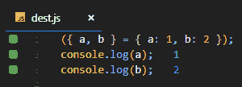

析构对于对象和数组都是一样的。LHS 中的对象具有属性`a` & `b`，这些属性分别被分配给 RHS 对象的属性`a` & `b`。我们通过打印它们分别得到 1 & 2。

有一点需要注意(*如果你有*)的话，那就是语法上有一点小小的变化(*现在有了*)。

> *在对象析构中，整个 LHS & RHS 都被包裹在`(`* `)`里面

我们可以看到当我们没有把它放在`().` **中时，我们得到的错误，它表示期望声明语句。**

实际发生的情况是，用花括号`{}`将某物括起来会混淆 JavaScript，使其认为是一个块而不是一个对象。由于这个原因，它正在寻找块的声明(*函数声明*，所以我们将代码放在`()`中。这使它成为一个表达式而不是一个块，我们得到了我们的结果。

样本 2:

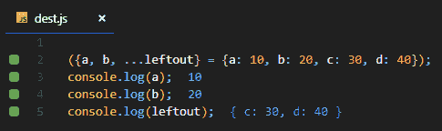

再次使用`rest`操作符。就像在数组中一样工作，除了这次剩余的值被折叠在一个对象中，因为要使用的结构是由 LHS 定义的。

### 析构是用来做什么的？

从上面的例子可以看出，我们现在知道了析构的重要性。析构在对象和数组中有很多不同的用法和情况。我们将尝试其中的一些。( **P.S. —** *这些例子对对象和数组都有效，除非另有说明。*)

#### 变量赋值

在上面的例子中，我们已经看到了变量是如何赋值的，所以让我们来看看另一个例子。

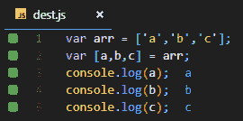

在这个例子中，一个已经创建的数组被直接分配用于析构。尽管如此，还是要给变量赋值。

物体也是如此。

#### 默认值

有时我们会定义`n`个变量来从析构中获取值，但是数组/对象可能只有`n-x`个元素。在这种情况下，`x`变量将被赋值`undefined`。

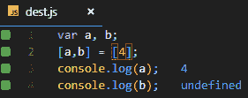

我们可以看到`b`是未定义的，因为数组没有那么多元素来析构和分配每个变量。

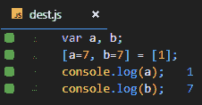

解决这个问题的方法是给变量赋予默认值，这样如果没有足够的元素，变量就采用默认值，而不是不定义。

#### 交换

交换是在两个或多个变量之间交换值的过程。执行交换的标准方法是使用临时变量或使用 XOR。在 JavaScript 中，使用析构也可以做到这一点。

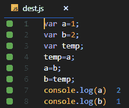

Using temporary variable

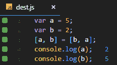

Using destructuring

使用变量 temp 进行交换。代码是不言自明的。

使用析构，我们只需交换元素的位置，瞧！交换完成。

#### 忽略值

我们可以只获取和使用需要的值，拒绝或忽略不必要的值。

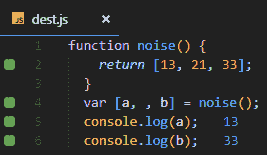

这里我们可以看到，我们忽略了中间值，没有将它赋给任何变量，这样就省去了麻烦。

#### 函数返回的间接赋值

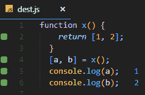

这里我们可以看到函数 x 返回一个数组。在我们析构的第 4 行，我们提供了返回数组的函数调用，而不是直接返回数组。它使代码整洁，易于阅读和理解。

#### 新变量的赋值

属性可以从对象中解包，并赋给与对象属性不同名称的变量。

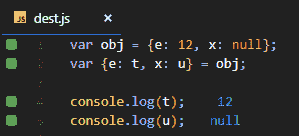

我们可以看到属性的值也是变量，通过析构将值分配给变量。

#### 嵌套对象和数组析构

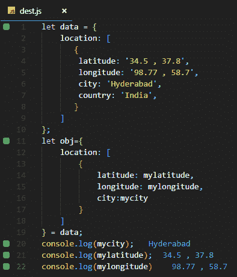

正如我们所看到的，数据是一个对象，它有一个名为 location 的属性，这个属性又包含一个数组，数组的元素是对象。

通过析构，我们必须获取位置数组中对象的所有属性值。

因此，我们创建了一个名为 obj 的对象，它包含与数据对象相同的结构，我们要解包的值以变量的形式提供(mylatitude，mylongitude，mycity)。这些反过来等同于数据数组(与前面的析构语法相同)。当变量被打印出来时，我们得到各自的值。

#### 用 for-of 循环进行析构

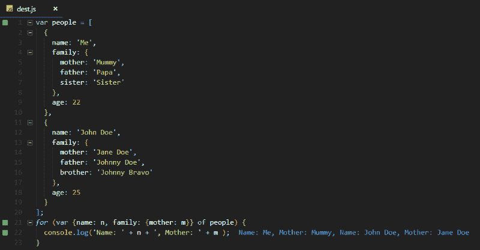

在上面的代码片段中，我们有一个 people 对象数组，其属性依次包含一个对象(people > object >family)。现在我们想使用 for 从对象中解包一些值..循环的。

在循环中，我们分配了一个对象变量，其结构与 people 数组中的结构相同，忽略了我们不需要的值。我们已经将变量 n & m 分别分配给 name 和 mother 属性，因为这些是我们想要解包的值。在循环内部，我们打印变量并得到所需的值。

### 大局。

Photo by [Jeremy Bishop](https://unsplash.com/@jeremybishop?utm_source=medium&utm_medium=referral) on [Unsplash](https://unsplash.com?utm_source=medium&utm_medium=referral)

你必须在你的代码中使用析构或者实践它来真正掌握它。这个例子看起来很简单，因为这些例子只是为了让你理解基础知识。用复杂/多重运算(reduce()！)，分解可能会很快变得混乱，这是我们不希望的！

此外，你也可能认为析构只是执行一组任务的甜语法(就像我们可以使用 for 循环给变量数组中每个元素的值)。在某种程度上，我们可以说它是糖，但是当我们看更广泛的图像“大图”时，我们会明白为什么析构比代码极小化更有价值。

JavaScript 有许多提取和构造数据的操作，但是所有这些操作一次只能处理一个元素。

**用于构建**

**用于提取**(仍然是一次一个)

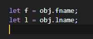

虽然有一种一次构造多个属性的语法，但它只能在赋值时使用，不能用于改变现有对象。

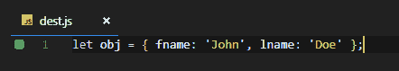

在引入 ES6 之前，没有一次性提取所有数据的机制。这就是解构主义真正大放异彩的地方。它允许您从一个对象中提取多个属性。我们在上面的例子中已经看到了这一点。

#### 陷阱

我能想到的只有一个，我们讨论过了:

*   语句不应以花括号`{`开头

### 结论

我试图通过展示尽可能多的析构用例来简化析构。我希望它能让你明白这个概念。现在，您可以使用析构来编写强大而干净的代码。

Google